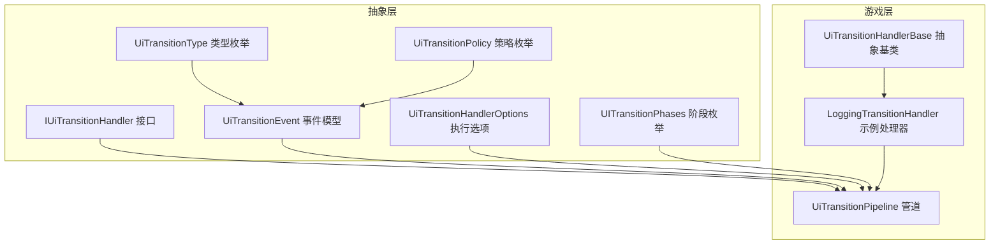
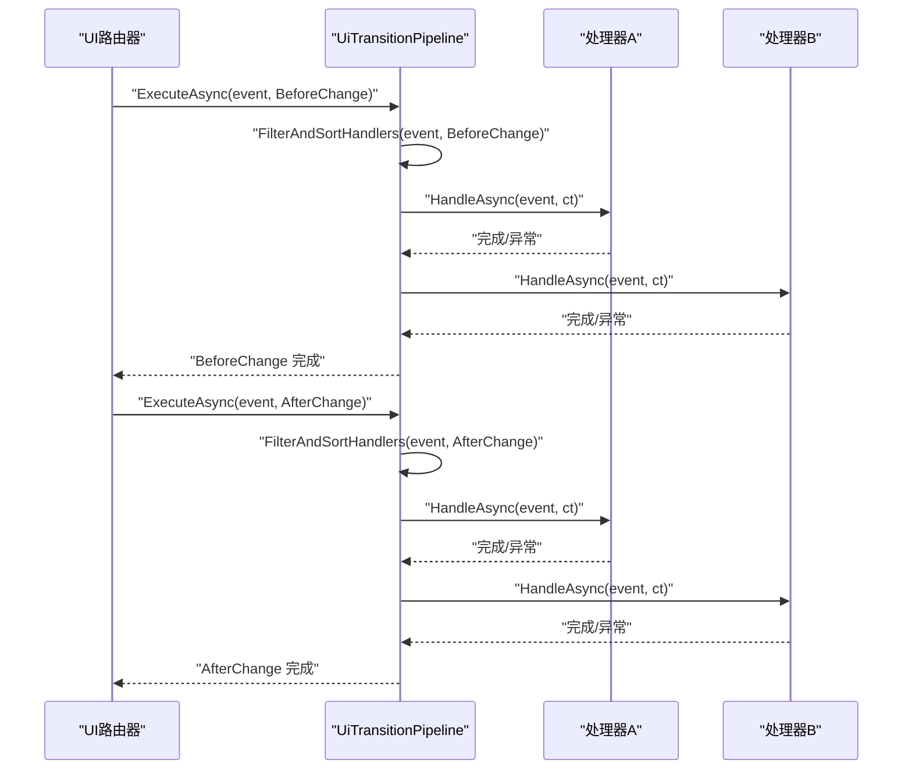
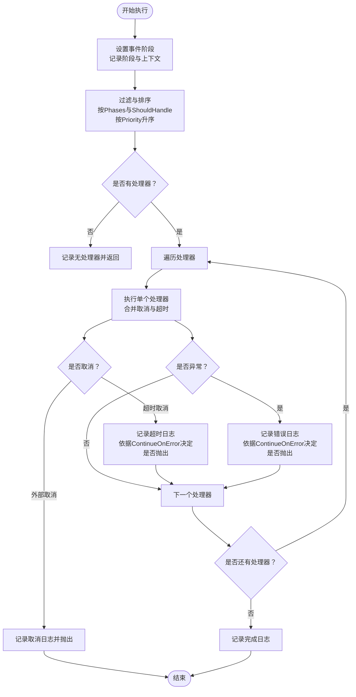
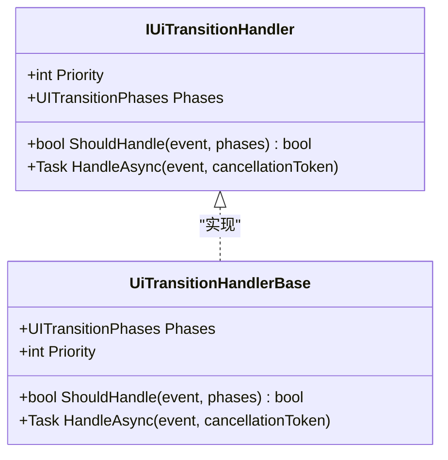
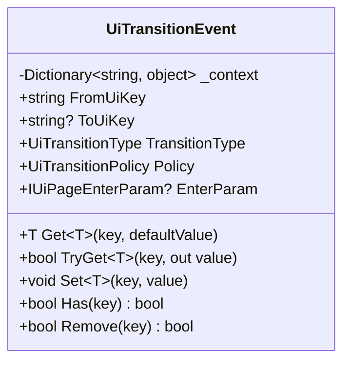
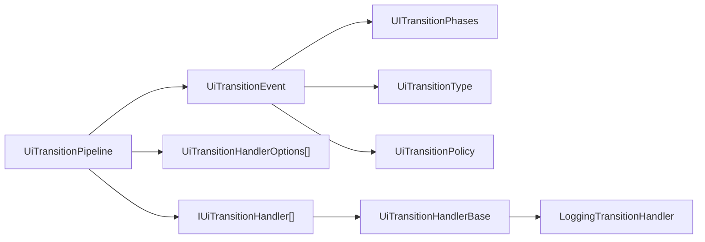

# UI过渡管道

<cite>
**本文引用的文件**
- [UiTransitionPipeline.cs](file://GFramework.Game/ui/UiTransitionPipeline.cs)
- [UiTransitionHandlerBase.cs](file://GFramework.Game/ui/handler/UiTransitionHandlerBase.cs)
- [LoggingTransitionHandler.cs](file://GFramework.Game/ui/handler/LoggingTransitionHandler.cs)
- [IUiTransitionHandler.cs](file://GFramework.Game.Abstractions/ui/IUiTransitionHandler.cs)
- [UiTransitionEvent.cs](file://GFramework.Game.Abstractions/ui/UiTransitionEvent.cs)
- [UiTransitionHandlerOptions.cs](file://GFramework.Game.Abstractions/ui/UiTransitionHandlerOptions.cs)
- [UITransitionPhases.cs](file://GFramework.Game.Abstractions/enums/UITransitionPhases.cs)
- [UiTransitionType.cs](file://GFramework.Game.Abstractions/enums/UiTransitionType.cs)
- [UiTransitionPolicy.cs](file://GFramework.Game.Abstractions/enums/UiTransitionPolicy.cs)
</cite>

## 目录
1. [简介](#简介)
2. [项目结构](#项目结构)
3. [核心组件](#核心组件)
4. [架构总览](#架构总览)
5. [详细组件分析](#详细组件分析)
6. [依赖关系分析](#依赖关系分析)
7. [性能考量](#性能考量)
8. [故障排查指南](#故障排查指南)
9. [结论](#结论)
10. [附录](#附录)

## 简介
本文件围绕 GFramework 的 UI 过渡管道（UiTransitionPipeline）提供系统化、可操作的技术文档。重点涵盖：
- 管道设计与执行机制：BeforeChange 与 AfterChange 两阶段的处理流程与职责边界
- 处理器注册与注销：RegisterHandler 与 UnregisterHandler 的使用方式与注意事项
- 配置选项与执行策略：UiTransitionHandlerOptions 的超时与错误继续策略
- 事件模型：UiTransitionEvent 的属性与上下文传递机制
- 执行顺序与异常处理：基于优先级的排序、取消令牌与异常分支
- 自定义处理器开发指南与实践示例
- 与 UI 路由系统的集成方式与性能优化建议

## 项目结构
UiTransitionPipeline 位于游戏层（GFramework.Game），其接口与事件模型位于抽象层（GFramework.Game.Abstractions）。处理器基类与示例处理器位于游戏层。

图表来源
- [UiTransitionPipeline.cs](file://GFramework.Game/ui/UiTransitionPipeline.cs#L1-L168)
- [IUiTransitionHandler.cs](file://GFramework.Game.Abstractions/ui/IUiTransitionHandler.cs#L1-L39)
- [UiTransitionEvent.cs](file://GFramework.Game.Abstractions/ui/UiTransitionEvent.cs#L1-L105)
- [UiTransitionHandlerOptions.cs](file://GFramework.Game.Abstractions/ui/UiTransitionHandlerOptions.cs#L1-L6)
- [UITransitionPhases.cs](file://GFramework.Game.Abstractions/enums/UITransitionPhases.cs#L1-L27)
- [UiTransitionType.cs](file://GFramework.Game.Abstractions/enums/UiTransitionType.cs)
- [UiTransitionPolicy.cs](file://GFramework.Game.Abstractions/enums/UiTransitionPolicy.cs)
- [UiTransitionHandlerBase.cs](file://GFramework.Game/ui/handler/UiTransitionHandlerBase.cs#L1-L33)
- [LoggingTransitionHandler.cs](file://GFramework.Game/ui/handler/LoggingTransitionHandler.cs#L1-L48)

章节来源
- [UiTransitionPipeline.cs](file://GFramework.Game/ui/UiTransitionPipeline.cs#L1-L168)
- [IUiTransitionHandler.cs](file://GFramework.Game.Abstractions/ui/IUiTransitionHandler.cs#L1-L39)
- [UiTransitionEvent.cs](file://GFramework.Game.Abstractions/ui/UiTransitionEvent.cs#L1-L105)
- [UiTransitionHandlerOptions.cs](file://GFramework.Game.Abstractions/ui/UiTransitionHandlerOptions.cs#L1-L6)
- [UITransitionPhases.cs](file://GFramework.Game.Abstractions/enums/UITransitionPhases.cs#L1-L27)
- [UiTransitionType.cs](file://GFramework.Game.Abstractions/enums/UiTransitionType.cs)
- [UiTransitionPolicy.cs](file://GFramework.Game.Abstractions/enums/UiTransitionPolicy.cs)
- [UiTransitionHandlerBase.cs](file://GFramework.Game/ui/handler/UiTransitionHandlerBase.cs#L1-L33)
- [LoggingTransitionHandler.cs](file://GFramework.Game/ui/handler/LoggingTransitionHandler.cs#L1-L48)

## 核心组件
- UiTransitionPipeline：负责管理与执行 UI 过渡处理器链，支持按阶段过滤与优先级排序，并提供统一的超时与错误处理策略。
- IUiTransitionHandler：处理器接口，定义优先级、适用阶段、条件判断与异步处理方法。
- UiTransitionHandlerBase：处理器抽象基类，提供默认的阶段与条件判断行为，便于快速实现自定义处理器。
- UiTransitionEvent：事件承载对象，包含源 UI、目标 UI、切换类型、策略、进入参数以及可扩展的上下文字典。
- UiTransitionHandlerOptions：处理器执行选项，支持超时时间与错误继续策略。
- UITransitionPhases：阶段枚举，定义 BeforeChange 与 AfterChange 两个阶段及其组合。

章节来源
- [UiTransitionPipeline.cs](file://GFramework.Game/ui/UiTransitionPipeline.cs#L11-L168)
- [IUiTransitionHandler.cs](file://GFramework.Game.Abstractions/ui/IUiTransitionHandler.cs#L10-L39)
- [UiTransitionHandlerBase.cs](file://GFramework.Game/ui/handler/UiTransitionHandlerBase.cs#L9-L33)
- [UiTransitionEvent.cs](file://GFramework.Game.Abstractions/ui/UiTransitionEvent.cs#L10-L105)
- [UiTransitionHandlerOptions.cs](file://GFramework.Game.Abstractions/ui/UiTransitionHandlerOptions.cs#L6)
- [UITransitionPhases.cs](file://GFramework.Game.Abstractions/enums/UITransitionPhases.cs#L9-L27)

## 架构总览
UiTransitionPipeline 采用“处理器链”模式，将 UI 切换过程拆分为 BeforeChange 与 AfterChange 两个阶段。每个阶段通过过滤与排序选择合适的处理器，依次执行。处理器内部可利用 UiTransitionEvent 的上下文字典进行数据传递，也可通过取消令牌与超时机制保证稳定性。

图表来源
- [UiTransitionPipeline.cs](file://GFramework.Game/ui/UiTransitionPipeline.cs#L63-L101)
- [IUiTransitionHandler.cs](file://GFramework.Game.Abstractions/ui/IUiTransitionHandler.cs#L32-L38)
- [UITransitionPhases.cs](file://GFramework.Game.Abstractions/enums/UITransitionPhases.cs#L9-L27)

## 详细组件分析

### UiTransitionPipeline 组件分析
- 设计要点
  - 处理器集合与选项映射：内部维护处理器列表与对应执行选项，确保每个处理器拥有独立的超时与错误策略。
  - 注册与注销：提供 RegisterHandler 与 UnregisterHandler，支持重复注册检测与日志记录；注销时同步移除选项映射。
  - 执行流程：按阶段过滤与优先级排序，逐个执行处理器；支持取消令牌与超时组合；异常分支明确区分取消与错误并决定是否中断。
  - 上下文记录：在执行前后记录阶段、来源 UI、目标 UI、切换类型与处理器数量等关键信息，便于调试与审计。

- 关键方法与行为
  - RegisterHandler：校验非空，避免重复注册，记录处理器优先级与阶段信息。
  - UnregisterHandler：移除处理器与对应选项，记录注销日志。
  - ExecuteAsync：设置事件阶段标记，过滤与排序，逐个执行单个处理器。
  - FilterAndSortHandlers：按适用阶段与条件判断筛选，并按优先级升序排列。
  - ExecuteSingleHandlerAsync：合并外部取消与超时取消，捕获取消与异常，依据选项决定是否继续。

- 异常与取消处理
  - 超时：当超时发生且未被外部取消时，记录错误并依据 ContinueOnError 决定是否抛出中断管道。
  - 取消：区分外部取消与超时取消，前者直接记录并抛出；后者记录超时并依据选项处理。
  - 其他异常：记录错误并依据选项决定是否中断。

图表来源
- [UiTransitionPipeline.cs](file://GFramework.Game/ui/UiTransitionPipeline.cs#L63-L168)

章节来源
- [UiTransitionPipeline.cs](file://GFramework.Game/ui/UiTransitionPipeline.cs#L11-L168)

### IUiTransitionHandler 与 UiTransitionHandlerBase
- IUiTransitionHandler
  - Priority：数值越小优先级越高，影响执行顺序。
  - Phases：阶段标志位，可同时包含 BeforeChange 与 AfterChange。
  - ShouldHandle：根据事件与阶段判断是否处理，支持细粒度过滤。
  - HandleAsync：异步处理逻辑，接收事件与取消令牌。

- UiTransitionHandlerBase
  - 提供默认实现：Phases 默认 All，ShouldHandle 默认 true，需子类实现 Priority 与 HandleAsync。

图表来源
- [IUiTransitionHandler.cs](file://GFramework.Game.Abstractions/ui/IUiTransitionHandler.cs#L10-L39)
- [UiTransitionHandlerBase.cs](file://GFramework.Game/ui/handler/UiTransitionHandlerBase.cs#L9-L33)

章节来源
- [IUiTransitionHandler.cs](file://GFramework.Game.Abstractions/ui/IUiTransitionHandler.cs#L10-L39)
- [UiTransitionHandlerBase.cs](file://GFramework.Game/ui/handler/UiTransitionHandlerBase.cs#L9-L33)

### UiTransitionEvent 事件模型
- 核心属性
  - FromUiKey：切换前 UI 的标识符
  - ToUiKey：切换后 UI 的标识符（可为空）
  - TransitionType：切换类型（如 Push、Pop、Replace 等）
  - Policy：切换策略（缓存、弹出等策略）
  - EnterParam：进入参数（向目标 UI 传递的数据）

- 上下文字典
  - Get/TryGet/Set/Has/Remove：提供类型安全的键值访问，用于处理器间传递数据与状态。

- 阶段标记
  - 管道在执行前会将阶段字符串写入事件上下文，便于处理器读取。

图表来源
- [UiTransitionEvent.cs](file://GFramework.Game.Abstractions/ui/UiTransitionEvent.cs#L10-L105)

章节来源
- [UiTransitionEvent.cs](file://GFramework.Game.Abstractions/ui/UiTransitionEvent.cs#L10-L105)

### UiTransitionHandlerOptions 执行策略
- TimeoutMs：处理器执行超时时间（毫秒），0 表示不限制；与外部取消令牌合并使用。
- ContinueOnError：发生异常或超时时是否继续执行后续处理器；false 时立即中断。

章节来源
- [UiTransitionHandlerOptions.cs](file://GFramework.Game.Abstractions/ui/UiTransitionHandlerOptions.cs#L6)

### 阶段与类型/策略枚举
- UITransitionPhases：BeforeChange（可阻塞切换）、AfterChange（不可阻塞）、All（两者皆执行）
- UiTransitionType：切换类型（具体枚举项见枚举定义）
- UiTransitionPolicy：切换策略（具体枚举项见枚举定义）

章节来源
- [UITransitionPhases.cs](file://GFramework.Game.Abstractions/enums/UITransitionPhases.cs#L9-L27)
- [UiTransitionType.cs](file://GFramework.Game.Abstractions/enums/UiTransitionType.cs)
- [UiTransitionPolicy.cs](file://GFramework.Game.Abstractions/enums/UiTransitionPolicy.cs)

### 示例处理器：LoggingTransitionHandler
- 作用：记录 UI 切换的关键信息，便于调试与审计。
- 实现：继承 UiTransitionHandlerBase，设置高优先级与全阶段处理，记录事件上下文中的阶段、类型、来源与目标 UI、策略等。

章节来源
- [LoggingTransitionHandler.cs](file://GFramework.Game/ui/handler/LoggingTransitionHandler.cs#L11-L48)

## 依赖关系分析
- 管道对处理器的依赖：通过接口 IUiTransitionHandler 解耦，支持多实现并行存在。
- 管道对事件与选项的依赖：事件承载上下文，选项控制超时与错误策略。
- 阶段枚举与类型/策略枚举：为事件提供语义化标识，驱动处理器的条件判断与行为差异。
- 日志系统：管道与处理器均使用统一的日志工厂进行日志记录，便于追踪执行路径与问题定位。

图表来源
- [UiTransitionPipeline.cs](file://GFramework.Game/ui/UiTransitionPipeline.cs#L14-L15)
- [IUiTransitionHandler.cs](file://GFramework.Game.Abstractions/ui/IUiTransitionHandler.cs#L10-L39)
- [UiTransitionHandlerBase.cs](file://GFramework.Game/ui/handler/UiTransitionHandlerBase.cs#L9-L33)
- [LoggingTransitionHandler.cs](file://GFramework.Game/ui/handler/LoggingTransitionHandler.cs#L11-L48)
- [UiTransitionEvent.cs](file://GFramework.Game.Abstractions/ui/UiTransitionEvent.cs#L10-L105)
- [UITransitionPhases.cs](file://GFramework.Game.Abstractions/enums/UITransitionPhases.cs#L9-L27)
- [UiTransitionType.cs](file://GFramework.Game.Abstractions/enums/UiTransitionType.cs)
- [UiTransitionPolicy.cs](file://GFramework.Game.Abstractions/enums/UiTransitionPolicy.cs)

章节来源
- [UiTransitionPipeline.cs](file://GFramework.Game/ui/UiTransitionPipeline.cs#L11-L168)
- [IUiTransitionHandler.cs](file://GFramework.Game.Abstractions/ui/IUiTransitionHandler.cs#L10-L39)
- [UiTransitionHandlerBase.cs](file://GFramework.Game/ui/handler/UiTransitionHandlerBase.cs#L9-L33)
- [LoggingTransitionHandler.cs](file://GFramework.Game/ui/handler/LoggingTransitionHandler.cs#L11-L48)
- [UiTransitionEvent.cs](file://GFramework.Game.Abstractions/ui/UiTransitionEvent.cs#L10-L105)
- [UITransitionPhases.cs](file://GFramework.Game.Abstractions/enums/UITransitionPhases.cs#L9-L27)
- [UiTransitionType.cs](file://GFramework.Game.Abstractions/enums/UiTransitionType.cs)
- [UiTransitionPolicy.cs](file://GFramework.Game.Abstractions/enums/UiTransitionPolicy.cs)

## 性能考量
- 处理器数量与排序成本：每次执行都会对处理器进行过滤与排序，建议合理控制处理器数量与复杂度。
- 超时与取消：为耗时处理器设置合理的 TimeoutMs，避免阻塞 UI 切换；在外部取消场景下及时响应。
- 错误继续策略：对于可容忍失败的 AfterChange 处理器，可启用 ContinueOnError 以提升鲁棒性。
- 日志开销：在生产环境适当降低日志级别，避免频繁记录带来的性能损耗。
- 并发与线程：处理器 HandleAsync 应为纯异步逻辑，避免阻塞调用；若涉及 UI 更新，请结合平台主线程调度。

## 故障排查指南
- 管道未执行任何处理器
  - 检查处理器的 Phases 是否包含当前阶段；确认 ShouldHandle 返回 true。
  - 查看日志中“无处理器可执行”的记录。
- 处理器被重复注册
  - 管道会检测并跳过重复注册，检查注册逻辑是否多次调用 RegisterHandler。
- 超时导致中断
  - 检查处理器执行时间与 TimeoutMs 设置；必要时调整或拆分长任务。
  - 若为外部取消，确认上游取消令牌来源。
- 异常导致中断
  - 检查处理器内部异常处理；如允许继续，设置 ContinueOnError=true。
- 日志与审计
  - 使用 LoggingTransitionHandler 记录关键信息；核对事件上下文中的阶段与键值。

章节来源
- [UiTransitionPipeline.cs](file://GFramework.Game/ui/UiTransitionPipeline.cs#L119-L167)
- [LoggingTransitionHandler.cs](file://GFramework.Game/ui/handler/LoggingTransitionHandler.cs#L34-L47)

## 结论
UiTransitionPipeline 通过清晰的阶段划分、灵活的处理器注册与排序机制、完善的超时与错误处理策略，为 UI 路由系统提供了稳定、可扩展的过渡扩展点。配合 UiTransitionEvent 的上下文传递能力与 UiTransitionHandlerOptions 的执行策略，开发者可以在不侵入路由核心的前提下，实现丰富的过渡行为与可观测性。

## 附录

### 处理器注册与注销最佳实践
- 在模块初始化阶段集中注册处理器，避免运行期动态注册带来的不确定性。
- 对于需要在切换前阻塞的处理器，设置较低的 Priority 并在 BeforeChange 阶段执行。
- 对于后台统计与日志类处理器，设置较高的 Priority 并在 AfterChange 阶段执行。
- 合理设置 TimeoutMs 与 ContinueOnError，平衡用户体验与系统稳定性。

章节来源
- [UiTransitionPipeline.cs](file://GFramework.Game/ui/UiTransitionPipeline.cs#L22-L54)
- [IUiTransitionHandler.cs](file://GFramework.Game.Abstractions/ui/IUiTransitionHandler.cs#L14-L21)

### 自定义处理器开发指南
- 继承 UiTransitionHandlerBase，至少实现 Priority 与 HandleAsync。
- 如需限制适用阶段，重写 Phases；如需条件过滤，重写 ShouldHandle。
- 在 HandleAsync 中读取 UiTransitionEvent 的属性与上下文，完成业务逻辑。
- 对可能耗时的操作设置超时，必要时拆分为多个处理器以提高可控性。

章节来源
- [UiTransitionHandlerBase.cs](file://GFramework.Game/ui/handler/UiTransitionHandlerBase.cs#L9-L33)
- [IUiTransitionHandler.cs](file://GFramework.Game.Abstractions/ui/IUiTransitionHandler.cs#L10-L39)

### 与 UI 路由系统的集成方式
- 在路由发起切换前，构造 UiTransitionEvent（设置 FromUiKey、ToUiKey、TransitionType、Policy、EnterParam 等），调用管道 BeforeChange 阶段。
- 在切换完成后，再次调用 AfterChange 阶段，用于非阻塞的收尾工作。
- 通过事件上下文在处理器间传递数据，例如预加载资源结果、用户确认状态等。

章节来源
- [UiTransitionEvent.cs](file://GFramework.Game.Abstractions/ui/UiTransitionEvent.cs#L10-L105)
- [UITransitionPhases.cs](file://GFramework.Game.Abstractions/enums/UITransitionPhases.cs#L9-L27)
- [UiTransitionPipeline.cs](file://GFramework.Game/ui/UiTransitionPipeline.cs#L63-L101)