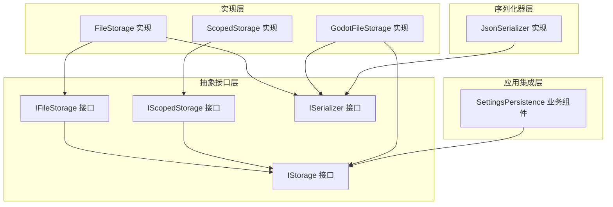
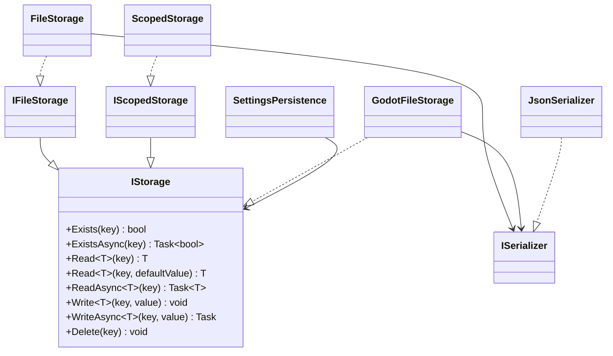
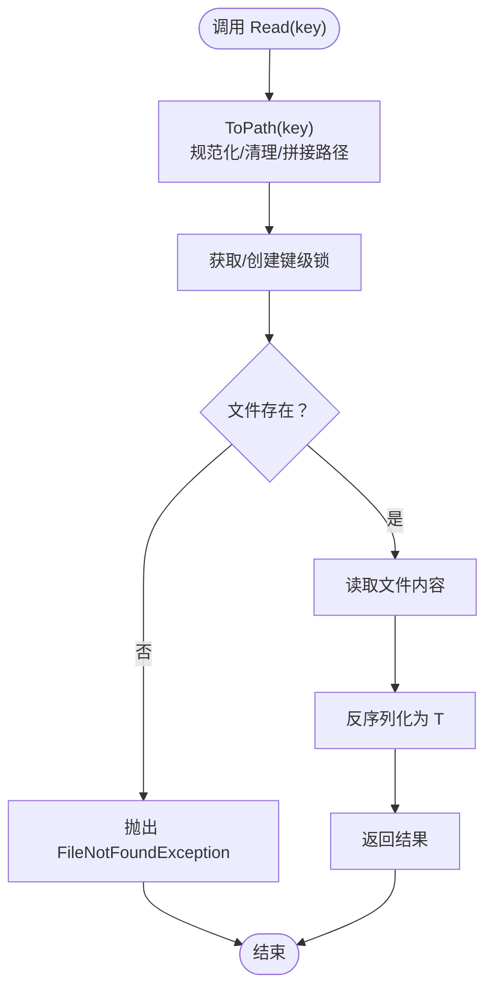
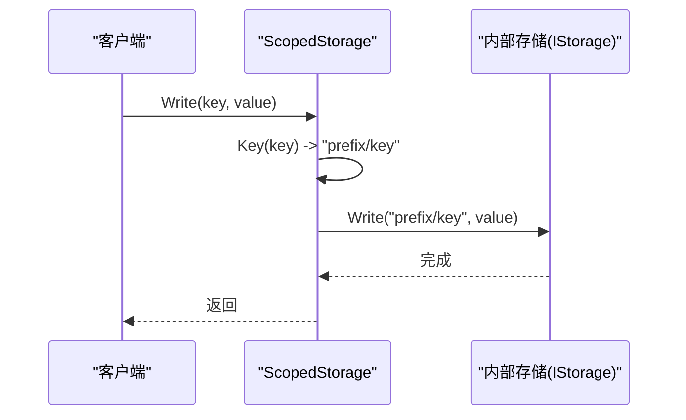
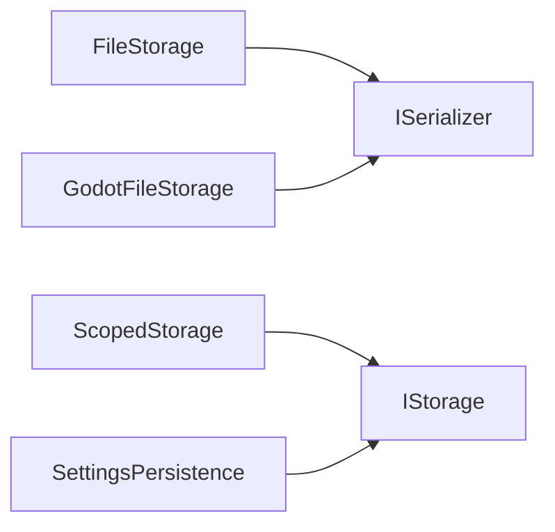

# 存储系统

<cite>
**本文引用的文件列表**
- [IStorage.cs](file://GFramework.Core.Abstractions/storage/IStorage.cs)
- [IFileStorage.cs](file://GFramework.Game.Abstractions/storage/IFileStorage.cs)
- [IScopedStorage.cs](file://GFramework.Game.Abstractions/storage/IScopedStorage.cs)
- [ISerializer.cs](file://GFramework.Game.Abstractions/serializer/ISerializer.cs)
- [FileStorage.cs](file://GFramework.Game/storage/FileStorage.cs)
- [ScopedStorage.cs](file://GFramework.Game/storage/ScopedStorage.cs)
- [JsonSerializer.cs](file://GFramework.Game/serializer/JsonSerializer.cs)
- [ReadMe.md](file://GFramework.Game/storage/ReadMe.md)
- [GodotFileStorage.cs](file://GFramework.Godot/storage/GodotFileStorage.cs)
- [CachedStorage.cs](file://GFramework.Game/README.md)
- [SettingsPersistence.cs](file://GFramework.Game/setting/SettingsPersistence.cs)
- [ISettingsPersistence.cs](file://GFramework.Game.Abstractions/setting/ISettingsPersistence.cs)
</cite>

## 目录
1. [简介](#简介)
2. [项目结构](#项目结构)
3. [核心组件](#核心组件)
4. [架构总览](#架构总览)
5. [组件详解](#组件详解)
6. [依赖关系分析](#依赖关系分析)
7. [性能与优化](#性能与优化)
8. [故障排查指南](#故障排查指南)
9. [结论](#结论)
10. [附录](#附录)

## 简介
本文件面向GFramework存储系统，聚焦于FileStorage文件存储实现、ScopedStorage作用域存储策略、以及IStorage/IFileStorage/IScopedStorage接口的设计理念。文档涵盖文件读写流程、路径管理与安全校验、错误处理机制、作用域隔离与命名空间控制、以及在游戏开发中的典型应用场景（配置、存档、临时缓存）。同时提供配置选项、API参考与实践示例，并总结数据持久化的最佳实践、安全性与性能优化建议。

## 项目结构
存储系统由“抽象接口层”“具体实现层”“序列化器层”“应用集成层”组成：
- 抽象接口层：定义统一的存储契约（IStorage、IFileStorage、IScopedStorage）。
- 具体实现层：FileStorage（通用文件系统）、ScopedStorage（作用域包装器）、GodotFileStorage（Godot引擎专用）。
- 序列化器层：ISerializer及JsonSerializer，负责对象与文本的双向转换。
- 应用集成层：SettingsPersistence等业务组件通过IStorage进行设置的加载/保存/删除。

图表来源
- [IStorage.cs](file://GFramework.Core.Abstractions/storage/IStorage.cs#L1-L72)
- [IFileStorage.cs](file://GFramework.Game.Abstractions/storage/IFileStorage.cs#L1-L9)
- [IScopedStorage.cs](file://GFramework.Game.Abstractions/storage/IScopedStorage.cs#L1-L8)
- [ISerializer.cs](file://GFramework.Game.Abstractions/serializer/ISerializer.cs#L1-L25)
- [FileStorage.cs](file://GFramework.Game/storage/FileStorage.cs#L1-L258)
- [ScopedStorage.cs](file://GFramework.Game/storage/ScopedStorage.cs#L1-L99)
- [GodotFileStorage.cs](file://GFramework.Godot/storage/GodotFileStorage.cs#L1-L291)
- [JsonSerializer.cs](file://GFramework.Game/serializer/JsonSerializer.cs#L1-L29)
- [SettingsPersistence.cs](file://GFramework.Game/setting/SettingsPersistence.cs#L1-L39)

章节来源
- [IStorage.cs](file://GFramework.Core.Abstractions/storage/IStorage.cs#L1-L72)
- [IFileStorage.cs](file://GFramework.Game.Abstractions/storage/IFileStorage.cs#L1-L9)
- [IScopedStorage.cs](file://GFramework.Game.Abstractions/storage/IScopedStorage.cs#L1-L8)
- [ISerializer.cs](file://GFramework.Game.Abstractions/serializer/ISerializer.cs#L1-L25)
- [FileStorage.cs](file://GFramework.Game/storage/FileStorage.cs#L1-L258)
- [ScopedStorage.cs](file://GFramework.Game/storage/ScopedStorage.cs#L1-L99)
- [GodotFileStorage.cs](file://GFramework.Godot/storage/GodotFileStorage.cs#L1-L291)
- [JsonSerializer.cs](file://GFramework.Game/serializer/JsonSerializer.cs#L1-L29)
- [ReadMe.md](file://GFramework.Game/storage/ReadMe.md#L1-L135)
- [SettingsPersistence.cs](file://GFramework.Game/setting/SettingsPersistence.cs#L1-L39)

## 核心组件
- IStorage：统一的存储接口，定义读写、存在检查、异步操作与删除等能力。
- IFileStorage：面向文件系统的存储接口，继承自IStorage。
- IScopedStorage：作用域存储接口，继承自IStorage，提供命名空间隔离。
- FileStorage：基于文件系统的通用实现，支持同步/异步读写、路径安全校验、细粒度锁。
- ScopedStorage：作用域包装器，为所有键添加前缀，支持嵌套作用域。
- ISerializer/JsonSerializer：序列化器接口与JSON实现，负责对象与字符串的互转。
- SettingsPersistence：设置持久化业务组件，基于IStorage实现设置的加载/保存/删除。

章节来源
- [IStorage.cs](file://GFramework.Core.Abstractions/storage/IStorage.cs#L1-L72)
- [IFileStorage.cs](file://GFramework.Game.Abstractions/storage/IFileStorage.cs#L1-L9)
- [IScopedStorage.cs](file://GFramework.Game.Abstractions/storage/IScopedStorage.cs#L1-L8)
- [FileStorage.cs](file://GFramework.Game/storage/FileStorage.cs#L1-L258)
- [ScopedStorage.cs](file://GFramework.Game/storage/ScopedStorage.cs#L1-L99)
- [ISerializer.cs](file://GFramework.Game.Abstractions/serializer/ISerializer.cs#L1-L25)
- [JsonSerializer.cs](file://GFramework.Game/serializer/JsonSerializer.cs#L1-L29)
- [SettingsPersistence.cs](file://GFramework.Game/setting/SettingsPersistence.cs#L1-L39)

## 架构总览
存储系统采用“接口抽象 + 多实现 + 装饰器包装”的架构：
- 接口层提供统一契约，屏蔽具体实现差异。
- FileStorage/GodotFileStorage分别适配通用文件系统与Godot虚拟路径。
- ScopedStorage通过装饰器模式为任意IStorage增加命名空间隔离。
- SettingsPersistence等业务组件仅依赖IStorage，便于替换与扩展。

图表来源
- [IStorage.cs](file://GFramework.Core.Abstractions/storage/IStorage.cs#L1-L72)
- [IFileStorage.cs](file://GFramework.Game.Abstractions/storage/IFileStorage.cs#L1-L9)
- [IScopedStorage.cs](file://GFramework.Game.Abstractions/storage/IScopedStorage.cs#L1-L8)
- [FileStorage.cs](file://GFramework.Game/storage/FileStorage.cs#L1-L258)
- [ScopedStorage.cs](file://GFramework.Game/storage/ScopedStorage.cs#L1-L99)
- [GodotFileStorage.cs](file://GFramework.Godot/storage/GodotFileStorage.cs#L1-L291)
- [ISerializer.cs](file://GFramework.Game.Abstractions/serializer/ISerializer.cs#L1-L25)
- [JsonSerializer.cs](file://GFramework.Game/serializer/JsonSerializer.cs#L1-L29)
- [SettingsPersistence.cs](file://GFramework.Game/setting/SettingsPersistence.cs#L1-L39)

## 组件详解

### FileStorage 文件存储实现
- 设计目标：提供基于文件系统的可靠持久化能力，支持同步/异步读写、路径安全校验、细粒度锁保证线程安全。
- 关键特性：
  - 路径安全：禁止“..”路径逃逸；清理非法文件名字符；自动创建目录。
  - 锁机制：按路径生成独立锁对象，避免跨键竞争，提升并发性能。
  - 序列化：通过ISerializer完成对象与字符串的转换。
  - 扩展名：默认“.dat”，可通过构造参数定制。
- 主要方法与流程：
  - 路径转换ToPath：规范化分隔符、清理段名、拼接根路径与扩展名。
  - 读取Read/ReadAsync：先加锁，再读取文件内容，最后反序列化。
  - 写入Write/WriteAsync：先序列化，再加锁写入文件。
  - 存在检查Exists/ExistsAsync：加锁判断文件是否存在。
  - 删除Delete：加锁删除文件。
- 错误处理：
  - 读取不存在键时抛出FileNotFoundException。
  - 读取重载Read<T>(key, defaultValue)提供默认值避免异常。
  - 路径校验失败抛出ArgumentException。
- 性能要点：
  - 异步读写仍需加锁，但IO可异步进行，减少阻塞。
  - 并发访问不同键可并行，同一键串行执行。

图表来源
- [FileStorage.cs](file://GFramework.Game/storage/FileStorage.cs#L144-L157)
- [FileStorage.cs](file://GFramework.Game/storage/FileStorage.cs#L200-L209)

章节来源
- [FileStorage.cs](file://GFramework.Game/storage/FileStorage.cs#L1-L258)
- [ReadMe.md](file://GFramework.Game/storage/ReadMe.md#L1-L135)

### ScopedStorage 作用域存储策略
- 设计目标：通过前缀为所有键添加命名空间隔离，实现逻辑分组与数据范围控制，支持嵌套作用域。
- 关键特性：
  - 前缀拼接：Key(key)将prefix与key组合为“prefix/key”。
  - 嵌套作用域：Scope(scope)返回新的ScopedStorage，前缀叠加。
  - 透明包装：所有IStorage操作均转发到底层inner存储。
  - 同步/异步：与底层存储保持一致的异步能力。
- 使用场景：
  - 将玩家数据、游戏存档、全局设置分组到不同作用域，避免键冲突。
  - 嵌套作用域用于更细粒度的组织（如settings/audio/master_volume）。
- 注意事项：
  - 前缀为空时直接使用原键。
  - 与底层存储共享物理存储，注意键冲突与命名规范。

图表来源
- [ScopedStorage.cs](file://GFramework.Game/storage/ScopedStorage.cs#L63-L73)

章节来源
- [ScopedStorage.cs](file://GFramework.Game/storage/ScopedStorage.cs#L1-L99)
- [ReadMe.md](file://GFramework.Game/storage/ReadMe.md#L60-L121)

### 接口设计：IStorage/IFileStorage/IScopedStorage
- IStorage：定义统一的读写、存在检查、异步与删除能力，是所有存储实现的基础契约。
- IFileStorage：面向文件系统的扩展接口，强调文件语义（扩展名、路径等）。
- IScopedStorage：强调命名空间隔离与作用域管理，便于多模块/多功能的数据分区。
- 设计理念：
  - 抽象先行：通过接口屏蔽实现细节，便于替换与扩展。
  - 统一契约：所有实现遵循相同的API，降低学习成本与迁移成本。
  - 可组合：通过装饰器（如ScopedStorage）增强功能，不侵入核心实现。

章节来源
- [IStorage.cs](file://GFramework.Core.Abstractions/storage/IStorage.cs#L1-L72)
- [IFileStorage.cs](file://GFramework.Game.Abstractions/storage/IFileStorage.cs#L1-L9)
- [IScopedStorage.cs](file://GFramework.Game.Abstractions/storage/IScopedStorage.cs#L1-L8)

### 序列化器：ISerializer/JsonSerializer
- ISerializer：定义Serialize/Deserialize通用方法，解耦存储与序列化技术。
- JsonSerializer：基于Newtonsoft.Json实现，提供对象与JSON字符串的互转。
- 使用建议：
  - 选择与数据结构匹配的序列化器（JSON适合结构化数据；二进制/自定义格式适合性能敏感场景）。
  - 注意反序列化失败时的异常处理与默认值策略。

章节来源
- [ISerializer.cs](file://GFramework.Game.Abstractions/serializer/ISerializer.cs#L1-L25)
- [JsonSerializer.cs](file://GFramework.Game/serializer/JsonSerializer.cs#L1-L29)

### 应用集成：SettingsPersistence
- 通过IStorage实现设置的异步加载、保存、存在检查与删除。
- 与事件系统配合，发出加载/应用/保存等事件，便于观察状态变化。
- 适用于游戏配置、音量、难度等设置的持久化管理。

章节来源
- [SettingsPersistence.cs](file://GFramework.Game/setting/SettingsPersistence.cs#L1-L39)
- [ISettingsPersistence.cs](file://GFramework.Game.Abstractions/setting/ISettingsPersistence.cs#L1-L43)

## 依赖关系分析
- FileStorage依赖ISerializer进行序列化；依赖路径工具与文件系统API；使用ConcurrentDictionary维护键级锁。
- ScopedStorage依赖IStorage，通过装饰器模式透明包装任何存储实现。
- SettingsPersistence依赖IStorage与事件系统，实现设置的生命周期管理。
- GodotFileStorage为Godot引擎特化实现，兼容res://与user://虚拟路径，提供Godot FileAccess支持。

图表来源
- [FileStorage.cs](file://GFramework.Game/storage/FileStorage.cs#L1-L258)
- [ScopedStorage.cs](file://GFramework.Game/storage/ScopedStorage.cs#L1-L99)
- [GodotFileStorage.cs](file://GFramework.Godot/storage/GodotFileStorage.cs#L1-L291)
- [SettingsPersistence.cs](file://GFramework.Game/setting/SettingsPersistence.cs#L1-L39)

章节来源
- [FileStorage.cs](file://GFramework.Game/storage/FileStorage.cs#L1-L258)
- [ScopedStorage.cs](file://GFramework.Game/storage/ScopedStorage.cs#L1-L99)
- [GodotFileStorage.cs](file://GFramework.Godot/storage/GodotFileStorage.cs#L1-L291)
- [SettingsPersistence.cs](file://GFramework.Game/setting/SettingsPersistence.cs#L1-L39)

## 性能与优化
- 并发与锁：
  - FileStorage按键级锁，不同键可并行；同一键串行，避免竞态。
  - GodotFileStorage同理，按键级锁保障线程安全。
- 异步IO：
  - FileStorage/ScopedStorage在读取时可使用异步IO（注意锁范围）。
  - GodotFileStorage ReadAsync通过Task.Run包装同步读取，简化调用。
- 缓存策略：
  - 可使用CachedStorage对热点数据进行内存缓存，减少重复IO。
  - 缓存过期时间可配置，默认5分钟；支持清空缓存与清空存储。
- 写入优化：
  - 批量写入优于频繁小写入；可缓冲后再一次性写入。
  - 合理拆分键层级，避免单文件过大导致读写压力集中。
- 路径与序列化：
  - 使用合理扩展名与目录结构，便于备份与迁移。
  - 选择合适的序列化器，平衡可读性、体积与性能。

章节来源
- [FileStorage.cs](file://GFramework.Game/storage/FileStorage.cs#L1-L258)
- [GodotFileStorage.cs](file://GFramework.Godot/storage/GodotFileStorage.cs#L1-L291)
- [CachedStorage.cs](file://GFramework.Game/README.md#L550-L647)

## 故障排查指南
- 常见问题与定位：
  - “存储键不存在”：FileStorage读取会抛出FileNotFoundException；建议使用Read<T>(key, defaultValue)提供默认值。
  - “路径包含‘..’”：ToPath会拒绝包含“..”的键，抛出ArgumentException；请使用合法路径。
  - “文件名包含非法字符”：SanitizeSegment会替换非法字符为下划线；请避免使用不可用字符。
  - “权限不足”：确保程序对存储目录具有读写权限。
  - “序列化失败”：JsonSerializer反序列化失败会抛出ArgumentException；检查数据格式与字段映射。
- 调试建议：
  - 在关键节点记录日志（键、路径、序列化前后大小）。
  - 使用ScopedStorage隔离不同模块，缩小问题范围。
  - 对高频读写键进行缓存，减少IO波动。

章节来源
- [FileStorage.cs](file://GFramework.Game/storage/FileStorage.cs#L55-L103)
- [FileStorage.cs](file://GFramework.Game/storage/FileStorage.cs#L144-L157)
- [JsonSerializer.cs](file://GFramework.Game/serializer/JsonSerializer.cs#L20-L29)

## 结论
GFramework存储系统通过清晰的接口抽象与多种实现，为游戏开发提供了灵活、安全且高性能的数据持久化方案。FileStorage提供通用文件存储能力，ScopedStorage实现命名空间隔离与作用域管理，ISerializer解耦序列化技术，SettingsPersistence将存储与业务流程结合。配合缓存与异步IO策略，可在保证一致性的同时提升性能与可维护性。

## 附录

### API参考（IStorage/IFileStorage/IScopedStorage）
- IStorage
  - Exists(key): 检查键是否存在
  - ExistsAsync(key): 异步检查
  - Read<T>(key): 读取键值
  - Read<T>(key, defaultValue): 读取键值或默认值
  - ReadAsync<T>(key): 异步读取
  - Write<T>(key, value): 写入键值
  - WriteAsync<T>(key, value): 异步写入
  - Delete(key): 删除键
- IFileStorage：继承IStorage，面向文件系统
- IScopedStorage：继承IStorage，提供作用域包装

章节来源
- [IStorage.cs](file://GFramework.Core.Abstractions/storage/IStorage.cs#L1-L72)
- [IFileStorage.cs](file://GFramework.Game.Abstractions/storage/IFileStorage.cs#L1-L9)
- [IScopedStorage.cs](file://GFramework.Game.Abstractions/storage/IScopedStorage.cs#L1-L8)

### 配置与使用示例
- FileStorage
  - 构造：FileStorage(rootPath, serializer, extension=".dat")
  - 示例：写入/读取/异步读取/存在检查/删除
- ScopedStorage
  - 构造：ScopedStorage(inner, prefix)
  - 示例：作用域前缀、嵌套作用域、异步操作
- SettingsPersistence
  - 异步加载/保存/存在检查/删除；发送事件通知

章节来源
- [ReadMe.md](file://GFramework.Game/storage/ReadMe.md#L1-L135)
- [SettingsPersistence.cs](file://GFramework.Game/setting/SettingsPersistence.cs#L1-L39)

### 最佳实践
- 命名与分层：使用有意义的键层级与作用域，避免键冲突。
- 默认值策略：读取时提供默认值，避免异常传播。
- 缓存与批处理：对热点数据启用缓存；合并多次写入为批量写入。
- 安全与合规：严格校验键与路径，避免路径逃逸；定期备份重要数据。
- 性能监控：关注IO延迟与锁等待，必要时引入异步与缓存。