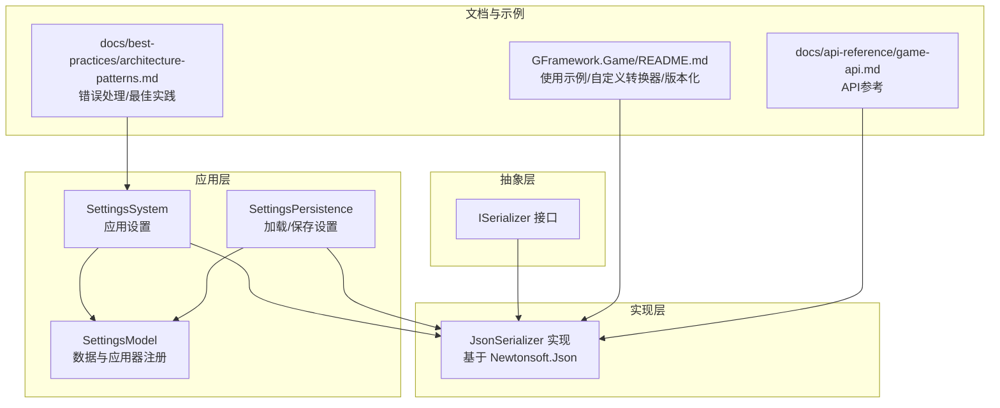
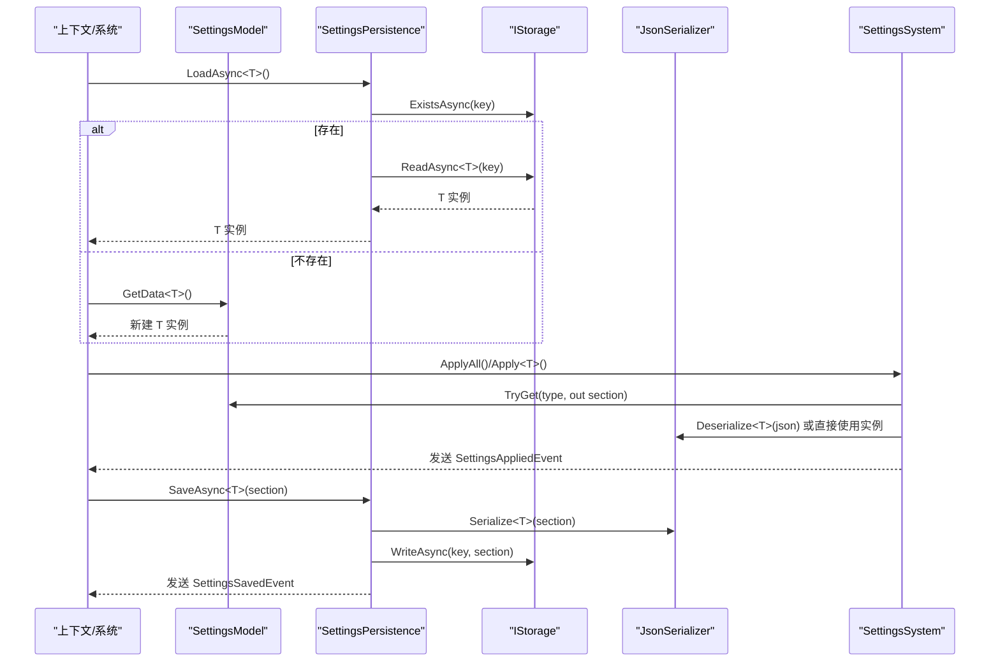
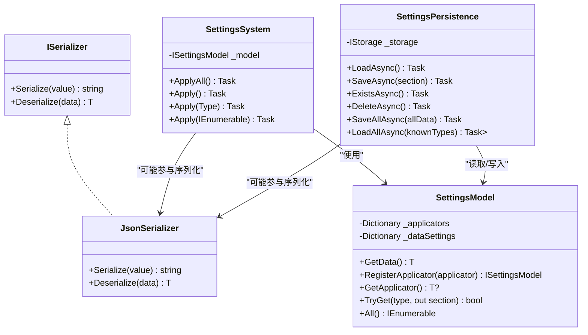

# 序列化器

<cite>
**本文引用的文件**
- [JsonSerializer.cs](file://GFramework.Game/serializer/JsonSerializer.cs)
- [ISerializer.cs](file://GFramework.Game.Abstractions/serializer/ISerializer.cs)
- [SettingsSystem.cs](file://GFramework.Game/setting/SettingsSystem.cs)
- [SettingsPersistence.cs](file://GFramework.Game/setting/SettingsPersistence.cs)
- [SettingsModel.cs](file://GFramework.Game/setting/SettingsModel.cs)
- [README.md（GFramework.Game）](file://GFramework.Game/README.md)
- [game-api.md（docs）](file://docs/api-reference/game-api.md)
- [architecture-patterns.md（docs）](file://docs/best-practices/architecture-patterns.md)
</cite>

## 目录
1. [简介](#简介)
2. [项目结构](#项目结构)
3. [核心组件](#核心组件)
4. [架构总览](#架构总览)
5. [组件详解](#组件详解)
6. [依赖关系分析](#依赖关系分析)
7. [性能与优化](#性能与优化)
8. [故障排查指南](#故障排查指南)
9. [结论](#结论)
10. [附录](#附录)

## 简介
本文件面向GFramework的序列化子系统，聚焦于JsonSerializer的JSON序列化实现，系统性阐述ISerializer接口的设计理念、类型处理机制、在游戏开发中的典型应用场景（数据持久化、网络传输、配置管理），以及性能优化策略（缓存、延迟加载、内存管理）。同时提供配置选项、API参考与实践示例，并总结最佳实践、错误处理与兼容性注意事项。

## 项目结构
围绕序列化能力，相关代码主要分布在以下模块：
- 抽象层：ISerializer接口定义
- 实现层：JsonSerializer基于Newtonsoft.Json的具体实现
- 应用层：设置系统与持久化服务，展示序列化在“配置管理”场景中的使用
- 文档与示例：README与API文档中给出的使用示例、自定义转换器与版本化序列化方案

图表来源
- [ISerializer.cs](file://GFramework.Game.Abstractions/serializer/ISerializer.cs#L1-L25)
- [JsonSerializer.cs](file://GFramework.Game/serializer/JsonSerializer.cs#L1-L29)
- [SettingsSystem.cs](file://GFramework.Game/setting/SettingsSystem.cs#L1-L99)
- [SettingsPersistence.cs](file://GFramework.Game/setting/SettingsPersistence.cs#L1-L141)
- [SettingsModel.cs](file://GFramework.Game/setting/SettingsModel.cs#L1-L103)
- [README.md（GFramework.Game）](file://GFramework.Game/README.md#L649-L1274)
- [game-api.md（docs）](file://docs/api-reference/game-api.md#L535-L601)
- [architecture-patterns.md（docs）](file://docs/best-practices/architecture-patterns.md#L833-L1036)

章节来源
- [JsonSerializer.cs](file://GFramework.Game/serializer/JsonSerializer.cs#L1-L29)
- [ISerializer.cs](file://GFramework.Game.Abstractions/serializer/ISerializer.cs#L1-L25)
- [README.md（GFramework.Game）](file://GFramework.Game/README.md#L649-L1274)

## 核心组件
- ISerializer接口：定义统一的序列化与反序列化抽象，面向字符串格式的通用契约，便于替换不同实现（如JSON、MessagePack等）。
- JsonSerializer实现：封装Newtonsoft.Json，提供类型安全的Serialize/Deserialize方法；在反序列化失败时抛出异常以明确失败原因。
- 设置系统与持久化：通过SettingsSystem/SettingsPersistence/SettingsModel展示序列化在“配置管理”中的典型流程：加载、应用、保存、批量处理与事件通知。

章节来源
- [ISerializer.cs](file://GFramework.Game.Abstractions/serializer/ISerializer.cs#L1-L25)
- [JsonSerializer.cs](file://GFramework.Game/serializer/JsonSerializer.cs#L1-L29)
- [SettingsSystem.cs](file://GFramework.Game/setting/SettingsSystem.cs#L1-L99)
- [SettingsPersistence.cs](file://GFramework.Game/setting/SettingsPersistence.cs#L1-L141)
- [SettingsModel.cs](file://GFramework.Game/setting/SettingsModel.cs#L1-L103)

## 架构总览
下图展示了序列化器在“设置系统”中的角色与交互路径：设置模型提供数据与应用器，持久化服务负责读写存储，系统负责应用设置并发出事件，序列化器贯穿其中用于数据的序列化与反序列化。

图表来源
- [SettingsSystem.cs](file://GFramework.Game/setting/SettingsSystem.cs#L1-L99)
- [SettingsPersistence.cs](file://GFramework.Game/setting/SettingsPersistence.cs#L1-L141)
- [SettingsModel.cs](file://GFramework.Game/setting/SettingsModel.cs#L1-L103)
- [JsonSerializer.cs](file://GFramework.Game/serializer/JsonSerializer.cs#L1-L29)

## 组件详解

### ISerializer接口设计
- 设计目标：提供统一的序列化抽象，屏蔽具体实现细节，便于扩展多种格式（JSON、MessagePack、Protocol Buffers等）。
- 关键点：
  - 泛型方法Serialize<T>/Deserialize<T>确保类型安全。
  - 作为IUtility的子接口，融入GFramework的工具体系。
  - 与存储系统、设置系统解耦，便于替换实现。

章节来源
- [ISerializer.cs](file://GFramework.Game.Abstractions/serializer/ISerializer.cs#L1-L25)

### JsonSerializer实现
- 功能要点：
  - Serialize<T>：将任意对象序列化为JSON字符串。
  - Deserialize<T>：将JSON字符串反序列化为指定类型对象；若解析失败返回空值则抛出异常，明确失败语义。
- 与Newtonsoft.Json的关系：直接委托其SerializeObject/DeserializeObject，保持与该生态一致的特性与行为。
- 类型处理机制：
  - 支持Newtonsoft.Json的特性（如自定义转换器、忽略/包含属性、类型名处理等）。
  - 通过Converters集合扩展对特定类型（如Vector2、Color、Godot Resource）的序列化支持。

章节来源
- [JsonSerializer.cs](file://GFramework.Game/serializer/JsonSerializer.cs#L1-L29)
- [README.md（GFramework.Game）](file://GFramework.Game/README.md#L649-L777)

### 设置系统中的序列化应用
- SettingsModel：维护两类设置集合（数据设置与应用器设置），提供GetData/RegisterApplicator/TryGet/All等方法，支撑设置系统的统一管理。
- SettingsPersistence：负责设置的加载、保存、删除、批量处理与存在性检查，内部通过IStorage进行读写，并在关键节点发送事件。
- SettingsSystem：负责应用设置（TryApply），在应用前后发送事件，捕获异常并向上抛出，保证错误可见性与可恢复性。

章节来源
- [SettingsModel.cs](file://GFramework.Game/setting/SettingsModel.cs#L1-L103)
- [SettingsPersistence.cs](file://GFramework.Game/setting/SettingsPersistence.cs#L1-L141)
- [SettingsSystem.cs](file://GFramework.Game/setting/SettingsSystem.cs#L1-L99)

### API参考与使用示例
- 基础API
  - Serialize<T>(T value)：序列化为JSON字符串。
  - Deserialize<T>(string data)：从JSON字符串反序列化为T。
- 使用示例与扩展
  - README中提供了自定义转换器（Vector2/Color/Godot Resource）与版本化序列化（VersionedData+迁移）的完整示例。
  - API参考文档给出了Serialize/Deserialize/File/Async/Compressed等常见用法的片段。

章节来源
- [JsonSerializer.cs](file://GFramework.Game/serializer/JsonSerializer.cs#L1-L29)
- [README.md（GFramework.Game）](file://GFramework.Game/README.md#L649-L868)
- [game-api.md（docs）](file://docs/api-reference/game-api.md#L535-L601)

### 类图（接口与实现）

图表来源
- [ISerializer.cs](file://GFramework.Game.Abstractions/serializer/ISerializer.cs#L1-L25)
- [JsonSerializer.cs](file://GFramework.Game/serializer/JsonSerializer.cs#L1-L29)
- [SettingsSystem.cs](file://GFramework.Game/setting/SettingsSystem.cs#L1-L99)
- [SettingsPersistence.cs](file://GFramework.Game/setting/SettingsPersistence.cs#L1-L141)
- [SettingsModel.cs](file://GFramework.Game/setting/SettingsModel.cs#L1-L103)

## 依赖关系分析
- 耦合与内聚
  - ISerializer与JsonSerializer之间为接口与实现的清晰分离，内聚度高、耦合度低。
  - SettingsSystem/SettingsPersistence/SettingsModel形成稳定的协作关系，序列化器作为可选组件被间接使用。
- 外部依赖
  - JsonSerializer依赖Newtonsoft.Json；通过Converters扩展实现自定义类型序列化。
- 循环依赖
  - 当前结构未见循环依赖迹象，各模块职责边界清晰。

章节来源
- [JsonSerializer.cs](file://GFramework.Game/serializer/JsonSerializer.cs#L1-L29)
- [ISerializer.cs](file://GFramework.Game.Abstractions/serializer/ISerializer.cs#L1-L25)
- [SettingsSystem.cs](file://GFramework.Game/setting/SettingsSystem.cs#L1-L99)
- [SettingsPersistence.cs](file://GFramework.Game/setting/SettingsPersistence.cs#L1-L141)
- [SettingsModel.cs](file://GFramework.Game/setting/SettingsModel.cs#L1-L103)

## 性能与优化
- 缓存机制
  - 存储层提供缓存包装（CachedStorage），可显著降低频繁读取带来的IO开销；序列化器本身未内置缓存，但可在上层结合缓存策略使用。
- 延迟加载与懒初始化
  - SettingsModel的GetData<T>()采用“首次缺失创建”的策略，避免不必要的实例化。
- 内存管理
  - 使用Converters扩展自定义类型序列化，减少中间对象的创建与拷贝。
  - 对大对象或高频序列化场景，建议结合压缩（README中给出压缩思路）与批量写入（SettingsPersistence的SaveAllAsync）。
- 版本化与兼容性
  - README中提供版本化序列化与迁移方案，避免因字段变更导致的反序列化失败。

章节来源
- [README.md（GFramework.Game）](file://GFramework.Game/README.md#L550-L647)
- [README.md（GFramework.Game）](file://GFramework.Game/README.md#L649-L868)
- [SettingsPersistence.cs](file://GFramework.Game/setting/SettingsPersistence.cs#L76-L87)

## 故障排查指南
- 反序列化失败
  - JsonSerializer在反序列化返回空值时会抛出异常，提示“无法反序列化数据”。应检查JSON格式、类型匹配与转换器配置。
- 设置应用异常
  - SettingsSystem在应用设置时捕获异常并发送事件，同时向上抛出，便于定位问题。建议在业务层捕获并记录上下文信息。
- 错误恢复策略
  - 参考最佳实践文档中的错误处理与恢复策略，优先尝试从备份存储恢复，最后回退到默认数据，确保系统可用性。

章节来源
- [JsonSerializer.cs](file://GFramework.Game/serializer/JsonSerializer.cs#L25-L29)
- [SettingsSystem.cs](file://GFramework.Game/setting/SettingsSystem.cs#L83-L98)
- [architecture-patterns.md（docs）](file://docs/best-practices/architecture-patterns.md#L833-L1036)

## 结论
GFramework的序列化子系统以ISerializer为抽象核心，JsonSerializer提供简洁可靠的JSON实现，并通过Converters扩展满足游戏开发中的复杂类型需求。在“设置系统”中，序列化器与设置模型、持久化服务、系统协作良好，覆盖了配置管理的全生命周期。结合缓存、延迟加载、版本化与错误恢复策略，可在保证易用性的同时兼顾性能与稳定性。

## 附录

### 配置选项与扩展点
- Newtonsoft.Json设置
  - README示例展示了如何配置Formatting、NullValueHandling、DefaultValueHandling与TypeNameHandling等。
- 自定义转换器
  - README提供了Vector2/Color/Godot Resource的转换器示例，可直接扩展到更多类型。
- 版本化与迁移
  - README提供了VersionedData与迁移接口的实现思路，便于跨版本兼容。

章节来源
- [README.md（GFramework.Game）](file://GFramework.Game/README.md#L649-L868)

### API参考摘要
- ISerializer
  - Serialize<T>(T value)：序列化为字符串
  - Deserialize<T>(string data)：反序列化为T
- JsonSerializer
  - 基于Newtonsoft.Json的实现，支持Converters扩展
- SettingsSystem/SettingsPersistence/SettingsModel
  - 提供设置的加载、应用、保存、批量处理与事件通知

章节来源
- [ISerializer.cs](file://GFramework.Game.Abstractions/serializer/ISerializer.cs#L1-L25)
- [JsonSerializer.cs](file://GFramework.Game/serializer/JsonSerializer.cs#L1-L29)
- [SettingsSystem.cs](file://GFramework.Game/setting/SettingsSystem.cs#L1-L99)
- [SettingsPersistence.cs](file://GFramework.Game/setting/SettingsPersistence.cs#L1-L141)
- [SettingsModel.cs](file://GFramework.Game/setting/SettingsModel.cs#L1-L103)
- [game-api.md（docs）](file://docs/api-reference/game-api.md#L535-L601)