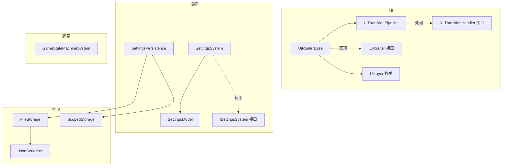
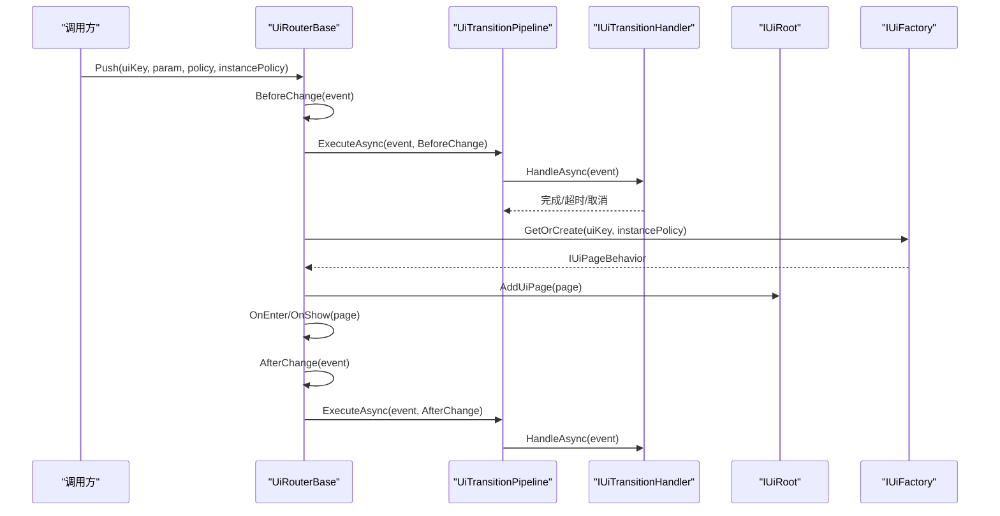
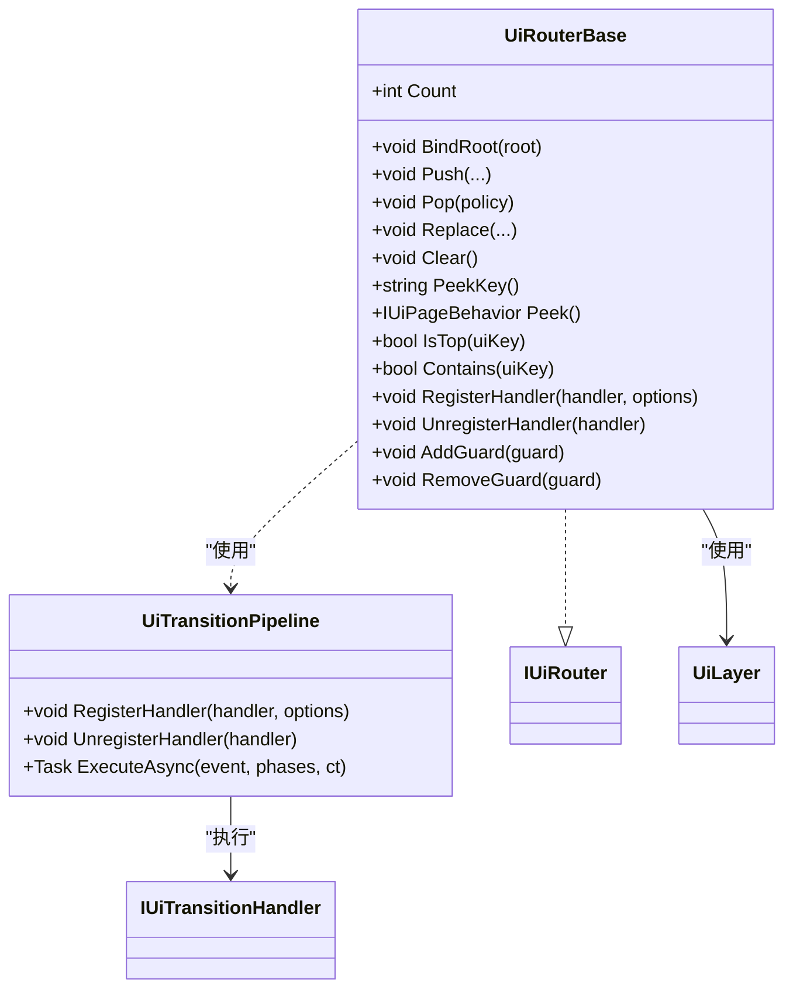
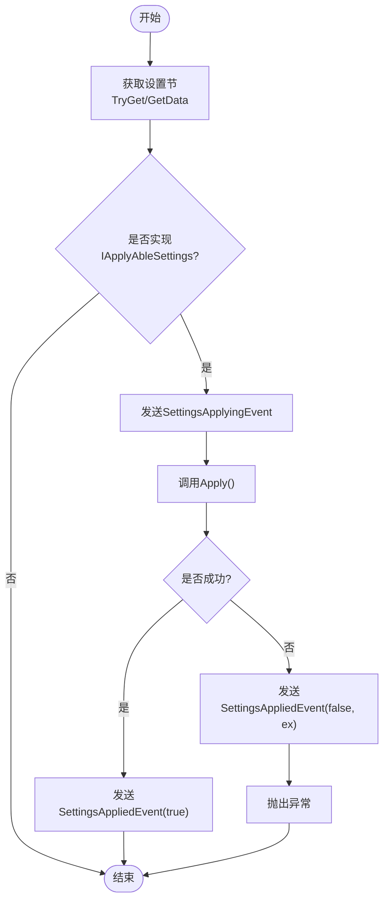
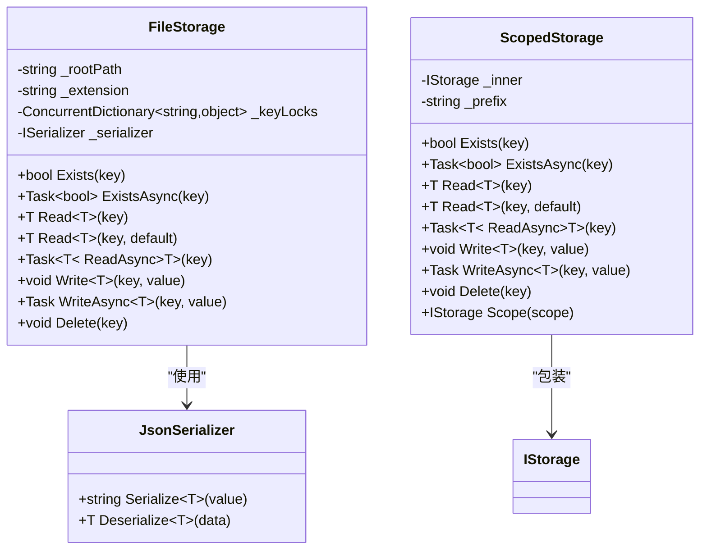
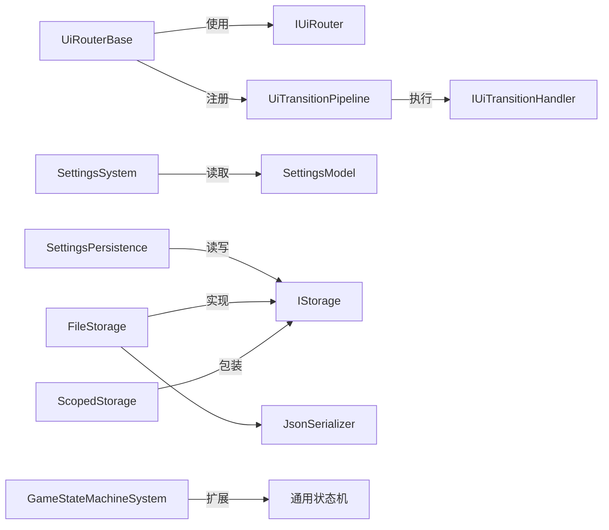

# 游戏功能模块

<cite>
**本文档引用的文件**
- [UiRouterBase.cs](file://GFramework.Game/ui/UiRouterBase.cs)
- [UiTransitionPipeline.cs](file://GFramework.Game/ui/UiTransitionPipeline.cs)
- [IUiRouter.cs](file://GFramework.Game.Abstractions/ui/IUiRouter.cs)
- [IUiTransitionHandler.cs](file://GFramework.Game.Abstractions/ui/IUiTransitionHandler.cs)
- [UiLayer.cs](file://GFramework.Game.Abstractions/enums/UiLayer.cs)
- [SettingsSystem.cs](file://GFramework.Game/setting/SettingsSystem.cs)
- [SettingsModel.cs](file://GFramework.Game/setting/SettingsModel.cs)
- [SettingsPersistence.cs](file://GFramework.Game/setting/SettingsPersistence.cs)
- [ISettingsSystem.cs](file://GFramework.Game.Abstractions/setting/ISettingsSystem.cs)
- [FileStorage.cs](file://GFramework.Game/storage/FileStorage.cs)
- [ScopedStorage.cs](file://GFramework.Game/storage/ScopedStorage.cs)
- [JsonSerializer.cs](file://GFramework.Game/serializer/JsonSerializer.cs)
- [GameStateMachineSystem.cs](file://GFramework.Game/state/GameStateMachineSystem.cs)
</cite>

## 目录
1. [简介](#简介)
2. [项目结构](#项目结构)
3. [核心组件](#核心组件)
4. [架构总览](#架构总览)
5. [详细组件分析](#详细组件分析)
6. [依赖关系分析](#依赖关系分析)
7. [性能考量](#性能考量)
8. [故障排查指南](#故障排查指南)
9. [结论](#结论)
10. [附录](#附录)

## 简介
本文件面向GFramework游戏功能模块，围绕以下主题提供系统化、可操作的技术文档：
- UI系统（UiRouterBase）的页面栈管理、层级系统与过渡管道实现
- 设置系统（SettingsSystem）的配置管理、持久化存储与实时应用机制
- 状态管理系统（GameStateMachineSystem）的有限状态机实现、状态转换逻辑与状态持久化策略
- 存储系统（FileStorage、ScopedStorage）的数据持久化方案与序列化器（JsonSerializer）实现
- 游戏抽象接口设计（IUiRouter、ISettingsSystem等）的理念、职责与使用方法
- 每个模块的配置选项、API参考与实际使用示例
- 最佳实践与性能优化建议

## 项目结构
本模块位于GFramework.Game与GFramework.Game.Abstractions两个工程中，分别提供具体实现与抽象接口。核心模块包括：
- UI路由与过渡：UiRouterBase、UiTransitionPipeline、IUiRouter、IUiTransitionHandler、UiLayer
- 设置系统：SettingsSystem、SettingsModel、SettingsPersistence、ISettingsSystem
- 存储系统：FileStorage、ScopedStorage、JsonSerializer
- 状态系统：GameStateMachineSystem

图表来源
- [UiRouterBase.cs](file://GFramework.Game/ui/UiRouterBase.cs#L13-L314)
- [UiTransitionPipeline.cs](file://GFramework.Game/ui/UiTransitionPipeline.cs#L11-L168)
- [IUiRouter.cs](file://GFramework.Game.Abstractions/ui/IUiRouter.cs#L9-L138)
- [IUiTransitionHandler.cs](file://GFramework.Game.Abstractions/ui/IUiTransitionHandler.cs#L10-L39)
- [UiLayer.cs](file://GFramework.Game.Abstractions/enums/UiLayer.cs#L7-L33)
- [SettingsSystem.cs](file://GFramework.Game/setting/SettingsSystem.cs#L11-L99)
- [SettingsModel.cs](file://GFramework.Game/setting/SettingsModel.cs#L9-L103)
- [SettingsPersistence.cs](file://GFramework.Game/setting/SettingsPersistence.cs#L12-L141)
- [ISettingsSystem.cs](file://GFramework.Game.Abstractions/setting/ISettingsSystem.cs#L11-L32)
- [FileStorage.cs](file://GFramework.Game/storage/FileStorage.cs#L11-L258)
- [ScopedStorage.cs](file://GFramework.Game/storage/ScopedStorage.cs#L11-L99)
- [JsonSerializer.cs](file://GFramework.Game/serializer/JsonSerializer.cs#L9-L29)
- [GameStateMachineSystem.cs](file://GFramework.Game/state/GameStateMachineSystem.cs#L9-L26)

章节来源
- [UiRouterBase.cs](file://GFramework.Game/ui/UiRouterBase.cs#L13-L314)
- [UiTransitionPipeline.cs](file://GFramework.Game/ui/UiTransitionPipeline.cs#L11-L168)
- [IUiRouter.cs](file://GFramework.Game.Abstractions/ui/IUiRouter.cs#L9-L138)
- [IUiTransitionHandler.cs](file://GFramework.Game.Abstractions/ui/IUiTransitionHandler.cs#L10-L39)
- [UiLayer.cs](file://GFramework.Game.Abstractions/enums/UiLayer.cs#L7-L33)
- [SettingsSystem.cs](file://GFramework.Game/setting/SettingsSystem.cs#L11-L99)
- [SettingsModel.cs](file://GFramework.Game/setting/SettingsModel.cs#L9-L103)
- [SettingsPersistence.cs](file://GFramework.Game/setting/SettingsPersistence.cs#L12-L141)
- [ISettingsSystem.cs](file://GFramework.Game.Abstractions/setting/ISettingsSystem.cs#L11-L32)
- [FileStorage.cs](file://GFramework.Game/storage/FileStorage.cs#L11-L258)
- [ScopedStorage.cs](file://GFramework.Game/storage/ScopedStorage.cs#L11-L99)
- [JsonSerializer.cs](file://GFramework.Game/serializer/JsonSerializer.cs#L9-L29)
- [GameStateMachineSystem.cs](file://GFramework.Game/state/GameStateMachineSystem.cs#L9-L26)

## 核心组件
- UI路由与过渡
  - UiRouterBase：提供页面栈管理、层级管理、路由守卫、过渡管道注册与执行
  - UiTransitionPipeline：按阶段与优先级执行UI切换处理器
  - IUiRouter/IUiTransitionHandler：定义路由与过渡扩展点的接口契约
  - UiLayer：定义页面层与浮层的层级体系
- 设置系统
  - SettingsSystem：集中应用设置，触发事件
  - SettingsModel：聚合数据设置与可应用设置
  - SettingsPersistence：封装设置的加载、保存、删除与批量操作
  - ISettingsSystem：对外暴露设置应用接口
- 存储系统
  - FileStorage：基于文件系统的键值存储，带key级锁保证线程安全
  - ScopedStorage：为存储键加前缀的作用域包装器
  - JsonSerializer：基于Newtonsoft.Json的序列化实现
- 状态系统
  - GameStateMachineSystem：在上下文感知的状态机之上提供类型查询与断言能力

章节来源
- [UiRouterBase.cs](file://GFramework.Game/ui/UiRouterBase.cs#L13-L314)
- [UiTransitionPipeline.cs](file://GFramework.Game/ui/UiTransitionPipeline.cs#L11-L168)
- [IUiRouter.cs](file://GFramework.Game.Abstractions/ui/IUiRouter.cs#L9-L138)
- [IUiTransitionHandler.cs](file://GFramework.Game.Abstractions/ui/IUiTransitionHandler.cs#L10-L39)
- [UiLayer.cs](file://GFramework.Game.Abstractions/enums/UiLayer.cs#L7-L33)
- [SettingsSystem.cs](file://GFramework.Game/setting/SettingsSystem.cs#L11-L99)
- [SettingsModel.cs](file://GFramework.Game/setting/SettingsModel.cs#L9-L103)
- [SettingsPersistence.cs](file://GFramework.Game/setting/SettingsPersistence.cs#L12-L141)
- [ISettingsSystem.cs](file://GFramework.Game.Abstractions/setting/ISettingsSystem.cs#L11-L32)
- [FileStorage.cs](file://GFramework.Game/storage/FileStorage.cs#L11-L258)
- [ScopedStorage.cs](file://GFramework.Game/storage/ScopedStorage.cs#L11-L99)
- [JsonSerializer.cs](file://GFramework.Game/serializer/JsonSerializer.cs#L9-L29)
- [GameStateMachineSystem.cs](file://GFramework.Game/state/GameStateMachineSystem.cs#L9-L26)

## 架构总览
UI系统通过“页面栈 + 层级系统 + 过渡管道”的组合实现UI导航与切换；设置系统通过“模型 + 持久化 + 应用器”三层协作实现配置的读取、应用与事件通知；存储系统提供线程安全的键值存储与作用域隔离；状态系统在通用状态机之上提供类型化查询。

图表来源
- [UiRouterBase.cs](file://GFramework.Game/ui/UiRouterBase.cs#L80-L100)
- [UiTransitionPipeline.cs](file://GFramework.Game/ui/UiTransitionPipeline.cs#L63-L101)
- [IUiTransitionHandler.cs](file://GFramework.Game.Abstractions/ui/IUiTransitionHandler.cs#L10-L39)

## 详细组件分析

### UI系统：页面栈管理、层级系统与过渡管道
- 页面栈管理
  - 支持Push（基于uiKey或已有页面）、Pop、Replace、Clear等操作
  - 栈顶元素通过Peek/PeekKey/IsTop/Contains等方法访问
  - 过渡策略（UiTransitionPolicy）与实例策略（UiInstancePolicy）控制页面生命周期与复用
- 层级系统（非栈）
  - 通过UiLayer枚举区分Page、Overlay、Modal、Toast、Topmost等
  - Show/Hide/ClearLayer管理浮层显示与回收
- 过渡管道
  - UiTransitionPipeline按阶段（BeforeChange/AfterChange）与优先级执行处理器
  - 支持超时、取消令牌、错误继续策略
- 路由守卫
  - 支持注册/移除守卫，按优先级执行进入/离开守卫，支持中断与异常处理

图表来源
- [UiRouterBase.cs](file://GFramework.Game/ui/UiRouterBase.cs#L13-L314)
- [UiTransitionPipeline.cs](file://GFramework.Game/ui/UiTransitionPipeline.cs#L11-L168)
- [IUiRouter.cs](file://GFramework.Game.Abstractions/ui/IUiRouter.cs#L9-L138)
- [IUiTransitionHandler.cs](file://GFramework.Game.Abstractions/ui/IUiTransitionHandler.cs#L10-L39)
- [UiLayer.cs](file://GFramework.Game.Abstractions/enums/UiLayer.cs#L7-L33)

章节来源
- [UiRouterBase.cs](file://GFramework.Game/ui/UiRouterBase.cs#L13-L314)
- [UiTransitionPipeline.cs](file://GFramework.Game/ui/UiTransitionPipeline.cs#L11-L168)
- [IUiRouter.cs](file://GFramework.Game.Abstractions/ui/IUiRouter.cs#L9-L138)
- [IUiTransitionHandler.cs](file://GFramework.Game.Abstractions/ui/IUiTransitionHandler.cs#L10-L39)
- [UiLayer.cs](file://GFramework.Game.Abstractions/enums/UiLayer.cs#L7-L33)

### 设置系统：配置管理、持久化存储与实时应用
- SettingsSystem
  - 负责集中应用设置，遍历模型中的设置节并调用可应用设置的Apply方法
  - 发送应用开始/完成事件，异常时发送失败事件并向上抛出
- SettingsModel
  - 聚合两类设置：数据设置（ISettingsData）与可应用设置（IApplyAbleSettings）
  - 提供GetData/RegisterApplicator/GetApplicator/TryGet/All等方法
- SettingsPersistence
  - 基于存储接口（IStorage）实现设置的Load/Save/Delete/LoadAll/SaveAll
  - 通过事件总线发布加载、保存、删除、批量保存等事件
  - 键名规则：Settings_{TypeName}

图表来源
- [SettingsSystem.cs](file://GFramework.Game/setting/SettingsSystem.cs#L83-L98)
- [SettingsModel.cs](file://GFramework.Game/setting/SettingsModel.cs#L65-L94)

章节来源
- [SettingsSystem.cs](file://GFramework.Game/setting/SettingsSystem.cs#L11-L99)
- [SettingsModel.cs](file://GFramework.Game/setting/SettingsModel.cs#L9-L103)
- [SettingsPersistence.cs](file://GFramework.Game/setting/SettingsPersistence.cs#L12-L141)
- [ISettingsSystem.cs](file://GFramework.Game.Abstractions/setting/ISettingsSystem.cs#L11-L32)

### 存储系统：数据持久化与序列化
- FileStorage
  - 基于文件系统，键转路径时进行安全清理与路径校验，防止路径逃逸
  - 每个key持有独立锁对象，确保并发读写安全
  - 支持同步/异步读写、存在性检查、删除
  - 使用ISerializer进行序列化/反序列化
- ScopedStorage
  - 对所有键统一添加前缀，形成作用域隔离
  - 提供Scope方法创建子作用域
- JsonSerializer
  - 基于Newtonsoft.Json的Serialize/Deserialize实现

图表来源
- [FileStorage.cs](file://GFramework.Game/storage/FileStorage.cs#L11-L258)
- [ScopedStorage.cs](file://GFramework.Game/storage/ScopedStorage.cs#L11-L99)
- [JsonSerializer.cs](file://GFramework.Game/serializer/JsonSerializer.cs#L9-L29)

章节来源
- [FileStorage.cs](file://GFramework.Game/storage/FileStorage.cs#L11-L258)
- [ScopedStorage.cs](file://GFramework.Game/storage/ScopedStorage.cs#L11-L99)
- [JsonSerializer.cs](file://GFramework.Game/serializer/JsonSerializer.cs#L9-L29)

### 状态管理系统：有限状态机与查询
- GameStateMachineSystem
  - 在通用状态机系统基础上提供类型化查询：IsIn<T>()与Get<T>()
  - 便于在业务层以强类型方式判断与获取当前状态

章节来源
- [GameStateMachineSystem.cs](file://GFramework.Game/state/GameStateMachineSystem.cs#L9-L26)

### 抽象接口设计与使用方法
- IUiRouter
  - 职责：UI导航与切换的统一入口，包含Push/Pop/Replace/Clear、层级管理、守卫与处理器注册
  - 使用要点：通过BindRoot绑定UI根节点；在RegisterHandlers中注册默认处理器；利用策略参数控制页面生命周期
- ISettingsSystem
  - 职责：集中应用设置，支持单类型、多类型与全部设置的应用
  - 使用要点：在系统初始化后调用ApplyAll或按需调用Apply<T>
- 其他接口
  - IUiTransitionHandler：定义处理器优先级、适用阶段、过滤条件与异步处理逻辑
  - UiLayer：定义页面层与浮层的层级体系，用于Show/Hide等非栈管理

章节来源
- [IUiRouter.cs](file://GFramework.Game.Abstractions/ui/IUiRouter.cs#L9-L138)
- [ISettingsSystem.cs](file://GFramework.Game.Abstractions/setting/ISettingsSystem.cs#L11-L32)
- [IUiTransitionHandler.cs](file://GFramework.Game.Abstractions/ui/IUiTransitionHandler.cs#L10-L39)
- [UiLayer.cs](file://GFramework.Game.Abstractions/enums/UiLayer.cs#L7-L33)

## 依赖关系分析
- UI路由依赖
  - 依赖IUiRoot与IUiFactory以管理页面生命周期与实例复用
  - 通过UiTransitionPipeline与IUiTransitionHandler解耦过渡逻辑
  - 通过路由守卫实现可插拔的进入/离开控制
- 设置系统依赖
  - SettingsSystem依赖ISettingsModel；SettingsModel聚合数据与应用器
  - SettingsPersistence依赖IStorage与事件总线，负责持久化与批量操作
- 存储系统依赖
  - FileStorage依赖ISerializer；ScopedStorage依赖IStorage
- 状态系统依赖
  - GameStateMachineSystem基于通用状态机系统，提供类型化查询

图表来源
- [UiRouterBase.cs](file://GFramework.Game/ui/UiRouterBase.cs#L13-L314)
- [UiTransitionPipeline.cs](file://GFramework.Game/ui/UiTransitionPipeline.cs#L11-L168)
- [IUiRouter.cs](file://GFramework.Game.Abstractions/ui/IUiRouter.cs#L9-L138)
- [IUiTransitionHandler.cs](file://GFramework.Game.Abstractions/ui/IUiTransitionHandler.cs#L10-L39)
- [SettingsSystem.cs](file://GFramework.Game/setting/SettingsSystem.cs#L11-L99)
- [SettingsModel.cs](file://GFramework.Game/setting/SettingsModel.cs#L9-L103)
- [SettingsPersistence.cs](file://GFramework.Game/setting/SettingsPersistence.cs#L12-L141)
- [FileStorage.cs](file://GFramework.Game/storage/FileStorage.cs#L11-L258)
- [ScopedStorage.cs](file://GFramework.Game/storage/ScopedStorage.cs#L11-L99)
- [JsonSerializer.cs](file://GFramework.Game/serializer/JsonSerializer.cs#L9-L29)
- [GameStateMachineSystem.cs](file://GFramework.Game/state/GameStateMachineSystem.cs#L9-L26)

章节来源
- [UiRouterBase.cs](file://GFramework.Game/ui/UiRouterBase.cs#L13-L314)
- [UiTransitionPipeline.cs](file://GFramework.Game/ui/UiTransitionPipeline.cs#L11-L168)
- [SettingsSystem.cs](file://GFramework.Game/setting/SettingsSystem.cs#L11-L99)
- [SettingsModel.cs](file://GFramework.Game/setting/SettingsModel.cs#L9-L103)
- [SettingsPersistence.cs](file://GFramework.Game/setting/SettingsPersistence.cs#L12-L141)
- [FileStorage.cs](file://GFramework.Game/storage/FileStorage.cs#L11-L258)
- [ScopedStorage.cs](file://GFramework.Game/storage/ScopedStorage.cs#L11-L99)
- [JsonSerializer.cs](file://GFramework.Game/serializer/JsonSerializer.cs#L9-L29)
- [GameStateMachineSystem.cs](file://GFramework.Game/state/GameStateMachineSystem.cs#L9-L26)

## 性能考量
- UI过渡
  - 使用AfterChange异步执行避免阻塞主线程
  - 通过UiInstancePolicy控制实例复用，减少频繁创建/销毁开销
  - 路由守卫应尽量短小、异步化，避免长时间阻塞
- 存储
  - FileStorage按key加锁，避免并发写冲突；读多写少场景建议使用异步读取
  - ScopedStorage提供作用域隔离，避免键冲突与命名污染
  - JsonSerializer序列化成本与数据大小相关，建议对大对象分片或压缩
- 设置系统
  - ApplyAll按需调用，避免频繁全量应用
  - SettingsPersistence的批量保存可减少多次IO

## 故障排查指南
- UI路由
  - 若Push被忽略：确认IsTop判断与路由守卫返回值
  - Pop被拦截：检查离开守卫CanLeaveAsync返回值
  - 过渡卡住：检查UiTransitionHandler超时与ContinueOnError配置
- 设置系统
  - Apply失败：查看SettingsAppliedEvent携带的异常信息
  - 加载不到数据：确认键名规则Settings_{TypeName}与存储路径一致
- 存储
  - 文件不存在：确认键名与扩展名、目录创建逻辑
  - 并发写冲突：确认key锁是否生效，避免跨key共享同一锁对象
  - 路径逃逸：检查键名中是否包含非法字符或“..”

章节来源
- [UiRouterBase.cs](file://GFramework.Game/ui/UiRouterBase.cs#L84-L88)
- [UiRouterBase.cs](file://GFramework.Game/ui/UiRouterBase.cs#L148-L152)
- [UiTransitionPipeline.cs](file://GFramework.Game/ui/UiTransitionPipeline.cs#L127-L153)
- [SettingsSystem.cs](file://GFramework.Game/setting/SettingsSystem.cs#L93-L97)
- [FileStorage.cs](file://GFramework.Game/storage/FileStorage.cs#L72-L103)
- [FileStorage.cs](file://GFramework.Game/storage/FileStorage.cs#L246-L254)

## 结论
本模块通过清晰的抽象接口与可插拔的实现，提供了稳定可靠的UI导航、设置管理、数据持久化与状态管理能力。遵循本文档的最佳实践与配置建议，可在保证性能与可维护性的前提下快速构建复杂的游戏功能模块。

## 附录
- API参考与配置选项
  - UI路由
    - Push/Pop/Replace/Clear：支持策略参数与实例策略
    - RegisterHandler/UnregisterHandler：注册过渡处理器与选项
    - AddGuard/RemoveGuard：注册路由守卫与优先级
  - 设置系统
    - Apply/ApplyAll/Apply(IEnumerable)：应用设置
    - SettingsModel：GetData/RegisterApplicator/TryGet/All
    - SettingsPersistence：Load/Save/Delete/LoadAll/SaveAll
  - 存储系统
    - FileStorage：Write/Read/Exists/Delete，支持同步/异步
    - ScopedStorage：Scope创建子作用域
    - JsonSerializer：Serialize/Deserialize
- 实际使用示例（步骤说明）
  - UI页面切换
    - 在模块初始化中注册UiRouter与IUiRoot
    - 在RegisterHandlers中注册默认过渡处理器
    - 调用Push/Pop/Replace进行页面切换
  - 设置应用
    - 在SettingsModel中注册可应用设置
    - 通过SettingsSystem.ApplyAll应用设置
    - 使用SettingsPersistence.Load/Save进行持久化
  - 数据存储
    - 使用FileStorage进行键值读写
    - 使用ScopedStorage进行作用域隔离
    - 使用JsonSerializer进行序列化