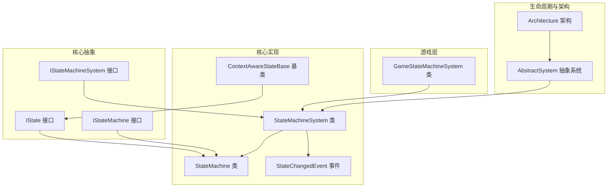
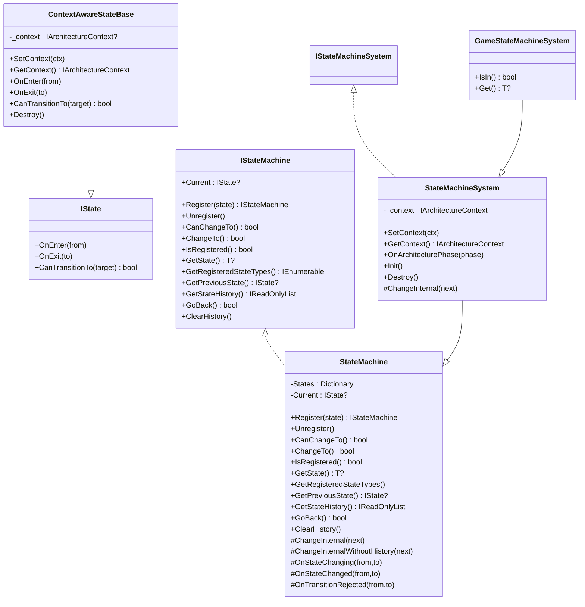
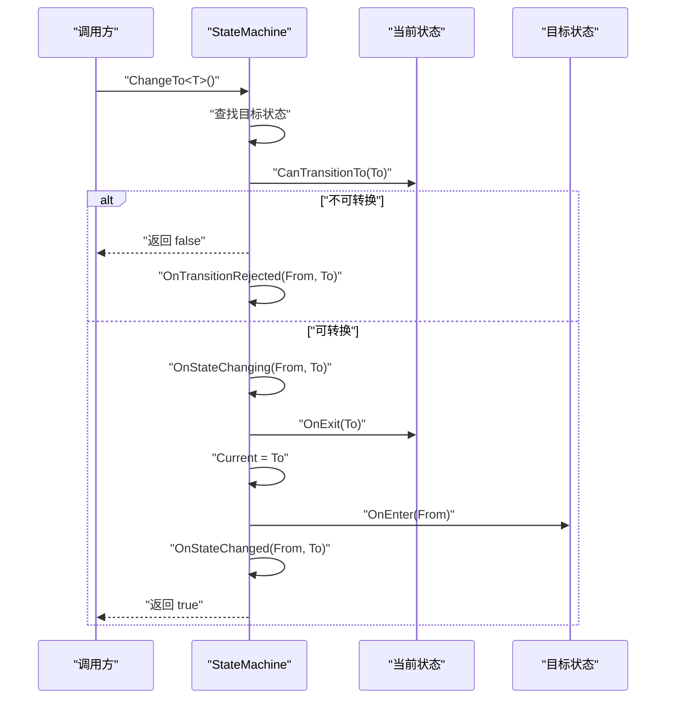
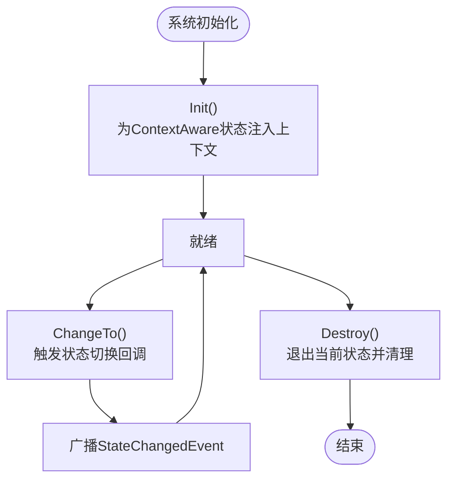
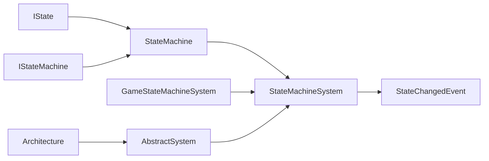

# 状态管理

<cite>
**本文引用的文件**
- [GFramework.Core/state/StateMachineSystem.cs](file://GFramework.Core/state/StateMachineSystem.cs)
- [GFramework.Core/state/StateMachine.cs](file://GFramework.Core/state/StateMachine.cs)
- [GFramework.Core/state/ContextAwareStateBase.cs](file://GFramework.Core/state/ContextAwareStateBase.cs)
- [GFramework.Core/state/StateChangedEvent.cs](file://GFramework.Core/state/StateChangedEvent.cs)
- [GFramework.Core.Abstractions/state/IStateMachineSystem.cs](file://GFramework.Core.Abstractions/state/IStateMachineSystem.cs)
- [GFramework.Core.Abstractions/state/IStateMachine.cs](file://GFramework.Core.Abstractions/state/IStateMachine.cs)
- [GFramework.Core.Abstractions/state/IState.cs](file://GFramework.Core.Abstractions/state/IState.cs)
- [GFramework.Game/state/GameStateMachineSystem.cs](file://GFramework.Game/state/GameStateMachineSystem.cs)
- [GFramework.Core/system/AbstractSystem.cs](file://GFramework.Core/system/AbstractSystem.cs)
- [GFramework.Core/architecture/Architecture.cs](file://GFramework.Core/architecture/Architecture.cs)
- [GFramework.Core.Tests/state/StateMachineSystemTests.cs](file://GFramework.Core.Tests/state/StateMachineSystemTests.cs)
- [GFramework.Core.Tests/state/StateMachineTests.cs](file://GFramework.Core.Tests/state/StateMachineTests.cs)
- [GFramework.Core.Tests/state/StateTests.cs](file://GFramework.Core.Tests/state/StateTests.cs)
- [docs/tutorials/godot-integration.md](file://docs/tutorials/godot-integration.md)
- [GFramework.Core/system/README.md](file://GFramework.Core/system/README.md)
</cite>

## 目录
1. [简介](#简介)
2. [项目结构](#项目结构)
3. [核心组件](#核心组件)
4. [架构总览](#架构总览)
5. [详细组件分析](#详细组件分析)
6. [依赖关系分析](#依赖关系分析)
7. [性能考量](#性能考量)
8. [故障排查指南](#故障排查指南)
9. [结论](#结论)
10. [附录](#附录)

## 简介
本文件面向GFramework的状态管理系统，围绕GameStateMachineSystem的有限状态机实现展开，系统性阐述状态定义、转换规则与状态机生命周期管理；详解IStateMachineSystem与IStateMachine接口设计理念，以及IState接口的状态抽象与生命周期回调；并结合游戏开发常见场景（游戏状态、场景状态、UI状态）给出管理策略、配置选项、API参考与实践示例。最后总结最佳实践、性能优化与调试技巧。

## 项目结构
状态管理相关代码主要分布在以下位置：
- 核心实现：GFramework.Core/state（状态机、上下文感知状态基类、状态变更事件）
- 抽象接口：GFramework.Core.Abstractions/state（状态机与状态接口）
- 游戏层扩展：GFramework.Game/state（游戏专用状态机系统）
- 生命周期与架构集成：GFramework.Core/system、GFramework.Core/architecture
- 测试与示例：GFramework.Core.Tests/state、docs/tutorials/godot-integration.md、GFramework.Core/system/README.md

**图示来源**
- [GFramework.Core.Abstractions/state/IState.cs](file://GFramework.Core.Abstractions/state/IState.cs#L1-L26)
- [GFramework.Core.Abstractions/state/IStateMachine.cs](file://GFramework.Core.Abstractions/state/IStateMachine.cs#L1-L84)
- [GFramework.Core.Abstractions/state/IStateMachineSystem.cs](file://GFramework.Core.Abstractions/state/IStateMachineSystem.cs#L1-L9)
- [GFramework.Core/state/StateMachine.cs](file://GFramework.Core/state/StateMachine.cs#L1-L276)
- [GFramework.Core/state/StateMachineSystem.cs](file://GFramework.Core/state/StateMachineSystem.cs#L1-L96)
- [GFramework.Core/state/ContextAwareStateBase.cs](file://GFramework.Core/state/ContextAwareStateBase.cs#L1-L74)
- [GFramework.Core/state/StateChangedEvent.cs](file://GFramework.Core/state/StateChangedEvent.cs#L1-L19)
- [GFramework.Game/state/GameStateMachineSystem.cs](file://GFramework.Game/state/GameStateMachineSystem.cs#L1-L26)
- [GFramework.Core/system/AbstractSystem.cs](file://GFramework.Core/system/AbstractSystem.cs#L1-L62)
- [GFramework.Core/architecture/Architecture.cs](file://GFramework.Core/architecture/Architecture.cs#L1-L200)

**章节来源**
- [GFramework.Core/state/StateMachineSystem.cs](file://GFramework.Core/state/StateMachineSystem.cs#L1-L96)
- [GFramework.Core/state/StateMachine.cs](file://GFramework.Core/state/StateMachine.cs#L1-L276)
- [GFramework.Core/state/ContextAwareStateBase.cs](file://GFramework.Core/state/ContextAwareStateBase.cs#L1-L74)
- [GFramework.Core/state/StateChangedEvent.cs](file://GFramework.Core/state/StateChangedEvent.cs#L1-L19)
- [GFramework.Core.Abstractions/state/IStateMachineSystem.cs](file://GFramework.Core.Abstractions/state/IStateMachineSystem.cs#L1-L9)
- [GFramework.Core.Abstractions/state/IStateMachine.cs](file://GFramework.Core.Abstractions/state/IStateMachine.cs#L1-L84)
- [GFramework.Core.Abstractions/state/IState.cs](file://GFramework.Core.Abstractions/state/IState.cs#L1-L26)
- [GFramework.Game/state/GameStateMachineSystem.cs](file://GFramework.Game/state/GameStateMachineSystem.cs#L1-L26)
- [GFramework.Core/system/AbstractSystem.cs](file://GFramework.Core/system/AbstractSystem.cs#L1-L62)
- [GFramework.Core/architecture/Architecture.cs](file://GFramework.Core/architecture/Architecture.cs#L1-L200)

## 核心组件
- IState：定义状态的最小契约，包含进入、退出与转换判定三类回调。
- IStateMachine：定义状态机的注册、切换、查询与历史管理能力。
- IStateMachineSystem：在IStateMachine基础上叠加系统生命周期与上下文感知能力。
- StateMachine：IStateMachine的具体实现，负责状态注册、切换、历史记录与回调分发。
- StateMachineSystem：IStateMachineSystem的具体实现，扩展上下文注入、系统生命周期与状态变更事件广播。
- ContextAwareStateBase：IState与IContextAware的基类实现，提供默认回调与上下文访问。
- GameStateMachineSystem：游戏层专用状态机系统，提供类型级查询与获取当前状态的便捷方法。
- StateChangedEvent：状态变更事件载体，携带旧状态与新状态引用。

**章节来源**
- [GFramework.Core.Abstractions/state/IState.cs](file://GFramework.Core.Abstractions/state/IState.cs#L1-L26)
- [GFramework.Core.Abstractions/state/IStateMachine.cs](file://GFramework.Core.Abstractions/state/IStateMachine.cs#L1-L84)
- [GFramework.Core.Abstractions/state/IStateMachineSystem.cs](file://GFramework.Core.Abstractions/state/IStateMachineSystem.cs#L1-L9)
- [GFramework.Core/state/StateMachine.cs](file://GFramework.Core/state/StateMachine.cs#L1-L276)
- [GFramework.Core/state/StateMachineSystem.cs](file://GFramework.Core/state/StateMachineSystem.cs#L1-L96)
- [GFramework.Core/state/ContextAwareStateBase.cs](file://GFramework.Core/state/ContextAwareStateBase.cs#L1-L74)
- [GFramework.Game/state/GameStateMachineSystem.cs](file://GFramework.Game/state/GameStateMachineSystem.cs#L1-L26)
- [GFramework.Core/state/StateChangedEvent.cs](file://GFramework.Core/state/StateChangedEvent.cs#L1-L19)

## 架构总览
状态管理在GFramework中通过“抽象接口 + 核心实现 + 游戏层扩展”的分层设计组织，配合系统生命周期与架构阶段通知，形成可插拔、可扩展的状态机基础设施。

**图示来源**
- [GFramework.Core.Abstractions/state/IState.cs](file://GFramework.Core.Abstractions/state/IState.cs#L1-L26)
- [GFramework.Core.Abstractions/state/IStateMachine.cs](file://GFramework.Core.Abstractions/state/IStateMachine.cs#L1-L84)
- [GFramework.Core.Abstractions/state/IStateMachineSystem.cs](file://GFramework.Core.Abstractions/state/IStateMachineSystem.cs#L1-L9)
- [GFramework.Core/state/StateMachine.cs](file://GFramework.Core/state/StateMachine.cs#L1-L276)
- [GFramework.Core/state/StateMachineSystem.cs](file://GFramework.Core/state/StateMachineSystem.cs#L1-L96)
- [GFramework.Core/state/ContextAwareStateBase.cs](file://GFramework.Core/state/ContextAwareStateBase.cs#L1-L74)
- [GFramework.Game/state/GameStateMachineSystem.cs](file://GFramework.Game/state/GameStateMachineSystem.cs#L1-L26)

## 详细组件分析

### IState 接口与 ContextAwareStateBase 基类
- 设计要点
  - OnEnter/OnExit：状态进入与退出的生命周期回调，支持来源/目标状态传递。
  - CanTransitionTo：状态间转换的判定入口，子类可按业务规则定制。
  - ContextAwareStateBase：提供上下文注入与默认空实现，便于快速派生。
- 使用建议
  - 在OnEnter中加载资源、订阅事件；在OnExit中释放资源、取消订阅。
  - 通过CanTransitionTo实现互斥状态、前置条件校验等规则。

**章节来源**
- [GFramework.Core.Abstractions/state/IState.cs](file://GFramework.Core.Abstractions/state/IState.cs#L1-L26)
- [GFramework.Core/state/ContextAwareStateBase.cs](file://GFramework.Core/state/ContextAwareStateBase.cs#L1-L74)

### IStateMachine 与 StateMachine 实现
- 设计要点
  - 注册/注销：基于Type键的字典存储，支持运行时动态管理。
  - 切换流程：先校验CanTransitionTo，再触发回调，更新Current并维护历史栈。
  - 历史管理：支持GoBack回退与最大历史长度限制。
  - 查询能力：当前状态、历史、注册状态类型、是否可切换等。
- 关键流程（切换序列图）

**图示来源**
- [GFramework.Core/state/StateMachine.cs](file://GFramework.Core/state/StateMachine.cs#L88-L106)
- [GFramework.Core/state/StateMachine.cs](file://GFramework.Core/state/StateMachine.cs#L210-L248)

**章节来源**
- [GFramework.Core.Abstractions/state/IStateMachine.cs](file://GFramework.Core.Abstractions/state/IStateMachine.cs#L1-L84)
- [GFramework.Core/state/StateMachine.cs](file://GFramework.Core/state/StateMachine.cs#L1-L276)

### IStateMachineSystem 与 StateMachineSystem
- 设计要点
  - 继承StateMachine并实现ISystem，具备系统生命周期能力。
  - Init阶段为实现了IContextAware的状态注入上下文。
  - Destroy阶段安全退出当前状态并清理实现IDisposable的状态。
  - ChangeInternal重写后在切换完成后广播StateChangedEvent。
- 生命周期（状态机系统）

**图示来源**
- [GFramework.Core/state/StateMachineSystem.cs](file://GFramework.Core/state/StateMachineSystem.cs#L51-L57)
- [GFramework.Core/state/StateMachineSystem.cs](file://GFramework.Core/state/StateMachineSystem.cs#L62-L78)
- [GFramework.Core/state/StateMachineSystem.cs](file://GFramework.Core/state/StateMachineSystem.cs#L84-L95)

**章节来源**
- [GFramework.Core.Abstractions/state/IStateMachineSystem.cs](file://GFramework.Core.Abstractions/state/IStateMachineSystem.cs#L1-L9)
- [GFramework.Core/state/StateMachineSystem.cs](file://GFramework.Core/state/StateMachineSystem.cs#L1-L96)

### GameStateMachineSystem（游戏层）
- 设计要点
  - 在StateMachineSystem之上提供IsIn<T>()与Get<T>()，简化游戏层状态判断与获取。
- 应用场景
  - 游戏主菜单、玩法中、暂停、结算等状态的快速判断与访问。

**章节来源**
- [GFramework.Game/state/GameStateMachineSystem.cs](file://GFramework.Game/state/GameStateMachineSystem.cs#L1-L26)

### 状态变更事件 StateChangedEvent
- 作用：在状态切换完成后广播事件，携带旧状态与新状态引用，便于解耦监听者。
- 触发点：StateMachineSystem.ChangeInternal内部。

**章节来源**
- [GFramework.Core/state/StateChangedEvent.cs](file://GFramework.Core/state/StateChangedEvent.cs#L1-L19)
- [GFramework.Core/state/StateMachineSystem.cs](file://GFramework.Core/state/StateMachineSystem.cs#L84-L95)

### 与系统生命周期和架构集成
- AbstractSystem：提供Init/Destroy与架构阶段通知的通用能力。
- Architecture：统一管理模块、系统、模型与工具的注册与生命周期，驱动系统按阶段运行。
- 集成路径：StateMachineSystem作为ISystem参与架构生命周期管理。

**章节来源**
- [GFramework.Core/system/AbstractSystem.cs](file://GFramework.Core/system/AbstractSystem.cs#L1-L62)
- [GFramework.Core/architecture/Architecture.cs](file://GFramework.Core/architecture/Architecture.cs#L135-L200)

## 依赖关系分析
- 组件耦合
  - StateMachine依赖IState接口，通过字典管理状态实例，低耦合高内聚。
  - StateMachineSystem依赖架构上下文与事件总线，扩展系统能力。
  - GameStateMachineSystem仅提供游戏层便捷方法，不改变核心状态机语义。
- 外部依赖
  - 事件总线用于广播状态变更事件。
  - 架构容器用于系统注册与生命周期管理。

**图示来源**
- [GFramework.Core/state/StateMachine.cs](file://GFramework.Core/state/StateMachine.cs#L1-L276)
- [GFramework.Core/state/StateMachineSystem.cs](file://GFramework.Core/state/StateMachineSystem.cs#L1-L96)
- [GFramework.Game/state/GameStateMachineSystem.cs](file://GFramework.Game/state/GameStateMachineSystem.cs#L1-L26)
- [GFramework.Core/system/AbstractSystem.cs](file://GFramework.Core/system/AbstractSystem.cs#L1-L62)
- [GFramework.Core/architecture/Architecture.cs](file://GFramework.Core/architecture/Architecture.cs#L1-L200)

**章节来源**
- [GFramework.Core/state/StateMachine.cs](file://GFramework.Core/state/StateMachine.cs#L1-L276)
- [GFramework.Core/state/StateMachineSystem.cs](file://GFramework.Core/state/StateMachineSystem.cs#L1-L96)
- [GFramework.Game/state/GameStateMachineSystem.cs](file://GFramework.Game/state/GameStateMachineSystem.cs#L1-L26)
- [GFramework.Core/system/AbstractSystem.cs](file://GFramework.Core/system/AbstractSystem.cs#L1-L62)
- [GFramework.Core/architecture/Architecture.cs](file://GFramework.Core/architecture/Architecture.cs#L1-L200)

## 性能考量
- 状态切换成本
  - 字典查找O(1)，回调调用O(1)，整体切换为常数时间。
  - 历史栈维护与最大长度限制，避免无限增长导致内存压力。
- 线程安全
  - 内部使用锁保护状态字典与历史栈，确保并发安全。
- 事件广播
  - 状态变更事件仅在切换完成后触发，避免频繁广播造成性能损耗。
- 建议
  - 控制状态数量与历史深度，必要时调用ClearHistory清理。
  - 在CanTransitionTo中做轻量判定，避免昂贵计算阻塞切换。

[本节为通用指导，无需列出具体文件来源]

## 故障排查指南
- 常见问题
  - 切换失败：确认目标状态已注册且当前状态允许转换。
  - 回退无效：确认历史栈非空且目标状态仍处于注册状态。
  - 资源泄漏：确保实现IDisposable的状态在Destroy中清理。
- 单元测试参考
  - 状态机切换与回调验证、注销影响、历史回退、事件广播等均有覆盖。
- 调试技巧
  - 使用StateChangedEvent监听器观察切换轨迹。
  - 在CanTransitionTo中加入日志，定位转换拒绝原因。
  - 在OnEnter/OnExit中记录关键资源的分配与释放。

**章节来源**
- [GFramework.Core.Tests/state/StateMachineTests.cs](file://GFramework.Core.Tests/state/StateMachineTests.cs#L1-L444)
- [GFramework.Core.Tests/state/StateMachineSystemTests.cs](file://GFramework.Core.Tests/state/StateMachineSystemTests.cs#L1-L367)
- [GFramework.Core.Tests/state/StateTests.cs](file://GFramework.Core.Tests/state/StateTests.cs#L1-L493)

## 结论
GFramework的状态管理系统以清晰的接口分层与稳健的实现，提供了可扩展、可测试、可集成的状态机基础设施。通过IState/IStateMachine/IStateMachineSystem的职责分离，结合上下文感知与事件广播，既能满足游戏状态、场景状态与UI状态的多样化需求，又能在架构生命周期内稳定运行。

[本节为总结性内容，无需列出具体文件来源]

## 附录

### API 参考（概览）
- IState
  - OnEnter(from): void
  - OnExit(to): void
  - CanTransitionTo(target): bool
- IStateMachine
  - Current: IState?
  - Register(state): IStateMachine
  - Unregister<T>(): IStateMachine
  - CanChangeTo<T>(): bool
  - ChangeTo<T>(): bool
  - IsRegistered<T>(): bool
  - GetState<T>(): T?
  - GetRegisteredStateTypes(): IEnumerable<Type>
  - GetPreviousState(): IState?
  - GetStateHistory(): IReadOnlyList<IState>
  - GoBack(): bool
  - ClearHistory(): void
- IStateMachineSystem
  - SetContext(ctx): void
  - GetContext(): IArchitectureContext
  - OnArchitecturePhase(phase): void
  - Init(): void
  - Destroy(): void
- GameStateMachineSystem
  - IsIn<T>(): bool
  - Get<T>(): T?

**章节来源**
- [GFramework.Core.Abstractions/state/IState.cs](file://GFramework.Core.Abstractions/state/IState.cs#L1-L26)
- [GFramework.Core.Abstractions/state/IStateMachine.cs](file://GFramework.Core.Abstractions/state/IStateMachine.cs#L1-L84)
- [GFramework.Core.Abstractions/state/IStateMachineSystem.cs](file://GFramework.Core.Abstractions/state/IStateMachineSystem.cs#L1-L9)
- [GFramework.Game/state/GameStateMachineSystem.cs](file://GFramework.Game/state/GameStateMachineSystem.cs#L1-L26)

### 实际使用示例（路径指引）
- Godot集成示例（状态机控制器）
  - 示例路径：docs/tutorials/godot-integration.md
  - 关键片段：状态切换、输入处理与状态回调
- 系统化状态机管理（复杂状态机）
  - 示例路径：GFramework.Core/system/README.md
  - 关键片段：状态转换规则、事件广播与命令触发

**章节来源**
- [docs/tutorials/godot-integration.md](file://docs/tutorials/godot-integration.md#L1083-L1184)
- [GFramework.Core/system/README.md](file://GFramework.Core/system/README.md#L367-L432)