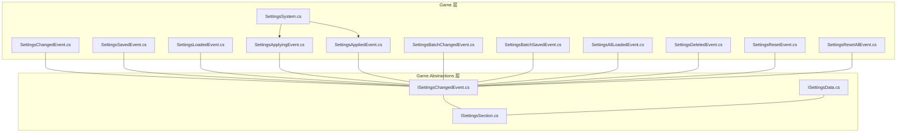
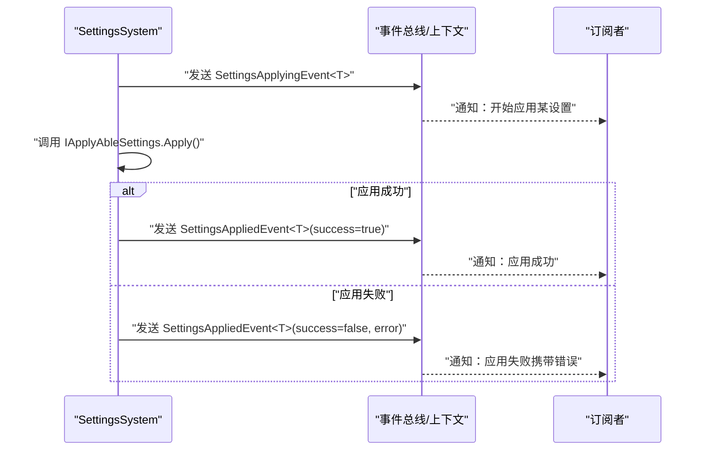
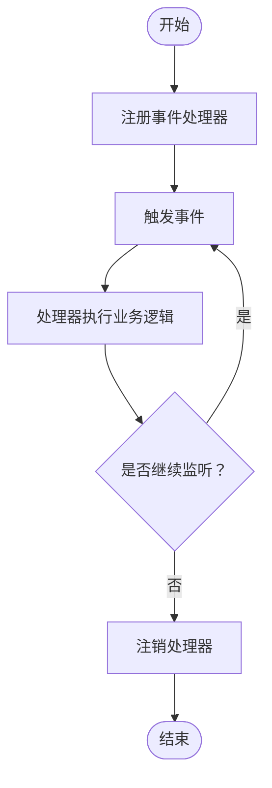
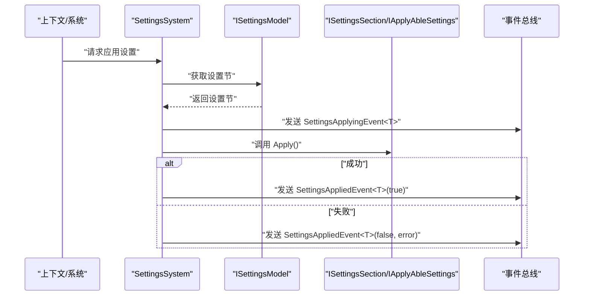
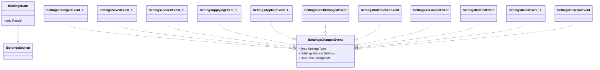

# 设置事件系统

<cite>
**本文引用的文件**
- [SettingsChangedEvent.cs](file://GFramework.Game/setting/events/SettingsChangedEvent.cs)
- [SettingsSavedEvent.cs](file://GFramework.Game/setting/events/SettingsSavedEvent.cs)
- [SettingsLoadedEvent.cs](file://GFramework.Game/setting/events/SettingsLoadedEvent.cs)
- [SettingsApplyingEvent.cs](file://GFramework.Game/setting/events/SettingsApplyingEvent.cs)
- [SettingsAppliedEvent.cs](file://GFramework.Game/setting/events/SettingsAppliedEvent.cs)
- [SettingsBatchChangedEvent.cs](file://GFramework.Game/setting/events/SettingsBatchChangedEvent.cs)
- [SettingsBatchSavedEvent.cs](file://GFramework.Game/setting/events/SettingsBatchSavedEvent.cs)
- [SettingsAllLoadedEvent.cs](file://GFramework.Game/setting/events/SettingsAllLoadedEvent.cs)
- [SettingsDeletedEvent.cs](file://GFramework.Game/setting/events/SettingsDeletedEvent.cs)
- [SettingsResetEvent.cs](file://GFramework.Game/setting/events/SettingsResetEvent.cs)
- [SettingsResetAllEvent.cs](file://GFramework.Game/setting/events/SettingsResetAllEvent.cs)
- [ISettingsChangedEvent.cs](file://GFramework.Game.Abstractions/setting/ISettingsChangedEvent.cs)
- [ISettingsSection.cs](file://GFramework.Game.Abstractions/setting/ISettingsSection.cs)
- [ISettingsData.cs](file://GFramework.Game.Abstractions/setting/ISettingsData.cs)
- [SettingsSystem.cs](file://GFramework.Game/setting/SettingsSystem.cs)
- [EasyEvent.cs](file://GFramework.Core/events/EasyEvent.cs)
</cite>

## 目录
1. [简介](#简介)
2. [项目结构](#项目结构)
3. [核心组件](#核心组件)
4. [架构总览](#架构总览)
5. [详细组件分析](#详细组件分析)
6. [依赖关系分析](#依赖关系分析)
7. [性能考量](#性能考量)
8. [故障排查指南](#故障排查指南)
9. [结论](#结论)
10. [附录：API 参考与使用示例](#附录api-参考与使用示例)

## 简介
本文件面向 GFramework 的“设置事件系统”，系统性梳理与设置管理相关的事件类设计、触发时机、数据传递与生命周期管理，并扩展到批量操作事件、事件处理器实现模式与最佳实践。读者将获得事件驱动架构在设置管理中的应用策略、性能优化建议以及调试技巧。

## 项目结构
设置事件系统位于 Game 层，围绕 ISettingsChangedEvent 接口构建，派生出多类强类型事件，用于描述设置的变更、保存、加载、应用、重置、删除等生命周期节点；同时配合 SettingsSystem 在应用阶段触发相应事件，形成完整的事件驱动闭环。

图表来源
- [SettingsSystem.cs](file://GFramework.Game/setting/SettingsSystem.cs#L1-L99)
- [SettingsChangedEvent.cs](file://GFramework.Game/setting/events/SettingsChangedEvent.cs#L1-L32)
- [SettingsSavedEvent.cs](file://GFramework.Game/setting/events/SettingsSavedEvent.cs#L1-L31)
- [SettingsLoadedEvent.cs](file://GFramework.Game/setting/events/SettingsLoadedEvent.cs#L1-L31)
- [SettingsApplyingEvent.cs](file://GFramework.Game/setting/events/SettingsApplyingEvent.cs#L1-L31)
- [SettingsAppliedEvent.cs](file://GFramework.Game/setting/events/SettingsAppliedEvent.cs#L1-L41)
- [SettingsBatchChangedEvent.cs](file://GFramework.Game/setting/events/SettingsBatchChangedEvent.cs#L1-L31)
- [SettingsBatchSavedEvent.cs](file://GFramework.Game/setting/events/SettingsBatchSavedEvent.cs#L1-L30)
- [SettingsAllLoadedEvent.cs](file://GFramework.Game/setting/events/SettingsAllLoadedEvent.cs#L1-L30)
- [SettingsDeletedEvent.cs](file://GFramework.Game/setting/events/SettingsDeletedEvent.cs#L1-L24)
- [SettingsResetEvent.cs](file://GFramework.Game/setting/events/SettingsResetEvent.cs#L1-L36)
- [SettingsResetAllEvent.cs](file://GFramework.Game/setting/events/SettingsResetAllEvent.cs#L1-L30)
- [ISettingsChangedEvent.cs](file://GFramework.Game.Abstractions/setting/ISettingsChangedEvent.cs#L1-L25)
- [ISettingsSection.cs](file://GFramework.Game.Abstractions/setting/ISettingsSection.cs#L1-L7)
- [ISettingsData.cs](file://GFramework.Game.Abstractions/setting/ISettingsData.cs#L1-L12)

章节来源
- [SettingsSystem.cs](file://GFramework.Game/setting/SettingsSystem.cs#L1-L99)
- [ISettingsChangedEvent.cs](file://GFramework.Game.Abstractions/setting/ISettingsChangedEvent.cs#L1-L25)

## 核心组件
- 事件接口 ISettingsChangedEvent：统一事件的数据契约，包含设置类型、设置实例、变更时间等字段，确保所有设置事件具备一致的查询能力。
- 强类型事件类：围绕 ISettingsChangedEvent 提供 SettingsChangedEvent、SettingsSavedEvent、SettingsLoadedEvent、SettingsApplyingEvent、SettingsAppliedEvent 等，分别对应“变更”“保存”“加载”“开始应用”“应用完成（含成功/失败）”等关键节点。
- 批量事件类：SettingsBatchChangedEvent、SettingsBatchSavedEvent，用于描述多条设置同时变更或保存的场景，数据载体为 ISettingsData 集合。
- 其他事件：SettingsAllLoadedEvent（全部加载完成）、SettingsDeletedEvent（删除）、SettingsResetEvent（单个重置）、SettingsResetAllEvent（全部重置）。
- SettingsSystem：在设置应用流程中触发事件，串联“开始应用 -> 成功/失败 -> 完成”的生命周期。

章节来源
- [ISettingsChangedEvent.cs](file://GFramework.Game.Abstractions/setting/ISettingsChangedEvent.cs#L1-L25)
- [SettingsChangedEvent.cs](file://GFramework.Game/setting/events/SettingsChangedEvent.cs#L1-L32)
- [SettingsSavedEvent.cs](file://GFramework.Game/setting/events/SettingsSavedEvent.cs#L1-L31)
- [SettingsLoadedEvent.cs](file://GFramework.Game/setting/events/SettingsLoadedEvent.cs#L1-L31)
- [SettingsApplyingEvent.cs](file://GFramework.Game/setting/events/SettingsApplyingEvent.cs#L1-L31)
- [SettingsAppliedEvent.cs](file://GFramework.Game/setting/events/SettingsAppliedEvent.cs#L1-L41)
- [SettingsBatchChangedEvent.cs](file://GFramework.Game/setting/events/SettingsBatchChangedEvent.cs#L1-L31)
- [SettingsBatchSavedEvent.cs](file://GFramework.Game/setting/events/SettingsBatchSavedEvent.cs#L1-L30)
- [SettingsAllLoadedEvent.cs](file://GFramework.Game/setting/events/SettingsAllLoadedEvent.cs#L1-L30)
- [SettingsDeletedEvent.cs](file://GFramework.Game/setting/events/SettingsDeletedEvent.cs#L1-L24)
- [SettingsResetEvent.cs](file://GFramework.Game/setting/events/SettingsResetEvent.cs#L1-L36)
- [SettingsResetAllEvent.cs](file://GFramework.Game/setting/events/SettingsResetAllEvent.cs#L1-L30)
- [SettingsSystem.cs](file://GFramework.Game/setting/SettingsSystem.cs#L1-L99)

## 架构总览
设置事件系统采用事件驱动架构，通过 SettingsSystem 在设置应用生命周期中主动触发各类事件，订阅者基于事件类型与数据进行响应，实现解耦与可扩展的设置管理。

图表来源
- [SettingsSystem.cs](file://GFramework.Game/setting/SettingsSystem.cs#L83-L98)
- [SettingsApplyingEvent.cs](file://GFramework.Game/setting/events/SettingsApplyingEvent.cs#L1-L31)
- [SettingsAppliedEvent.cs](file://GFramework.Game/setting/events/SettingsAppliedEvent.cs#L1-L41)

## 详细组件分析

### 事件生命周期与触发时机
- 变更事件（SettingsChangedEvent<T>）
  - 触发时机：设置值发生变更时（通常由设置模型或属性绑定触发）。
  - 数据传递：包含 TypedSettings（强类型设置实例）、SettingsType（类型）、ChangedAt（UTC 时间）。
- 保存事件（SettingsSavedEvent<T>）
  - 触发时机：设置保存成功时。
  - 数据传递：同上，强调“保存完成”语义。
- 加载事件（SettingsLoadedEvent<T>）
  - 触发时机：设置从持久化层加载完成后。
  - 数据传递：同上，强调“加载完成”语义。
- 应用阶段事件
  - 开始应用（SettingsApplyingEvent<T>）：在调用 IApplyAbleSettings.Apply() 前触发。
  - 应用完成（SettingsAppliedEvent<T>）：在调用后根据结果触发成功或失败事件，携带 success 与可选 error。
- 批量事件
  - 变更（SettingsBatchChangedEvent）：当多个 ISettingsData 同步变更时触发，Settings 为 null，ChangedSettings 列表承载具体变更项。
  - 保存（SettingsBatchSavedEvent）：保存多个 ISettingsData 时触发，Settings 为 null，SavedSettings 为只读集合。
- 其他事件
  - 全部加载（SettingsAllLoadedEvent）：所有设置节加载完成时触发。
  - 删除（SettingsDeletedEvent）：删除某个设置类型时触发。
  - 重置
    - 单个（SettingsResetEvent<T>）：单个设置节重置为默认值后触发。
    - 全部（SettingsResetAllEvent）：全部设置节重置后触发。

章节来源
- [SettingsChangedEvent.cs](file://GFramework.Game/setting/events/SettingsChangedEvent.cs#L1-L32)
- [SettingsSavedEvent.cs](file://GFramework.Game/setting/events/SettingsSavedEvent.cs#L1-L31)
- [SettingsLoadedEvent.cs](file://GFramework.Game/setting/events/SettingsLoadedEvent.cs#L1-L31)
- [SettingsApplyingEvent.cs](file://GFramework.Game/setting/events/SettingsApplyingEvent.cs#L1-L31)
- [SettingsAppliedEvent.cs](file://GFramework.Game/setting/events/SettingsAppliedEvent.cs#L1-L41)
- [SettingsBatchChangedEvent.cs](file://GFramework.Game/setting/events/SettingsBatchChangedEvent.cs#L1-L31)
- [SettingsBatchSavedEvent.cs](file://GFramework.Game/setting/events/SettingsBatchSavedEvent.cs#L1-L30)
- [SettingsAllLoadedEvent.cs](file://GFramework.Game/setting/events/SettingsAllLoadedEvent.cs#L1-L30)
- [SettingsDeletedEvent.cs](file://GFramework.Game/setting/events/SettingsDeletedEvent.cs#L1-L24)
- [SettingsResetEvent.cs](file://GFramework.Game/setting/events/SettingsResetEvent.cs#L1-L36)
- [SettingsResetAllEvent.cs](file://GFramework.Game/setting/events/SettingsResetAllEvent.cs#L1-L30)

### 事件注册、分发与注销机制
- 注册：事件订阅通常通过上下文或事件总线提供的注册方法完成，接收 Action 或带参数的回调。
- 分发：事件由 SettingsSystem 在恰当的生命周期节点触发，事件总线负责将事件广播给所有已注册的处理器。
- 注销：提供 IUnRegister 对象以解除绑定，避免内存泄漏与重复回调。

为便于理解，下图给出一个通用的事件注册/触发/注销流程示意：

（本图为概念性流程图，不直接映射具体源码文件）

### 批量操作事件的特殊处理
- SettingsBatchChangedEvent
  - 数据载体：ChangedSettings 为 ISettingsData 列表，表示一次批量变更涉及的具体数据项。
  - 特殊点：Settings 为 null，需通过 ChangedSettings 获取实际受影响的设置数据。
- SettingsBatchSavedEvent
  - 数据载体：SavedSettings 为 ISettingsData 只读集合，表示一次批量保存涉及的数据项。
  - 特殊点：Settings 为 null，需通过 SavedSettings 获取保存结果。

章节来源
- [SettingsBatchChangedEvent.cs](file://GFramework.Game/setting/events/SettingsBatchChangedEvent.cs#L1-L31)
- [SettingsBatchSavedEvent.cs](file://GFramework.Game/setting/events/SettingsBatchSavedEvent.cs#L1-L30)

### 事件处理器实现模式与最佳实践
- 模式一：按类型订阅
  - 订阅 SettingsApplyingEvent<T> 与 SettingsAppliedEvent<T>，在 Applying 中准备资源，在 Applied 中清理或记录日志。
- 模式二：按接口订阅
  - 订阅 ISettingsChangedEvent，通过 SettingsType 与 Settings 进行分支处理，适用于需要统一处理多种设置类型的场景。
- 最佳实践
  - 明确职责边界：仅处理与自身模块相关的设置事件，避免过度耦合。
  - 使用注销：在模块卸载或对象销毁时及时注销事件，防止内存泄漏。
  - 错误处理：在 SettingsAppliedEvent<T> 的失败分支中记录错误并回滚或补偿。
  - 性能：避免在事件处理器中执行阻塞操作，必要时异步化或延迟处理。
  - 幂等性：事件处理器应保证多次触发不会产生副作用。

章节来源
- [ISettingsChangedEvent.cs](file://GFramework.Game.Abstractions/setting/ISettingsChangedEvent.cs#L1-L25)
- [SettingsSystem.cs](file://GFramework.Game/setting/SettingsSystem.cs#L83-L98)

### SettingsSystem 的事件触发流程
SettingsSystem 在应用设置时，会先触发 SettingsApplyingEvent，再调用 IApplyAbleSettings.Apply()，最后根据结果触发 SettingsAppliedEvent（成功或失败）。该流程确保订阅者可以在应用前后进行必要的处理。

图表来源
- [SettingsSystem.cs](file://GFramework.Game/setting/SettingsSystem.cs#L83-L98)

章节来源
- [SettingsSystem.cs](file://GFramework.Game/setting/SettingsSystem.cs#L1-L99)

## 依赖关系分析
- 事件接口与数据契约
  - ISettingsChangedEvent 统一事件结构，ISettingsSection 作为设置节的标记接口，ISettingsData 扩展 ISettingsSection 并增加 Reset 能力。
- 事件类与接口的关系
  - 多数强类型事件类实现 ISettingsChangedEvent，部分事件类（如批量事件）通过集合承载数据，Settings 属性为 null。
- SettingsSystem 与事件
  - SettingsSystem 依赖 ISettingsModel 获取设置节，并在应用阶段触发事件，体现事件驱动的控制流。

图表来源
- [ISettingsChangedEvent.cs](file://GFramework.Game.Abstractions/setting/ISettingsChangedEvent.cs#L1-L25)
- [ISettingsSection.cs](file://GFramework.Game.Abstractions/setting/ISettingsSection.cs#L1-L7)
- [ISettingsData.cs](file://GFramework.Game.Abstractions/setting/ISettingsData.cs#L1-L12)
- [SettingsChangedEvent.cs](file://GFramework.Game/setting/events/SettingsChangedEvent.cs#L1-L32)
- [SettingsSavedEvent.cs](file://GFramework.Game/setting/events/SettingsSavedEvent.cs#L1-L31)
- [SettingsLoadedEvent.cs](file://GFramework.Game/setting/events/SettingsLoadedEvent.cs#L1-L31)
- [SettingsApplyingEvent.cs](file://GFramework.Game/setting/events/SettingsApplyingEvent.cs#L1-L31)
- [SettingsAppliedEvent.cs](file://GFramework.Game/setting/events/SettingsAppliedEvent.cs#L1-L41)
- [SettingsBatchChangedEvent.cs](file://GFramework.Game/setting/events/SettingsBatchChangedEvent.cs#L1-L31)
- [SettingsBatchSavedEvent.cs](file://GFramework.Game/setting/events/SettingsBatchSavedEvent.cs#L1-L30)
- [SettingsAllLoadedEvent.cs](file://GFramework.Game/setting/events/SettingsAllLoadedEvent.cs#L1-L30)
- [SettingsDeletedEvent.cs](file://GFramework.Game/setting/events/SettingsDeletedEvent.cs#L1-L24)
- [SettingsResetEvent.cs](file://GFramework.Game/setting/events/SettingsResetEvent.cs#L1-L36)
- [SettingsResetAllEvent.cs](file://GFramework.Game/setting/events/SettingsResetAllEvent.cs#L1-L30)

章节来源
- [ISettingsChangedEvent.cs](file://GFramework.Game.Abstractions/setting/ISettingsChangedEvent.cs#L1-L25)
- [ISettingsSection.cs](file://GFramework.Game.Abstractions/setting/ISettingsSection.cs#L1-L7)
- [ISettingsData.cs](file://GFramework.Game.Abstractions/setting/ISettingsData.cs#L1-L12)
- [SettingsSystem.cs](file://GFramework.Game/setting/SettingsSystem.cs#L1-L99)

## 性能考量
- 事件风暴防护
  - 批量事件（SettingsBatchChangedEvent、SettingsBatchSavedEvent）通过集合承载数据，减少事件数量，降低总线压力。
- 处理器开销
  - 避免在事件处理器中执行耗时同步操作；必要时异步化或延迟处理。
- 内存与生命周期
  - 使用 IUnRegister 及时注销处理器，防止长期驻留导致的内存增长。
- 幂等与去重
  - 在订阅端对重复事件进行去重或幂等处理，避免重复应用同一设置。

## 故障排查指南
- 应用失败定位
  - 关注 SettingsAppliedEvent<T> 的失败分支，结合 Error 字段定位具体异常。
- 订阅缺失
  - 若未收到事件，请检查注册是否正确、作用域是否匹配、是否在正确生命周期内注册。
- 数据一致性
  - 批量事件中 Settings 为 null，务必通过 ChangedSettings/SavedSettings/NewSettings 获取实际数据。
- 调试技巧
  - 在 SettingsApplyingEvent 与 SettingsAppliedEvent 之间插入日志，记录 Apply 前后状态。
  - 使用断言或单元测试验证事件序列与数据完整性。

章节来源
- [SettingsAppliedEvent.cs](file://GFramework.Game/setting/events/SettingsAppliedEvent.cs#L1-L41)
- [SettingsSystem.cs](file://GFramework.Game/setting/SettingsSystem.cs#L83-L98)

## 结论
GFramework 的设置事件系统以 ISettingsChangedEvent 为核心，围绕设置的变更、保存、加载、应用、重置与删除构建了完整的事件族，并通过 SettingsSystem 实现了清晰的生命周期触发。配合批量事件与统一接口，既满足细粒度控制，也兼顾大规模操作的性能与可维护性。遵循本文的实现模式与最佳实践，可在复杂设置场景中实现高内聚、低耦合的事件驱动架构。

## 附录：API 参考与使用示例

- 事件接口与数据契约
  - ISettingsChangedEvent：统一事件结构，包含 SettingsType、Settings、ChangedAt。
  - ISettingsSection：设置节标记接口。
  - ISettingsData：继承 ISettingsSection 并提供 Reset 能力。

- 常用事件类
  - SettingsChangedEvent<T>：设置变更事件。
  - SettingsSavedEvent<T>：设置保存事件。
  - SettingsLoadedEvent<T>：设置加载事件。
  - SettingsApplyingEvent<T>：设置开始应用事件。
  - SettingsAppliedEvent<T>：设置应用完成事件（含成功/失败与错误）。
  - SettingsBatchChangedEvent：批量变更事件。
  - SettingsBatchSavedEvent：批量保存事件。
  - SettingsAllLoadedEvent：全部加载完成事件。
  - SettingsDeletedEvent：删除事件。
  - SettingsResetEvent<T>：单个重置事件。
  - SettingsResetAllEvent：全部重置事件。

- 使用示例（步骤说明）
  - 订阅应用前事件：订阅 SettingsApplyingEvent<T>，在处理器中准备资源或记录日志。
  - 订阅应用后事件：订阅 SettingsAppliedEvent<T>，在成功分支中确认生效，在失败分支中记录错误并回滚。
  - 处理批量事件：订阅 SettingsBatchChangedEvent 或 SettingsBatchSavedEvent，遍历 ChangedSettings/SavedSettings 获取受影响项。
  - 注销处理器：在模块卸载或对象销毁时调用注销方法，确保无残留回调。

- 事件总线与简单事件（参考）
  - EasyEvent：提供 Register/UnRegister/Trigger 的简单事件模型，可用于理解事件注册与注销机制。

章节来源
- [ISettingsChangedEvent.cs](file://GFramework.Game.Abstractions/setting/ISettingsChangedEvent.cs#L1-L25)
- [ISettingsSection.cs](file://GFramework.Game.Abstractions/setting/ISettingsSection.cs#L1-L7)
- [ISettingsData.cs](file://GFramework.Game.Abstractions/setting/ISettingsData.cs#L1-L12)
- [SettingsChangedEvent.cs](file://GFramework.Game/setting/events/SettingsChangedEvent.cs#L1-L32)
- [SettingsSavedEvent.cs](file://GFramework.Game/setting/events/SettingsSavedEvent.cs#L1-L31)
- [SettingsLoadedEvent.cs](file://GFramework.Game/setting/events/SettingsLoadedEvent.cs#L1-L31)
- [SettingsApplyingEvent.cs](file://GFramework.Game/setting/events/SettingsApplyingEvent.cs#L1-L31)
- [SettingsAppliedEvent.cs](file://GFramework.Game/setting/events/SettingsAppliedEvent.cs#L1-L41)
- [SettingsBatchChangedEvent.cs](file://GFramework.Game/setting/events/SettingsBatchChangedEvent.cs#L1-L31)
- [SettingsBatchSavedEvent.cs](file://GFramework.Game/setting/events/SettingsBatchSavedEvent.cs#L1-L30)
- [SettingsAllLoadedEvent.cs](file://GFramework.Game/setting/events/SettingsAllLoadedEvent.cs#L1-L30)
- [SettingsDeletedEvent.cs](file://GFramework.Game/setting/events/SettingsDeletedEvent.cs#L1-L24)
- [SettingsResetEvent.cs](file://GFramework.Game/setting/events/SettingsResetEvent.cs#L1-L36)
- [SettingsResetAllEvent.cs](file://GFramework.Game/setting/events/SettingsResetAllEvent.cs#L1-L30)
- [EasyEvent.cs](file://GFramework.Core/events/EasyEvent.cs#L1-L39)
- [SettingsSystem.cs](file://GFramework.Game/setting/SettingsSystem.cs#L1-L99)