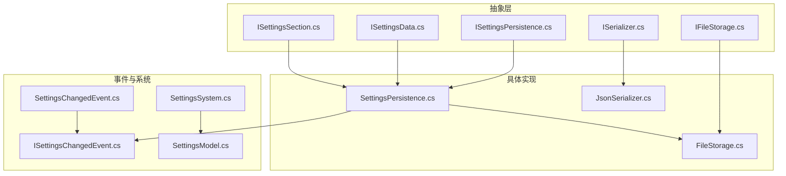
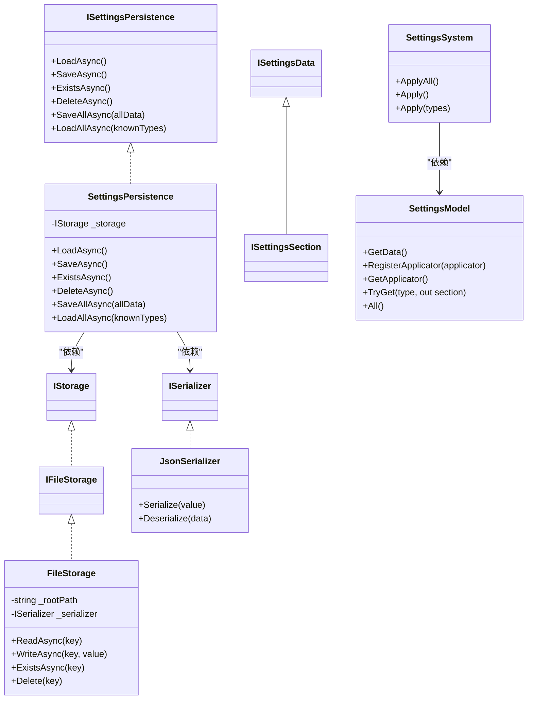
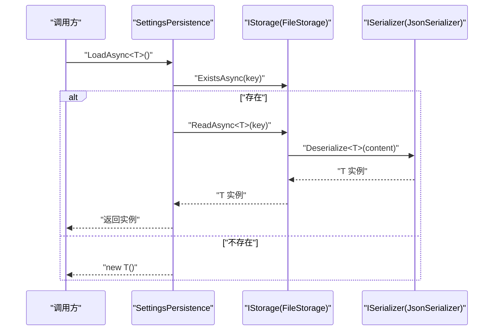
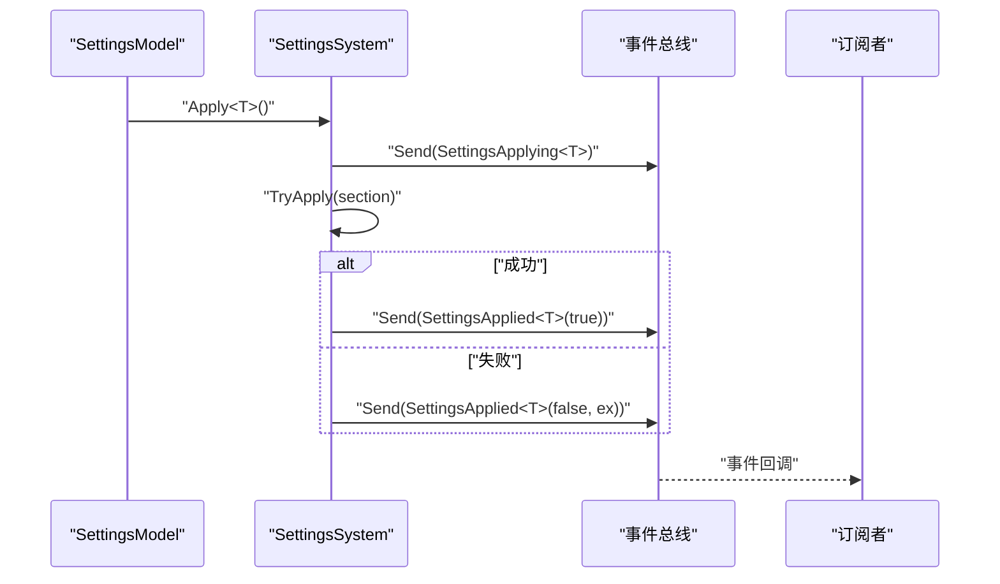
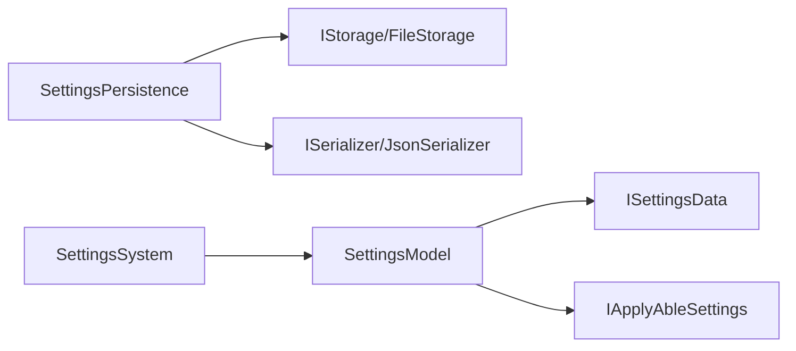
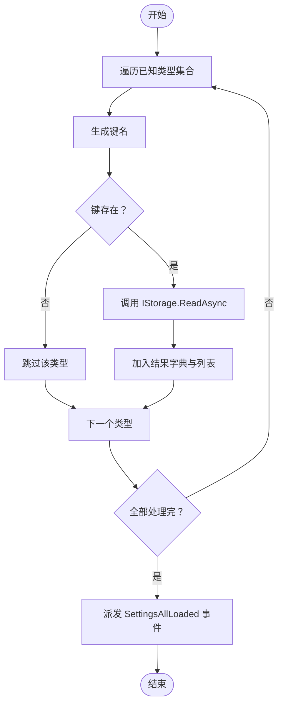

# 设置持久化

<cite>
**本文引用的文件**
- [SettingsPersistence.cs](file://GFramework.Game/setting/SettingsPersistence.cs)
- [ISettingsPersistence.cs](file://GFramework.Game.Abstractions/setting/ISettingsPersistence.cs)
- [ISettingsChangedEvent.cs](file://GFramework.Game.Abstractions/setting/ISettingsChangedEvent.cs)
- [SettingsChangedEvent.cs](file://GFramework.Game/setting/events/SettingsChangedEvent.cs)
- [SettingsModel.cs](file://GFramework.Game/setting/SettingsModel.cs)
- [SettingsSystem.cs](file://GFramework.Game/setting/SettingsSystem.cs)
- [FileStorage.cs](file://GFramework.Game/storage/FileStorage.cs)
- [IFileStorage.cs](file://GFramework.Game.Abstractions/storage/IFileStorage.cs)
- [ISerializer.cs](file://GFramework.Game.Abstractions/serializer/ISerializer.cs)
- [JsonSerializer.cs](file://GFramework.Game/serializer/JsonSerializer.cs)
- [ISettingsData.cs](file://GFramework.Game.Abstractions/setting/ISettingsData.cs)
- [ISettingsSection.cs](file://GFramework.Game.Abstractions/setting/ISettingsSection.cs)
- [SettingsData.cs](file://GFramework.Game.Abstractions/setting/SettingsData.cs)
- [AudioSettings.cs](file://GFramework.Game.Abstractions/setting/AudioSettings.cs)
</cite>

## 目录
1. [简介](#简介)
2. [项目结构](#项目结构)
3. [核心组件](#核心组件)
4. [架构总览](#架构总览)
5. [详细组件分析](#详细组件分析)
6. [依赖关系分析](#依赖关系分析)
7. [性能考虑](#性能考虑)
8. [故障排除指南](#故障排除指南)
9. [结论](#结论)
10. [附录](#附录)

## 简介
本文件围绕 GFramework 的设置持久化子系统，系统性梳理 SettingsPersistence 类的持久化策略、ISettingsPersistence 接口设计原则、设置变更事件模型与通知机制，并对数据校验、版本兼容性与错误恢复策略进行说明。同时给出配置选项、性能优化建议与不同存储场景的最佳实践与迁移策略。

## 项目结构
设置持久化相关代码主要分布在以下模块：
- 抽象层：定义接口与契约（ISettingsPersistence、ISettingsData、ISettingsSection、ISerializer、IFileStorage 等）
- 具体实现：SettingsPersistence 负责加载/保存/删除/批量操作；FileStorage 提供基于文件的存储；JsonSerializer 提供 JSON 序列化能力
- 事件与系统：SettingsChangedEvent 变更事件模型；SettingsSystem 负责应用设置；SettingsModel 管理设置节与可应用设置

**图表来源**
- [ISettingsPersistence.cs](file://GFramework.Game.Abstractions/setting/ISettingsPersistence.cs#L1-L43)
- [ISettingsData.cs](file://GFramework.Game.Abstractions/setting/ISettingsData.cs#L1-L12)
- [ISettingsSection.cs](file://GFramework.Game.Abstractions/setting/ISettingsSection.cs#L1-L7)
- [ISerializer.cs](file://GFramework.Game.Abstractions/serializer/ISerializer.cs#L1-L25)
- [IFileStorage.cs](file://GFramework.Game.Abstractions/storage/IFileStorage.cs#L1-L9)
- [SettingsPersistence.cs](file://GFramework.Game/setting/SettingsPersistence.cs#L1-L141)
- [FileStorage.cs](file://GFramework.Game/storage/FileStorage.cs#L1-L258)
- [JsonSerializer.cs](file://GFramework.Game/serializer/JsonSerializer.cs#L1-L29)
- [ISettingsChangedEvent.cs](file://GFramework.Game.Abstractions/setting/ISettingsChangedEvent.cs#L1-L25)
- [SettingsChangedEvent.cs](file://GFramework.Game/setting/events/SettingsChangedEvent.cs#L1-L32)
- [SettingsSystem.cs](file://GFramework.Game/setting/SettingsSystem.cs#L1-L99)
- [SettingsModel.cs](file://GFramework.Game/setting/SettingsModel.cs#L1-L103)

**章节来源**
- [SettingsPersistence.cs](file://GFramework.Game/setting/SettingsPersistence.cs#L1-L141)
- [ISettingsPersistence.cs](file://GFramework.Game.Abstractions/setting/ISettingsPersistence.cs#L1-L43)
- [FileStorage.cs](file://GFramework.Game/storage/FileStorage.cs#L1-L258)
- [JsonSerializer.cs](file://GFramework.Game/serializer/JsonSerializer.cs#L1-L29)
- [ISettingsChangedEvent.cs](file://GFramework.Game.Abstractions/setting/ISettingsChangedEvent.cs#L1-L25)
- [SettingsChangedEvent.cs](file://GFramework.Game/setting/events/SettingsChangedEvent.cs#L1-L32)
- [SettingsSystem.cs](file://GFramework.Game/setting/SettingsSystem.cs#L1-L99)
- [SettingsModel.cs](file://GFramework.Game/setting/SettingsModel.cs#L1-L103)

## 核心组件
- SettingsPersistence：实现 ISettingsPersistence，封装对 IStorage 的读写与事件派发，提供单个与批量的加载/保存/删除能力，并生成 SettingsLoaded/SettingsSaved/SettingsDeleted/SettingsBatchSaved 等事件
- ISettingsPersistence：定义异步 LoadAsync/SaveAsync/ExistsAsync/DeleteAsync/SaveAllAsync/LoadAllAsync 等契约
- FileStorage：基于文件系统的 IFileStorage 实现，提供线程安全的读写、键名到路径的映射、UTF-8 文本读写与 JSON 序列化
- JsonSerializer：基于 Newtonsoft.Json 的 ISerializer 实现，负责对象与 JSON 字符串之间的转换
- SettingsSystem：负责应用设置（TryApply），并在应用前后发送 SettingsApplying/SettingsApplied 事件
- SettingsModel：管理 ISettingsData 与 IApplyAbleSettings 的注册与检索，聚合所有设置节
- ISettingsChangedEvent/SettingsChangedEvent：设置变更事件模型，携带设置类型、实例与变更时间

**章节来源**
- [SettingsPersistence.cs](file://GFramework.Game/setting/SettingsPersistence.cs#L12-L141)
- [ISettingsPersistence.cs](file://GFramework.Game.Abstractions/setting/ISettingsPersistence.cs#L12-L43)
- [FileStorage.cs](file://GFramework.Game/storage/FileStorage.cs#L11-L258)
- [JsonSerializer.cs](file://GFramework.Game/serializer/JsonSerializer.cs#L9-L29)
- [SettingsSystem.cs](file://GFramework.Game/setting/SettingsSystem.cs#L11-L99)
- [SettingsModel.cs](file://GFramework.Game/setting/SettingsModel.cs#L9-L103)
- [ISettingsChangedEvent.cs](file://GFramework.Game.Abstractions/setting/ISettingsChangedEvent.cs#L9-L25)
- [SettingsChangedEvent.cs](file://GFramework.Game/setting/events/SettingsChangedEvent.cs#L10-L32)

## 架构总览
设置持久化采用“接口抽象 + 具体实现 + 事件驱动 + 应用系统”的分层设计。持久化层通过 IStorage 抽象屏蔽底层介质差异；序列化层通过 ISerializer 解耦序列化算法；事件层提供统一的变更通知；系统层负责应用与异常传播。

**图表来源**
- [ISettingsPersistence.cs](file://GFramework.Game.Abstractions/setting/ISettingsPersistence.cs#L12-L43)
- [SettingsPersistence.cs](file://GFramework.Game/setting/SettingsPersistence.cs#L12-L141)
- [IFileStorage.cs](file://GFramework.Game.Abstractions/storage/IFileStorage.cs#L9-L9)
- [FileStorage.cs](file://GFramework.Game/storage/FileStorage.cs#L11-L258)
- [ISerializer.cs](file://GFramework.Game.Abstractions/serializer/ISerializer.cs#L8-L25)
- [JsonSerializer.cs](file://GFramework.Game/serializer/JsonSerializer.cs#L9-L29)
- [ISettingsData.cs](file://GFramework.Game.Abstractions/setting/ISettingsData.cs#L6-L12)
- [ISettingsSection.cs](file://GFramework.Game.Abstractions/setting/ISettingsSection.cs#L7-L7)
- [SettingsSystem.cs](file://GFramework.Game/setting/SettingsSystem.cs#L11-L99)
- [SettingsModel.cs](file://GFramework.Game/setting/SettingsModel.cs#L9-L103)

## 详细组件分析

### SettingsPersistence 持久化策略
- 数据序列化
  - 通过 ISerializer 将对象序列化为字符串写入文件，读取时再反序列化回对象
  - FileStorage 在读写时使用 UTF-8 编码，确保跨平台一致性
- 存储介质选择
  - 默认使用 FileStorage（IFileStorage），键名映射到文件路径，支持目录分层与扩展名
  - 键名到路径映射包含防路径穿越与非法字符清理
- 加载机制
  - LoadAsync<T>()：若键存在则读取并派发 SettingsLoaded 事件；否则创建新实例并派发事件
  - LoadAllAsync(knownTypes)：按类型集合批量读取，使用反射调用 IStorage.ReadAsync<T> 并派发 SettingsAllLoaded
- 保存与删除
  - SaveAsync<T>()：写入并派发 SettingsSaved
  - DeleteAsync<T>()：删除并派发 SettingsDeleted
  - SaveAllAsync(IEnumerable<ISettingsData>)：遍历写入并派发 SettingsBatchSaved
- 键命名策略
  - GetKey<T>() 返回 "Settings_{TypeName}"，避免冲突并便于调试

**图表来源**
- [SettingsPersistence.cs](file://GFramework.Game/setting/SettingsPersistence.cs#L21-L35)
- [FileStorage.cs](file://GFramework.Game/storage/FileStorage.cs#L188-L209)
- [JsonSerializer.cs](file://GFramework.Game/serializer/JsonSerializer.cs#L27-L29)

**章节来源**
- [SettingsPersistence.cs](file://GFramework.Game/setting/SettingsPersistence.cs#L12-L141)
- [FileStorage.cs](file://GFramework.Game/storage/FileStorage.cs#L72-L103)
- [JsonSerializer.cs](file://GFramework.Game/serializer/JsonSerializer.cs#L17-L29)

### ISettingsPersistence 接口设计原则
- 方法职责清晰：Load/Save/Exists/Delete/SaveAll/LoadAll 分别覆盖单体与批量场景
- 泛型约束明确：T : class, ISettingsData, new() 确保可自动创建；T : class, ISettingsData 确保可序列化
- 异步优先：所有操作均为 Task/Task<T>，适配高并发与 UI 线程不阻塞
- 扩展性：新增存储介质只需实现 IStorage，无需修改上层调用

**章节来源**
- [ISettingsPersistence.cs](file://GFramework.Game.Abstractions/setting/ISettingsPersistence.cs#L12-L43)

### 设置变更事件系统
- ISettingsChangedEvent：统一事件模型，包含 SettingsType、Settings、ChangedAt
- SettingsChangedEvent<T>：泛型事件承载具体设置实例，便于订阅者按类型处理
- SettingsSystem：在应用前派发 SettingsApplying，应用成功/失败分别派发 SettingsApplied（含结果与异常）

**图表来源**
- [SettingsSystem.cs](file://GFramework.Game/setting/SettingsSystem.cs#L83-L98)
- [ISettingsChangedEvent.cs](file://GFramework.Game.Abstractions/setting/ISettingsChangedEvent.cs#L9-L25)
- [SettingsChangedEvent.cs](file://GFramework.Game/setting/events/SettingsChangedEvent.cs#L10-L32)

**章节来源**
- [ISettingsChangedEvent.cs](file://GFramework.Game.Abstractions/setting/ISettingsChangedEvent.cs#L9-L25)
- [SettingsChangedEvent.cs](file://GFramework.Game/setting/events/SettingsChangedEvent.cs#L10-L32)
- [SettingsSystem.cs](file://GFramework.Game/setting/SettingsSystem.cs#L83-L98)

### 数据校验、版本兼容性与错误恢复
- 数据校验
  - FileStorage 对键名进行清理与路径穿越防护，防止非法字符与目录逃逸
  - 读取失败抛出 FileNotFoundException，调用方可据此决定是否创建默认实例
- 版本兼容性
  - SettingsData.Reset() 使用反射将属性重置为默认值，便于未来字段增删的向后兼容
  - 建议在业务设置类中显式实现 Reset() 以精确控制默认值
- 错误恢复
  - LoadAsync<T>() 在键不存在时返回新实例，避免崩溃
  - SettingsSystem.TryApply 捕获异常并派发失败事件，随后重新抛出，便于上层处理

**章节来源**
- [FileStorage.cs](file://GFramework.Game/storage/FileStorage.cs#L60-L90)
- [FileStorage.cs](file://GFramework.Game/storage/FileStorage.cs#L144-L156)
- [SettingsData.cs](file://GFramework.Game.Abstractions/setting/SettingsData.cs#L15-L25)
- [SettingsSystem.cs](file://GFramework.Game/setting/SettingsSystem.cs#L88-L97)

### 持久化配置选项与最佳实践
- 存储介质选择
  - FileStorage：适合本地文件系统，键名映射到文件路径；注意磁盘空间与权限
  - 若需云同步或内存缓存，可实现 IStorage 的其他实现（如 IScopedStorage）并与 SettingsPersistence 解耦
- 序列化策略
  - 默认 JSON；确保设置类具备无参构造函数与可序列化属性
  - 大对象建议压缩或分块存储，避免单文件过大
- 键命名与组织
  - 使用 GetKey 规则统一前缀，必要时引入命名空间/分组层级
- 事件与应用
  - 仅 IApplyAbleSettings 才会被 SettingsSystem 应用，避免非数据类被误应用
  - 订阅 SettingsApplying/SettingsApplied 以实现副作用（如刷新 UI、写入日志）

**章节来源**
- [SettingsPersistence.cs](file://GFramework.Game/setting/SettingsPersistence.cs#L131-L141)
- [FileStorage.cs](file://GFramework.Game/storage/FileStorage.cs#L26-L33)
- [SettingsSystem.cs](file://GFramework.Game/setting/SettingsSystem.cs#L83-L98)

## 依赖关系分析
- SettingsPersistence 依赖 IStorage 与 ISerializer，解耦存储介质与序列化算法
- SettingsSystem 依赖 SettingsModel，通过 ISettingsSection/IApplyAbleSettings 控制应用流程
- SettingsModel 聚合 ISettingsData 与 IApplyAbleSettings，提供统一访问入口

**图表来源**
- [SettingsPersistence.cs](file://GFramework.Game/setting/SettingsPersistence.cs#L14-L124)
- [FileStorage.cs](file://GFramework.Game/storage/FileStorage.cs#L11-L33)
- [JsonSerializer.cs](file://GFramework.Game/serializer/JsonSerializer.cs#L9-L29)
- [SettingsSystem.cs](file://GFramework.Game/setting/SettingsSystem.cs#L13-L77)
- [SettingsModel.cs](file://GFramework.Game/setting/SettingsModel.cs#L11-L94)

**章节来源**
- [SettingsPersistence.cs](file://GFramework.Game/setting/SettingsPersistence.cs#L12-L124)
- [SettingsSystem.cs](file://GFramework.Game/setting/SettingsSystem.cs#L11-L77)
- [SettingsModel.cs](file://GFramework.Game/setting/SettingsModel.cs#L9-L94)

## 性能考虑
- 线程安全与锁粒度
  - FileStorage 为每个路径维护独立锁对象，降低争用；读多写少场景建议合并写入批次
- 异步 I/O
  - ReadAsync/WriteAsync 已异步化，但仍需持有锁；建议批量写入时减少锁竞争
- 序列化成本
  - 大对象或频繁写入时，考虑二进制序列化或增量更新策略
- 事件风暴
  - SaveAllAsync 会触发多次事件；订阅者应避免在事件中执行耗时操作

**章节来源**
- [FileStorage.cs](file://GFramework.Game/storage/FileStorage.cs#L16-L33)
- [FileStorage.cs](file://GFramework.Game/storage/FileStorage.cs#L240-L255)

## 故障排除指南
- 读取失败（FileNotFoundException）
  - 现象：LoadAsync/ReadAsync 抛出文件未找到异常
  - 处理：捕获异常后创建新实例或回退到默认值
- 路径异常（ArgumentException）
  - 现象：键名包含非法字符或 ".."
  - 处理：检查键名生成逻辑，确保符合 ToPath 约束
- 应用失败（异常事件）
  - 现象：SettingsApplied(false, ex) 被派发
  - 处理：记录异常详情，回滚或提示用户
- 迁移与兼容
  - 新增字段：使用 SettingsData.Reset 或在具体设置类中实现 Reset，保持默认值一致
  - 重命名字段：在反序列化兼容层处理字段映射（如 JSON 属性名映射）

**章节来源**
- [FileStorage.cs](file://GFramework.Game/storage/FileStorage.cs#L74-L90)
- [FileStorage.cs](file://GFramework.Game/storage/FileStorage.cs#L151-L156)
- [SettingsSystem.cs](file://GFramework.Game/setting/SettingsSystem.cs#L93-L97)
- [SettingsData.cs](file://GFramework.Game.Abstractions/setting/SettingsData.cs#L15-L25)

## 结论
SettingsPersistence 通过清晰的接口与事件模型，结合 FileStorage 与 JsonSerializer，提供了稳定、可扩展的设置持久化方案。其异步设计与线程安全策略满足多场景需求；配合 SettingsSystem 的应用流程与 SettingsModel 的聚合管理，形成完整的设置生命周期闭环。建议在生产环境中关注键命名规范、序列化兼容与事件处理性能，并根据部署环境选择合适的存储介质。

## 附录
- 示例设置类（音频设置）
  - AudioSettings：演示如何实现 ISettingsData 并提供 Reset() 默认值
- 关键流程图（批量加载）

**图表来源**
- [SettingsPersistence.cs](file://GFramework.Game/setting/SettingsPersistence.cs#L94-L119)