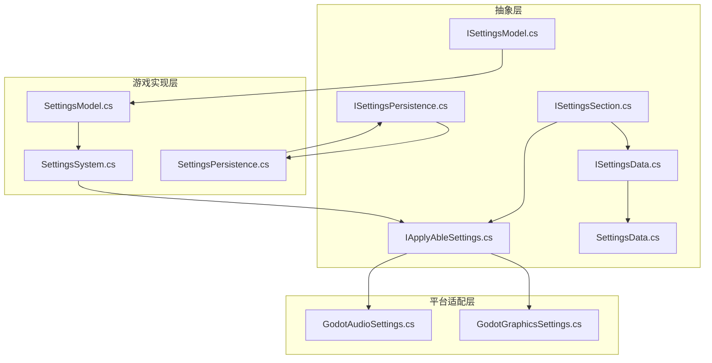
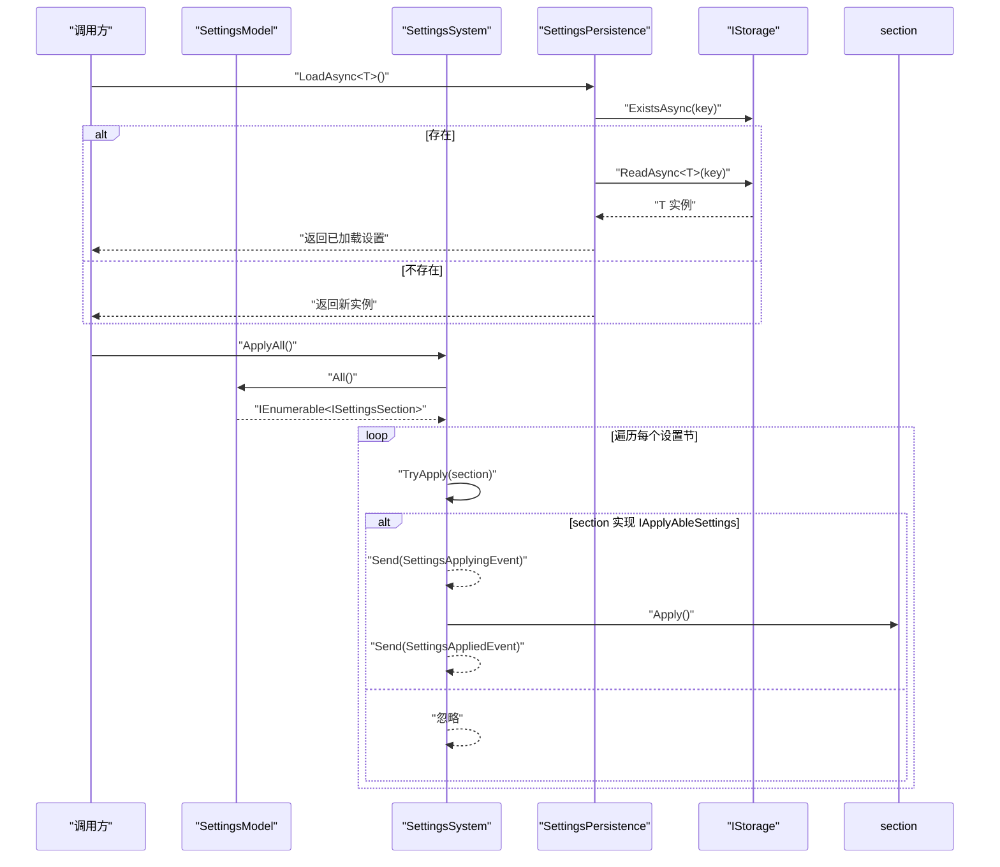
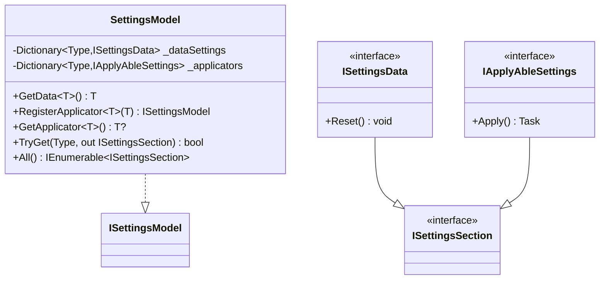
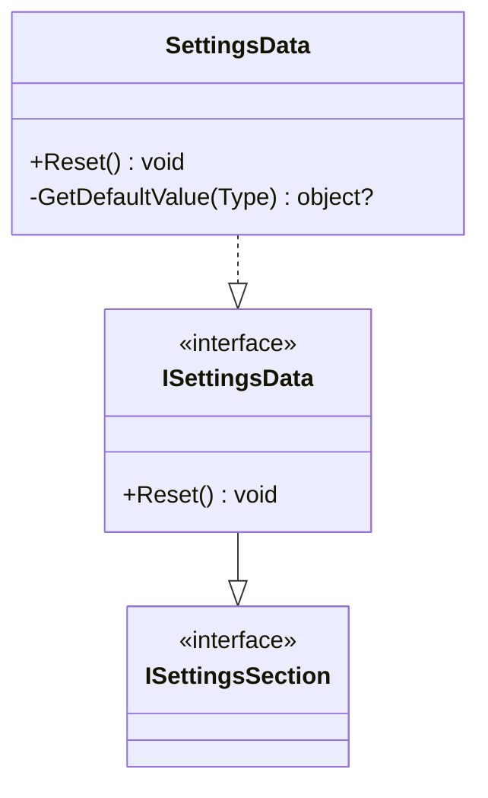
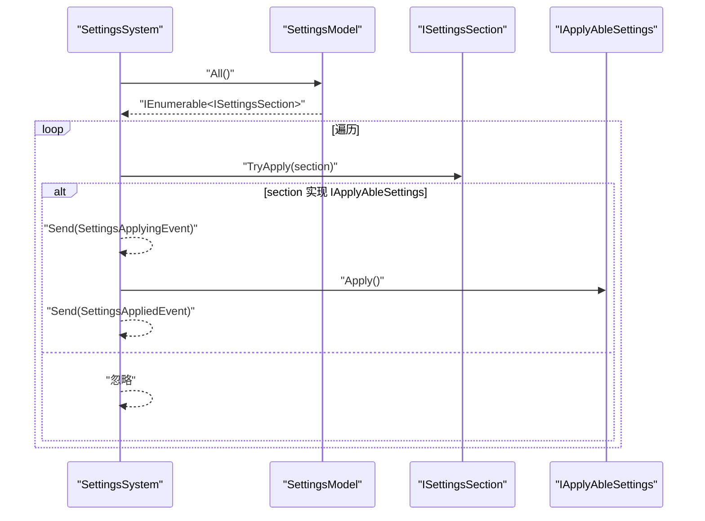
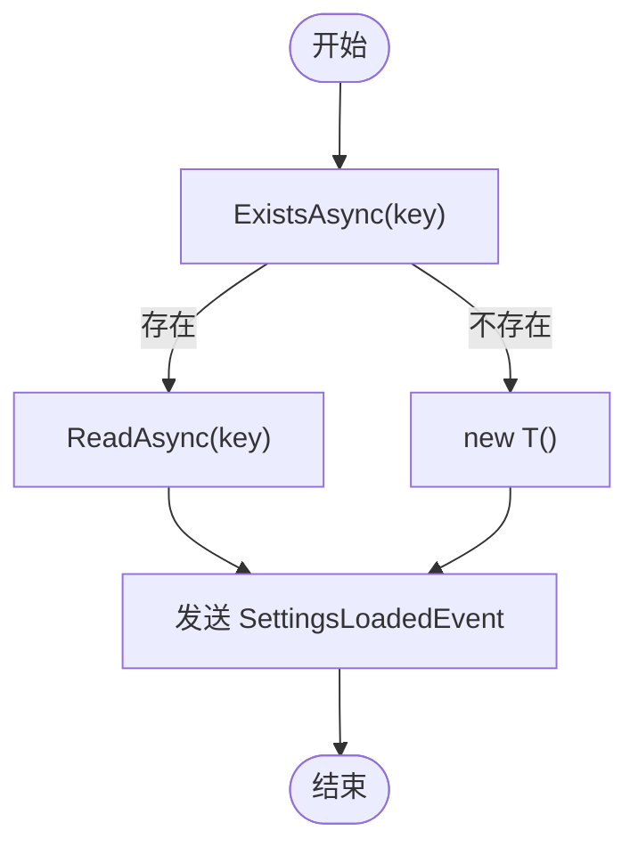
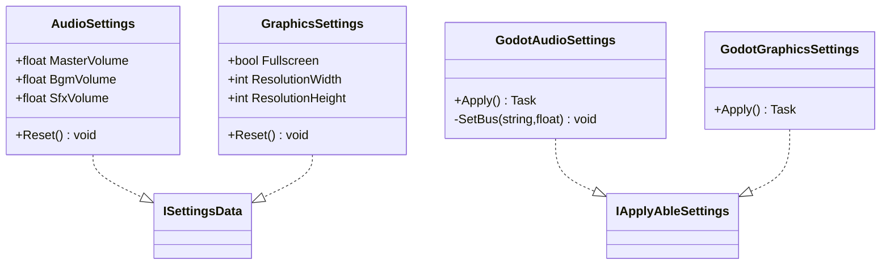
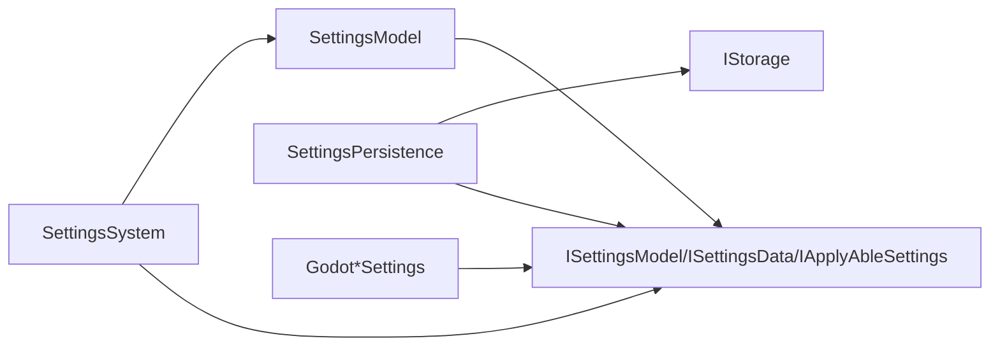

# 设置模型

<cite>
**本文引用的文件**
- [SettingsModel.cs](file://GFramework.Game/setting/SettingsModel.cs)
- [ISettingsModel.cs](file://GFramework.Game.Abstractions/setting/ISettingsModel.cs)
- [ISettingsSection.cs](file://GFramework.Game.Abstractions/setting/ISettingsSection.cs)
- [ISettingsData.cs](file://GFramework.Game.Abstractions/setting/ISettingsData.cs)
- [SettingsSystem.cs](file://GFramework.Game/setting/SettingsSystem.cs)
- [ISettingsPersistence.cs](file://GFramework.Game.Abstractions/setting/ISettingsPersistence.cs)
- [SettingsPersistence.cs](file://GFramework.Game/setting/SettingsPersistence.cs)
- [IApplyAbleSettings.cs](file://GFramework.Game.Abstractions/setting/IApplyAbleSettings.cs)
- [SettingsData.cs](file://GFramework.Game.Abstractions/setting/SettingsData.cs)
- [AudioSettings.cs](file://GFramework.Game.Abstractions/setting/AudioSettings.cs)
- [GraphicsSettings.cs](file://GFramework.Game.Abstractions/setting/GraphicsSettings.cs)
- [GodotAudioSettings.cs](file://GFramework.Godot/setting/GodotAudioSettings.cs)
- [GodotGraphicsSettings.cs](file://GFramework.Godot/setting/GodotGraphicsSettings.cs)
- [SettingsChangedEvent.cs](file://GFramework.Game/setting/events/SettingsChangedEvent.cs)
- [SettingsAllLoadedEvent.cs](file://GFramework.Game/setting/events/SettingsAllLoadedEvent.cs)
</cite>

## 目录
1. [简介](#简介)
2. [项目结构](#项目结构)
3. [核心组件](#核心组件)
4. [架构总览](#架构总览)
5. [详细组件分析](#详细组件分析)
6. [依赖关系分析](#依赖关系分析)
7. [性能考量](#性能考量)
8. [故障排查指南](#故障排查指南)
9. [结论](#结论)
10. [附录：API 参考与数据结构示例](#附录api-参考与数据结构示例)

## 简介
本文件面向 GFramework 的“设置模型”子系统，系统性阐述 SettingsModel 类的数据存储机制、ISettingsModel 接口的设计模式、ISettingsSection 的结构化定义、ISettingsData 的数据契约与序列化要求，并给出 API 参考、数据结构示例与典型应用场景。同时，文档覆盖设置数据的一致性保证与并发访问控制建议。

## 项目结构
设置模型相关代码分布在以下模块：
- 抽象层（Abstractions）：定义接口契约与通用抽象基类
- 游戏实现层（Game）：提供具体实现（模型、系统、持久化）
- 平台适配层（Godot）：针对 Godot 引擎的具体应用器实现

图表来源
- [ISettingsModel.cs](file://GFramework.Game.Abstractions/setting/ISettingsModel.cs#L1-L47)
- [ISettingsSection.cs](file://GFramework.Game.Abstractions/setting/ISettingsSection.cs#L1-L7)
- [ISettingsData.cs](file://GFramework.Game.Abstractions/setting/ISettingsData.cs#L1-L12)
- [IApplyAbleSettings.cs](file://GFramework.Game.Abstractions/setting/IApplyAbleSettings.cs#L1-L14)
- [ISettingsPersistence.cs](file://GFramework.Game.Abstractions/setting/ISettingsPersistence.cs#L1-L43)
- [SettingsData.cs](file://GFramework.Game.Abstractions/setting/SettingsData.cs#L1-L36)
- [SettingsModel.cs](file://GFramework.Game/setting/SettingsModel.cs#L1-L103)
- [SettingsSystem.cs](file://GFramework.Game/setting/SettingsSystem.cs#L1-L99)
- [SettingsPersistence.cs](file://GFramework.Game/setting/SettingsPersistence.cs#L1-L141)
- [GodotAudioSettings.cs](file://GFramework.Godot/setting/GodotAudioSettings.cs#L1-L47)
- [GodotGraphicsSettings.cs](file://GFramework.Godot/setting/GodotGraphicsSettings.cs#L1-L43)

章节来源
- [ISettingsModel.cs](file://GFramework.Game.Abstractions/setting/ISettingsModel.cs#L1-L47)
- [SettingsModel.cs](file://GFramework.Game/setting/SettingsModel.cs#L1-L103)

## 核心组件
- SettingsModel：集中管理“数据设置”和“可应用设置”，提供注册、检索与聚合查询能力
- SettingsSystem：负责应用设置（调用 IApplyAbleSettings.Apply），并发布生命周期事件
- SettingsPersistence：负责设置数据的异步加载、保存、存在性检查与批量操作
- ISettingsData/SettingsData：纯数据设置的契约与默认重置行为
- ISettingsSection/IApplyAbleSettings：设置节的结构化定义与可应用设置的执行契约
- 平台应用器（Godot*Settings）：将设置应用到具体平台（如 Godot 音频/图形）

章节来源
- [SettingsModel.cs](file://GFramework.Game/setting/SettingsModel.cs#L9-L103)
- [SettingsSystem.cs](file://GFramework.Game/setting/SettingsSystem.cs#L11-L99)
- [SettingsPersistence.cs](file://GFramework.Game/setting/SettingsPersistence.cs#L12-L141)
- [ISettingsData.cs](file://GFramework.Game.Abstractions/setting/ISettingsData.cs#L1-L12)
- [SettingsData.cs](file://GFramework.Game.Abstractions/setting/SettingsData.cs#L9-L36)
- [IApplyAbleSettings.cs](file://GFramework.Game.Abstractions/setting/IApplyAbleSettings.cs#L1-L14)
- [ISettingsSection.cs](file://GFramework.Game.Abstractions/setting/ISettingsSection.cs#L1-L7)

## 架构总览
设置模型采用“模型-系统-持久化”的分层设计，通过接口隔离关注点，确保跨平台可扩展性。

图表来源
- [SettingsModel.cs](file://GFramework.Game/setting/SettingsModel.cs#L89-L94)
- [SettingsSystem.cs](file://GFramework.Game/setting/SettingsSystem.cs#L19-L69)
- [SettingsPersistence.cs](file://GFramework.Game/setting/SettingsPersistence.cs#L21-L35)
- [ISettingsPersistence.cs](file://GFramework.Game.Abstractions/setting/ISettingsPersistence.cs#L12-L43)

## 详细组件分析

### SettingsModel：设置模型与数据存储机制
- 数据存储机制
  - 数据设置（ISettingsData）：以类型为键缓存，首次访问自动创建并放入字典；后续访问直接返回同一实例
  - 可应用设置（IApplyAbleSettings）：显式注册，按类型检索；用于将设置应用到平台或系统
- 注册、检索与聚合
  - GetData<T>()：自动创建并缓存
  - RegisterApplicator<T>()：注册可应用设置，支持链式调用
  - GetApplicator<T>()：按类型获取可应用设置（可空）
  - TryGet(Type, out ISettingsSection)：优先从数据设置查找，再从可应用设置查找
  - All()：合并两类设置节的值，统一暴露给系统进行应用
- 设计要点
  - 通过两个独立字典隔离“数据持有者”和“应用执行者”，职责清晰
  - 自动创建策略降低调用方心智负担，但需注意生命周期与重置策略

图表来源
- [SettingsModel.cs](file://GFramework.Game/setting/SettingsModel.cs#L9-L103)
- [ISettingsModel.cs](file://GFramework.Game.Abstractions/setting/ISettingsModel.cs#L10-L47)
- [ISettingsData.cs](file://GFramework.Game.Abstractions/setting/ISettingsData.cs#L6-L12)
- [IApplyAbleSettings.cs](file://GFramework.Game.Abstractions/setting/IApplyAbleSettings.cs#L8-L14)
- [ISettingsSection.cs](file://GFramework.Game.Abstractions/setting/ISettingsSection.cs#L7-L7)

章节来源
- [SettingsModel.cs](file://GFramework.Game/setting/SettingsModel.cs#L11-L94)
- [ISettingsModel.cs](file://GFramework.Game.Abstractions/setting/ISettingsModel.cs#L10-L47)

### ISettingsModel 接口：设计模式与使用场景
- 方法语义
  - GetData<T>()：自动创建并缓存，适合“读多写少”的配置项
  - TryGet(Type, out ISettingsSection)：安全检索，避免异常传播
  - GetApplicator<T>()：获取应用器，常用于平台适配层
  - All()：统一聚合，便于系统一次性应用
  - RegisterApplicator<T>()：显式注册，确保应用器可用
- 使用场景
  - 初始化阶段：通过 GetData<T>() 获取并可能触发 LoadAsync<T>()
  - 应用阶段：通过 All()/TryGet() 遍历并调用 Apply()
  - 维护阶段：通过 Reset() 或重置流程恢复默认值

章节来源
- [ISettingsModel.cs](file://GFramework.Game.Abstractions/setting/ISettingsModel.cs#L10-L47)

### ISettingsSection 与 ISettingsData：结构化定义与数据契约
- ISettingsSection：设置节的最小契约，用于区分“数据设置”和“可应用设置”
- ISettingsData：继承 ISettingsSection，强调“纯数据”特性，并提供 Reset() 重置能力
- SettingsData 抽象基类：提供基于反射的默认 Reset() 实现，按属性类型设置默认值

图表来源
- [ISettingsSection.cs](file://GFramework.Game.Abstractions/setting/ISettingsSection.cs#L1-L7)
- [ISettingsData.cs](file://GFramework.Game.Abstractions/setting/ISettingsData.cs#L1-L12)
- [SettingsData.cs](file://GFramework.Game.Abstractions/setting/SettingsData.cs#L9-L36)

章节来源
- [ISettingsData.cs](file://GFramework.Game.Abstractions/setting/ISettingsData.cs#L6-L12)
- [SettingsData.cs](file://GFramework.Game.Abstractions/setting/SettingsData.cs#L15-L35)

### IApplyAbleSettings 与 SettingsSystem：应用与事件
- IApplyAbleSettings：定义 Apply() 异步方法，用于将设置应用到平台或系统
- SettingsSystem：遍历模型中的所有设置节，识别可应用设置并调用 Apply()，期间发送“正在应用/已应用”事件
- 事件模型：通过事件总线广播设置变更与应用结果，便于 UI 或日志系统订阅

图表来源
- [SettingsSystem.cs](file://GFramework.Game/setting/SettingsSystem.cs#L19-L98)
- [IApplyAbleSettings.cs](file://GFramework.Game.Abstractions/setting/IApplyAbleSettings.cs#L8-L14)

章节来源
- [SettingsSystem.cs](file://GFramework.Game/setting/SettingsSystem.cs#L19-L98)
- [SettingsChangedEvent.cs](file://GFramework.Game/setting/events/SettingsChangedEvent.cs#L10-L32)
- [SettingsAllLoadedEvent.cs](file://GFramework.Game/setting/events/SettingsAllLoadedEvent.cs#L9-L30)

### SettingsPersistence 与 ISettingsPersistence：序列化与一致性
- 职责边界
  - LoadAsync<T>()：若存储存在则反序列化，否则返回新实例；均发送“已加载”事件
  - SaveAsync<T>()：序列化并写入存储，发送“已保存”事件
  - ExistsAsync<T>()：检查键是否存在
  - DeleteAsync<T>()：删除键并发送“已删除”事件
  - SaveAllAsync/LoadAllAsync：批量写入与批量加载，支持事件聚合
- 键命名约定：Settings_{TypeName}
- 一致性保证
  - 读取失败时返回新实例，避免崩溃；写入成功后才认为一致
  - 批量操作通过事件聚合（如 SettingsAllLoadedEvent）通知上层
- 并发访问控制建议
  - 对同一类型设置的并发读写应加锁或使用原子更新策略
  - 批量保存/加载建议串行化，避免竞态条件
  - 事件发布与存储写入顺序：先写入存储，再发布事件，确保订阅者看到最新状态

图表来源
- [SettingsPersistence.cs](file://GFramework.Game/setting/SettingsPersistence.cs#L21-L35)
- [ISettingsPersistence.cs](file://GFramework.Game.Abstractions/setting/ISettingsPersistence.cs#L12-L43)

章节来源
- [SettingsPersistence.cs](file://GFramework.Game/setting/SettingsPersistence.cs#L12-L141)
- [ISettingsPersistence.cs](file://GFramework.Game.Abstractions/setting/ISettingsPersistence.cs#L12-L43)

### 平台应用器示例：GodotAudioSettings 与 GodotGraphicsSettings
- GodotAudioSettings：将线性音量转换为分贝并设置到对应音频总线
- GodotGraphicsSettings：根据图形设置调整窗口模式、尺寸与居中
- 共同特点：实现 IApplyAbleSettings，接收对应数据设置作为输入，在 Apply() 中执行平台特定逻辑

图表来源
- [AudioSettings.cs](file://GFramework.Game.Abstractions/setting/AudioSettings.cs#L6-L32)
- [GraphicsSettings.cs](file://GFramework.Game.Abstractions/setting/GraphicsSettings.cs#L6-L32)
- [GodotAudioSettings.cs](file://GFramework.Godot/setting/GodotAudioSettings.cs#L11-L47)
- [GodotGraphicsSettings.cs](file://GFramework.Godot/setting/GodotGraphicsSettings.cs#L10-L43)

章节来源
- [GodotAudioSettings.cs](file://GFramework.Godot/setting/GodotAudioSettings.cs#L18-L46)
- [GodotGraphicsSettings.cs](file://GFramework.Godot/setting/GodotGraphicsSettings.cs#L16-L42)

## 依赖关系分析
- 松耦合：通过接口隔离（ISettingsModel、ISettingsData、IApplyAbleSettings、ISettingsPersistence）实现跨模块协作
- 可替换性：SettingsPersistence 可替换为其他存储实现（文件、内存、网络），不影响上层逻辑
- 循环依赖：未见循环依赖；模型与系统通过接口交互，系统与持久化通过接口交互

图表来源
- [SettingsModel.cs](file://GFramework.Game/setting/SettingsModel.cs#L9-L103)
- [SettingsSystem.cs](file://GFramework.Game/setting/SettingsSystem.cs#L11-L99)
- [SettingsPersistence.cs](file://GFramework.Game/setting/SettingsPersistence.cs#L12-L141)
- [ISettingsPersistence.cs](file://GFramework.Game.Abstractions/setting/ISettingsPersistence.cs#L12-L43)

章节来源
- [SettingsModel.cs](file://GFramework.Game/setting/SettingsModel.cs#L9-L103)
- [SettingsSystem.cs](file://GFramework.Game/setting/SettingsSystem.cs#L11-L99)
- [SettingsPersistence.cs](file://GFramework.Game/setting/SettingsPersistence.cs#L12-L141)

## 性能考量
- 访问模式
  - GetData<T>() 为 O(1) 查找+首次创建成本，建议在初始化阶段预热常用设置
  - All() 返回合并后的集合，遍历时注意避免重复计算
- 序列化
  - 大型设置对象建议分块加载或延迟初始化
  - 批量保存/加载时尽量减少事件风暴，必要时合并事件
- 并发
  - 对同一类型设置的并发读写建议加锁或使用不可变快照
  - Apply() 为异步，避免阻塞主线程；UI 更新应在主线程回调中进行

## 故障排查指南
- 症状：设置未生效
  - 检查是否注册了对应的 IApplyAbleSettings 实现
  - 确认 SettingsSystem.ApplyAll() 已被调用
  - 关注 SettingsAppliedEvent 是否携带异常信息
- 症状：设置丢失或重置
  - 检查 IStorage 是否正常工作
  - 确认 SettingsPersistence 的键命名规则（Settings_{TypeName}）
  - 若存在竞态，考虑引入互斥锁或原子更新
- 症状：事件未触发
  - 确认事件总线已正确初始化
  - 检查 SendEvent 调用路径与异常捕获

章节来源
- [SettingsSystem.cs](file://GFramework.Game/setting/SettingsSystem.cs#L83-L98)
- [SettingsPersistence.cs](file://GFramework.Game/setting/SettingsPersistence.cs#L121-L141)

## 结论
设置模型通过清晰的接口分层与职责分离，提供了可扩展、可测试且易于维护的设置管理方案。数据设置与可应用设置的双通道设计，既满足了“读多写少”的数据访问需求，又允许平台层以统一契约执行应用逻辑。配合事件总线与持久化抽象，系统可在不同平台与存储介质间灵活切换。

## 附录：API 参考与数据结构示例

### API 参考（摘自接口定义）
- ISettingsModel
  - GetData<T>()：获取或创建数据设置
  - TryGet(Type, out ISettingsSection)：安全检索设置节
  - GetApplicator<T>()：获取可应用设置
  - All()：获取全部设置节
  - RegisterApplicator<T>(T)：注册可应用设置
- ISettingsData
  - Reset()：重置为默认值
- IApplyAbleSettings
  - Apply()：应用设置到平台
- ISettingsPersistence
  - LoadAsync<T>()、SaveAsync<T>()、ExistsAsync<T>()、DeleteAsync<T>()
  - SaveAllAsync(IEnumerable<ISettingsData>)、LoadAllAsync(IEnumerable<Type>)

章节来源
- [ISettingsModel.cs](file://GFramework.Game.Abstractions/setting/ISettingsModel.cs#L10-L47)
- [ISettingsData.cs](file://GFramework.Game.Abstractions/setting/ISettingsData.cs#L6-L12)
- [IApplyAbleSettings.cs](file://GFramework.Game.Abstractions/setting/IApplyAbleSettings.cs#L8-L14)
- [ISettingsPersistence.cs](file://GFramework.Game.Abstractions/setting/ISettingsPersistence.cs#L12-L43)

### 数据结构示例（类型与字段）
- AudioSettings：主音量、背景音乐音量、音效音量
- GraphicsSettings：全屏开关、分辨率宽高
- GodotAudioSettings/GodotGraphicsSettings：平台应用器，接收对应数据设置并在 Apply() 中执行平台逻辑

章节来源
- [AudioSettings.cs](file://GFramework.Game.Abstractions/setting/AudioSettings.cs#L6-L32)
- [GraphicsSettings.cs](file://GFramework.Game.Abstractions/setting/GraphicsSettings.cs#L6-L32)
- [GodotAudioSettings.cs](file://GFramework.Godot/setting/GodotAudioSettings.cs#L11-L47)
- [GodotGraphicsSettings.cs](file://GFramework.Godot/setting/GodotGraphicsSettings.cs#L10-L43)

### 实际应用场景
- 游戏启动时：通过 SettingsPersistence.LoadAllAsync 加载已知类型设置，随后 SettingsSystem.ApplyAll 应用到平台
- 设置面板修改后：调用 SettingsPersistence.SaveAsync 保存，同时触发事件通知 UI 刷新
- 重置功能：调用 ISettingsData.Reset() 或平台应用器的回滚逻辑