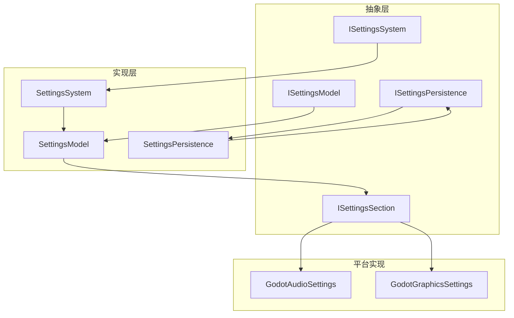
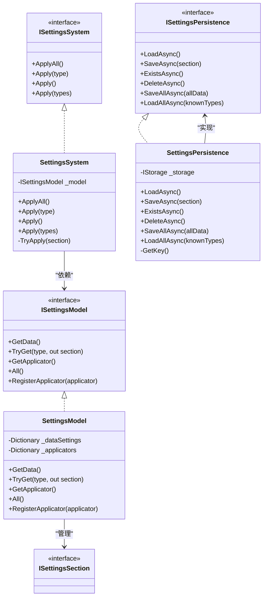
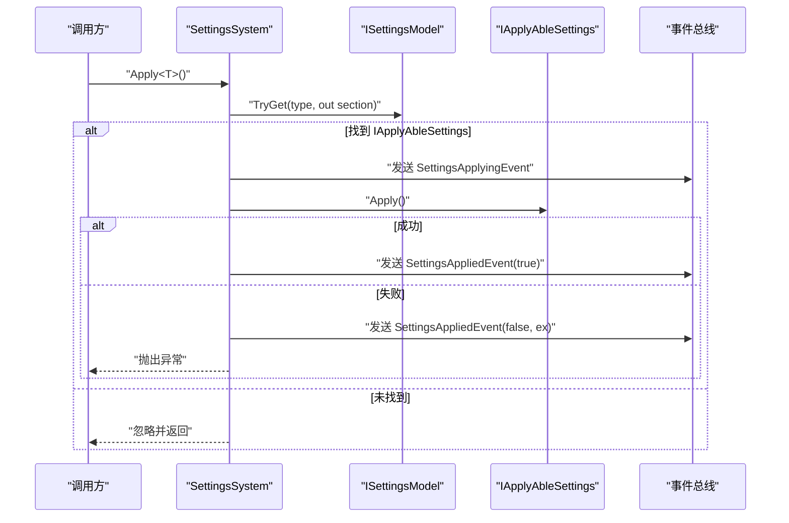
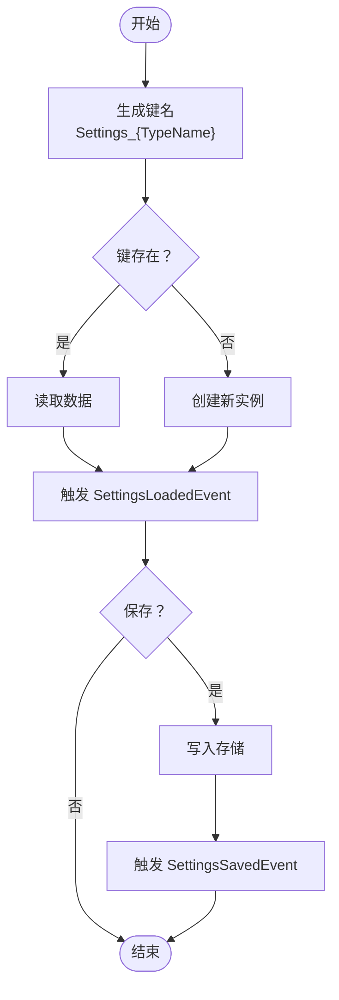
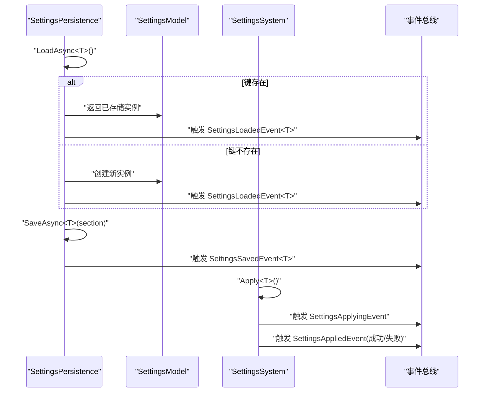
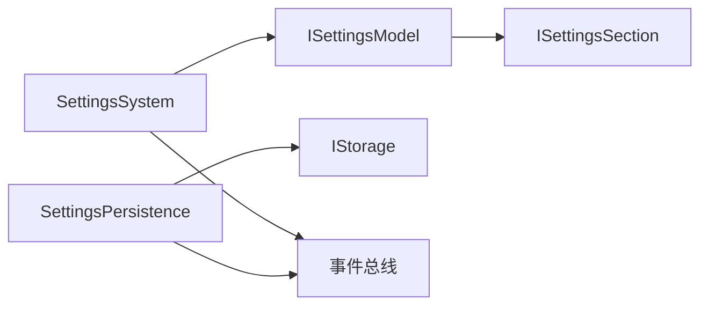

# 设置系统

<cite>
**本文引用的文件**
- [SettingsSystem.cs](file://GFramework.Game/setting/SettingsSystem.cs)
- [SettingsModel.cs](file://GFramework.Game/setting/SettingsModel.cs)
- [SettingsPersistence.cs](file://GFramework.Game/setting/SettingsPersistence.cs)
- [README.md](file://GFramework.Game/setting/README.md)
- [ISettingsSystem.cs](file://GFramework.Game.Abstractions/setting/ISettingsSystem.cs)
- [ISettingsModel.cs](file://GFramework.Game.Abstractions/setting/ISettingsModel.cs)
- [ISettingsPersistence.cs](file://GFramework.Game.Abstractions/setting/ISettingsPersistence.cs)
- [ISettingsSection.cs](file://GFramework.Game.Abstractions/setting/ISettingsSection.cs)
- [SettingsChangedEvent.cs](file://GFramework.Game/setting/events/SettingsChangedEvent.cs)
- [SettingsSavedEvent.cs](file://GFramework.Game/setting/events/SettingsSavedEvent.cs)
- [SettingsAllLoadedEvent.cs](file://GFramework.Game/setting/events/SettingsAllLoadedEvent.cs)
- [SettingsBatchChangedEvent.cs](file://GFramework.Game/setting/events/SettingsBatchChangedEvent.cs)
- [AudioSettings.cs](file://GFramework.Game.Abstractions/setting/AudioSettings.cs)
- [GraphicsSettings.cs](file://GFramework.Game.Abstractions/setting/GraphicsSettings.cs)
- [GodotAudioSettings.cs](file://GFramework.Godot/setting/GodotAudioSettings.cs)
- [GodotGraphicsSettings.cs](file://GFramework.Godot/setting/GodotGraphicsSettings.cs)
</cite>

## 目录
1. [简介](#简介)
2. [项目结构](#项目结构)
3. [核心组件](#核心组件)
4. [架构总览](#架构总览)
5. [详细组件分析](#详细组件分析)
6. [依赖关系分析](#依赖关系分析)
7. [性能考量](#性能考量)
8. [故障排查指南](#故障排查指南)
9. [结论](#结论)
10. [附录](#附录)

## 简介
本文件为 GFramework 设置系统（Settings System）的权威功能文档，覆盖配置管理机制、数据模型、持久化策略、事件系统、接口设计与最佳实践。重点围绕以下目标展开：
- 设置项注册与生命周期管理
- 验证规则与默认值处理策略
- SettingsModel 数据模型的结构化存储与访问模式
- SettingsPersistence 的序列化、存储位置与加载机制
- 设置事件系统（如 SettingsChangedEvent、SettingsSavedEvent 等）的触发时机与处理流程
- ISettingsSystem、ISettingsModel、ISettingsPersistence 等接口的设计理念与使用方法
- 实际使用示例、配置选项、API 参考与数据一致性保障策略

## 项目结构
设置系统位于 GFramework.Game 与 GFramework.Game.Abstractions 中，并在 GFramework.Godot 提供具体平台实现（如 Godot 音频/图形设置）。核心文件分布如下：
- 设置系统与模型：SettingsSystem.cs、SettingsModel.cs
- 持久化：SettingsPersistence.cs
- 事件：SettingsChangedEvent.cs、SettingsSavedEvent.cs、SettingsAllLoadedEvent.cs、SettingsBatchChangedEvent.cs
- 抽象接口：ISettingsSystem.cs、ISettingsModel.cs、ISettingsPersistence.cs、ISettingsSection.cs
- 示例设置数据：AudioSettings.cs、GraphicsSettings.cs
- 平台应用器：GodotAudioSettings.cs、GodotGraphicsSettings.cs

图表来源
- [ISettingsModel.cs](file://GFramework.Game.Abstractions/setting/ISettingsModel.cs#L1-L47)
- [ISettingsSystem.cs](file://GFramework.Game.Abstractions/setting/ISettingsSystem.cs#L1-L32)
- [ISettingsPersistence.cs](file://GFramework.Game.Abstractions/setting/ISettingsPersistence.cs#L1-L43)
- [ISettingsSection.cs](file://GFramework.Game.Abstractions/setting/ISettingsSection.cs#L1-L7)
- [SettingsModel.cs](file://GFramework.Game/setting/SettingsModel.cs#L1-L103)
- [SettingsSystem.cs](file://GFramework.Game/setting/SettingsSystem.cs#L1-L99)
- [SettingsPersistence.cs](file://GFramework.Game/setting/SettingsPersistence.cs#L1-L141)
- [GodotAudioSettings.cs](file://GFramework.Godot/setting/GodotAudioSettings.cs#L1-L47)
- [GodotGraphicsSettings.cs](file://GFramework.Godot/setting/GodotGraphicsSettings.cs#L1-L43)

章节来源
- [README.md](file://GFramework.Game/setting/README.md#L1-L204)

## 核心组件
- SettingsModel：集中管理“设置节”（ISettingsSection），提供类型安全的获取、注册与聚合查询能力；内部维护两类映射：数据设置（ISettingsData）与可应用设置（IApplyAbleSettings）。
- SettingsSystem：负责应用设置（ApplyAll/Apply<T>/Apply(IEnumerable<Type>)），自动识别 IApplyAbleSettings 并触发应用前后事件。
- SettingsPersistence：负责设置数据的异步加载、保存、存在性检查与批量操作，统一键命名策略（Settings_{TypeName}），并与事件系统联动。

章节来源
- [SettingsModel.cs](file://GFramework.Game/setting/SettingsModel.cs#L1-L103)
- [SettingsSystem.cs](file://GFramework.Game/setting/SettingsSystem.cs#L1-L99)
- [SettingsPersistence.cs](file://GFramework.Game/setting/SettingsPersistence.cs#L1-L141)

## 架构总览
设置系统采用“模型-系统-持久化”的分层设计，结合事件驱动与接口抽象，实现高内聚低耦合的配置管理。

图表来源
- [ISettingsSection.cs](file://GFramework.Game.Abstractions/setting/ISettingsSection.cs#L1-L7)
- [ISettingsModel.cs](file://GFramework.Game.Abstractions/setting/ISettingsModel.cs#L1-L47)
- [ISettingsSystem.cs](file://GFramework.Game.Abstractions/setting/ISettingsSystem.cs#L1-L32)
- [ISettingsPersistence.cs](file://GFramework.Game.Abstractions/setting/ISettingsPersistence.cs#L1-L43)
- [SettingsModel.cs](file://GFramework.Game/setting/SettingsModel.cs#L1-L103)
- [SettingsSystem.cs](file://GFramework.Game/setting/SettingsSystem.cs#L1-L99)
- [SettingsPersistence.cs](file://GFramework.Game/setting/SettingsPersistence.cs#L1-L141)

## 详细组件分析

### SettingsModel 数据模型
- 职责与特性
  - 统一管理 ISettingsSection 的数据设置与可应用设置。
  - 通过 GetData<T>() 自动创建并缓存 ISettingsData 实例，确保类型安全与单例语义。
  - 通过 RegisterApplicator<T>() 手动注册 IApplyAbleSettings，便于后续由 SettingsSystem 应用。
  - TryGet/All 提供查询与聚合访问，支持上层系统按需筛选。
- 复杂度与性能
  - GetData<T>() 基于字典查找与创建，平均 O(1)，首次创建包含对象构造成本。
  - TryGet/All 为 O(n) 聚合（n 为已注册数量），建议在高频路径避免频繁 All()。
- 默认值与验证
  - 默认值由 ISettingsData.Reset() 或构造函数设定；建议在 GetData<T>() 返回后立即进行校验与规范化。
  - 验证可在应用前（Apply 前）或保存前（SaveAsync 前）执行，结合事件流进行拦截与回滚。

章节来源
- [SettingsModel.cs](file://GFramework.Game/setting/SettingsModel.cs#L1-L103)
- [ISettingsModel.cs](file://GFramework.Game.Abstractions/setting/ISettingsModel.cs#L1-L47)
- [AudioSettings.cs](file://GFramework.Game.Abstractions/setting/AudioSettings.cs#L1-L32)
- [GraphicsSettings.cs](file://GFramework.Game.Abstractions/setting/GraphicsSettings.cs#L1-L32)

### SettingsSystem 应用系统
- 职责与特性
  - 提供 ApplyAll/Apply<T>/Apply(IEnumerable<Type>) 三种应用入口，自动去重与过滤非 IApplyAbleSettings。
  - 在应用前发送 SettingsApplyingEvent，应用成功/失败分别发送 SettingsAppliedEvent（含异常信息）。
- 错误处理
  - 应用异常会通过事件上报并重新抛出，便于上层捕获与恢复。
- 性能建议
  - 批量修改后一次性应用，减少事件风暴与重复应用开销。

图表来源
- [SettingsSystem.cs](file://GFramework.Game/setting/SettingsSystem.cs#L1-L99)
- [ISettingsSystem.cs](file://GFramework.Game.Abstractions/setting/ISettingsSystem.cs#L1-L32)

章节来源
- [SettingsSystem.cs](file://GFramework.Game/setting/SettingsSystem.cs#L1-L99)

### SettingsPersistence 持久化策略
- 存储键命名
  - 统一键格式：Settings_{TypeName}，避免冲突并便于调试。
- 加载与保存
  - LoadAsync<T>()：若存在则读取，否则创建新实例；均触发 SettingsLoadedEvent。
  - SaveAsync<T>()：写入存储并触发 SettingsSavedEvent。
  - SaveAllAsync(IEnumerable<ISettingsData>)：批量写入并触发 SettingsBatchSavedEvent。
  - LoadAllAsync(IEnumerable<Type>)：按类型集合批量读取，触发 SettingsAllLoadedEvent。
- 与事件系统联动
  - 读取、保存、删除、批量保存与全部加载均伴随事件，便于订阅者同步状态。
- 与存储后端解耦
  - 通过 IStorage 抽象对接任意存储实现（文件、内存、加密存储等）。

图表来源
- [SettingsPersistence.cs](file://GFramework.Game/setting/SettingsPersistence.cs#L1-L141)

章节来源
- [SettingsPersistence.cs](file://GFramework.Game/setting/SettingsPersistence.cs#L1-L141)

### 设置事件系统
- 事件类型与触发时机
  - SettingsChangedEvent<T>：泛型设置变更事件，携带变更时间与类型信息。
  - SettingsSavedEvent<T>：设置保存事件，用于记录保存动作与时间戳。
  - SettingsAllLoadedEvent：全部设置加载完成事件，聚合所有已加载设置。
  - SettingsBatchChangedEvent：批量设置变更事件，用于批处理场景。
- 事件用途
  - 订阅者可基于事件进行 UI 刷新、日志记录、统计上报或二次应用（如跨平台同步）。
- 时序示意

图表来源
- [SettingsPersistence.cs](file://GFramework.Game/setting/SettingsPersistence.cs#L1-L141)
- [SettingsSystem.cs](file://GFramework.Game/setting/SettingsSystem.cs#L1-L99)
- [SettingsChangedEvent.cs](file://GFramework.Game/setting/events/SettingsChangedEvent.cs#L1-L32)
- [SettingsSavedEvent.cs](file://GFramework.Game/setting/events/SettingsSavedEvent.cs#L1-L31)
- [SettingsAllLoadedEvent.cs](file://GFramework.Game/setting/events/SettingsAllLoadedEvent.cs#L1-L30)
- [SettingsBatchChangedEvent.cs](file://GFramework.Game/setting/events/SettingsBatchChangedEvent.cs#L1-L31)

章节来源
- [SettingsChangedEvent.cs](file://GFramework.Game/setting/events/SettingsChangedEvent.cs#L1-L32)
- [SettingsSavedEvent.cs](file://GFramework.Game/setting/events/SettingsSavedEvent.cs#L1-L31)
- [SettingsAllLoadedEvent.cs](file://GFramework.Game/setting/events/SettingsAllLoadedEvent.cs#L1-L30)
- [SettingsBatchChangedEvent.cs](file://GFramework.Game/setting/events/SettingsBatchChangedEvent.cs#L1-L31)

### 接口设计与使用方法
- ISettingsSection：设置节标识接口，承载具体配置项。
- ISettingsModel：提供类型安全的设置获取、注册与聚合查询。
- ISettingsSystem：提供设置应用的统一入口，支持单个/批量/全部应用。
- ISettingsPersistence：提供异步加载/保存/删除/存在性检查与批量操作。
- 使用要点
  - 先通过 ISettingsModel.GetData<T>() 获取或创建设置实例，再进行赋值与校验。
  - 对需要应用到平台/引擎的设置，实现 IApplyAbleSettings 并通过 RegisterApplicator<T>() 注册。
  - 使用 SettingsPersistence 进行持久化，注意键名唯一性与序列化兼容性。
  - 通过事件总线订阅相关事件，实现 UI/日志/同步等横切关注点。

章节来源
- [ISettingsSection.cs](file://GFramework.Game.Abstractions/setting/ISettingsSection.cs#L1-L7)
- [ISettingsModel.cs](file://GFramework.Game.Abstractions/setting/ISettingsModel.cs#L1-L47)
- [ISettingsSystem.cs](file://GFramework.Game.Abstractions/setting/ISettingsSystem.cs#L1-L32)
- [ISettingsPersistence.cs](file://GFramework.Game.Abstractions/setting/ISettingsPersistence.cs#L1-L43)

### 平台应用器示例（Godot）
- GodotAudioSettings：将 AudioSettings 映射到 Godot 音频总线，支持主音量、BGM、SFX 分别设置。
- GodotGraphicsSettings：根据 GraphicsSettings 控制窗口模式、分辨率与全屏状态。
- 设计要点
  - 应用器仅负责“如何应用”，不负责数据存储；数据由 ISettingsData 与 SettingsPersistence 管理。
  - 应用器应具备幂等性与边界检查（如音量范围、分辨率有效性）。

章节来源
- [GodotAudioSettings.cs](file://GFramework.Godot/setting/GodotAudioSettings.cs#L1-L47)
- [GodotGraphicsSettings.cs](file://GFramework.Godot/setting/GodotGraphicsSettings.cs#L1-L43)
- [AudioSettings.cs](file://GFramework.Game.Abstractions/setting/AudioSettings.cs#L1-L32)
- [GraphicsSettings.cs](file://GFramework.Game.Abstractions/setting/GraphicsSettings.cs#L1-L32)

## 依赖关系分析
- 组件耦合
  - SettingsSystem 依赖 ISettingsModel；SettingsModel 依赖 ISettingsSection；SettingsPersistence 依赖 IStorage。
  - 事件系统通过 SendEvent 与事件总线解耦，降低模块间直接依赖。
- 外部依赖
  - IStorage 由上下文注入，允许替换为文件存储、内存存储或其他实现。
- 循环依赖
  - 未发现循环依赖；各方向依赖清晰（System -> Model -> Section；Persistence -> Storage）。

图表来源
- [SettingsSystem.cs](file://GFramework.Game/setting/SettingsSystem.cs#L1-L99)
- [SettingsModel.cs](file://GFramework.Game/setting/SettingsModel.cs#L1-L103)
- [SettingsPersistence.cs](file://GFramework.Game/setting/SettingsPersistence.cs#L1-L141)

章节来源
- [SettingsSystem.cs](file://GFramework.Game/setting/SettingsSystem.cs#L1-L99)
- [SettingsModel.cs](file://GFramework.Game/setting/SettingsModel.cs#L1-L103)
- [SettingsPersistence.cs](file://GFramework.Game/setting/SettingsPersistence.cs#L1-L141)

## 性能考量
- 批处理优于频繁小变更
  - 修改多处设置后统一调用 ApplyAll/Apply(types) 应用，减少事件风暴与平台调用次数。
- 缓存与懒创建
  - SettingsModel 对 ISettingsData 使用字典缓存，避免重复构造；GetData<T>() 为 O(1) 查找。
- I/O 优化
  - SettingsPersistence 的 SaveAllAsync 与 LoadAllAsync 适合批量场景；单次 SaveAsync/LoadAsync 适合增量更新。
- 事件风暴
  - 批量保存/加载时使用 SettingsBatchSavedEvent/SettingsAllLoadedEvent，订阅者可选择批量刷新以提升 UI 性能。

## 故障排查指南
- 应用失败
  - 现象：SettingsAppliedEvent(false, ex)。
  - 排查：检查 IApplyAbleSettings.Apply() 内部异常来源（平台 API 参数、权限、资源状态）。
- 未生效
  - 现象：设置已保存但未应用。
  - 排查：确认设置实现了 IApplyAbleSettings 并通过 RegisterApplicator<T>() 注册；调用 ApplyAll/Apply<T>()。
- 无法加载
  - 现象：LoadAsync<T>() 返回默认值而非期望值。
  - 排查：确认键名一致（Settings_{TypeName}）、序列化兼容、存储后端可用。
- 事件未触发
  - 现象：订阅者未收到事件。
  - 排查：确认事件总线可用、SendEvent 调用路径正确、订阅者生命周期匹配。

章节来源
- [SettingsSystem.cs](file://GFramework.Game/setting/SettingsSystem.cs#L1-L99)
- [SettingsPersistence.cs](file://GFramework.Game/setting/SettingsPersistence.cs#L1-L141)

## 结论
设置系统通过清晰的接口分层与事件驱动，提供了类型安全、可扩展、可测试的配置管理方案。配合平台应用器与持久化抽象，既满足默认值与验证需求，又兼顾性能与一致性。建议在实际工程中遵循“批量修改、延迟应用、事件聚合”的最佳实践，并通过 Reset() 与边界检查确保默认值与数据合法性。

## 附录

### 配置选项与约定
- 键命名：Settings_{TypeName}
- 默认值：由 ISettingsData.Reset() 或构造函数提供
- 序列化：由 IStorage 实现决定，建议保持向后兼容

### API 参考（摘要）
- ISettingsModel
  - GetData<T>()：获取或创建 ISettingsData 实例
  - RegisterApplicator<T>()：注册 IApplyAbleSettings
  - TryGet/All：查询与聚合
- ISettingsSystem
  - ApplyAll/Apply(Type)/Apply<T>()(IEnumerable<Type>)
- ISettingsPersistence
  - LoadAsync<T>(), SaveAsync<T>(), ExistsAsync<T>(), DeleteAsync<T>()
  - SaveAllAsync(IEnumerable<ISettingsData>), LoadAllAsync(IEnumerable<Type>)

章节来源
- [ISettingsModel.cs](file://GFramework.Game.Abstractions/setting/ISettingsModel.cs#L1-L47)
- [ISettingsSystem.cs](file://GFramework.Game.Abstractions/setting/ISettingsSystem.cs#L1-L32)
- [ISettingsPersistence.cs](file://GFramework.Game.Abstractions/setting/ISettingsPersistence.cs#L1-L43)