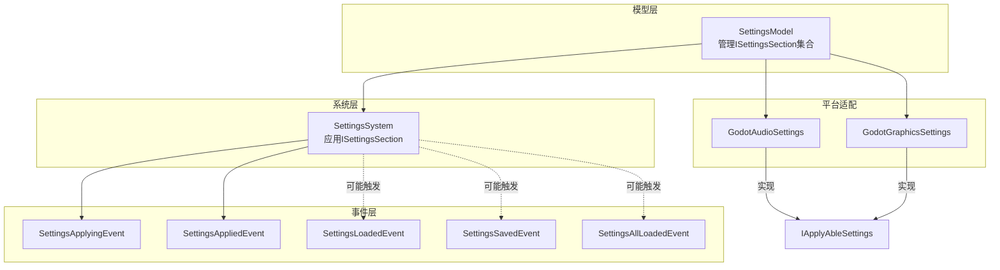
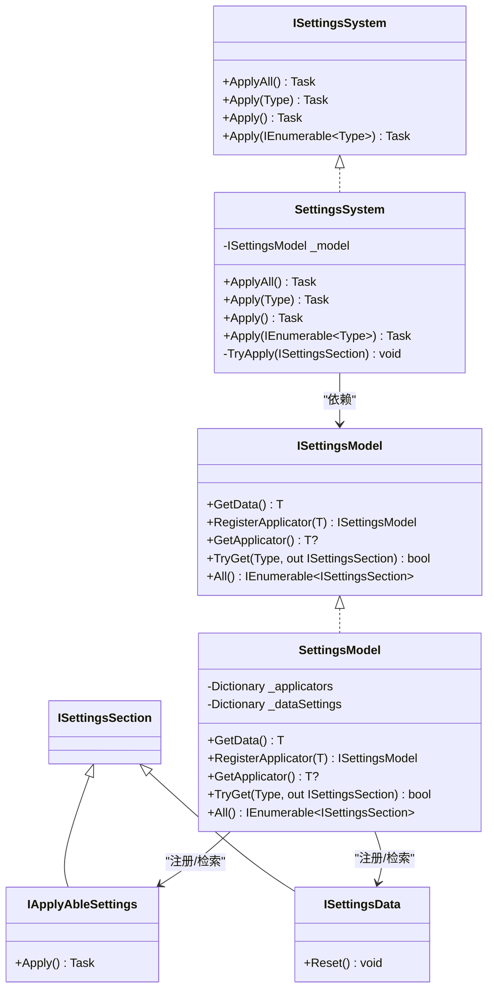
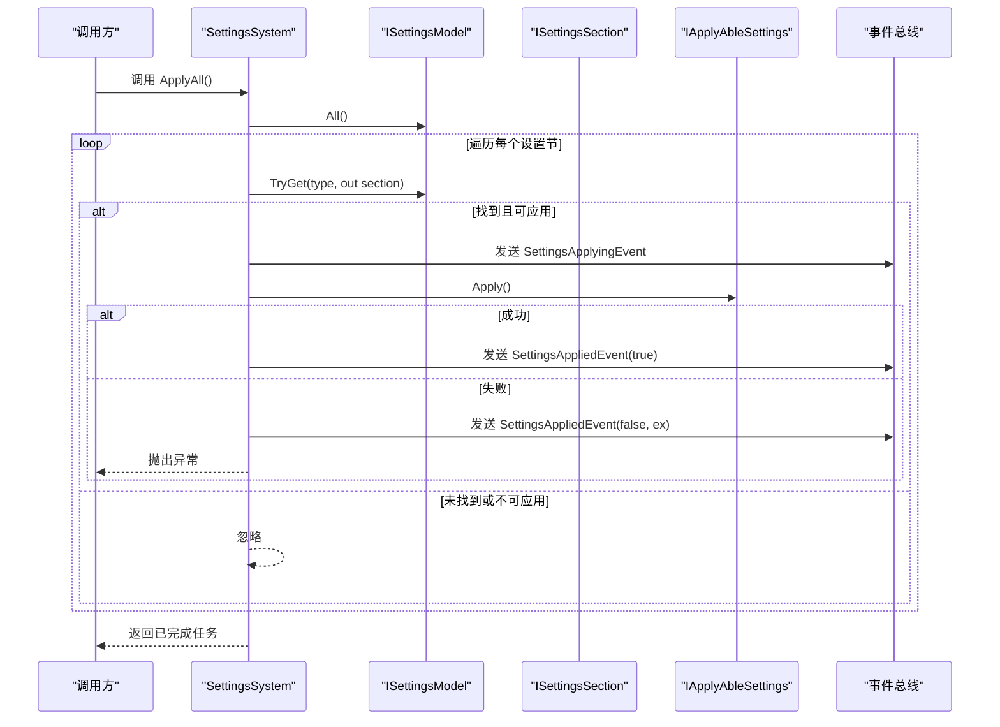
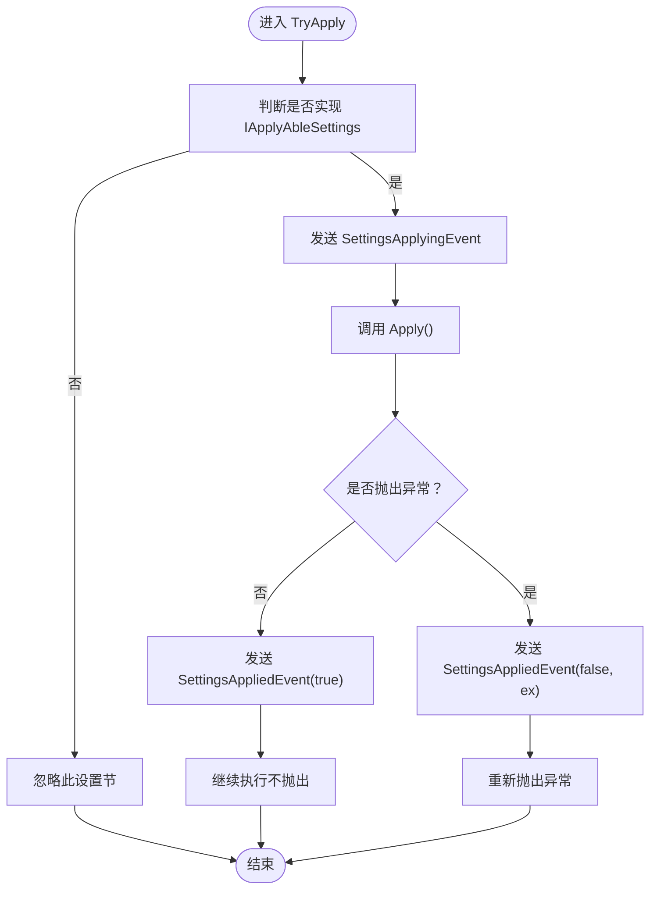
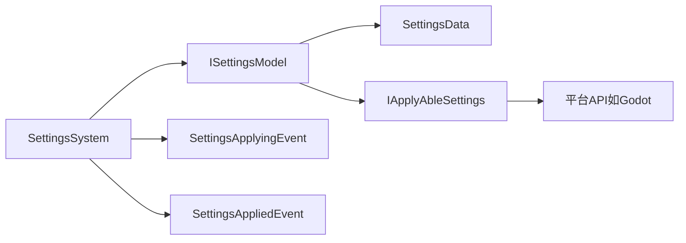

# 设置系统核心

<cite>
**本文引用的文件**
- [SettingsSystem.cs](file://GFramework.Game/setting/SettingsSystem.cs)
- [ISettingsSystem.cs](file://GFramework.Game.Abstractions/setting/ISettingsSystem.cs)
- [SettingsModel.cs](file://GFramework.Game/setting/SettingsModel.cs)
- [ISettingsModel.cs](file://GFramework.Game.Abstractions/setting/ISettingsModel.cs)
- [SettingsPersistence.cs](file://GFramework.Game/setting/SettingsPersistence.cs)
- [ISettingsPersistence.cs](file://GFramework.Game.Abstractions/setting/ISettingsPersistence.cs)
- [IApplyAbleSettings.cs](file://GFramework.Game.Abstractions/setting/IApplyAbleSettings.cs)
- [ISettingsSection.cs](file://GFramework.Game.Abstractions/setting/ISettingsSection.cs)
- [ISettingsData.cs](file://GFramework.Game.Abstractions/setting/ISettingsData.cs)
- [SettingsApplyingEvent.cs](file://GFramework.Game/setting/events/SettingsApplyingEvent.cs)
- [SettingsAppliedEvent.cs](file://GFramework.Game/setting/events/SettingsAppliedEvent.cs)
- [SettingsAllLoadedEvent.cs](file://GFramework.Game/setting/events/SettingsAllLoadedEvent.cs)
- [SettingsSavedEvent.cs](file://GFramework.Game/setting/events/SettingsSavedEvent.cs)
- [SettingsLoadedEvent.cs](file://GFramework.Game/setting/events/SettingsLoadedEvent.cs)
- [GodotAudioSettings.cs](file://GFramework.Godot/setting/GodotAudioSettings.cs)
- [GodotGraphicsSettings.cs](file://GFramework.Godot/setting/GodotGraphicsSettings.cs)
- [GraphicsSettings.cs](file://GFramework.Game.Abstractions/setting/GraphicsSettings.cs)
- [AudioSettings.cs](file://GFramework.Game.Abstractions/setting/AudioSettings.cs)
- [README.md（设置系统）](file://GFramework.Game/setting/README.md)
</cite>

## 目录
1. [简介](#简介)
2. [项目结构](#项目结构)
3. [核心组件](#核心组件)
4. [架构总览](#架构总览)
5. [详细组件分析](#详细组件分析)
6. [依赖关系分析](#依赖关系分析)
7. [性能考量](#性能考量)
8. [故障排查指南](#故障排查指南)
9. [结论](#结论)
10. [附录](#附录)

## 简介
本文件聚焦于GFramework设置系统的核心组件，围绕SettingsSystem类展开，深入解析其设置应用机制、批量应用策略与异常处理流程；同时阐明ISettingsSystem接口的设计理念与方法签名，并结合事件系统说明设置应用的生命周期管理与状态流转。文档还提供核心API参考、使用示例与最佳实践，帮助开发者在不同平台（如Godot）中正确集成与扩展设置系统。

## 项目结构
设置系统位于Game层，采用“模型-系统-事件”的分层设计：
- 模型层：SettingsModel负责设置节的注册、检索与聚合
- 系统层：SettingsSystem负责设置应用的调度与异常传播
- 事件层：围绕设置加载、保存、应用等生命周期发出事件
- 平台适配：Godot等平台通过IApplyAbleSettings实现具体应用逻辑

图表来源
- [SettingsModel.cs](file://GFramework.Game/setting/SettingsModel.cs#L9-L103)
- [SettingsSystem.cs](file://GFramework.Game/setting/SettingsSystem.cs#L11-L99)
- [SettingsApplyingEvent.cs](file://GFramework.Game/setting/events/SettingsApplyingEvent.cs#L9-L31)
- [SettingsAppliedEvent.cs](file://GFramework.Game/setting/events/SettingsAppliedEvent.cs#L9-L41)
- [GodotAudioSettings.cs](file://GFramework.Godot/setting/GodotAudioSettings.cs#L11-L47)
- [GodotGraphicsSettings.cs](file://GFramework.Godot/setting/GodotGraphicsSettings.cs#L10-L43)

章节来源
- [README.md（设置系统）](file://GFramework.Game/setting/README.md#L1-L61)

## 核心组件
- ISettingsSystem：定义设置应用的统一入口，支持ApplyAll、Apply(Type)、Apply<T>()、Apply(IEnumerable<Type>)四种应用方式
- SettingsSystem：具体实现，负责遍历模型中的设置节，筛选可应用设置并触发事件与异常传播
- ISettingsModel：提供设置节的注册、检索与聚合能力
- IApplyAbleSettings：可应用设置接口，定义Apply方法
- 事件体系：SettingsApplyingEvent、SettingsAppliedEvent等，贯穿设置应用生命周期

章节来源
- [ISettingsSystem.cs](file://GFramework.Game.Abstractions/setting/ISettingsSystem.cs#L11-L32)
- [SettingsSystem.cs](file://GFramework.Game/setting/SettingsSystem.cs#L11-L99)
- [SettingsModel.cs](file://GFramework.Game/setting/SettingsModel.cs#L9-L103)
- [IApplyAbleSettings.cs](file://GFramework.Game.Abstractions/setting/IApplyAbleSettings.cs#L8-L14)
- [SettingsApplyingEvent.cs](file://GFramework.Game/setting/events/SettingsApplyingEvent.cs#L9-L31)
- [SettingsAppliedEvent.cs](file://GFramework.Game/setting/events/SettingsAppliedEvent.cs#L9-L41)

## 架构总览
设置系统遵循“模型-系统-事件”分层，系统层不直接操作平台细节，而是通过可应用设置接口抽象进行应用；事件层提供可观测性与可观测性扩展点。

图表来源
- [ISettingsSystem.cs](file://GFramework.Game.Abstractions/setting/ISettingsSystem.cs#L11-L32)
- [SettingsSystem.cs](file://GFramework.Game/setting/SettingsSystem.cs#L11-L99)
- [SettingsModel.cs](file://GFramework.Game/setting/SettingsModel.cs#L9-L103)
- [IApplyAbleSettings.cs](file://GFramework.Game.Abstractions/setting/IApplyAbleSettings.cs#L8-L14)
- [ISettingsSection.cs](file://GFramework.Game.Abstractions/setting/ISettingsSection.cs#L7-L7)
- [ISettingsData.cs](file://GFramework.Game.Abstractions/setting/ISettingsData.cs#L6-L12)

## 详细组件分析

### SettingsSystem 类分析
- 设计要点
  - 继承自AbstractSystem，通过GetModel获取ISettingsModel
  - 仅对实现IApplyAbleSettings的设置节执行应用，非可应用设置会被忽略
  - 应用前发送“正在应用”事件，应用结果（成功/失败）发送“已应用”事件
  - 异常捕获后仍抛出，保证上层可感知失败并进行恢复

- 方法详解
  - ApplyAll：遍历模型中所有设置节，逐个调用TryApply
  - Apply(Type)：根据类型从模型获取设置节，若存在则调用TryApply
  - Apply<T>()：泛型版本，委托给Apply(Type)
  - Apply(IEnumerable<Type>)：去重后批量应用，提升效率

- 生命周期与事件
  - 应用开始：发送SettingsApplyingEvent
  - 应用结束：发送SettingsAppliedEvent（成功或失败均会发送）
  - 异常：捕获后发送失败事件并向上抛出

- 异常处理与恢复
  - TryApply内部捕获异常，确保事件一致性
  - 抛出异常使调用方可以决定回滚或记录日志

图表来源
- [SettingsSystem.cs](file://GFramework.Game/setting/SettingsSystem.cs#L19-L98)
- [SettingsApplyingEvent.cs](file://GFramework.Game/setting/events/SettingsApplyingEvent.cs#L9-L31)
- [SettingsAppliedEvent.cs](file://GFramework.Game/setting/events/SettingsAppliedEvent.cs#L9-L41)

章节来源
- [SettingsSystem.cs](file://GFramework.Game/setting/SettingsSystem.cs#L11-L99)

### ISettingsSystem 接口设计
- 设计理念
  - 统一设置应用入口，屏蔽具体实现差异
  - 支持单类型、泛型、批量应用，满足不同场景需求
  - 返回Task以契合异步应用模式

- 方法签名与语义
  - ApplyAll：应用所有可应用设置
  - Apply(Type)：按类型应用设置
  - Apply<T>()：泛型约束为class且实现ISettingsSection
  - Apply(IEnumerable<Type>)：批量应用，内部去重

- 使用场景
  - 启动时一次性应用全部设置
  - 运行时按需应用某类设置
  - 批量应用多类设置，避免重复应用同一类型

章节来源
- [ISettingsSystem.cs](file://GFramework.Game.Abstractions/setting/ISettingsSystem.cs#L11-L32)

### SettingsModel 与 ISettingsModel
- 能力概览
  - GetData<T>()：按类型获取或创建数据设置实例
  - RegisterApplicator<T>()：注册可应用设置实例
  - GetApplicator<T>()：获取已注册的可应用设置
  - TryGet(Type, out ISettingsSection)：优先从数据设置查找，再从可应用设置查找
  - All()：合并两类设置节集合

- 复杂度与性能
  - 字典查找近似O(1)，All()合并两个集合，整体开销与设置数量线性相关
  - 建议在高频应用场景中缓存常用类型

章节来源
- [SettingsModel.cs](file://GFramework.Game/setting/SettingsModel.cs#L9-L103)
- [ISettingsModel.cs](file://GFramework.Game.Abstractions/setting/ISettingsModel.cs)

### IApplyAbleSettings 与 ISettingsData
- IApplyAbleSettings
  - 定义Apply方法，返回Task，便于平台侧执行异步应用（如Godot图形/音频设置）
- ISettingsData
  - 继承ISettingsSection，提供Reset方法，用于恢复默认值

章节来源
- [IApplyAbleSettings.cs](file://GFramework.Game.Abstractions/setting/IApplyAbleSettings.cs#L8-L14)
- [ISettingsData.cs](file://GFramework.Game.Abstractions/setting/ISettingsData.cs#L6-L12)

### 平台适配示例（Godot）
- GodotAudioSettings
  - 通过AudioServer设置各总线音量，应用前校验总线存在性
- GodotGraphicsSettings
  - 通过DisplayServer设置窗口模式、尺寸与位置，支持全屏与窗口化切换

章节来源
- [GodotAudioSettings.cs](file://GFramework.Godot/setting/GodotAudioSettings.cs#L11-L47)
- [GodotGraphicsSettings.cs](file://GFramework.Godot/setting/GodotGraphicsSettings.cs#L10-L43)

### 设置应用流程与事件触发时机
- 触发顺序
  - SettingsApplyingEvent：在TryApply开始时发送
  - SettingsAppliedEvent：无论成功或失败都会发送
- 状态管理
  - 成功：Success=true，Error=null
  - 失败：Success=false，Error=异常对象
- 与其他模块的关系
  - SettingsSystem与ISettingsModel交互获取设置节
  - SettingsSystem与事件总线交互发布应用事件
  - SettingsSystem不直接依赖平台API，通过IApplyAbleSettings抽象实现

图表来源
- [SettingsSystem.cs](file://GFramework.Game/setting/SettingsSystem.cs#L83-L98)
- [SettingsApplyingEvent.cs](file://GFramework.Game/setting/events/SettingsApplyingEvent.cs#L9-L31)
- [SettingsAppliedEvent.cs](file://GFramework.Game/setting/events/SettingsAppliedEvent.cs#L9-L41)

## 依赖关系分析
- 组件耦合
  - SettingsSystem依赖ISettingsModel，低耦合高内聚
  - SettingsModel内部维护两类字典，职责清晰
- 外部依赖
  - 事件系统：通过SendEvent发布事件
  - 平台API：由IApplyAbleSettings实现（如Godot）
- 循环依赖
  - 未发现循环依赖，事件与系统解耦良好

图表来源
- [SettingsSystem.cs](file://GFramework.Game/setting/SettingsSystem.cs#L11-L99)
- [SettingsModel.cs](file://GFramework.Game/setting/SettingsModel.cs#L9-L103)
- [IApplyAbleSettings.cs](file://GFramework.Game.Abstractions/setting/IApplyAbleSettings.cs#L8-L14)

章节来源
- [SettingsSystem.cs](file://GFramework.Game/setting/SettingsSystem.cs#L11-L99)
- [SettingsModel.cs](file://GFramework.Game/setting/SettingsModel.cs#L9-L103)

## 性能考量
- 批量应用优化
  - Apply(IEnumerable<Type>)内部对类型集合去重，避免重复应用同一类型
- 查找与遍历
  - SettingsModel的TryGet优先从数据设置字典查找，再从可应用设置字典查找，均为O(1)
  - ApplyAll与Apply(IEnumerable<Type>)遍历集合，整体O(n)
- 异步应用
  - IApplyAbleSettings.Apply返回Task，允许平台侧异步执行（如Godot设置），避免阻塞主线程

## 故障排查指南
- 症状：设置未生效
  - 检查设置是否实现IApplyAbleSettings
  - 确认已在ISettingsModel中注册（RegisterApplicator或GetData后注册）
- 症状：应用过程中抛出异常
  - SettingsAppliedEvent.Success=false，Error包含异常对象
  - 上层应捕获异常并进行回滚或降级处理
- 症状：事件未触发
  - 确认SettingsSystem已正确初始化并获取ISettingsModel
  - 确认事件订阅正常

章节来源
- [SettingsSystem.cs](file://GFramework.Game/setting/SettingsSystem.cs#L83-L98)
- [SettingsAppliedEvent.cs](file://GFramework.Game/setting/events/SettingsAppliedEvent.cs#L9-L41)

## 结论
SettingsSystem通过清晰的接口抽象与事件驱动，实现了设置应用的统一入口与可观测性。ISettingsSystem提供了灵活的应用策略（单类型、泛型、批量），配合TryApply的异常处理与事件传播，使得设置系统既易于扩展又便于维护。在平台适配方面，IApplyAbleSettings将平台细节封装在实现类中，保持核心系统的稳定与通用。

## 附录

### 核心API参考
- ISettingsSystem
  - ApplyAll(): 应用所有可应用设置
  - Apply(Type): 按类型应用设置
  - Apply<T>(): 泛型应用，约束T为class且实现ISettingsSection
  - Apply(IEnumerable<Type>): 批量应用，内部去重
- ISettingsModel
  - GetData<T>(): 获取或创建数据设置实例
  - RegisterApplicator<T>(): 注册可应用设置实例
  - GetApplicator<T>(): 获取已注册的可应用设置
  - TryGet(Type, out ISettingsSection): 尝试获取设置节
  - All(): 获取所有设置节集合
- IApplyAbleSettings
  - Apply(): 异步应用设置到平台系统
- ISettingsData
  - Reset(): 重置为默认值

章节来源
- [ISettingsSystem.cs](file://GFramework.Game.Abstractions/setting/ISettingsSystem.cs#L11-L32)
- [ISettingsModel.cs](file://GFramework.Game.Abstractions/setting/ISettingsModel.cs)
- [IApplyAbleSettings.cs](file://GFramework.Game.Abstractions/setting/IApplyAbleSettings.cs#L8-L14)
- [ISettingsData.cs](file://GFramework.Game.Abstractions/setting/ISettingsData.cs#L6-L12)

### 使用示例与最佳实践
- 基本使用
  - 获取ISettingsModel，使用GetData<T>()获取或创建设置实例
  - 通过RegisterApplicator<T>()注册可应用设置
  - 使用ISettingsSystem.ApplyAll()一次性应用所有设置
- 最佳实践
  - 将平台相关设置封装为IApplyAbleSettings实现类，避免在系统层直接耦合平台API
  - 对批量应用的类型集合进行去重，减少重复工作
  - 在应用前订阅SettingsApplyingEvent，应用后订阅SettingsAppliedEvent，以便进行日志与监控
  - 对可能失败的设置应用进行异常捕获与回滚策略设计

章节来源
- [README.md（设置系统）](file://GFramework.Game/setting/README.md#L63-L138)