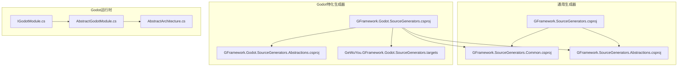
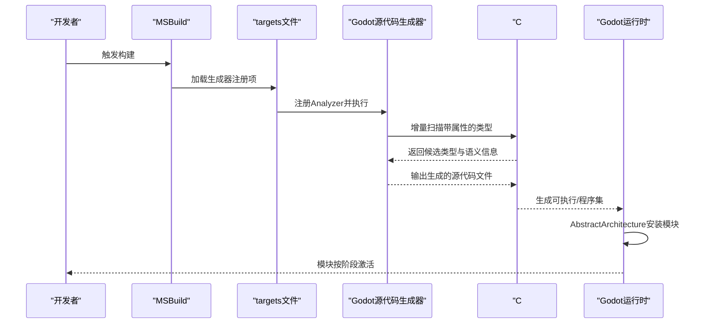
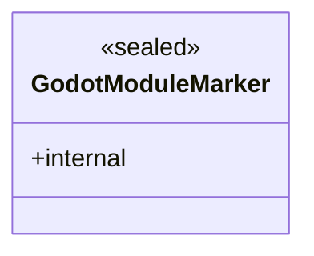
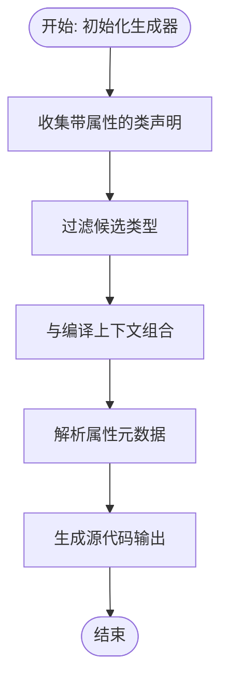
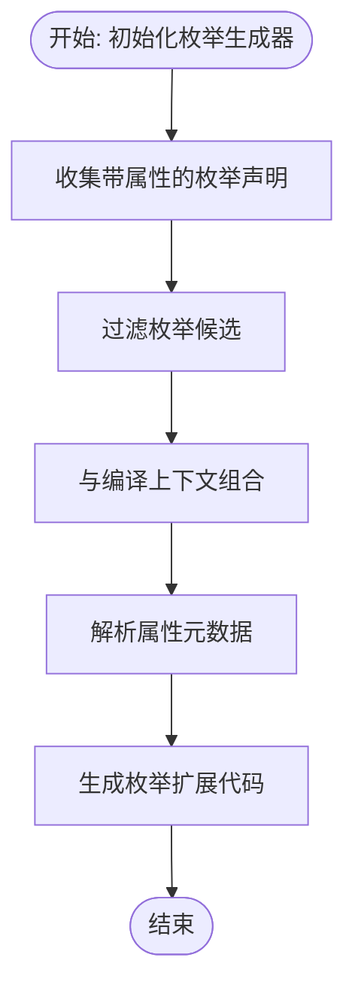
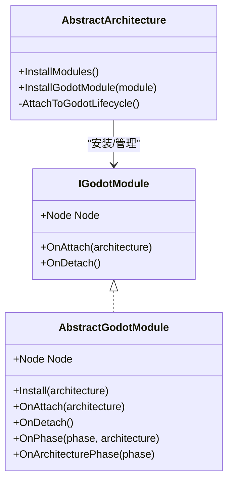
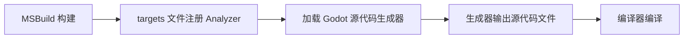
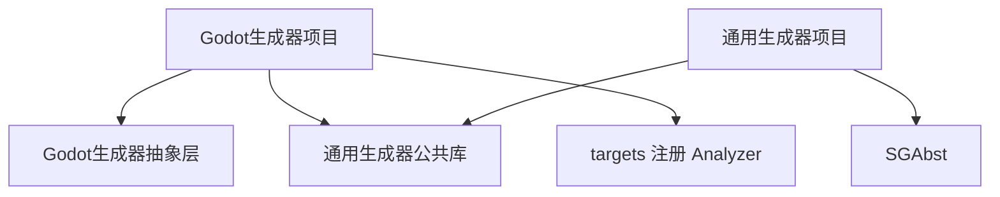

# Godot源代码生成器

<cite>
**本文档引用的文件**
- [GodotModuleMarker.cs](file://GFramework.Godot.SourceGenerators.Abstractions/GodotModuleMarker.cs)
- [GFramework.Godot.SourceGenerators.csproj](file://GFramework.Godot.SourceGenerators/GFramework.Godot.SourceGenerators.csproj)
- [GeWuYou.GFramework.Godot.SourceGenerators.targets](file://GFramework.Godot.SourceGenerators/GeWuYou.GFramework.Godot.SourceGenerators.targets)
- [GFramework.SourceGenerators.csproj](file://GFramework.SourceGenerators/GFramework.SourceGenerators.csproj)
- [GFramework.SourceGenerators.Common.csproj](file://GFramework.SourceGenerators.Common/GFramework.SourceGenerators.Common.csproj)
- [GFramework.Godot.SourceGenerators.Abstractions.csproj](file://GFramework.Godot.SourceGenerators.Abstractions/GFramework.Godot.SourceGenerators.Abstractions.csproj)
- [AttributeClassGeneratorBase.cs](file://GFramework.SourceGenerators.Common/generator/AttributeClassGeneratorBase.cs)
- [AttributeEnumGeneratorBase.cs](file://GFramework.SourceGenerators.Common/generator/AttributeEnumGeneratorBase.cs)
- [ContextAwareAttribute.cs](file://GFramework.SourceGenerators.Abstractions/rule/ContextAwareAttribute.cs)
- [IGodotModule.cs](file://GFramework.Godot/architecture/IGodotModule.cs)
- [AbstractGodotModule.cs](file://GFramework.Godot/architecture/AbstractGodotModule.cs)
- [AbstractArchitecture.cs](file://GFramework.Godot/architecture/AbstractArchitecture.cs)
- [godot-api.md](file://docs/api-reference/godot-api.md)
</cite>

## 目录
1. [引言](#引言)
2. [项目结构](#项目结构)
3. [核心组件](#核心组件)
4. [架构总览](#架构总览)
5. [详细组件分析](#详细组件分析)
6. [依赖关系分析](#依赖关系分析)
7. [性能考虑](#性能考虑)
8. [故障排除指南](#故障排除指南)
9. [结论](#结论)
10. [附录](#附录)

## 引言
本文件面向Godot引擎的开发者，系统性阐述“Godot源代码生成器”的设计与实现，重点覆盖以下主题：
- GodotModuleMarker的标记生成机制与作用域隔离
- 基于属性标记的Godot模块自动发现与注册流程
- Godot源代码生成器与通用生成器的差异与Godot特化能力
- 生成器配置选项、使用场景与最佳实践
- 从模块标记到完整模块类的生成流程
- 在Godot项目中的集成示例与常见问题
- 性能优化与调试技巧

## 项目结构
该仓库采用多项目分层组织，围绕“通用生成器”和“Godot特化生成器”两条主线展开：
- 通用生成器层：提供跨平台、跨框架的增量式源码生成基础设施
- Godot特化生成器层：在通用基础上，针对Godot模块系统进行定制化扩展
- 抽象与公共基础：为两套生成器提供共享的抽象类型与通用工具

图表来源
- [GFramework.SourceGenerators.csproj](file://GFramework.SourceGenerators/GFramework.SourceGenerators.csproj#L1-L64)
- [GFramework.SourceGenerators.Common.csproj](file://GFramework.SourceGenerators.Common/GFramework.SourceGenerators.Common.csproj#L1-L39)
- [GFramework.Godot.SourceGenerators.csproj](file://GFramework.Godot.SourceGenerators/GFramework.Godot.SourceGenerators.csproj#L1-L71)
- [GFramework.Godot.SourceGenerators.Abstractions.csproj](file://GFramework.Godot.SourceGenerators.Abstractions/GFramework.Godot.SourceGenerators.Abstractions.csproj#L1-L32)
- [GeWuYou.GFramework.Godot.SourceGenerators.targets](file://GFramework.Godot.SourceGenerators/GeWuYou.GFramework.Godot.SourceGenerators.targets#L1-L16)
- [IGodotModule.cs](file://GFramework.Godot/architecture/IGodotModule.cs#L1-L27)
- [AbstractGodotModule.cs](file://GFramework.Godot/architecture/AbstractGodotModule.cs#L1-L55)
- [AbstractArchitecture.cs](file://GFramework.Godot/architecture/AbstractArchitecture.cs#L66-L105)

章节来源
- [GFramework.SourceGenerators.csproj](file://GFramework.SourceGenerators/GFramework.SourceGenerators.csproj#L1-L64)
- [GFramework.SourceGenerators.Common.csproj](file://GFramework.SourceGenerators.Common/GFramework.SourceGenerators.Common.csproj#L1-L39)
- [GFramework.Godot.SourceGenerators.csproj](file://GFramework.Godot.SourceGenerators/GFramework.Godot.SourceGenerators.csproj#L1-L71)
- [GFramework.Godot.SourceGenerators.Abstractions.csproj](file://GFramework.Godot.SourceGenerators.Abstractions/GFramework.Godot.SourceGenerators.Abstractions.csproj#L1-L32)
- [GeWuYou.GFramework.Godot.SourceGenerators.targets](file://GFramework.Godot.SourceGenerators/GeWuYou.Godot.SourceGenerators.targets#L1-L16)

## 核心组件
- GodotModuleMarker：作为Godot模块命名空间的占位类型，用于隔离与标记Godot模块相关的生成范围，避免与其他生成器产生命名冲突或误匹配。
- 通用生成器基类：提供基于属性的增量式源码生成骨架，支持类与枚举两类目标，具备统一的候选收集、语义解析与输出注册流程。
- Godot特化生成器：在通用生成器之上，结合Godot模块接口与生命周期，实现模块类的自动发现与注册。

章节来源
- [GodotModuleMarker.cs](file://GFramework.Godot.SourceGenerators.Abstractions/GodotModuleMarker.cs#L1-L6)
- [AttributeClassGeneratorBase.cs](file://GFramework.SourceGenerators.Common/generator/AttributeClassGeneratorBase.cs#L1-L67)
- [AttributeEnumGeneratorBase.cs](file://GFramework.SourceGenerators.Common/generator/AttributeEnumGeneratorBase.cs#L1-L33)

## 架构总览
Godot源代码生成器通过MSBuild targets在编译前加载Analyzer，利用Roslyn增量生成器扫描带特定属性的类/枚举，生成对应模块注册与装配代码。运行时由AbstractArchitecture负责模块生命周期管理与节点挂载。

图表来源
- [GeWuYou.GFramework.Godot.SourceGenerators.targets](file://GFramework.Godot.SourceGenerators/GeWuYou.Godot.SourceGenerators.targets#L1-L16)
- [GFramework.Godot.SourceGenerators.csproj](file://GFramework.Godot.SourceGenerators/GFramework.Godot.SourceGenerators.csproj#L35-L53)
- [AbstractArchitecture.cs](file://GFramework.Godot/architecture/AbstractArchitecture.cs#L66-L105)

## 详细组件分析

### 组件A：GodotModuleMarker与命名空间隔离
- 作用：以内部密封类形式为Godot模块相关生成逻辑提供命名空间占位，避免与通用生成器或其他模块生成器发生命名冲突。
- 影响：确保生成器仅作用于Godot模块命名空间内的类型，提升生成范围的确定性与安全性。

图表来源
- [GodotModuleMarker.cs](file://GFramework.Godot.SourceGenerators.Abstractions/GodotModuleMarker.cs#L1-L6)

章节来源
- [GodotModuleMarker.cs](file://GFramework.Godot.SourceGenerators.Abstractions/GodotModuleMarker.cs#L1-L6)

### 组件B：通用属性类生成器基类
- 功能：基于属性标记的增量式源码生成骨架，支持：
  - 语法级候选收集：筛选包含指定属性名的类声明
  - 语义级解析：获取类型符号与属性元数据
  - 组合并输出：将候选与编译上下文组合，触发源码生成
- 关键点：
  - 通过AttributeShortNameWithoutSuffix约定子类生成器的属性匹配规则
  - 通过ResolveAttribute与Execute解耦具体生成逻辑

图表来源
- [AttributeClassGeneratorBase.cs](file://GFramework.SourceGenerators.Common/generator/AttributeClassGeneratorBase.cs#L23-L48)

章节来源
- [AttributeClassGeneratorBase.cs](file://GFramework.SourceGenerators.Common/generator/AttributeClassGeneratorBase.cs#L1-L67)

### 组件C：通用属性枚举生成器基类
- 功能：与类生成器类似，但面向枚举声明，同样基于属性名匹配与语义解析，最终输出扩展代码。
- 适用场景：为Godot模块系统中的枚举型配置或状态提供自动生成的辅助方法或常量。

图表来源
- [AttributeEnumGeneratorBase.cs](file://GFramework.SourceGenerators.Common/generator/AttributeEnumGeneratorBase.cs#L21-L33)

章节来源
- [AttributeEnumGeneratorBase.cs](file://GFramework.SourceGenerators.Common/generator/AttributeEnumGeneratorBase.cs#L1-L33)

### 组件D：Godot模块接口与抽象基类
- IGodotModule：定义Godot模块的最小接口契约，包括节点引用、附加/分离回调以及与架构的交互。
- AbstractGodotModule：提供默认空实现，便于子类按需覆盖生命周期钩子与安装逻辑。
- AbstractArchitecture：在运行时负责模块安装、阶段通知与Godot生命周期绑定（如场景树锚点）。

图表来源
- [IGodotModule.cs](file://GFramework.Godot/architecture/IGodotModule.cs#L1-L27)
- [AbstractGodotModule.cs](file://GFramework.Godot/architecture/AbstractGodotModule.cs#L1-L55)
- [AbstractArchitecture.cs](file://GFramework.Godot/architecture/AbstractArchitecture.cs#L66-L105)

章节来源
- [IGodotModule.cs](file://GFramework.Godot/architecture/IGodotModule.cs#L1-L27)
- [AbstractGodotModule.cs](file://GFramework.Godot/architecture/AbstractGodotModule.cs#L1-L55)
- [AbstractArchitecture.cs](file://GFramework.Godot/architecture/AbstractArchitecture.cs#L66-L105)

### 组件E：生成器打包与加载机制
- GFramework.Godot.SourceGenerators.csproj：将生成器DLL及其运行期依赖打包至analyzers目录，供MSBuild在编译前加载。
- GeWuYou.GFramework.Godot.SourceGenerators.targets：在BeforeTargets=CoreCompile阶段注入Analyzer，确保生成器参与编译。
- GFramework.SourceGenerators.csproj与GFramework.SourceGenerators.Common.csproj：通用生成器的打包与加载策略一致，体现复用性。

图表来源
- [GFramework.Godot.SourceGenerators.csproj](file://GFramework.Godot.SourceGenerators/GFramework.Godot.SourceGenerators.csproj#L35-L53)
- [GeWuYou.GFramework.Godot.SourceGenerators.targets](file://GFramework.Godot.SourceGenerators/GeWuYou.Godot.SourceGenerators.targets#L6-L15)
- [GFramework.SourceGenerators.csproj](file://GFramework.SourceGenerators/GFramework.SourceGenerators.csproj#L36-L55)

章节来源
- [GFramework.Godot.SourceGenerators.csproj](file://GFramework.Godot.SourceGenerators/GFramework.Godot.SourceGenerators.csproj#L1-L71)
- [GeWuYou.GFramework.Godot.SourceGenerators.targets](file://GFramework.Godot.SourceGenerators/GeWuYou.Godot.SourceGenerators.targets#L1-L16)
- [GFramework.SourceGenerators.csproj](file://GFramework.SourceGenerators/GFramework.SourceGenerators.csproj#L1-L64)
- [GFramework.SourceGenerators.Common.csproj](file://GFramework.SourceGenerators.Common/GFramework.SourceGenerators.Common.csproj#L1-L39)

## 依赖关系分析
- 生成器打包策略：生成器DLL与运行期依赖均被打包到analyzers/dotnet/cs路径，确保在编译阶段可用。
- 目标文件注入：通过targets文件在CoreCompile前注入Analyzer，保证生成器在编译早期参与。
- 项目间依赖：Godot特化生成器同时引用通用生成器公共库与抽象层，形成“通用+特化”的双层架构。

图表来源
- [GFramework.Godot.SourceGenerators.csproj](file://GFramework.Godot.SourceGenerators/GFramework.Godot.SourceGenerators.csproj#L29-L53)
- [GFramework.SourceGenerators.csproj](file://GFramework.SourceGenerators/GFramework.SourceGenerators.csproj#L29-L55)
- [GeWuYou.GFramework.Godot.SourceGenerators.targets](file://GFramework.Godot.SourceGenerators/GeWuYou.Godot.SourceGenerators.targets#L6-L10)

章节来源
- [GFramework.Godot.SourceGenerators.csproj](file://GFramework.Godot.SourceGenerators/GFramework.Godot.SourceGenerators.csproj#L1-L71)
- [GFramework.SourceGenerators.csproj](file://GFramework.SourceGenerators/GFramework.SourceGenerators.csproj#L1-L64)
- [GFramework.SourceGenerators.Common.csproj](file://GFramework.SourceGenerators.Common/GFramework.SourceGenerators.Common.csproj#L1-L39)
- [GeWuYou.GFramework.Godot.SourceGenerators.targets](file://GFramework.Godot.SourceGenerators/GeWuYou.Godot.SourceGenerators.targets#L1-L16)

## 性能考虑
- 增量生成：基于IIncrementalGenerator，仅在属性或类型变更时重新生成，减少全量编译成本。
- 语义解析分离：先语法收集，再语义解析，避免不必要的符号查询开销。
- 生成范围控制：通过GodotModuleMarker等占位类型限定生成范围，降低无关类型扫描与生成压力。
- 依赖打包优化：将生成器与依赖打包至analyzers，避免运行时额外加载开销。

## 故障排除指南
- 生成器未生效
  - 确认targets文件已被MSBuild加载（BeforeTargets=CoreCompile阶段）
  - 检查analyzers目录下是否存在生成器DLL与依赖
- 生成范围不符合预期
  - 检查属性名称是否与AttributeShortNameWithoutSuffix约定一致
  - 确保目标类型位于Godot模块命名空间内，避免与通用生成器混淆
- 运行时模块未注册
  - 确认AbstractArchitecture的InstallModules中调用了InstallGodotModule
  - 检查模块是否实现IGodotModule并正确返回Node

章节来源
- [GeWuYou.GFramework.Godot.SourceGenerators.targets](file://GFramework.Godot.SourceGenerators/GeWuYou.Godot.SourceGenerators.targets#L12-L15)
- [GFramework.Godot.SourceGenerators.csproj](file://GFramework.Godot.SourceGenerators/GFramework.Godot.SourceGenerators.csproj#L35-L53)
- [AbstractArchitecture.cs](file://GFramework.Godot/architecture/AbstractArchitecture.cs#L66-L105)

## 结论
Godot源代码生成器通过“命名空间占位+增量生成+Analyzer打包”的组合，实现了Godot模块的自动发现与注册。它在通用生成器基础设施之上，提供了Godot特化的接口与生命周期集成，既保持了良好的可维护性，又满足了引擎层面的性能与稳定性要求。

## 附录

### 使用场景与最佳实践
- 场景
  - 需要为Godot模块自动注册系统、工具与页面的行为
  - 希望在编译期生成模块装配代码，减少运行时反射成本
- 最佳实践
  - 将模块类置于Godot模块命名空间，配合GodotModuleMarker实现范围隔离
  - 为模块类添加Godot特化属性，确保生成器能正确识别
  - 在AbstractArchitecture的InstallModules中集中调用InstallGodotModule

章节来源
- [godot-api.md](file://docs/api-reference/godot-api.md#L70-L125)

### 配置选项与打包细节
- 生成器项目属性
  - TargetFramework: netstandard2.0
  - IsRoslynAnalyzer: true
  - EmitCompilerGeneratedFiles: true（可选，便于调试生成代码）
- 打包策略
  - 生成器DLL与依赖打包至analyzers/dotnet/cs
  - targets文件随包进入build目录，确保在编译前加载

章节来源
- [GFramework.Godot.SourceGenerators.csproj](file://GFramework.Godot.SourceGenerators/GFramework.Godot.SourceGenerators.csproj#L3-L18)
- [GFramework.Godot.SourceGenerators.csproj](file://GFramework.Godot.SourceGenerators/GFramework.Godot.SourceGenerators.csproj#L35-L61)
- [GeWuYou.GFramework.Godot.SourceGenerators.targets](file://GFramework.Godot.SourceGenerators/GeWuYou.Godot.SourceGenerators.targets#L6-L10)