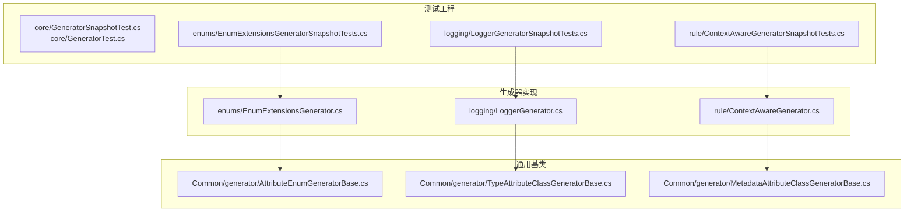
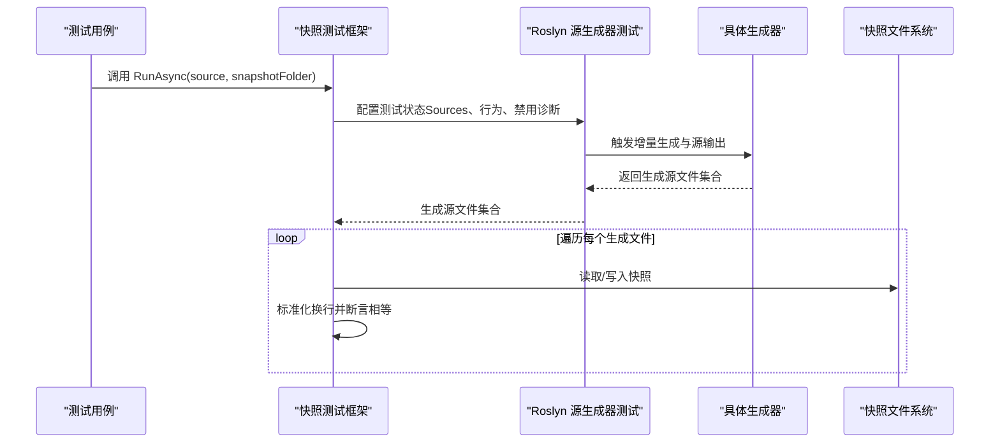
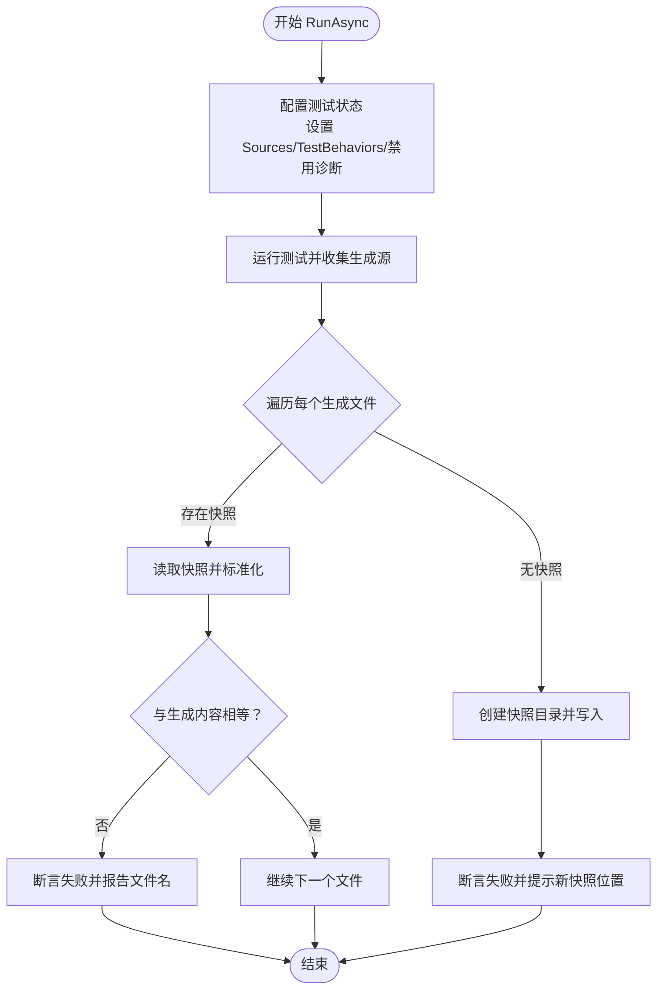
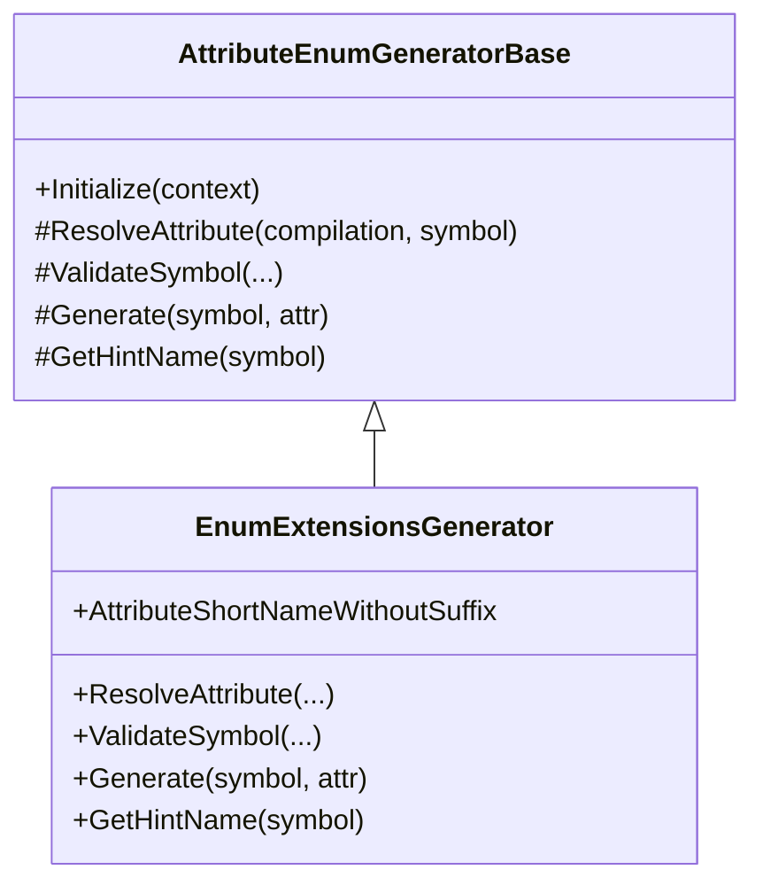
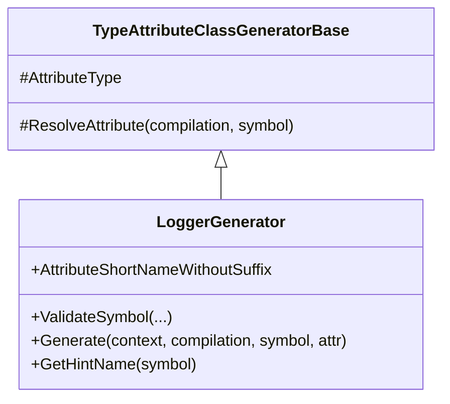
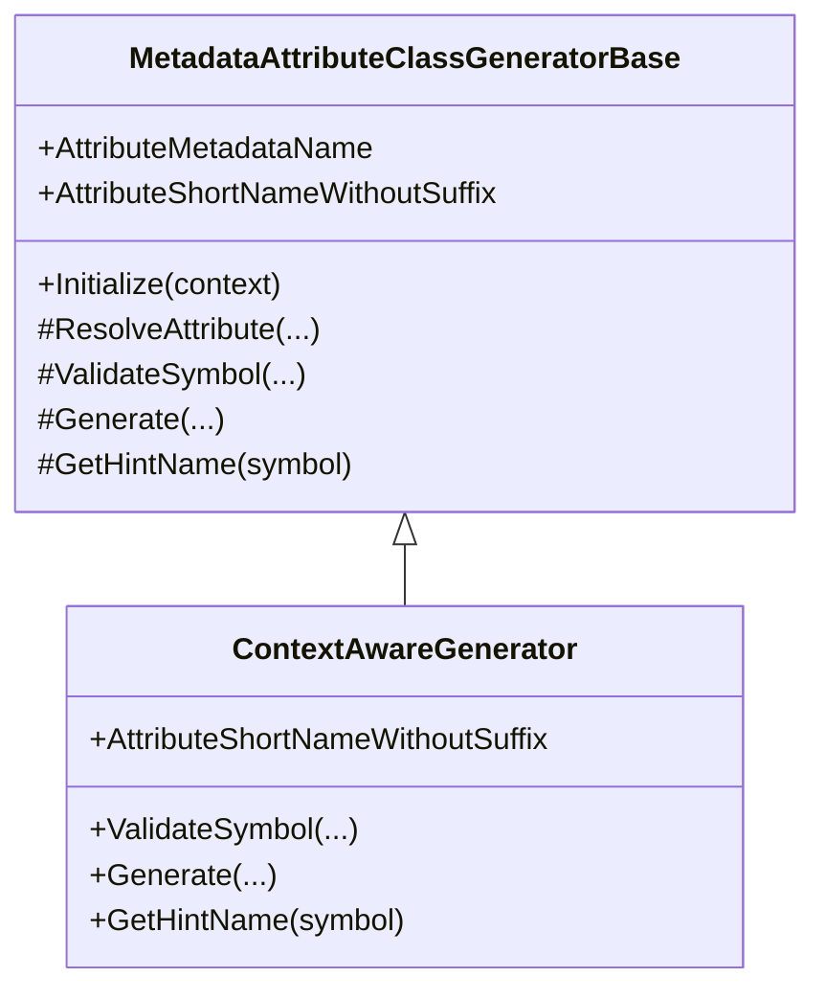
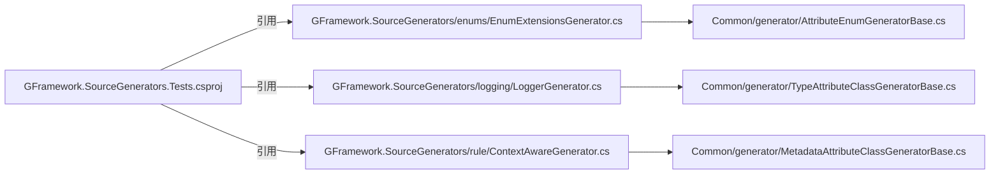

# 测试和验证

<cite>
**本文引用的文件**
- [GFramework.SourceGenerators.Tests/core/GeneratorSnapshotTest.cs](file://GFramework.SourceGenerators.Tests/core/GeneratorSnapshotTest.cs)
- [GFramework.SourceGenerators.Tests/core/GeneratorTest.cs](file://GFramework.SourceGenerators.Tests/core/GeneratorTest.cs)
- [GFramework.SourceGenerators.Tests/enums/EnumExtensionsGeneratorSnapshotTests.cs](file://GFramework.SourceGenerators.Tests/enums/EnumExtensionsGeneratorSnapshotTests.cs)
- [GFramework.SourceGenerators.Tests/logging/LoggerGeneratorSnapshotTests.cs](file://GFramework.SourceGenerators.Tests/logging/LoggerGeneratorSnapshotTests.cs)
- [GFramework.SourceGenerators.Tests/rule/ContextAwareGeneratorSnapshotTests.cs](file://GFramework.SourceGenerators.Tests/rule/ContextAwareGeneratorSnapshotTests.cs)
- [GFramework.SourceGenerators/enums/EnumExtensionsGenerator.cs](file://GFramework.SourceGenerators/enums/EnumExtensionsGenerator.cs)
- [GFramework.SourceGenerators/logging/LoggerGenerator.cs](file://GFramework.SourceGenerators/logging/LoggerGenerator.cs)
- [GFramework.SourceGenerators/rule/ContextAwareGenerator.cs](file://GFramework.SourceGenerators/rule/ContextAwareGenerator.cs)
- [GFramework.SourceGenerators.Common/generator/AttributeEnumGeneratorBase.cs](file://GFramework.SourceGenerators.Common/generator/AttributeEnumGeneratorBase.cs)
- [GFramework.SourceGenerators.Common/generator/TypeAttributeClassGeneratorBase.cs](file://GFramework.SourceGenerators.Common/generator/TypeAttributeClassGeneratorBase.cs)
- [GFramework.SourceGenerators.Common/generator/MetadataAttributeClassGeneratorBase.cs](file://GFramework.SourceGenerators.Common/generator/MetadataAttributeClassGeneratorBase.cs)
- [GFramework.SourceGenerators.Tests/GFramework.SourceGenerators.Tests.csproj](file://GFramework.SourceGenerators.Tests/GFramework.SourceGenerators.Tests.csproj)
</cite>

## 目录
1. [引言](#引言)
2. [项目结构](#项目结构)
3. [核心组件](#核心组件)
4. [架构总览](#架构总览)
5. [详细组件分析](#详细组件分析)
6. [依赖关系分析](#依赖关系分析)
7. [性能考虑](#性能考虑)
8. [故障排查指南](#故障排查指南)
9. [结论](#结论)
10. [附录](#附录)

## 引言
本文件面向源代码生成器的测试与验证，系统性阐述测试框架与策略，重点围绕快照测试机制、三类生成器（枚举扩展、日志、上下文感知）的测试用例设计、测试数据准备与执行流程、边界条件与异常模拟、最佳实践与调试技巧，以及在持续集成中的自动化与质量保障流程。目标是帮助开发者高效编写与维护生成器测试，并扩展测试覆盖面。

## 项目结构
测试工程位于 GFramework.SourceGenerators.Tests，按功能域划分子目录：
- core：通用测试基础设施（快照测试与基础测试）
- enums：枚举扩展生成器的快照测试
- logging：日志生成器的快照测试
- rule：上下文感知生成器的快照测试

生成器实现位于 GFramework.SourceGenerators，对应三个子命名空间：
- enums：枚举扩展生成器
- logging：日志生成器
- rule：上下文感知生成器

通用生成器基类位于 GFramework.SourceGenerators.Common/generator，为不同类型的生成器提供统一的增量生成与解析能力。

图表来源
- [GFramework.SourceGenerators.Tests/core/GeneratorSnapshotTest.cs](file://GFramework.SourceGenerators.Tests/core/GeneratorSnapshotTest.cs#L1-L72)
- [GFramework.SourceGenerators.Tests/core/GeneratorTest.cs](file://GFramework.SourceGenerators.Tests/core/GeneratorTest.cs#L1-L39)
- [GFramework.SourceGenerators.Tests/enums/EnumExtensionsGeneratorSnapshotTests.cs](file://GFramework.SourceGenerators.Tests/enums/EnumExtensionsGeneratorSnapshotTests.cs#L1-L208)
- [GFramework.SourceGenerators.Tests/logging/LoggerGeneratorSnapshotTests.cs](file://GFramework.SourceGenerators.Tests/logging/LoggerGeneratorSnapshotTests.cs#L1-L591)
- [GFramework.SourceGenerators.Tests/rule/ContextAwareGeneratorSnapshotTests.cs](file://GFramework.SourceGenerators.Tests/rule/ContextAwareGeneratorSnapshotTests.cs#L1-L84)
- [GFramework.SourceGenerators/enums/EnumExtensionsGenerator.cs](file://GFramework.SourceGenerators/enums/EnumExtensionsGenerator.cs#L1-L114)
- [GFramework.SourceGenerators/logging/LoggerGenerator.cs](file://GFramework.SourceGenerators/logging/LoggerGenerator.cs#L1-L103)
- [GFramework.SourceGenerators/rule/ContextAwareGenerator.cs](file://GFramework.SourceGenerators/rule/ContextAwareGenerator.cs#L1-L234)
- [GFramework.SourceGenerators.Common/generator/AttributeEnumGeneratorBase.cs](file://GFramework.SourceGenerators.Common/generator/AttributeEnumGeneratorBase.cs#L1-L104)
- [GFramework.SourceGenerators.Common/generator/TypeAttributeClassGeneratorBase.cs](file://GFramework.SourceGenerators.Common/generator/TypeAttributeClassGeneratorBase.cs#L1-L35)
- [GFramework.SourceGenerators.Common/generator/MetadataAttributeClassGeneratorBase.cs](file://GFramework.SourceGenerators.Common/generator/MetadataAttributeClassGeneratorBase.cs)

章节来源
- [GFramework.SourceGenerators.Tests/GFramework.SourceGenerators.Tests.csproj](file://GFramework.SourceGenerators.Tests/GFramework.SourceGenerators.Tests.csproj#L1-L30)

## 核心组件
- 快照测试框架（GeneratorSnapshotTest）：封装 Roslyn 源生成器测试流程，自动对比生成产物与快照文件，支持首次生成快照与后续比对。
- 基础测试工具（GeneratorTest）：用于直接断言生成源文件集合，适用于不需要快照管理的场景。
- 生成器基类体系：AttributeEnumGeneratorBase、TypeAttributeClassGeneratorBase、MetadataAttributeClassGeneratorBase，分别面向“属性+枚举”、“属性+类”、“元数据+类”的增量生成模式。

章节来源
- [GFramework.SourceGenerators.Tests/core/GeneratorSnapshotTest.cs](file://GFramework.SourceGenerators.Tests/core/GeneratorSnapshotTest.cs#L1-L72)
- [GFramework.SourceGenerators.Tests/core/GeneratorTest.cs](file://GFramework.SourceGenerators.Tests/core/GeneratorTest.cs#L1-L39)
- [GFramework.SourceGenerators.Common/generator/AttributeEnumGeneratorBase.cs](file://GFramework.SourceGenerators.Common/generator/AttributeEnumGeneratorBase.cs#L1-L104)
- [GFramework.SourceGenerators.Common/generator/TypeAttributeClassGeneratorBase.cs](file://GFramework.SourceGenerators.Common/generator/TypeAttributeClassGeneratorBase.cs#L1-L35)

## 架构总览
下图展示测试执行的端到端流程：测试用例构造输入源码，调用快照测试框架，Roslyn 源生成器运行并产出生成源；框架将生成产物与快照文件逐项比对，断言失败或首次运行生成新快照。

图表来源
- [GFramework.SourceGenerators.Tests/core/GeneratorSnapshotTest.cs](file://GFramework.SourceGenerators.Tests/core/GeneratorSnapshotTest.cs#L20-L61)
- [GFramework.SourceGenerators/enums/EnumExtensionsGenerator.cs](file://GFramework.SourceGenerators/enums/EnumExtensionsGenerator.cs#L14-L35)
- [GFramework.SourceGenerators/logging/LoggerGenerator.cs](file://GFramework.SourceGenerators/logging/LoggerGenerator.cs#L15-L41)
- [GFramework.SourceGenerators/rule/ContextAwareGenerator.cs](file://GFramework.SourceGenerators/rule/ContextAwareGenerator.cs#L16-L67)

## 详细组件分析

### 快照测试框架（GeneratorSnapshotTest）
- 设计要点
  - 使用 Roslyn 的 CSharpSourceGeneratorTest 作为测试宿主，配置 TestState.Sources 传入待测源码。
  - 通过 TestBehaviors 跳过生成源检查，聚焦于生成产物与快照的比对。
  - 支持禁用特定诊断（如 GF_Common_Trace_001），避免噪声干扰。
  - 首次运行若快照不存在，则创建快照并断言失败，引导开发者接受新快照。
  - 标准化换行符与空白，确保跨平台一致性。
- 断言策略
  - 对每个生成文件，读取对应快照，标准化后与生成内容断言相等。
  - 任一文件不匹配即报告差异文件名，便于定位问题。
- 适用场景
  - 生成器输出稳定且可预期的场景，适合长期维护的快照回归。

图表来源
- [GFramework.SourceGenerators.Tests/core/GeneratorSnapshotTest.cs](file://GFramework.SourceGenerators.Tests/core/GeneratorSnapshotTest.cs#L20-L61)

章节来源
- [GFramework.SourceGenerators.Tests/core/GeneratorSnapshotTest.cs](file://GFramework.SourceGenerators.Tests/core/GeneratorSnapshotTest.cs#L1-L72)

### 基础测试工具（GeneratorTest）
- 设计要点
  - 通过向 TestState.GeneratedSources 添加期望的文件名与内容，直接断言生成结果。
  - 适用于生成逻辑复杂但输出不稳定或难以维护快照的场景。
- 使用建议
  - 将生成器输出拆分为明确的片段，分批断言，提升可读性与可维护性。

章节来源
- [GFramework.SourceGenerators.Tests/core/GeneratorTest.cs](file://GFramework.SourceGenerators.Tests/core/GeneratorTest.cs#L1-L39)

### 枚举扩展生成器（EnumExtensionsGenerator）与测试
- 生成逻辑概览
  - 基于 AttributeEnumGeneratorBase，扫描带指定属性的枚举。
  - 生成 IsX 方法与 IsIn 方法，支持 Flags 枚举与普通枚举。
  - 输出文件名约定为 {EnumName}.EnumExtensions.g.cs。
- 测试用例设计
  - 基础枚举的 Is 方法集、IsIn 方法、带 Flags 的枚举、关闭 Is 方法或 IsIn 方法的开关。
  - 每个场景独立快照，确保变更可追踪。
- 边界与异常
  - 生成器在符号校验阶段会报告非 partial 类型或非枚举类型的错误诊断。
  - 测试中通过快照验证诊断是否按预期产生。

图表来源
- [GFramework.SourceGenerators.Common/generator/AttributeEnumGeneratorBase.cs](file://GFramework.SourceGenerators.Common/generator/AttributeEnumGeneratorBase.cs#L10-L104)
- [GFramework.SourceGenerators/enums/EnumExtensionsGenerator.cs](file://GFramework.SourceGenerators/enums/EnumExtensionsGenerator.cs#L14-L114)

章节来源
- [GFramework.SourceGenerators/enums/EnumExtensionsGenerator.cs](file://GFramework.SourceGenerators/enums/EnumExtensionsGenerator.cs#L1-L114)
- [GFramework.SourceGenerators.Tests/enums/EnumExtensionsGeneratorSnapshotTests.cs](file://GFramework.SourceGenerators.Tests/enums/EnumExtensionsGeneratorSnapshotTests.cs#L1-L208)

### 日志生成器（LoggerGenerator）与测试
- 生成逻辑概览
  - 基于 TypeAttributeClassGeneratorBase，扫描带指定属性的类。
  - 生成只读日志字段，支持自定义日志名、字段名、访问修饰符、静态/实例等。
  - 输出文件名约定为 {ClassName}.Logger.g.cs。
- 测试用例设计
  - 默认配置、自定义日志名、自定义字段名、实例字段、公开字段、泛型类等多维度快照。
  - 每个维度一个测试，确保参数组合正确。
- 边界与异常
  - 生成器在 ValidateSymbol 中可扩展校验规则（例如类可见性、接口约束等）。
  - 测试通过快照验证生成代码与预期一致。

图表来源
- [GFramework.SourceGenerators.Common/generator/TypeAttributeClassGeneratorBase.cs](file://GFramework.SourceGenerators.Common/generator/TypeAttributeClassGeneratorBase.cs#L10-L35)
- [GFramework.SourceGenerators/logging/LoggerGenerator.cs](file://GFramework.SourceGenerators/logging/LoggerGenerator.cs#L15-L103)

章节来源
- [GFramework.SourceGenerators/logging/LoggerGenerator.cs](file://GFramework.SourceGenerators/logging/LoggerGenerator.cs#L1-L103)
- [GFramework.SourceGenerators.Tests/logging/LoggerGeneratorSnapshotTests.cs](file://GFramework.SourceGenerators.Tests/logging/LoggerGeneratorSnapshotTests.cs#L1-L591)

### 上下文感知生成器（ContextAwareGenerator）与测试
- 生成逻辑概览
  - 基于 MetadataAttributeClassGeneratorBase，扫描带指定元数据特性的类。
  - 校验必须为 partial class；生成 Context 属性与 IContextAware 接口显式实现。
  - 输出文件名约定为 {ClassName}.ContextAware.g.cs。
- 测试用例设计
  - 单一快照测试，覆盖 partial class、接口实现、上下文访问等关键点。
- 边界与异常
  - 非 partial 或非 class 的类型会在生成阶段报告诊断，测试通过快照验证诊断与生成结果。

图表来源
- [GFramework.SourceGenerators.Common/generator/MetadataAttributeClassGeneratorBase.cs](file://GFramework.SourceGenerators.Common/generator/MetadataAttributeClassGeneratorBase.cs)
- [GFramework.SourceGenerators/rule/ContextAwareGenerator.cs](file://GFramework.SourceGenerators/rule/ContextAwareGenerator.cs#L16-L122)

章节来源
- [GFramework.SourceGenerators/rule/ContextAwareGenerator.cs](file://GFramework.SourceGenerators/rule/ContextAwareGenerator.cs#L1-L234)
- [GFramework.SourceGenerators.Tests/rule/ContextAwareGeneratorSnapshotTests.cs](file://GFramework.SourceGenerators.Tests/rule/ContextAwareGeneratorSnapshotTests.cs#L1-L84)

## 依赖关系分析
- 测试工程依赖 Roslyn 与 NUnit 测试 SDK，以及生成器实现项目。
- 各生成器依赖对应的通用基类，形成清晰的职责分离与复用。
- 快照测试框架与具体生成器解耦，通过 Roslyn 测试宿主统一接入。

图表来源
- [GFramework.SourceGenerators.Tests/GFramework.SourceGenerators.Tests.csproj](file://GFramework.SourceGenerators.Tests/GFramework.SourceGenerators.Tests.csproj#L21-L23)
- [GFramework.SourceGenerators/enums/EnumExtensionsGenerator.cs](file://GFramework.SourceGenerators/enums/EnumExtensionsGenerator.cs#L1-L114)
- [GFramework.SourceGenerators/logging/LoggerGenerator.cs](file://GFramework.SourceGenerators/logging/LoggerGenerator.cs#L1-L103)
- [GFramework.SourceGenerators/rule/ContextAwareGenerator.cs](file://GFramework.SourceGenerators/rule/ContextAwareGenerator.cs#L1-L234)
- [GFramework.SourceGenerators.Common/generator/AttributeEnumGeneratorBase.cs](file://GFramework.SourceGenerators.Common/generator/AttributeEnumGeneratorBase.cs#L1-L104)
- [GFramework.SourceGenerators.Common/generator/TypeAttributeClassGeneratorBase.cs](file://GFramework.SourceGenerators.Common/generator/TypeAttributeClassGeneratorBase.cs#L1-L35)
- [GFramework.SourceGenerators.Common/generator/MetadataAttributeClassGeneratorBase.cs](file://GFramework.SourceGenerators.Common/generator/MetadataAttributeClassGeneratorBase.cs)

章节来源
- [GFramework.SourceGenerators.Tests/GFramework.SourceGenerators.Tests.csproj](file://GFramework.SourceGenerators.Tests/GFramework.SourceGenerators.Tests.csproj#L1-L30)

## 性能考虑
- 快照测试的 I/O 成本主要集中在首次生成与大量文件比对。建议：
  - 控制快照粒度，避免单个测试生成过多文件。
  - 在 CI 中缓存快照目录，减少重复生成。
  - 使用稳定的换行与空白规范化，避免平台差异导致的无效比对。
- 生成器本身采用增量生成，尽量保持解析与生成逻辑轻量，避免在生成阶段做重型计算。

## 故障排查指南
- 快照不匹配
  - 首次运行会因缺少快照而断言失败并提示新快照位置，接受后重试。
  - 若断言失败，检查生成文件名与内容是否符合预期，必要时更新快照。
- 诊断噪声
  - 已在测试中禁用特定诊断（如 GF_Common_Trace_001），若仍有噪声，可在测试中进一步调整禁用列表。
- 生成器校验失败
  - 枚举扩展生成器对非 partial 或非枚举类型会报告诊断；上下文感知生成器对非 class/partial 也会报告诊断。检查输入源码是否满足生成器前置条件。
- 跨平台差异
  - 快照框架已做换行与空白标准化，仍出现差异时，检查本地编辑器的换行符设置与 IDE 行尾处理。

章节来源
- [GFramework.SourceGenerators.Tests/core/GeneratorSnapshotTest.cs](file://GFramework.SourceGenerators.Tests/core/GeneratorSnapshotTest.cs#L36-L61)
- [GFramework.SourceGenerators/enums/EnumExtensionsGenerator.cs](file://GFramework.SourceGenerators/enums/EnumExtensionsGenerator.cs#L37-L49)
- [GFramework.SourceGenerators/rule/ContextAwareGenerator.cs](file://GFramework.SourceGenerators/rule/ContextAwareGenerator.cs#L39-L67)

## 结论
该测试体系以快照测试为核心，结合通用测试基类与生成器基类，实现了对三类源代码生成器的全面验证。通过清晰的测试用例设计、稳健的断言策略与良好的边界处理，既保证了生成结果的稳定性，也为持续改进提供了可靠保障。建议在新增生成器或修改现有逻辑时，优先补充快照测试，确保回归可控。

## 附录

### 如何编写新的快照测试
- 准备输入源码：包含生成器特性与目标类型定义，必要时内联接口或工厂以满足生成依赖。
- 编写测试方法：调用 GeneratorSnapshotTest<T>.RunAsync(source, snapshotFolder)，确保 snapshotFolder 存在且可写。
- 首次运行：断言失败并生成快照，提交快照文件；后续运行将与快照比对。
- 维护快照：当生成逻辑变更时，确认变更合理后接受新快照。

章节来源
- [GFramework.SourceGenerators.Tests/core/GeneratorSnapshotTest.cs](file://GFramework.SourceGenerators.Tests/core/GeneratorSnapshotTest.cs#L20-L61)
- [GFramework.SourceGenerators.Tests/enums/EnumExtensionsGeneratorSnapshotTests.cs](file://GFramework.SourceGenerators.Tests/enums/EnumExtensionsGeneratorSnapshotTests.cs#L10-L48)
- [GFramework.SourceGenerators.Tests/logging/LoggerGeneratorSnapshotTests.cs](file://GFramework.SourceGenerators.Tests/logging/LoggerGeneratorSnapshotTests.cs#L10-L105)
- [GFramework.SourceGenerators.Tests/rule/ContextAwareGeneratorSnapshotTests.cs](file://GFramework.SourceGenerators.Tests/rule/ContextAwareGeneratorSnapshotTests.cs#L19-L83)

### 如何扩展测试覆盖范围
- 新增测试场景：针对生成器的关键参数与边界条件（如 Flags 枚举、泛型类、访问修饰符、静态/实例字段等）补充测试。
- 引入基础测试工具：对于输出不稳定或难以维护快照的场景，使用 GeneratorTest 直接断言生成源集合。
- 生成器扩展：在生成器基类中增加更多校验与可配置项时，同步完善测试用例与快照。

章节来源
- [GFramework.SourceGenerators.Tests/core/GeneratorTest.cs](file://GFramework.SourceGenerators.Tests/core/GeneratorTest.cs#L19-L38)
- [GFramework.SourceGenerators/enums/EnumExtensionsGenerator.cs](file://GFramework.SourceGenerators/enums/EnumExtensionsGenerator.cs#L57-L103)
- [GFramework.SourceGenerators/logging/LoggerGenerator.cs](file://GFramework.SourceGenerators/logging/LoggerGenerator.cs#L51-L93)
- [GFramework.SourceGenerators/rule/ContextAwareGenerator.cs](file://GFramework.SourceGenerators/rule/ContextAwareGenerator.cs#L78-L122)

### 持续集成中的测试自动化与质量保证
- 依赖与目标框架：测试工程同时支持 net8.0 与 net10.0，确保在不同 .NET 版本下均能运行。
- 包引用：包含 Roslyn 与 NUnit 测试 SDK，以及 Roslyn 源生成器测试包，保障测试宿主与断言能力。
- 快照目录：在项目文件中预置快照目录占位，CI 中可缓存以加速构建。
- 建议流程
  - PR 触发测试：所有快照测试通过后方可合并。
  - 快照审查：任何快照变更需在 PR 中明确说明原因。
  - 失败处理：CI 失败时优先检查断言失败的文件名与差异，必要时在受控环境下接受新快照。

章节来源
- [GFramework.SourceGenerators.Tests/GFramework.SourceGenerators.Tests.csproj](file://GFramework.SourceGenerators.Tests/GFramework.SourceGenerators.Tests.csproj#L1-L30)