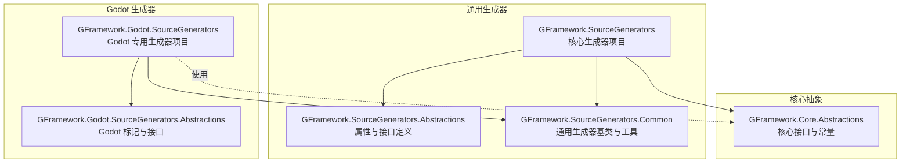
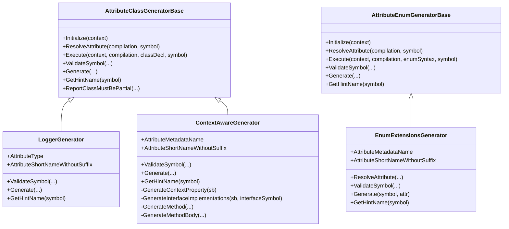
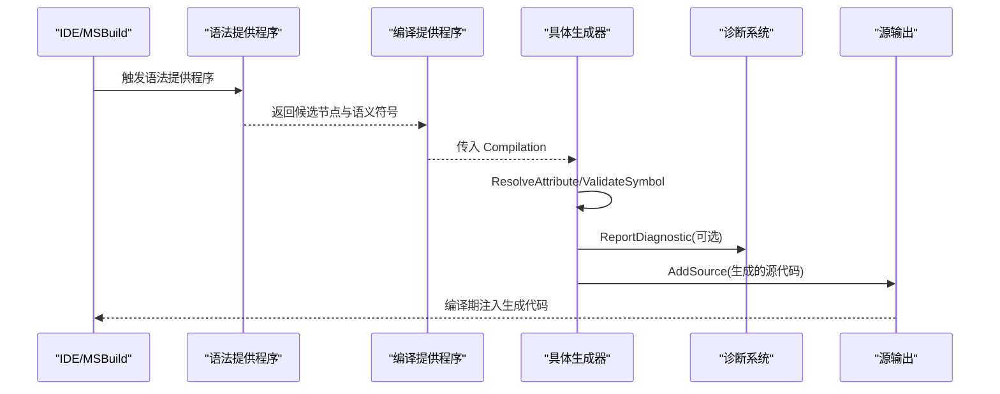
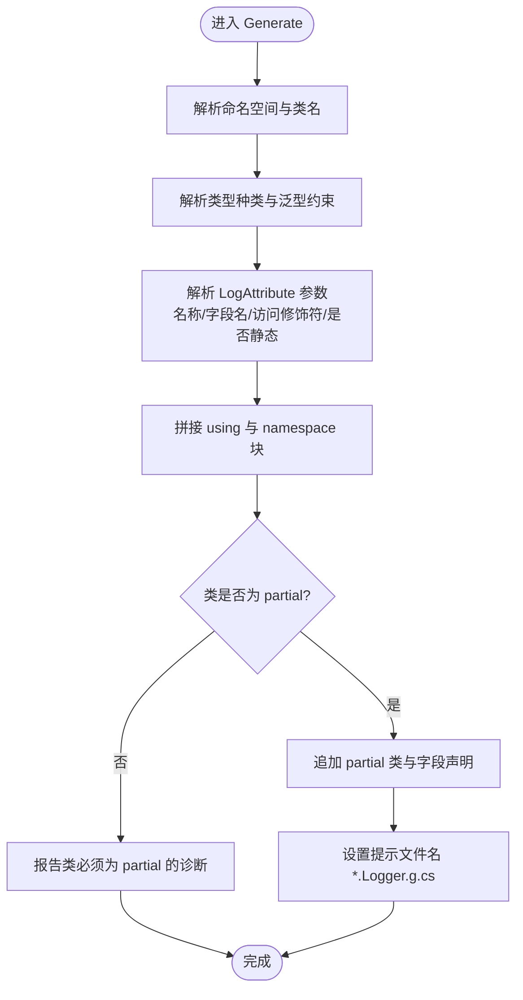
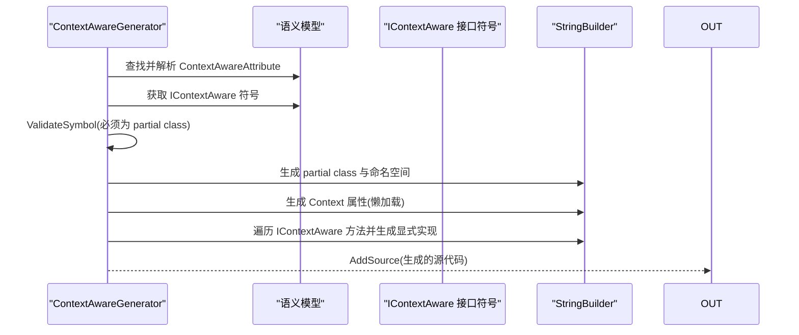
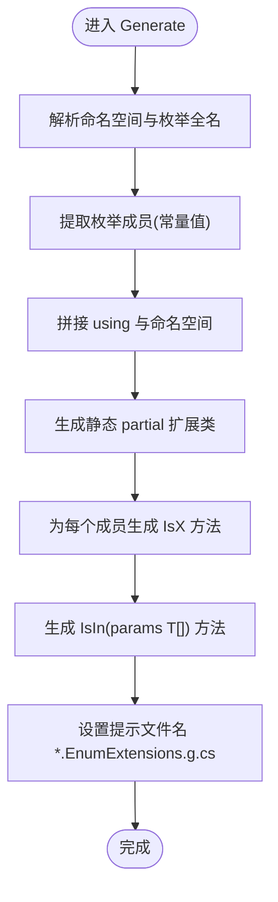
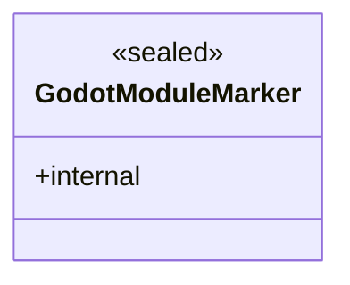
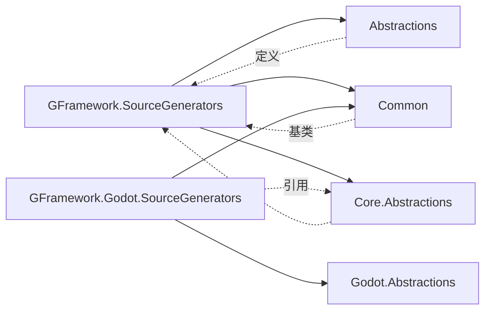

# 源代码生成器

<cite>
**本文档引用的文件**
- [GFramework.SourceGenerators.csproj](file://GFramework.SourceGenerators/GFramework.SourceGenerators.csproj)
- [GFramework.SourceGenerators.Abstractions.csproj](file://GFramework.SourceGenerators.Abstractions/GFramework.SourceGenerators.Abstractions.csproj)
- [GFramework.SourceGenerators.Common.csproj](file://GFramework.SourceGenerators.Common/GFramework.SourceGenerators.Common.csproj)
- [GFramework.Godot.SourceGenerators.csproj](file://GFramework.Godot.SourceGenerators/GFramework.Godot.SourceGenerators.csproj)
- [GFramework.Godot.SourceGenerators.Abstractions.csproj](file://GFramework.Godot.SourceGenerators.Abstractions/GFramework.Godot.SourceGenerators.Abstractions.csproj)
- [LoggerGenerator.cs](file://GFramework.SourceGenerators/logging/LoggerGenerator.cs)
- [ContextAwareGenerator.cs](file://GFramework.SourceGenerators/rule/ContextAwareGenerator.cs)
- [EnumExtensionsGenerator.cs](file://GFramework.SourceGenerators/enums/EnumExtensionsGenerator.cs)
- [LogAttribute.cs](file://GFramework.SourceGenerators.Abstractions/logging/LogAttribute.cs)
- [ContextAwareAttribute.cs](file://GFramework.SourceGenerators.Abstractions/rule/ContextAwareAttribute.cs)
- [GenerateEnumExtensionsAttribute.cs](file://GFramework.SourceGenerators.Abstractions/enums/GenerateEnumExtensionsAttribute.cs)
- [AttributeClassGeneratorBase.cs](file://GFramework.SourceGenerators.Common/generator/AttributeClassGeneratorBase.cs)
- [AttributeEnumGeneratorBase.cs](file://GFramework.SourceGenerators.Common/generator/AttributeEnumGeneratorBase.cs)
- [LoggerDiagnostic.cs](file://GFramework.SourceGenerators/diagnostics/LoggerDiagnostic.cs)
- [GodotModuleMarker.cs](file://GFramework.Godot.SourceGenerators.Abstractions/GodotModuleMarker.cs)
</cite>

## 目录
1. [简介](#简介)
2. [项目结构](#项目结构)
3. [核心组件](#核心组件)
4. [架构总览](#架构总览)
5. [详细组件分析](#详细组件分析)
6. [依赖关系分析](#依赖关系分析)
7. [性能考量](#性能考量)
8. [故障排除指南](#故障排除指南)
9. [结论](#结论)
10. [附录](#附录)

## 简介
本文件面向 GFramework 源代码生成器模块，系统化阐述通用与 Godot 特殊场景下的代码生成能力与实现原理。重点覆盖以下主题：
- 通用源代码生成器：LoggerGenerator 的日志字段自动生成、ContextAwareGenerator 的上下文感知接口实现、EnumExtensionsGenerator 的枚举扩展方法生成
- Godot 源代码生成器的特殊功能：GodotModuleMarker 的标记生成与 Godot 特定代码的自动生成
- 抽象层设计：生成器接口定义、通用工具类与诊断系统
- 工作流程：从属性标记到代码生成的完整过程
- 配置选项、使用方法与最佳实践
- 测试策略与验证方法
- 零运行时开销的设计目标
- 故障排除与常见问题

## 项目结构
GFramework 源代码生成器由多个子项目组成，分为“通用生成器”、“抽象层”、“公共工具”以及“Godot 专用生成器”。各项目职责清晰，遵循“只打包运行期依赖，不打包生成器本体”的原则，确保生成器在编译期工作、零运行时开销。

图表来源
- [GFramework.SourceGenerators.csproj](file://GFramework.SourceGenerators/GFramework.SourceGenerators.csproj#L1-L64)
- [GFramework.SourceGenerators.Abstractions.csproj](file://GFramework.SourceGenerators.Abstractions/GFramework.SourceGenerators.Abstractions.csproj#L1-L31)
- [GFramework.SourceGenerators.Common.csproj](file://GFramework.SourceGenerators.Common/GFramework.SourceGenerators.Common.csproj#L1-L39)
- [GFramework.Godot.SourceGenerators.csproj](file://GFramework.Godot.SourceGenerators/GFramework.Godot.SourceGenerators.csproj#L1-L71)
- [GFramework.Godot.SourceGenerators.Abstractions.csproj](file://GFramework.Godot.SourceGenerators.Abstractions/GFramework.Godot.SourceGenerators.Abstractions.csproj#L1-L32)

章节来源
- [GFramework.SourceGenerators.csproj](file://GFramework.SourceGenerators/GFramework.SourceGenerators.csproj#L1-L64)
- [GFramework.SourceGenerators.Abstractions.csproj](file://GFramework.SourceGenerators.Abstractions/GFramework.SourceGenerators.Abstractions.csproj#L1-L31)
- [GFramework.SourceGenerators.Common.csproj](file://GFramework.SourceGenerators.Common/GFramework.SourceGenerators.Common.csproj#L1-L39)
- [GFramework.Godot.SourceGenerators.csproj](file://GFramework.Godot.SourceGenerators/GFramework.Godot.SourceGenerators.csproj#L1-L71)
- [GFramework.Godot.SourceGenerators.Abstractions.csproj](file://GFramework.Godot.SourceGenerators.Abstractions/GFramework.Godot.SourceGenerators.Abstractions.csproj#L1-L32)

## 核心组件
本节概述三大通用生成器及其职责与交互方式：
- LoggerGenerator：为带 LogAttribute 的类自动生成日志字段
- ContextAwareGenerator：为带 ContextAwareAttribute 的类自动生成 IContextAware 接口实现
- EnumExtensionsGenerator：为带 GenerateEnumExtensionsAttribute 的枚举生成扩展方法

图表来源
- [AttributeClassGeneratorBase.cs](file://GFramework.SourceGenerators.Common/generator/AttributeClassGeneratorBase.cs#L1-L175)
- [AttributeEnumGeneratorBase.cs](file://GFramework.SourceGenerators.Common/generator/AttributeEnumGeneratorBase.cs#L1-L104)
- [LoggerGenerator.cs](file://GFramework.SourceGenerators/logging/LoggerGenerator.cs#L1-L103)
- [ContextAwareGenerator.cs](file://GFramework.SourceGenerators/rule/ContextAwareGenerator.cs#L1-L234)
- [EnumExtensionsGenerator.cs](file://GFramework.SourceGenerators/enums/EnumExtensionsGenerator.cs#L1-L114)

章节来源
- [AttributeClassGeneratorBase.cs](file://GFramework.SourceGenerators.Common/generator/AttributeClassGeneratorBase.cs#L1-L175)
- [AttributeEnumGeneratorBase.cs](file://GFramework.SourceGenerators.Common/generator/AttributeEnumGeneratorBase.cs#L1-L104)
- [LoggerGenerator.cs](file://GFramework.SourceGenerators/logging/LoggerGenerator.cs#L1-L103)
- [ContextAwareGenerator.cs](file://GFramework.SourceGenerators/rule/ContextAwareGenerator.cs#L1-L234)
- [EnumExtensionsGenerator.cs](file://GFramework.SourceGenerators/enums/EnumExtensionsGenerator.cs#L1-L114)

## 架构总览
生成器采用增量生成器模式，结合语法提供程序与语义模型，对候选节点进行筛选、验证与代码生成。整体流程如下：

图表来源
- [AttributeClassGeneratorBase.cs](file://GFramework.SourceGenerators.Common/generator/AttributeClassGeneratorBase.cs#L23-L48)
- [AttributeEnumGeneratorBase.cs](file://GFramework.SourceGenerators.Common/generator/AttributeEnumGeneratorBase.cs#L21-L57)

章节来源
- [AttributeClassGeneratorBase.cs](file://GFramework.SourceGenerators.Common/generator/AttributeClassGeneratorBase.cs#L23-L48)
- [AttributeEnumGeneratorBase.cs](file://GFramework.SourceGenerators.Common/generator/AttributeEnumGeneratorBase.cs#L21-L57)

## 详细组件分析

### LoggerGenerator（日志字段生成）
- 功能：为标记了 LogAttribute 的类自动生成日志字段，支持命名空间、泛型、静态/实例、访问修饰符等参数化控制
- 关键点：
  - 基于 AttributeClassGeneratorBase，通过 ResolveAttribute 解析属性元数据
  - 生成代码包含命名空间声明、partial 类、只读日志字段与工厂解析
  - 文件提示名形如 “ClassName.Logger.g.cs”
- 生成内容要点（不展示代码，仅说明结构）：
  - 使用核心抽象命名空间与核心日志接口
  - 生成只读日志字段，初始化时通过 LoggerFactoryResolver.Provider.CreateLogger(name)
  - 支持 static 与非 static 字段，支持 private/public 等访问修饰符

图表来源
- [LoggerGenerator.cs](file://GFramework.SourceGenerators/logging/LoggerGenerator.cs#L51-L103)
- [AttributeClassGeneratorBase.cs](file://GFramework.SourceGenerators.Common/generator/AttributeClassGeneratorBase.cs#L67-L113)

章节来源
- [LoggerGenerator.cs](file://GFramework.SourceGenerators/logging/LoggerGenerator.cs#L1-L103)
- [LogAttribute.cs](file://GFramework.SourceGenerators.Abstractions/logging/LogAttribute.cs#L1-L40)
- [AttributeClassGeneratorBase.cs](file://GFramework.SourceGenerators.Common/generator/AttributeClassGeneratorBase.cs#L67-L113)

### ContextAwareGenerator（上下文感知接口实现）
- 功能：为标记了 ContextAwareAttribute 的类自动生成 IContextAware 接口实现，包含 Context 属性与显式接口实现
- 关键点：
  - 基于 MetadataAttributeClassGeneratorBase，使用元数据名匹配特性
  - 强制要求类为 partial class；否则报告诊断
  - 生成 Context 属性（懒加载，首次使用时解析第一个架构上下文）
  - 遍历 IContextAware 接口方法，生成显式接口实现方法体
- 生成内容要点（不展示代码，仅说明结构）：
  - 生成 partial class 并显式实现 IContextAware
  - 生成 Context 属性与 SetContext/GetContext 的实现
  - 其他未支持方法抛出 NotImplementedException（void）

图表来源
- [ContextAwareGenerator.cs](file://GFramework.SourceGenerators/rule/ContextAwareGenerator.cs#L78-L112)
- [ContextAwareGenerator.cs](file://GFramework.SourceGenerators/rule/ContextAwareGenerator.cs#L131-L152)
- [ContextAwareGenerator.cs](file://GFramework.SourceGenerators/rule/ContextAwareGenerator.cs#L163-L178)
- [ContextAwareGenerator.cs](file://GFramework.SourceGenerators/rule/ContextAwareGenerator.cs#L186-L205)
- [ContextAwareGenerator.cs](file://GFramework.SourceGenerators/rule/ContextAwareGenerator.cs#L212-L233)

章节来源
- [ContextAwareGenerator.cs](file://GFramework.SourceGenerators/rule/ContextAwareGenerator.cs#L1-L234)
- [ContextAwareAttribute.cs](file://GFramework.SourceGenerators.Abstractions/rule/ContextAwareAttribute.cs#L1-L11)

### EnumExtensionsGenerator（枚举扩展方法生成）
- 功能：为标记了 GenerateEnumExtensionsAttribute 的枚举生成扩展方法，包括 IsX 与 IsIn
- 关键点：
  - 基于 AttributeEnumGeneratorBase，针对枚举声明进行筛选与生成
  - 仅对枚举类型有效；非枚举类型报告诊断
  - 生成 IsX 方法（每个枚举项一个），以及 IsIn(params T[]) 方法
  - 文件提示名形如 “EnumName.EnumExtensions.g.cs”
- 生成内容要点（不展示代码，仅说明结构）：
  - 生成静态 partial 扩展类
  - 为每个枚举成员生成 IsX 判断方法
  - 生成 IsIn 多值判断方法（空值安全）

图表来源
- [EnumExtensionsGenerator.cs](file://GFramework.SourceGenerators/enums/EnumExtensionsGenerator.cs#L57-L103)

章节来源
- [EnumExtensionsGenerator.cs](file://GFramework.SourceGenerators/enums/EnumExtensionsGenerator.cs#L1-L114)
- [GenerateEnumExtensionsAttribute.cs](file://GFramework.SourceGenerators.Abstractions/enums/GenerateEnumExtensionsAttribute.cs#L1-L20)

### Godot 源代码生成器（特殊功能）
- GodotModuleMarker：作为 Godot 模块命名空间的占位类型，用于标记与识别 Godot 相关生成逻辑
- Godot 专用生成器：在 Godot 项目中，结合 Godot 特定接口与约定，自动生成模块标记与相关代码

图表来源
- [GodotModuleMarker.cs](file://GFramework.Godot.SourceGenerators.Abstractions/GodotModuleMarker.cs#L1-L6)

章节来源
- [GodotModuleMarker.cs](file://GFramework.Godot.SourceGenerators.Abstractions/GodotModuleMarker.cs#L1-L6)

## 依赖关系分析
- 通用生成器依赖：
  - Abstractions：属性与接口定义（LogAttribute、ContextAwareAttribute、GenerateEnumExtensionsAttribute）
  - Common：生成器基类与通用工具（AttributeClassGeneratorBase、AttributeEnumGeneratorBase）
  - Core.Abstractions：核心接口与常量（用于生成代码中的类型引用）
- Godot 生成器依赖：
  - Godot.Abstractions：Godot 特定标记（如 GodotModuleMarker）
  - Common：复用通用生成器基类与工具
- 打包策略：
  - 生成器本体仅打包到 analyzers 下，不打包到 lib
  - 运行期依赖（Abstractions/Common）打包到 lib，供编译期引用

图表来源
- [GFramework.SourceGenerators.csproj](file://GFramework.SourceGenerators/GFramework.SourceGenerators.csproj#L29-L55)
- [GFramework.Godot.SourceGenerators.csproj](file://GFramework.Godot.SourceGenerators/GFramework.Godot.SourceGenerators.csproj#L29-L53)

章节来源
- [GFramework.SourceGenerators.csproj](file://GFramework.SourceGenerators/GFramework.SourceGenerators.csproj#L29-L55)
- [GFramework.Godot.SourceGenerators.csproj](file://GFramework.Godot.SourceGenerators/GFramework.Godot.SourceGenerators.csproj#L29-L53)

## 性能考量
- 零运行时开销：生成器仅在编译期工作，生成的代码在运行时直接执行，不引入额外运行时依赖
- 增量生成：使用 IIncrementalGenerator 与语法提供程序，仅对受影响的节点进行再生成
- 诊断与早失败：在 ValidateSymbol 阶段尽早报告无效标记或不兼容类型，避免无效生成
- 生成代码最小化：按需生成必要接口实现与字段，不生成冗余代码

## 故障排除指南
- 类必须为 partial：当类未声明为 partial 时，ContextAwareGenerator 会报告诊断；请将类声明为 partial
- 非枚举类型：EnumExtensionsGenerator 要求标记在枚举上；请确保目标类型为 enum
- LogAttribute 无效：若日志生成未生效，检查类是否为 partial、命名空间是否正确、属性参数是否合法
- 诊断信息：生成器在关键路径输出 Trace 诊断，便于定位问题

章节来源
- [AttributeClassGeneratorBase.cs](file://GFramework.SourceGenerators.Common/generator/AttributeClassGeneratorBase.cs#L90-L105)
- [EnumExtensionsGenerator.cs](file://GFramework.SourceGenerators/enums/EnumExtensionsGenerator.cs#L37-L49)
- [LoggerDiagnostic.cs](file://GFramework.SourceGenerators/diagnostics/LoggerDiagnostic.cs#L1-L21)

## 结论
GFramework 源代码生成器通过清晰的抽象层与通用基类，实现了三类高价值的编译期代码生成：日志字段、上下文感知接口与枚举扩展方法。Godot 专用生成器在此基础上提供了模块标记与特定约定支持。整体设计遵循零运行时开销原则，结合增量生成与严格诊断，确保生成质量与开发体验。

## 附录

### 使用方法与配置选项
- LoggerGenerator
  - 在类上添加 LogAttribute，可配置 Name、FieldName、AccessModifier、IsStatic 等参数
  - 生成结果：partial 类内包含只读日志字段，初始化自 LoggerFactoryResolver
- ContextAwareGenerator
  - 在类上添加 ContextAwareAttribute，类必须为 partial class
  - 生成结果：显式实现 IContextAware，包含 Context 属性与 SetContext/GetContext
- EnumExtensionsGenerator
  - 在枚举上添加 GenerateEnumExtensionsAttribute，可配置是否生成 IsX 与 IsIn 方法
  - 生成结果：静态 partial 扩展类，包含 IsX 与 IsIn 扩展方法

章节来源
- [LogAttribute.cs](file://GFramework.SourceGenerators.Abstractions/logging/LogAttribute.cs#L1-L40)
- [ContextAwareAttribute.cs](file://GFramework.SourceGenerators.Abstractions/rule/ContextAwareAttribute.cs#L1-L11)
- [GenerateEnumExtensionsAttribute.cs](file://GFramework.SourceGenerators.Abstractions/enums/GenerateEnumExtensionsAttribute.cs#L1-L20)

### 最佳实践
- 将生成器生成的 partial 类与手写部分分离，避免冲突
- 在 Godot 项目中，优先使用 Godot 专用生成器与标记类型
- 合理使用 IsStatic 与访问修饰符，确保日志字段可见性与性能需求平衡
- 对枚举扩展方法进行统一命名规范，保持 IsX 与 IsIn 的一致性

### 测试策略与验证方法
- 快照测试：对生成的源代码进行快照比对，确保生成结果稳定
- 单元测试：验证生成器在不同输入组合下的行为与诊断输出
- 集成测试：在真实项目中验证生成代码的编译与运行效果