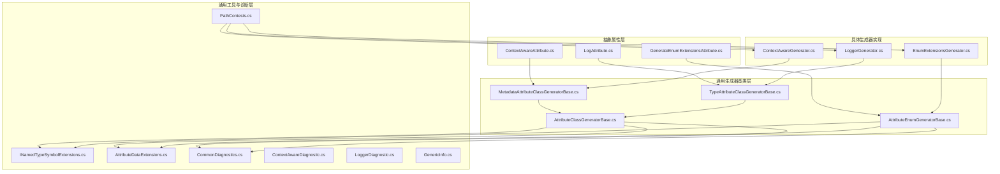
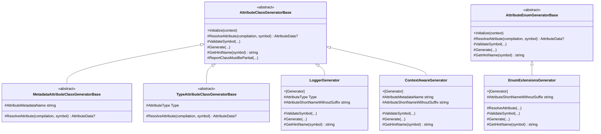
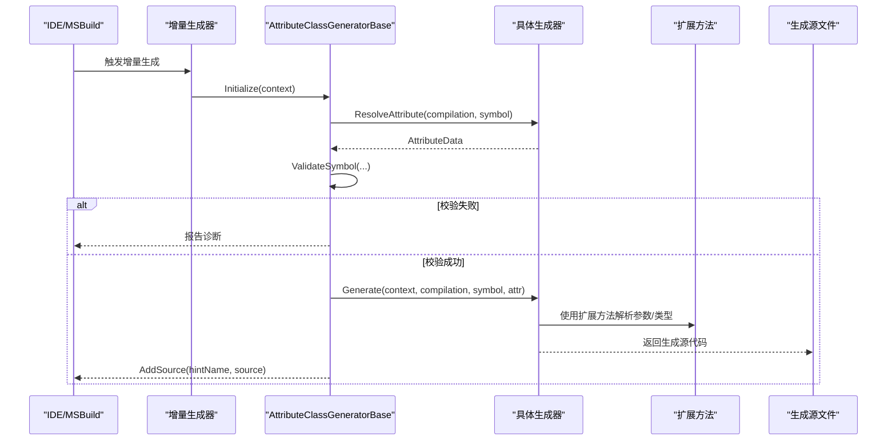
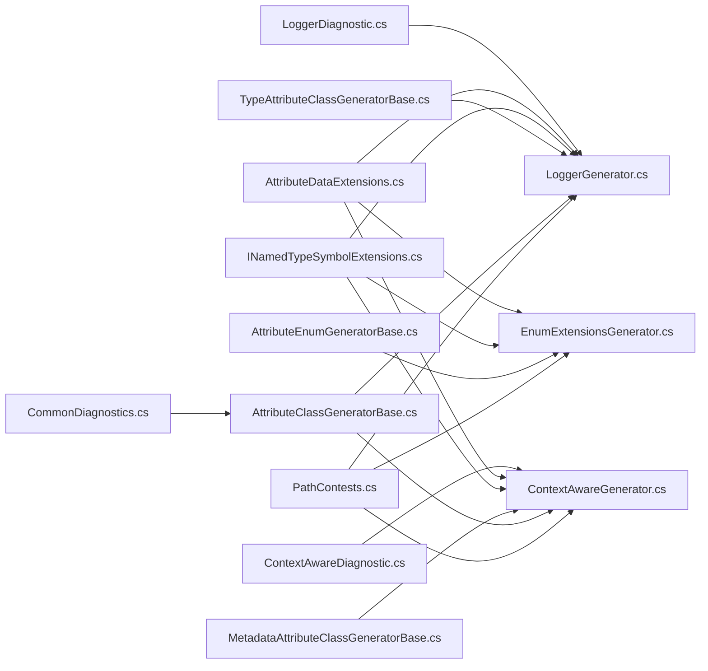

# 生成器抽象层

<cite>
**本文引用的文件**
- [GenerateEnumExtensionsAttribute.cs](file://GFramework.SourceGenerators.Abstractions/enums/GenerateEnumExtensionsAttribute.cs)
- [LogAttribute.cs](file://GFramework.SourceGenerators.Abstractions/logging/LogAttribute.cs)
- [ContextAwareAttribute.cs](file://GFramework.SourceGenerators.Abstractions/rule/ContextAwareAttribute.cs)
- [AttributeClassGeneratorBase.cs](file://GFramework.SourceGenerators.Common/generator/AttributeClassGeneratorBase.cs)
- [AttributeEnumGeneratorBase.cs](file://GFramework.SourceGenerators.Common/generator/AttributeEnumGeneratorBase.cs)
- [MetadataAttributeClassGeneratorBase.cs](file://GFramework.SourceGenerators.Common/generator/MetadataAttributeClassGeneratorBase.cs)
- [TypeAttributeClassGeneratorBase.cs](file://GFramework.SourceGenerators.Common/generator/TypeAttributeClassGeneratorBase.cs)
- [INamedTypeSymbolExtensions.cs](file://GFramework.SourceGenerators.Common/extensions/INamedTypeSymbolExtensions.cs)
- [AttributeDataExtensions.cs](file://GFramework.SourceGenerators.Common/extensions/AttributeDataExtensions.cs)
- [CommonDiagnostics.cs](file://GFramework.SourceGenerators.Common/diagnostics/CommonDiagnostics.cs)
- [ContextAwareDiagnostic.cs](file://GFramework.SourceGenerators/diagnostics/ContextAwareDiagnostic.cs)
- [LoggerDiagnostic.cs](file://GFramework.SourceGenerators/diagnostics/LoggerDiagnostic.cs)
- [EnumExtensionsGenerator.cs](file://GFramework.SourceGenerators/enums/EnumExtensionsGenerator.cs)
- [LoggerGenerator.cs](file://GFramework.SourceGenerators/logging/LoggerGenerator.cs)
- [ContextAwareGenerator.cs](file://GFramework.SourceGenerators/rule/ContextAwareGenerator.cs)
- [GenericInfo.cs](file://GFramework.SourceGenerators.Common/info/GenericInfo.cs)
- [PathContests.cs](file://GFramework.SourceGenerators.Common/constants/PathContests.cs)
</cite>

## 目录
1. [简介](#简介)
2. [项目结构](#项目结构)
3. [核心组件](#核心组件)
4. [架构总览](#架构总览)
5. [详细组件分析](#详细组件分析)
6. [依赖分析](#依赖分析)
7. [性能考虑](#性能考虑)
8. [故障排查指南](#故障排查指南)
9. [结论](#结论)
10. [附录](#附录)

## 简介
本文件面向“生成器抽象层”的设计与实现，系统化阐述其设计理念、架构模式与扩展方式。抽象层通过统一的增量生成器基类、属性解析策略与通用工具类，屏蔽不同生成器之间的重复逻辑，降低维护成本并提升可复用性。同时，文档详细解释以下关键要素：
- 属性定义：LogAttribute、ContextAwareAttribute、GenerateEnumExtensionsAttribute 的用途与行为
- 基类体系：AttributeClassGeneratorBase、AttributeEnumGeneratorBase、MetadataAttributeClassGeneratorBase、TypeAttributeClassGeneratorBase 的职责与继承关系
- 工具类组织：INamedTypeSymbolExtensions、AttributeDataExtensions 的扩展能力
- 诊断与错误处理：通用诊断与各生成器专用诊断
- 扩展指南：如何基于抽象层开发自定义生成器

## 项目结构
生成器抽象层位于独立的 NuGet 包中，主要由三部分组成：
- 抽象属性层：定义可被生成器识别的标注属性
- 通用生成器基类层：提供增量生成器的通用流程与校验
- 通用工具与诊断层：提供符号与特性解析的扩展方法以及诊断描述符

图表来源
- [LogAttribute.cs](file://GFramework.SourceGenerators.Abstractions/logging/LogAttribute.cs#L1-L40)
- [ContextAwareAttribute.cs](file://GFramework.SourceGenerators.Abstractions/rule/ContextAwareAttribute.cs#L1-L11)
- [GenerateEnumExtensionsAttribute.cs](file://GFramework.SourceGenerators.Abstractions/enums/GenerateEnumExtensionsAttribute.cs#L1-L20)
- [AttributeClassGeneratorBase.cs](file://GFramework.SourceGenerators.Common/generator/AttributeClassGeneratorBase.cs#L1-L175)
- [AttributeEnumGeneratorBase.cs](file://GFramework.SourceGenerators.Common/generator/AttributeEnumGeneratorBase.cs#L1-L104)
- [MetadataAttributeClassGeneratorBase.cs](file://GFramework.SourceGenerators.Common/generator/MetadataAttributeClassGeneratorBase.cs#L1-L41)
- [TypeAttributeClassGeneratorBase.cs](file://GFramework.SourceGenerators.Common/generator/TypeAttributeClassGeneratorBase.cs#L1-L35)
- [INamedTypeSymbolExtensions.cs](file://GFramework.SourceGenerators.Common/extensions/INamedTypeSymbolExtensions.cs#L1-L108)
- [AttributeDataExtensions.cs](file://GFramework.SourceGenerators.Common/extensions/AttributeDataExtensions.cs#L1-L47)
- [CommonDiagnostics.cs](file://GFramework.SourceGenerators.Common/diagnostics/CommonDiagnostics.cs#L1-L60)
- [ContextAwareDiagnostic.cs](file://GFramework.SourceGenerators/diagnostics/ContextAwareDiagnostic.cs#L1-L21)
- [LoggerDiagnostic.cs](file://GFramework.SourceGenerators/diagnostics/LoggerDiagnostic.cs#L1-L21)
- [GenericInfo.cs](file://GFramework.SourceGenerators.Common/info/GenericInfo.cs#L1-L13)
- [PathContests.cs](file://GFramework.SourceGenerators.Common/constants/PathContests.cs#L1-L42)
- [LoggerGenerator.cs](file://GFramework.SourceGenerators/logging/LoggerGenerator.cs#L1-L103)
- [ContextAwareGenerator.cs](file://GFramework.SourceGenerators/rule/ContextAwareGenerator.cs#L1-L234)
- [EnumExtensionsGenerator.cs](file://GFramework.SourceGenerators/enums/EnumExtensionsGenerator.cs#L1-L114)

章节来源
- [LogAttribute.cs](file://GFramework.SourceGenerators.Abstractions/logging/LogAttribute.cs#L1-L40)
- [ContextAwareAttribute.cs](file://GFramework.SourceGenerators.Abstractions/rule/ContextAwareAttribute.cs#L1-L11)
- [GenerateEnumExtensionsAttribute.cs](file://GFramework.SourceGenerators.Abstractions/enums/GenerateEnumExtensionsAttribute.cs#L1-L20)
- [AttributeClassGeneratorBase.cs](file://GFramework.SourceGenerators.Common/generator/AttributeClassGeneratorBase.cs#L1-L175)
- [AttributeEnumGeneratorBase.cs](file://GFramework.SourceGenerators.Common/generator/AttributeEnumGeneratorBase.cs#L1-L104)
- [MetadataAttributeClassGeneratorBase.cs](file://GFramework.SourceGenerators.Common/generator/MetadataAttributeClassGeneratorBase.cs#L1-L41)
- [TypeAttributeClassGeneratorBase.cs](file://GFramework.SourceGenerators.Common/generator/TypeAttributeClassGeneratorBase.cs#L1-L35)
- [INamedTypeSymbolExtensions.cs](file://GFramework.SourceGenerators.Common/extensions/INamedTypeSymbolExtensions.cs#L1-L108)
- [AttributeDataExtensions.cs](file://GFramework.SourceGenerators.Common/extensions/AttributeDataExtensions.cs#L1-L47)
- [CommonDiagnostics.cs](file://GFramework.SourceGenerators.Common/diagnostics/CommonDiagnostics.cs#L1-L60)
- [ContextAwareDiagnostic.cs](file://GFramework.SourceGenerators/diagnostics/ContextAwareDiagnostic.cs#L1-L21)
- [LoggerDiagnostic.cs](file://GFramework.SourceGenerators/diagnostics/LoggerDiagnostic.cs#L1-L21)
- [GenericInfo.cs](file://GFramework.SourceGenerators.Common/info/GenericInfo.cs#L1-L13)
- [PathContests.cs](file://GFramework.SourceGenerators.Common/constants/PathContests.cs#L1-L42)
- [LoggerGenerator.cs](file://GFramework.SourceGenerators/logging/LoggerGenerator.cs#L1-L103)
- [ContextAwareGenerator.cs](file://GFramework.SourceGenerators/rule/ContextAwareGenerator.cs#L1-L234)
- [EnumExtensionsGenerator.cs](file://GFramework.SourceGenerators/enums/EnumExtensionsGenerator.cs#L1-L114)

## 核心组件
- 抽象属性层
  - LogAttribute：为带标注的类生成日志记录器字段，支持命名、静态、访问修饰符等配置
  - ContextAwareAttribute：标记类需自动实现 IContextAware 接口
  - GenerateEnumExtensionsAttribute：为枚举生成扩展方法（IsX 与 IsIn）
- 通用生成器基类层
  - AttributeClassGeneratorBase：面向“类+属性”的增量生成器基类，负责候选收集、属性解析、类校验、生成与输出
  - AttributeEnumGeneratorBase：面向“枚举+属性”的增量生成器基类，负责候选收集、属性解析、符号校验、生成与输出
  - MetadataAttributeClassGeneratorBase：基于特性元数据名称解析属性
  - TypeAttributeClassGeneratorBase：基于特性类型全名解析属性
- 通用工具与诊断层
  - INamedTypeSymbolExtensions：类型解析（类型种类、泛型参数与约束、完整类名、命名空间）
  - AttributeDataExtensions：特性参数读取（命名参数、构造函数首个字符串参数）
  - CommonDiagnostics：通用诊断描述符与跟踪输出
  - 各生成器专用诊断：ContextAwareDiagnostic、LoggerDiagnostic
- 具体生成器实现
  - LoggerGenerator：基于 LogAttribute 自动生成日志字段
  - ContextAwareGenerator：基于 ContextAwareAttribute 自动生成 IContextAware 实现
  - EnumExtensionsGenerator：基于 GenerateEnumExtensionsAttribute 生成枚举扩展方法

章节来源
- [LogAttribute.cs](file://GFramework.SourceGenerators.Abstractions/logging/LogAttribute.cs#L1-L40)
- [ContextAwareAttribute.cs](file://GFramework.SourceGenerators.Abstractions/rule/ContextAwareAttribute.cs#L1-L11)
- [GenerateEnumExtensionsAttribute.cs](file://GFramework.SourceGenerators.Abstractions/enums/GenerateEnumExtensionsAttribute.cs#L1-L20)
- [AttributeClassGeneratorBase.cs](file://GFramework.SourceGenerators.Common/generator/AttributeClassGeneratorBase.cs#L1-L175)
- [AttributeEnumGeneratorBase.cs](file://GFramework.SourceGenerators.Common/generator/AttributeEnumGeneratorBase.cs#L1-L104)
- [MetadataAttributeClassGeneratorBase.cs](file://GFramework.SourceGenerators.Common/generator/MetadataAttributeClassGeneratorBase.cs#L1-L41)
- [TypeAttributeClassGeneratorBase.cs](file://GFramework.SourceGenerators.Common/generator/TypeAttributeClassGeneratorBase.cs#L1-L35)
- [INamedTypeSymbolExtensions.cs](file://GFramework.SourceGenerators.Common/extensions/INamedTypeSymbolExtensions.cs#L1-L108)
- [AttributeDataExtensions.cs](file://GFramework.SourceGenerators.Common/extensions/AttributeDataExtensions.cs#L1-L47)
- [CommonDiagnostics.cs](file://GFramework.SourceGenerators.Common/diagnostics/CommonDiagnostics.cs#L1-L60)
- [ContextAwareDiagnostic.cs](file://GFramework.SourceGenerators/diagnostics/ContextAwareDiagnostic.cs#L1-L21)
- [LoggerDiagnostic.cs](file://GFramework.SourceGenerators/diagnostics/LoggerDiagnostic.cs#L1-L21)
- [LoggerGenerator.cs](file://GFramework.SourceGenerators/logging/LoggerGenerator.cs#L1-L103)
- [ContextAwareGenerator.cs](file://GFramework.SourceGenerators/rule/ContextAwareGenerator.cs#L1-L234)
- [EnumExtensionsGenerator.cs](file://GFramework.SourceGenerators/enums/EnumExtensionsGenerator.cs#L1-L114)

## 架构总览
抽象层采用“基类 + 扩展方法 + 诊断系统”的组合架构，通过 IIncrementalGenerator 的统一入口，将不同生成器的差异化逻辑下沉至子类，从而实现高内聚、低耦合与强复用。

图表来源
- [AttributeClassGeneratorBase.cs](file://GFramework.SourceGenerators.Common/generator/AttributeClassGeneratorBase.cs#L1-L175)
- [AttributeEnumGeneratorBase.cs](file://GFramework.SourceGenerators.Common/generator/AttributeEnumGeneratorBase.cs#L1-L104)
- [MetadataAttributeClassGeneratorBase.cs](file://GFramework.SourceGenerators.Common/generator/MetadataAttributeClassGeneratorBase.cs#L1-L41)
- [TypeAttributeClassGeneratorBase.cs](file://GFramework.SourceGenerators.Common/generator/TypeAttributeClassGeneratorBase.cs#L1-L35)
- [LoggerGenerator.cs](file://GFramework.SourceGenerators/logging/LoggerGenerator.cs#L1-L103)
- [ContextAwareGenerator.cs](file://GFramework.SourceGenerators/rule/ContextAwareGenerator.cs#L1-L234)
- [EnumExtensionsGenerator.cs](file://GFramework.SourceGenerators/enums/EnumExtensionsGenerator.cs#L1-L114)

## 详细组件分析

### 抽象属性定义与作用
- LogAttribute
  - 作用：为类生成日志记录器字段，支持命名、静态、访问修饰符等配置
  - 关键属性：Name、FieldName、IsStatic、AccessModifier
- ContextAwareAttribute
  - 作用：标记类需自动实现 IContextAware 接口
- GenerateEnumExtensionsAttribute
  - 作用：为枚举生成扩展方法，支持 IsX 与 IsIn 两种生成选项

章节来源
- [LogAttribute.cs](file://GFramework.SourceGenerators.Abstractions/logging/LogAttribute.cs#L1-L40)
- [ContextAwareAttribute.cs](file://GFramework.SourceGenerators.Abstractions/rule/ContextAwareAttribute.cs#L1-L11)
- [GenerateEnumExtensionsAttribute.cs](file://GFramework.SourceGenerators.Abstractions/enums/GenerateEnumExtensionsAttribute.cs#L1-L20)

### 基类功能与继承关系
- AttributeClassGeneratorBase
  - 负责：候选类收集、属性解析、类校验（如 partial）、生成与输出
  - 关键抽象：ResolveAttribute、ValidateSymbol、Generate、GetHintName
- AttributeEnumGeneratorBase
  - 负责：候选枚举收集、属性解析、符号校验、生成与输出
  - 关键抽象：ResolveAttribute、ValidateSymbol、Generate、GetHintName
- MetadataAttributeClassGeneratorBase
  - 基于特性元数据名称解析属性，便于跨包引用
- TypeAttributeClassGeneratorBase
  - 基于特性类型全名解析属性，适用于本地特性

章节来源
- [AttributeClassGeneratorBase.cs](file://GFramework.SourceGenerators.Common/generator/AttributeClassGeneratorBase.cs#L1-L175)
- [AttributeEnumGeneratorBase.cs](file://GFramework.SourceGenerators.Common/generator/AttributeEnumGeneratorBase.cs#L1-L104)
- [MetadataAttributeClassGeneratorBase.cs](file://GFramework.SourceGenerators.Common/generator/MetadataAttributeClassGeneratorBase.cs#L1-L41)
- [TypeAttributeClassGeneratorBase.cs](file://GFramework.SourceGenerators.Common/generator/TypeAttributeClassGeneratorBase.cs#L1-L35)

### 通用工具类
- INamedTypeSymbolExtensions
  - 类型种类解析：根据 TypeKind 返回 "class"/"struct"/"record"
  - 泛型解析：提取泛型参数与约束，返回 GenericInfo
  - 名称解析：GetFullClassName、GetNamespace
- AttributeDataExtensions
  - GetNamedArgument：按名称读取特性命名参数，支持默认值
  - GetFirstCtorString：读取特性构造函数首个参数（字符串）

章节来源
- [INamedTypeSymbolExtensions.cs](file://GFramework.SourceGenerators.Common/extensions/INamedTypeSymbolExtensions.cs#L1-L108)
- [AttributeDataExtensions.cs](file://GFramework.SourceGenerators.Common/extensions/AttributeDataExtensions.cs#L1-L47)
- [GenericInfo.cs](file://GFramework.SourceGenerators.Common/info/GenericInfo.cs#L1-L13)

### 诊断系统与错误处理
- CommonDiagnostics
  - ClassMustBePartial：类必须为 partial 的错误
  - GeneratorTrace：生成器跟踪信息
- ContextAwareDiagnostic
  - ContextAwareOnlyForClass：ContextAwareAttribute 仅能用于类
- LoggerDiagnostic
  - LogAttributeInvalid：LogAttribute 无效的警告

章节来源
- [CommonDiagnostics.cs](file://GFramework.SourceGenerators.Common/diagnostics/CommonDiagnostics.cs#L1-L60)
- [ContextAwareDiagnostic.cs](file://GFramework.SourceGenerators/diagnostics/ContextAwareDiagnostic.cs#L1-L21)
- [LoggerDiagnostic.cs](file://GFramework.SourceGenerators/diagnostics/LoggerDiagnostic.cs#L1-L21)

### 具体生成器工作流
- LoggerGenerator
  - 使用 TypeAttributeClassGeneratorBase，基于 LogAttribute 生成日志字段
  - 通过 INamedTypeSymbolExtensions 与 AttributeDataExtensions 完成类型与参数解析
- ContextAwareGenerator
  - 使用 MetadataAttributeClassGeneratorBase，基于 ContextAwareAttribute 元数据生成 IContextAware 实现
  - 通过编译期接口符号生成显式接口实现
- EnumExtensionsGenerator
  - 使用 AttributeEnumGeneratorBase，基于 GenerateEnumExtensionsAttribute 生成枚举扩展方法

图表来源
- [AttributeClassGeneratorBase.cs](file://GFramework.SourceGenerators.Common/generator/AttributeClassGeneratorBase.cs#L1-L175)
- [LoggerGenerator.cs](file://GFramework.SourceGenerators/logging/LoggerGenerator.cs#L1-L103)
- [ContextAwareGenerator.cs](file://GFramework.SourceGenerators/rule/ContextAwareGenerator.cs#L1-L234)
- [EnumExtensionsGenerator.cs](file://GFramework.SourceGenerators/enums/EnumExtensionsGenerator.cs#L1-L114)
- [INamedTypeSymbolExtensions.cs](file://GFramework.SourceGenerators.Common/extensions/INamedTypeSymbolExtensions.cs#L1-L108)
- [AttributeDataExtensions.cs](file://GFramework.SourceGenerators.Common/extensions/AttributeDataExtensions.cs#L1-L47)

## 依赖分析
- 命名空间与路径常量
  - PathContests 统一管理 GFramework 基础命名空间、核心抽象层命名空间与源码生成器抽象层命名空间
- 生成器与基类的依赖
  - 具体生成器均继承自通用基类，复用候选收集、属性解析与输出流程
- 诊断与工具的依赖
  - 通用基类依赖 CommonDiagnostics；具体生成器可叠加专用诊断
  - 生成器广泛使用 INamedTypeSymbolExtensions 与 AttributeDataExtensions

图表来源
- [PathContests.cs](file://GFramework.SourceGenerators.Common/constants/PathContests.cs#L1-L42)
- [AttributeClassGeneratorBase.cs](file://GFramework.SourceGenerators.Common/generator/AttributeClassGeneratorBase.cs#L1-L175)
- [AttributeEnumGeneratorBase.cs](file://GFramework.SourceGenerators.Common/generator/AttributeEnumGeneratorBase.cs#L1-L104)
- [MetadataAttributeClassGeneratorBase.cs](file://GFramework.SourceGenerators.Common/generator/MetadataAttributeClassGeneratorBase.cs#L1-L41)
- [TypeAttributeClassGeneratorBase.cs](file://GFramework.SourceGenerators.Common/generator/TypeAttributeClassGeneratorBase.cs#L1-L35)
- [INamedTypeSymbolExtensions.cs](file://GFramework.SourceGenerators.Common/extensions/INamedTypeSymbolExtensions.cs#L1-L108)
- [AttributeDataExtensions.cs](file://GFramework.SourceGenerators.Common/extensions/AttributeDataExtensions.cs#L1-L47)
- [CommonDiagnostics.cs](file://GFramework.SourceGenerators.Common/diagnostics/CommonDiagnostics.cs#L1-L60)
- [ContextAwareDiagnostic.cs](file://GFramework.SourceGenerators/diagnostics/ContextAwareDiagnostic.cs#L1-L21)
- [LoggerDiagnostic.cs](file://GFramework.SourceGenerators/diagnostics/LoggerDiagnostic.cs#L1-L21)
- [LoggerGenerator.cs](file://GFramework.SourceGenerators/logging/LoggerGenerator.cs#L1-L103)
- [ContextAwareGenerator.cs](file://GFramework.SourceGenerators/rule/ContextAwareGenerator.cs#L1-L234)
- [EnumExtensionsGenerator.cs](file://GFramework.SourceGenerators/enums/EnumExtensionsGenerator.cs#L1-L114)

章节来源
- [PathContests.cs](file://GFramework.SourceGenerators.Common/constants/PathContests.cs#L1-L42)
- [AttributeClassGeneratorBase.cs](file://GFramework.SourceGenerators.Common/generator/AttributeClassGeneratorBase.cs#L1-L175)
- [AttributeEnumGeneratorBase.cs](file://GFramework.SourceGenerators.Common/generator/AttributeEnumGeneratorBase.cs#L1-L104)
- [MetadataAttributeClassGeneratorBase.cs](file://GFramework.SourceGenerators.Common/generator/MetadataAttributeClassGeneratorBase.cs#L1-L41)
- [TypeAttributeClassGeneratorBase.cs](file://GFramework.SourceGenerators.Common/generator/TypeAttributeClassGeneratorBase.cs#L1-L35)
- [INamedTypeSymbolExtensions.cs](file://GFramework.SourceGenerators.Common/extensions/INamedTypeSymbolExtensions.cs#L1-L108)
- [AttributeDataExtensions.cs](file://GFramework.SourceGenerators.Common/extensions/AttributeDataExtensions.cs#L1-L47)
- [CommonDiagnostics.cs](file://GFramework.SourceGenerators.Common/diagnostics/CommonDiagnostics.cs#L1-L60)
- [ContextAwareDiagnostic.cs](file://GFramework.SourceGenerators/diagnostics/ContextAwareDiagnostic.cs#L1-L21)
- [LoggerDiagnostic.cs](file://GFramework.SourceGenerators/diagnostics/LoggerDiagnostic.cs#L1-L21)
- [LoggerGenerator.cs](file://GFramework.SourceGenerators/logging/LoggerGenerator.cs#L1-L103)
- [ContextAwareGenerator.cs](file://GFramework.SourceGenerators/rule/ContextAwareGenerator.cs#L1-L234)
- [EnumExtensionsGenerator.cs](file://GFramework.SourceGenerators/enums/EnumExtensionsGenerator.cs#L1-L114)

## 性能考虑
- 增量生成：基类通过 IncrementalGeneratorInitializationContext 与 Combine/CombineLatest 实现增量输入，避免全量扫描
- 早期短路：在 ResolveAttribute 失败、ValidateSymbol 失败时尽早返回，减少不必要的生成开销
- 语法筛选：先用简单的 Name.Contains 快速过滤候选，再做语义解析，降低 Roslyn 解析压力
- 生成内容最小化：仅生成必要代码与注释，避免冗余空行与无意义片段

## 故障排查指南
- 类必须为 partial
  - 现象：编译报错“Class 'X' must be declared partial for code generation”
  - 处理：将目标类声明为 partial
- ContextAwareAttribute 仅能用于类
  - 现象：编译报错“ContextAwareAttribute can only be applied to class 'X'”
  - 处理：确保标注在 class 上
- LogAttribute 无效
  - 现象：编译警告“LogAttribute on class 'X' is ineffective: ...”
  - 处理：检查特性参数与类可见性，确认生成器可用性
- 生成器跟踪
  - 使用 CommonDiagnostics.Trace 输出生成器内部流程信息，辅助定位问题

章节来源
- [CommonDiagnostics.cs](file://GFramework.SourceGenerators.Common/diagnostics/CommonDiagnostics.cs#L1-L60)
- [ContextAwareDiagnostic.cs](file://GFramework.SourceGenerators/diagnostics/ContextAwareDiagnostic.cs#L1-L21)
- [LoggerDiagnostic.cs](file://GFramework.SourceGenerators/diagnostics/LoggerDiagnostic.cs#L1-L21)
- [AttributeClassGeneratorBase.cs](file://GFramework.SourceGenerators.Common/generator/AttributeClassGeneratorBase.cs#L1-L175)

## 结论
生成器抽象层通过“基类 + 扩展方法 + 诊断系统”的组合，实现了对不同生成场景的统一抽象与高效复用。它将通用流程（候选收集、属性解析、校验、生成、输出）下沉至基类，将差异化逻辑（属性解析策略、生成模板）下沉至子类，既保证了可维护性，也降低了学习与扩展成本。借助 INamedTypeSymbolExtensions 与 AttributeDataExtensions，生成器能够稳定地解析复杂类型与特性参数；借助诊断系统，开发者可以快速定位问题并优化生成行为。

## 附录

### 扩展指南：开发自定义生成器
- 选择基类
  - 若特性来自外部包或需跨包引用：继承 MetadataAttributeClassGeneratorBase，并提供 AttributeMetadataName
  - 若特性来自本地项目：继承 TypeAttributeClassGeneratorBase，并提供 AttributeType
  - 若处理枚举：继承 AttributeEnumGeneratorBase
- 实现抽象方法
  - ResolveAttribute：解析目标特性数据
  - ValidateSymbol：执行必要的符号与上下文校验
  - Generate：生成源代码字符串
  - GetHintName：自定义生成文件名
- 使用工具与诊断
  - 使用 INamedTypeSymbolExtensions 与 AttributeDataExtensions 简化类型与参数解析
  - 使用 CommonDiagnostics 输出跟踪信息，必要时叠加专用诊断
- 路径常量
  - 使用 PathContests 中的命名空间常量，确保生成代码引用正确

章节来源
- [MetadataAttributeClassGeneratorBase.cs](file://GFramework.SourceGenerators.Common/generator/MetadataAttributeClassGeneratorBase.cs#L1-L41)
- [TypeAttributeClassGeneratorBase.cs](file://GFramework.SourceGenerators.Common/generator/TypeAttributeClassGeneratorBase.cs#L1-L35)
- [AttributeEnumGeneratorBase.cs](file://GFramework.SourceGenerators.Common/generator/AttributeEnumGeneratorBase.cs#L1-L104)
- [INamedTypeSymbolExtensions.cs](file://GFramework.SourceGenerators.Common/extensions/INamedTypeSymbolExtensions.cs#L1-L108)
- [AttributeDataExtensions.cs](file://GFramework.SourceGenerators.Common/extensions/AttributeDataExtensions.cs#L1-L47)
- [CommonDiagnostics.cs](file://GFramework.SourceGenerators.Common/diagnostics/CommonDiagnostics.cs#L1-L60)
- [PathContests.cs](file://GFramework.SourceGenerators.Common/constants/PathContests.cs#L1-L42)