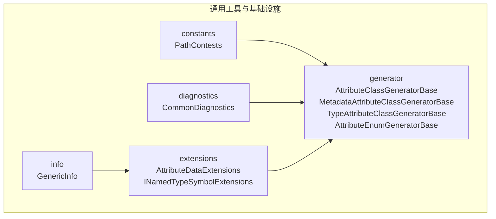
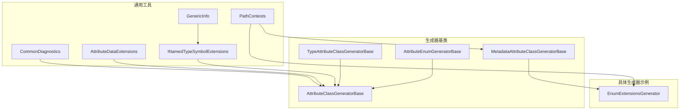
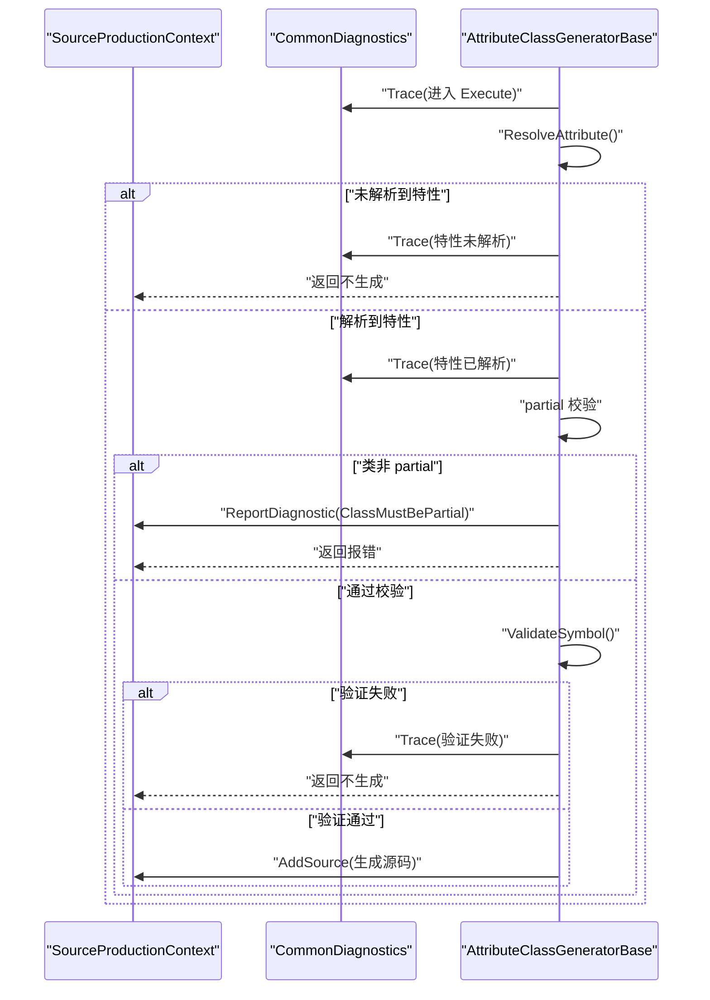
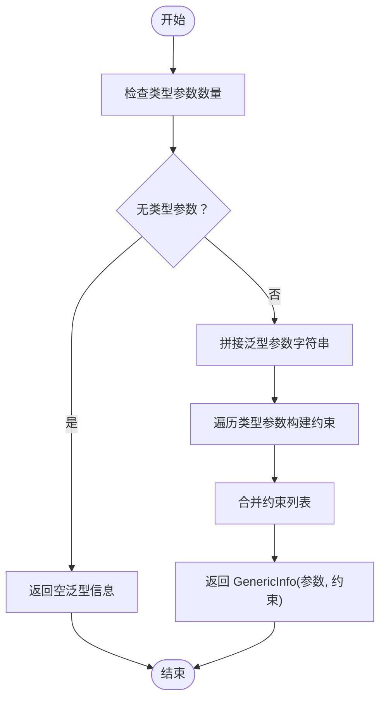
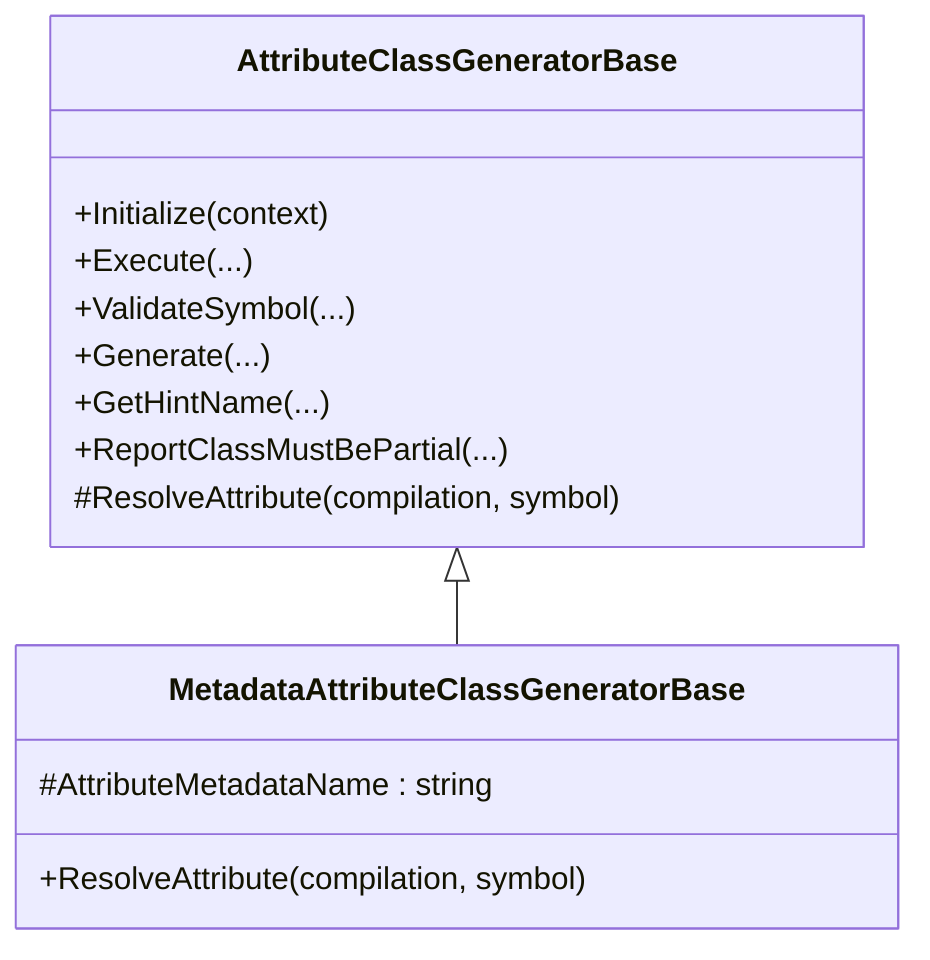
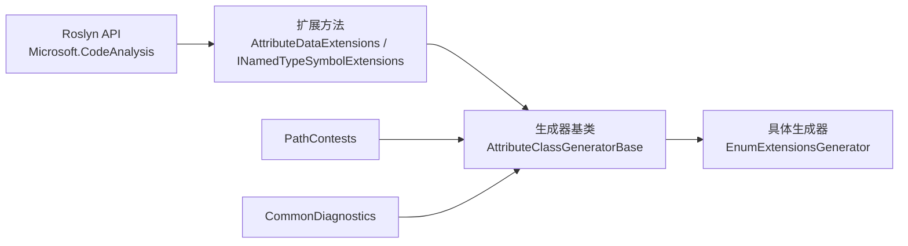

# 通用工具和基础设施

<cite>
**本文引用的文件**
- [PathContests.cs](file://GFramework.SourceGenerators.Common/constants/PathContests.cs)
- [CommonDiagnostics.cs](file://GFramework.SourceGenerators.Common/diagnostics/CommonDiagnostics.cs)
- [AttributeDataExtensions.cs](file://GFramework.SourceGenerators.Common/extensions/AttributeDataExtensions.cs)
- [INamedTypeSymbolExtensions.cs](file://GFramework.SourceGenerators.Common/extensions/INamedTypeSymbolExtensions.cs)
- [GenericInfo.cs](file://GFramework.SourceGenerators.Common/info/GenericInfo.cs)
- [AttributeClassGeneratorBase.cs](file://GFramework.SourceGenerators.Common/generator/AttributeClassGeneratorBase.cs)
- [MetadataAttributeClassGeneratorBase.cs](file://GFramework.SourceGenerators.Common/generator/MetadataAttributeClassGeneratorBase.cs)
- [TypeAttributeClassGeneratorBase.cs](file://GFramework.SourceGenerators.Common/generator/TypeAttributeClassGeneratorBase.cs)
- [AttributeEnumGeneratorBase.cs](file://GFramework.SourceGenerators.Common/generator/AttributeEnumGeneratorBase.cs)
- [GeWuYou.GFramework.SourceGenerators.targets](file://GFramework.SourceGenerators/GeWuYou.GFramework.SourceGenerators.targets)
- [Directory.Build.props](file://GFramework.SourceGenerators.Abstractions/Directory.Build.props)
- [GeneratorSnapshotTest.cs](file://GFramework.SourceGenerators.Tests/core/GeneratorSnapshotTest.cs)
- [GeneratorTest.cs](file://GFramework.SourceGenerators.Tests/core/GeneratorTest.cs)
- [EnumExtensionsGenerator.cs](file://GFramework.SourceGenerators/enums/EnumExtensionsGenerator.cs)
- [ContextAwareDiagnostic.cs](file://GFramework.SourceGenerators/diagnostics/ContextAwareDiagnostic.cs)
- [LoggerDiagnostic.cs](file://GFramework.SourceGenerators/diagnostics/LoggerDiagnostic.cs)
</cite>

## 目录
1. [简介](#简介)
2. [项目结构](#项目结构)
3. [核心组件](#核心组件)
4. [架构总览](#架构总览)
5. [详细组件分析](#详细组件分析)
6. [依赖分析](#依赖分析)
7. [性能考虑](#性能考虑)
8. [故障排查指南](#故障排查指南)
9. [结论](#结论)
10. [附录](#附录)

## 简介
本文件面向源代码生成器的通用工具与基础设施，系统性阐述以下主题：
- PathContests 常量定义与路径处理工具的使用方法
- CommonDiagnostics 的通用诊断功能（错误检测、警告生成、诊断信息格式化）
- AttributeDataExtensions 与 INamedTypeSymbolExtensions 扩展方法的功能与应用场景
- GenericInfo 的信息收集与处理机制（泛型类型的元数据提取与处理）
- MetadataAttributeClassGeneratorBase 的元数据生成逻辑与继承关系
- 通用工具类的使用示例与最佳实践
- 基础设施如何支持生成器的开发与维护
- 工具类的测试策略与验证方法

## 项目结构
本节聚焦“通用工具与基础设施”所在模块的组织方式与职责划分：
- constants：集中存放跨生成器共享的命名空间与路径常量
- diagnostics：提供统一的诊断描述符与诊断报告工具
- extensions：Roslyn 符号与特性数据的扩展方法集合
- info：通用数据结构（如 GenericInfo），承载泛型元数据
- generator：生成器基类族，定义增量生成流程与通用校验逻辑

图表来源
- [PathContests.cs](file://GFramework.SourceGenerators.Common/constants/PathContests.cs#L1-L42)
- [CommonDiagnostics.cs](file://GFramework.SourceGenerators.Common/diagnostics/CommonDiagnostics.cs#L1-L60)
- [AttributeDataExtensions.cs](file://GFramework.SourceGenerators.Common/extensions/AttributeDataExtensions.cs#L1-L47)
- [INamedTypeSymbolExtensions.cs](file://GFramework.SourceGenerators.Common/extensions/INamedTypeSymbolExtensions.cs#L1-L108)
- [GenericInfo.cs](file://GFramework.SourceGenerators.Common/info/GenericInfo.cs#L1-L13)
- [AttributeClassGeneratorBase.cs](file://GFramework.SourceGenerators.Common/generator/AttributeClassGeneratorBase.cs#L1-L175)
- [MetadataAttributeClassGeneratorBase.cs](file://GFramework.SourceGenerators.Common/generator/MetadataAttributeClassGeneratorBase.cs#L1-L41)
- [TypeAttributeClassGeneratorBase.cs](file://GFramework.SourceGenerators.Common/generator/TypeAttributeClassGeneratorBase.cs#L1-L35)
- [AttributeEnumGeneratorBase.cs](file://GFramework.SourceGenerators.Common/generator/AttributeEnumGeneratorBase.cs#L1-L104)

章节来源
- [PathContests.cs](file://GFramework.SourceGenerators.Common/constants/PathContests.cs#L1-L42)
- [CommonDiagnostics.cs](file://GFramework.SourceGenerators.Common/diagnostics/CommonDiagnostics.cs#L1-L60)
- [AttributeDataExtensions.cs](file://GFramework.SourceGenerators.Common/extensions/AttributeDataExtensions.cs#L1-L47)
- [INamedTypeSymbolExtensions.cs](file://GFramework.SourceGenerators.Common/extensions/INamedTypeSymbolExtensions.cs#L1-L108)
- [GenericInfo.cs](file://GFramework.SourceGenerators.Common/info/GenericInfo.cs#L1-L13)
- [AttributeClassGeneratorBase.cs](file://GFramework.SourceGenerators.Common/generator/AttributeClassGeneratorBase.cs#L1-L175)
- [MetadataAttributeClassGeneratorBase.cs](file://GFramework.SourceGenerators.Common/generator/MetadataAttributeClassGeneratorBase.cs#L1-L41)
- [TypeAttributeClassGeneratorBase.cs](file://GFramework.SourceGenerators.Common/generator/TypeAttributeClassGeneratorBase.cs#L1-L35)
- [AttributeEnumGeneratorBase.cs](file://GFramework.SourceGenerators.Common/generator/AttributeEnumGeneratorBase.cs#L1-L104)

## 核心组件
本节对关键组件进行深入剖析，涵盖职责、接口、数据结构与典型用法。

- PathContests：提供跨模块共享的命名空间与路径常量，确保生成器与抽象层之间的一致性引用。
- CommonDiagnostics：定义统一的诊断描述符（错误/信息级别）与便捷的诊断报告工具，便于在生成流程中输出跟踪与错误信息。
- AttributeDataExtensions：为 Roslyn 的 AttributeData 提供扩展方法，简化特性参数读取与构造函数参数访问。
- INamedTypeSymbolExtensions：为 Roslyn 的 INamedTypeSymbol 提供扩展方法，包括类型关键字解析、泛型信息解析与完整类名/命名空间获取。
- GenericInfo：记录泛型参数与约束的轻量数据结构，用于生成器在模板渲染时拼接泛型签名。
- 生成器基类族：
  - AttributeClassGeneratorBase：定义增量生成器的通用流程（候选类筛选、属性解析、partial 校验、符号验证、源码生成与输出）。
  - MetadataAttributeClassGeneratorBase：基于元数据名称解析特性，适配跨程序集的特性定位。
  - TypeAttributeClassGeneratorBase：基于特性类型全名解析特性，适配强类型场景。
  - AttributeEnumGeneratorBase：与类生成器类似，但针对枚举的增量生成流程。

章节来源
- [PathContests.cs](file://GFramework.SourceGenerators.Common/constants/PathContests.cs#L1-L42)
- [CommonDiagnostics.cs](file://GFramework.SourceGenerators.Common/diagnostics/CommonDiagnostics.cs#L1-L60)
- [AttributeDataExtensions.cs](file://GFramework.SourceGenerators.Common/extensions/AttributeDataExtensions.cs#L1-L47)
- [INamedTypeSymbolExtensions.cs](file://GFramework.SourceGenerators.Common/extensions/INamedTypeSymbolExtensions.cs#L1-L108)
- [GenericInfo.cs](file://GFramework.SourceGenerators.Common/info/GenericInfo.cs#L1-L13)
- [AttributeClassGeneratorBase.cs](file://GFramework.SourceGenerators.Common/generator/AttributeClassGeneratorBase.cs#L1-L175)
- [MetadataAttributeClassGeneratorBase.cs](file://GFramework.SourceGenerators.Common/generator/MetadataAttributeClassGeneratorBase.cs#L1-L41)
- [TypeAttributeClassGeneratorBase.cs](file://GFramework.SourceGenerators.Common/generator/TypeAttributeClassGeneratorBase.cs#L1-L35)
- [AttributeEnumGeneratorBase.cs](file://GFramework.SourceGenerators.Common/generator/AttributeEnumGeneratorBase.cs#L1-L104)

## 架构总览
下图展示了通用工具与基础设施在生成器体系中的角色与交互：

图表来源
- [AttributeClassGeneratorBase.cs](file://GFramework.SourceGenerators.Common/generator/AttributeClassGeneratorBase.cs#L1-L175)
- [MetadataAttributeClassGeneratorBase.cs](file://GFramework.SourceGenerators.Common/generator/MetadataAttributeClassGeneratorBase.cs#L1-L41)
- [TypeAttributeClassGeneratorBase.cs](file://GFramework.SourceGenerators.Common/generator/TypeAttributeClassGeneratorBase.cs#L1-L35)
- [AttributeEnumGeneratorBase.cs](file://GFramework.SourceGenerators.Common/generator/AttributeEnumGeneratorBase.cs#L1-L104)
- [PathContests.cs](file://GFramework.SourceGenerators.Common/constants/PathContests.cs#L1-L42)
- [CommonDiagnostics.cs](file://GFramework.SourceGenerators.Common/diagnostics/CommonDiagnostics.cs#L1-L60)
- [AttributeDataExtensions.cs](file://GFramework.SourceGenerators.Common/extensions/AttributeDataExtensions.cs#L1-L47)
- [INamedTypeSymbolExtensions.cs](file://GFramework.SourceGenerators.Common/extensions/INamedTypeSymbolExtensions.cs#L1-L108)
- [GenericInfo.cs](file://GFramework.SourceGenerators.Common/info/GenericInfo.cs#L1-L13)
- [EnumExtensionsGenerator.cs](file://GFramework.SourceGenerators/enums/EnumExtensionsGenerator.cs#L1-L37)

## 详细组件分析

### PathContests 常量定义与路径处理
- 设计目的：统一管理 GFramework 各模块的命名空间与路径常量，避免硬编码带来的维护成本。
- 关键能力：
  - 提供基础命名空间与各子模块命名空间常量
  - 提供源代码生成器抽象层与 Godot 源代码生成器抽象层的命名空间常量
  - 提供核心抽象层命名空间常量
- 使用建议：
  - 在具体生成器中通过元数据名称或类型全名解析特性时，统一使用 PathContests 的常量，确保跨程序集引用稳定可靠
  - 在生成器注册与目标文件路径构建时，复用这些常量以保持一致性

章节来源
- [PathContests.cs](file://GFramework.SourceGenerators.Common/constants/PathContests.cs#L1-L42)

### CommonDiagnostics 通用诊断功能
- 功能概述：
  - 定义两类诊断描述符：类必须为 partial 的错误；源代码生成器跟踪信息（Info 级别）
  - 提供便捷的 Trace 方法，用于在生成流程中输出跟踪信息
- 错误检测与警告生成：
  - 类必须为 partial 的错误：当候选类未声明为 partial 时触发
  - 跟踪信息：在进入 Execute、解析属性、partial 校验、符号验证、生成源码等关键步骤输出
- 诊断信息格式化：
  - 使用统一的诊断 ID 前缀与分类，便于在 IDE 与 CI 环境中检索与过滤
- 最佳实践：
  - 在生成器实现中，围绕关键控制点调用 Trace 输出上下文信息
  - 对于用户输入错误（如缺少 partial），使用 ClassMustBePartial 描述符报告

图表来源
- [CommonDiagnostics.cs](file://GFramework.SourceGenerators.Common/diagnostics/CommonDiagnostics.cs#L1-L60)
- [AttributeClassGeneratorBase.cs](file://GFramework.SourceGenerators.Common/generator/AttributeClassGeneratorBase.cs#L67-L113)

章节来源
- [CommonDiagnostics.cs](file://GFramework.SourceGenerators.Common/diagnostics/CommonDiagnostics.cs#L1-L60)
- [AttributeClassGeneratorBase.cs](file://GFramework.SourceGenerators.Common/generator/AttributeClassGeneratorBase.cs#L67-L113)

### AttributeDataExtensions 扩展方法
- 功能概述：
  - GetNamedArgument：从特性命名参数中按名称与类型安全地读取参数值，支持默认值回退
  - GetFirstCtorString：读取特性构造函数的第一个参数（字符串），支持默认值回退
- 应用场景：
  - 在生成器中读取特性参数（如命名空间、前缀、开关等），避免直接操作 Roslyn 的复杂 API
  - 统一处理参数缺失或类型不匹配的情况，提升健壮性

章节来源
- [AttributeDataExtensions.cs](file://GFramework.SourceGenerators.Common/extensions/AttributeDataExtensions.cs#L1-L47)

### INamedTypeSymbolExtensions 扩展方法
- 功能概述：
  - ResolveTypeKind：根据类型种类返回对应的关键字字符串（class/struct/record）
  - ResolveGenerics：解析泛型参数与约束，返回 GenericInfo 结构
  - GetFullClassName：获取完整类名（含嵌套类型）
  - GetNamespace：获取命名空间（全局命名空间返回 null）
- 泛型信息处理机制：
  - 从 TypeParameters 构造泛型参数列表
  - 遍历每个类型参数，收集引用类型约束、值类型约束、显式类型约束与构造函数约束，拼接 where 条件
  - 返回包含参数与约束列表的 GenericInfo
- 应用场景：
  - 在生成器模板中拼接泛型签名与 where 约束
  - 在类型判定与命名空间/类名拼接时使用

图表来源
- [INamedTypeSymbolExtensions.cs](file://GFramework.SourceGenerators.Common/extensions/INamedTypeSymbolExtensions.cs#L36-L72)
- [GenericInfo.cs](file://GFramework.SourceGenerators.Common/info/GenericInfo.cs#L1-L13)

章节来源
- [INamedTypeSymbolExtensions.cs](file://GFramework.SourceGenerators.Common/extensions/INamedTypeSymbolExtensions.cs#L1-L108)
- [GenericInfo.cs](file://GFramework.SourceGenerators.Common/info/GenericInfo.cs#L1-L13)

### MetadataAttributeClassGeneratorBase 元数据生成逻辑与继承关系
- 继承关系：
  - 从 AttributeClassGeneratorBase 继承，复用通用的增量生成流程
  - 通过受保护的抽象属性 AttributeMetadataName 指定特性元数据名称
- 解析逻辑：
  - 使用 Compilation.GetTypeByMetadataName 获取特性符号
  - 在目标符号的特性集合中查找与特性符号相等的首个特性
- 适用场景：
  - 当特性位于独立程序集或需要跨程序集定位时，使用元数据名称解析更稳健

图表来源
- [AttributeClassGeneratorBase.cs](file://GFramework.SourceGenerators.Common/generator/AttributeClassGeneratorBase.cs#L1-L175)
- [MetadataAttributeClassGeneratorBase.cs](file://GFramework.SourceGenerators.Common/generator/MetadataAttributeClassGeneratorBase.cs#L1-L41)

章节来源
- [MetadataAttributeClassGeneratorBase.cs](file://GFramework.SourceGenerators.Common/generator/MetadataAttributeClassGeneratorBase.cs#L1-L41)
- [AttributeClassGeneratorBase.cs](file://GFramework.SourceGenerators.Common/generator/AttributeClassGeneratorBase.cs#L1-L175)

### 生成器基类族与具体实现
- AttributeClassGeneratorBase：定义增量生成器的骨架流程，包括候选类筛选、属性解析、partial 校验、符号验证与源码生成
- TypeAttributeClassGeneratorBase：基于特性类型全名解析特性，适用于强类型场景
- AttributeEnumGeneratorBase：与类生成器类似，但针对枚举的增量生成流程
- 示例：EnumExtensionsGenerator 通过元数据名称解析特性，结合 PathContests 常量，完成枚举扩展方法的生成

章节来源
- [AttributeClassGeneratorBase.cs](file://GFramework.SourceGenerators.Common/generator/AttributeClassGeneratorBase.cs#L1-L175)
- [TypeAttributeClassGeneratorBase.cs](file://GFramework.SourceGenerators.Common/generator/TypeAttributeClassGeneratorBase.cs#L1-L35)
- [AttributeEnumGeneratorBase.cs](file://GFramework.SourceGenerators.Common/generator/AttributeEnumGeneratorBase.cs#L1-L104)
- [EnumExtensionsGenerator.cs](file://GFramework.SourceGenerators/enums/EnumExtensionsGenerator.cs#L1-L37)

## 依赖分析
- 外部依赖：
  - Microsoft.CodeAnalysis（C# 语法与语义模型）
  - Microsoft.CodeAnalysis.CSharp（C# 语法树与符号模型）
- 内部依赖：
  - 生成器基类依赖通用诊断与路径常量
  - 扩展方法依赖 Roslyn 符号模型与通用数据结构
  - 具体生成器依赖抽象层特性类型与路径常量

图表来源
- [AttributeClassGeneratorBase.cs](file://GFramework.SourceGenerators.Common/generator/AttributeClassGeneratorBase.cs#L1-L175)
- [AttributeDataExtensions.cs](file://GFramework.SourceGenerators.Common/extensions/AttributeDataExtensions.cs#L1-L47)
- [INamedTypeSymbolExtensions.cs](file://GFramework.SourceGenerators.Common/extensions/INamedTypeSymbolExtensions.cs#L1-L108)
- [PathContests.cs](file://GFramework.SourceGenerators.Common/constants/PathContests.cs#L1-L42)
- [CommonDiagnostics.cs](file://GFramework.SourceGenerators.Common/diagnostics/CommonDiagnostics.cs#L1-L60)
- [EnumExtensionsGenerator.cs](file://GFramework.SourceGenerators/enums/EnumExtensionsGenerator.cs#L1-L37)

章节来源
- [AttributeClassGeneratorBase.cs](file://GFramework.SourceGenerators.Common/generator/AttributeClassGeneratorBase.cs#L1-L175)
- [AttributeDataExtensions.cs](file://GFramework.SourceGenerators.Common/extensions/AttributeDataExtensions.cs#L1-L47)
- [INamedTypeSymbolExtensions.cs](file://GFramework.SourceGenerators.Common/extensions/INamedTypeSymbolExtensions.cs#L1-L108)
- [PathContests.cs](file://GFramework.SourceGenerators.Common/constants/PathContests.cs#L1-L42)
- [CommonDiagnostics.cs](file://GFramework.SourceGenerators.Common/diagnostics/CommonDiagnostics.cs#L1-L60)
- [EnumExtensionsGenerator.cs](file://GFramework.SourceGenerators/enums/EnumExtensionsGenerator.cs#L1-L37)

## 性能考虑
- 增量生成：生成器基类采用 IncrementalGenerator，仅在候选节点变化时触发，减少不必要的计算
- 早期返回：在属性未解析、类非 partial、符号验证失败等情况下尽早返回，避免无效生成
- 诊断开销：Info 级别的跟踪信息仅在诊断系统中输出，不会显著影响生成性能
- 建议：
  - 在生成器实现中尽量避免重复解析同一符号
  - 使用扩展方法封装常见操作，减少样板代码与潜在错误

## 故障排查指南
- 常见错误与诊断：
  - 类必须为 partial：当候选类未声明为 partial 时触发，需在类声明处添加 partial
  - 上下文感知接口冲突：ContextAwareAttribute 仅可应用于类，若应用于其他类型将触发错误
  - 日志生成器无效：LogAttribute 在某些条件下无法生成 Logger，将产生警告
- 调试建议：
  - 启用生成文件输出，检查生成的源文件内容
  - 在项目文件中开启编译器生成文件输出，定位生成器输出目录
  - 使用快照测试与断言测试验证生成结果

章节来源
- [CommonDiagnostics.cs](file://GFramework.SourceGenerators.Common/diagnostics/CommonDiagnostics.cs#L1-L60)
- [ContextAwareDiagnostic.cs](file://GFramework.SourceGenerators/diagnostics/ContextAwareDiagnostic.cs#L1-L21)
- [LoggerDiagnostic.cs](file://GFramework.SourceGenerators/diagnostics/LoggerDiagnostic.cs#L1-L21)
- [GeWuYou.GFramework.SourceGenerators.targets](file://GFramework.SourceGenerators/GeWuYou.GFramework.SourceGenerators.targets#L1-L16)

## 结论
通用工具与基础设施通过统一的常量、诊断、扩展与生成器基类，为源代码生成器提供了稳定、可维护且高性能的支撑。借助这些工具，开发者可以专注于业务生成逻辑，同时获得一致的错误与跟踪体验。

## 附录

### 使用示例与最佳实践
- 使用 PathContests 常量：
  - 在生成器中通过元数据名称解析特性时，使用 PathContests 的命名空间常量，确保引用稳定
- 使用 CommonDiagnostics：
  - 在关键流程节点调用 Trace 输出上下文信息
  - 对用户输入错误使用 ClassMustBePartial 报告
- 使用扩展方法：
  - 使用 AttributeDataExtensions 读取特性参数
  - 使用 INamedTypeSymbolExtensions 获取完整类名、命名空间与泛型信息
- 生成器实现最佳实践：
  - 在 Initialize 中使用 SyntaxProvider 精准筛选候选节点
  - 在 Execute 中严格遵循“解析属性 → partial 校验 → 符号验证 → 生成”的顺序
  - 在 Generate 中使用扩展方法与通用数据结构拼接模板

章节来源
- [PathContests.cs](file://GFramework.SourceGenerators.Common/constants/PathContests.cs#L1-L42)
- [CommonDiagnostics.cs](file://GFramework.SourceGenerators.Common/diagnostics/CommonDiagnostics.cs#L1-L60)
- [AttributeDataExtensions.cs](file://GFramework.SourceGenerators.Common/extensions/AttributeDataExtensions.cs#L1-L47)
- [INamedTypeSymbolExtensions.cs](file://GFramework.SourceGenerators.Common/extensions/INamedTypeSymbolExtensions.cs#L1-L108)
- [AttributeClassGeneratorBase.cs](file://GFramework.SourceGenerators.Common/generator/AttributeClassGeneratorBase.cs#L1-L175)

### 测试策略与验证方法
- 快照测试：
  - 使用 GeneratorSnapshotTest 将生成结果保存为快照文件，便于回归验证
  - 在测试中禁用跟踪诊断，避免干扰快照比对
- 断言测试：
  - 使用 GeneratorTest 将期望的生成源文件与实际结果进行断言比对
- 配置建议：
  - 在 Directory.Build.props 中启用持续集成构建与源码嵌入，提升可追溯性
  - 在生成器目标文件中注册 Analyzer，确保生成器在构建时被加载

章节来源
- [GeneratorSnapshotTest.cs](file://GFramework.SourceGenerators.Tests/core/GeneratorSnapshotTest.cs#L1-L43)
- [GeneratorTest.cs](file://GFramework.SourceGenerators.Tests/core/GeneratorTest.cs#L1-L39)
- [Directory.Build.props](file://GFramework.SourceGenerators.Abstractions/Directory.Build.props#L1-L25)
- [GeWuYou.GFramework.SourceGenerators.targets](file://GFramework.SourceGenerators/GeWuYou.GFramework.SourceGenerators.targets#L1-L16)