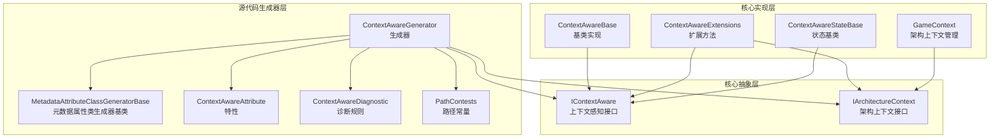
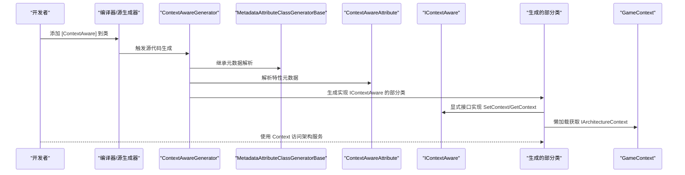
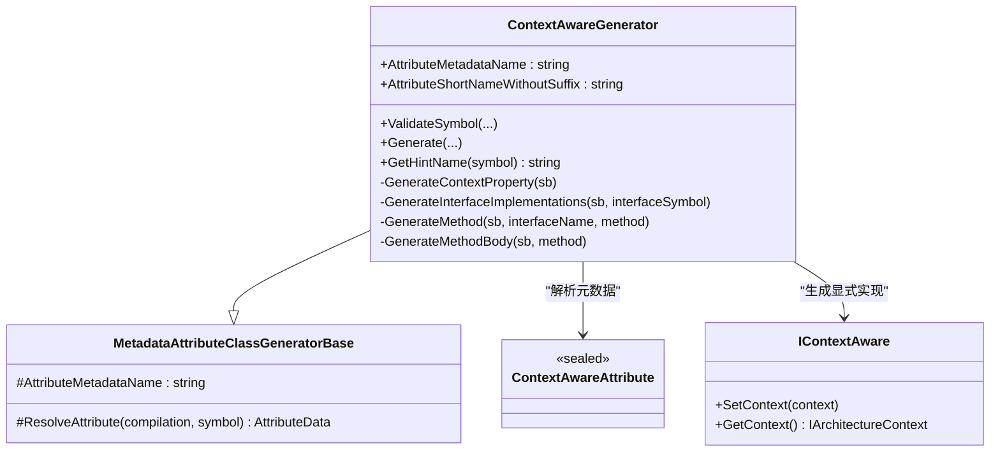
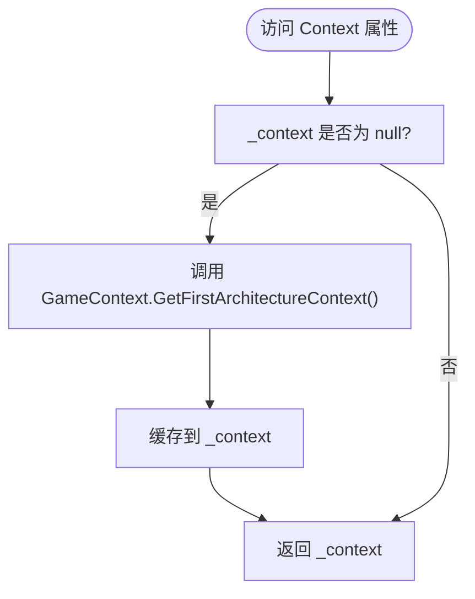
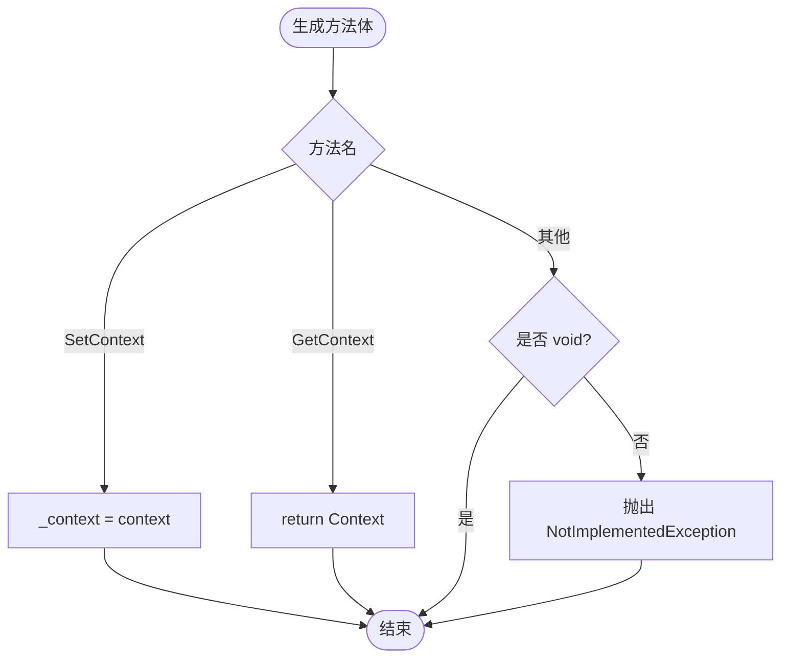
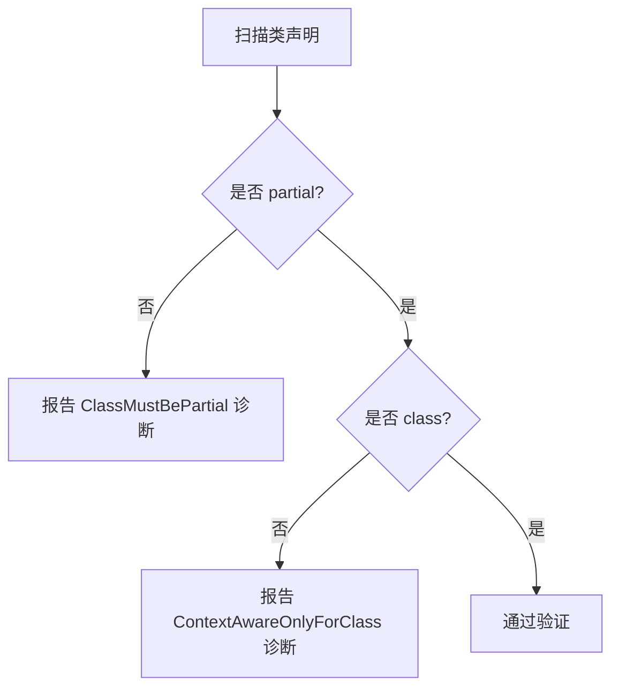
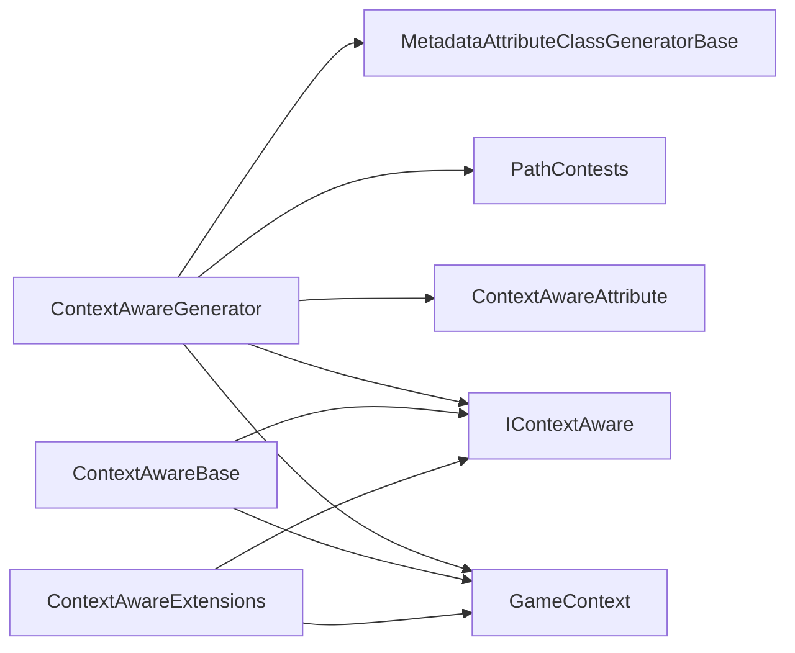

# 上下文感知生成器

<cite>
**本文档引用的文件**
- [ContextAwareGenerator.cs](file://GFramework.SourceGenerators/rule/ContextAwareGenerator.cs)
- [ContextAwareAttribute.cs](file://GFramework.SourceGenerators.Abstractions/rule/ContextAwareAttribute.cs)
- [IContextAware.cs](file://GFramework.Core.Abstractions/rule/IContextAware.cs)
- [ContextAwareDiagnostic.cs](file://GFramework.SourceGenerators/diagnostics/ContextAwareDiagnostic.cs)
- [ContextAwareBase.cs](file://GFramework.Core/rule/ContextAwareBase.cs)
- [GameContext.cs](file://GFramework.Core/architecture/GameContext.cs)
- [IArchitectureContext.cs](file://GFramework.Core.Abstractions/architecture/IArchitectureContext.cs)
- [ContextAwareExtensions.cs](file://GFramework.Core/extensions/ContextAwareExtensions.cs)
- [ContextAwareStateBase.cs](file://GFramework.Core/state/ContextAwareStateBase.cs)
- [MetadataAttributeClassGeneratorBase.cs](file://GFramework.SourceGenerators.Common/generator/MetadataAttributeClassGeneratorBase.cs)
- [PathContests.cs](file://GFramework.SourceGenerators.Common/constants/PathContests.cs)
- [ContextAwareGeneratorSnapshotTests.cs](file://GFramework.SourceGenerators.Tests/rule/ContextAwareGeneratorSnapshotTests.cs)
- [ContextAwareTests.cs](file://GFramework.Core.Tests/rule/ContextAwareTests.cs)
</cite>

## 目录
1. [简介](#简介)
2. [项目结构](#项目结构)
3. [核心组件](#核心组件)
4. [架构总览](#架构总览)
5. [详细组件分析](#详细组件分析)
6. [依赖关系分析](#依赖关系分析)
7. [性能考虑](#性能考虑)
8. [故障排查指南](#故障排查指南)
9. [结论](#结论)
10. [附录](#附录)

## 简介
本文件面向“上下文感知生成器”的技术文档，系统阐述 ContextAwareGenerator 的工作原理与使用方法，涵盖以下要点：
- ContextAwareAttribute 属性的使用方法与约束
- IContextAware 接口的自动生成与显式接口实现
- 上下文访问方法的实现与懒加载策略
- 诊断系统的工作机制（ContextAwareDiagnostic）
- 生成器如何为标记了 ContextAware 属性的类自动实现 IContextAware
- 生成代码结构与接口实现细节
- 与架构系统的集成方式与最佳实践
- 常见问题与调试技巧

## 项目结构
围绕上下文感知生成器的关键文件分布如下：
- 源代码生成器：GFramework.SourceGenerators/rule/ContextAwareGenerator.cs
- 属性定义：GFramework.SourceGenerators.Abstractions/rule/ContextAwareAttribute.cs
- 接口定义：GFramework.Core.Abstractions/rule/IContextAware.cs
- 诊断规则：GFramework.SourceGenerators/diagnostics/ContextAwareDiagnostic.cs
- 基类实现：GFramework.Core/rule/ContextAwareBase.cs
- 架构上下文：GFramework.Core/architecture/GameContext.cs
- 上下文接口：GFramework.Core.Abstractions/architecture/IArchitectureContext.cs
- 扩展方法：GFramework.Core/extensions/ContextAwareExtensions.cs
- 状态基类：GFramework.Core/state/ContextAwareStateBase.cs
- 生成器基类：GFramework.SourceGenerators.Common/generator/MetadataAttributeClassGeneratorBase.cs
- 路径常量：GFramework.SourceGenerators.Common/constants/PathContests.cs
- 快照测试：GFramework.SourceGenerators.Tests/rule/ContextAwareGeneratorSnapshotTests.cs
- 单元测试：GFramework.Core.Tests/rule/ContextAwareTests.cs

图表来源
- [ContextAwareGenerator.cs](file://GFramework.SourceGenerators/rule/ContextAwareGenerator.cs#L16-L112)
- [MetadataAttributeClassGeneratorBase.cs](file://GFramework.SourceGenerators.Common/generator/MetadataAttributeClassGeneratorBase.cs#L9-L41)
- [ContextAwareAttribute.cs](file://GFramework.SourceGenerators.Abstractions/rule/ContextAwareAttribute.cs#L8-L11)
- [ContextAwareDiagnostic.cs](file://GFramework.SourceGenerators/diagnostics/ContextAwareDiagnostic.cs#L8-L21)
- [PathContests.cs](file://GFramework.SourceGenerators.Common/constants/PathContests.cs#L6-L42)
- [IContextAware.cs](file://GFramework.Core.Abstractions/rule/IContextAware.cs#L8-L21)
- [IArchitectureContext.cs](file://GFramework.Core.Abstractions/architecture/IArchitectureContext.cs#L16-L123)
- [ContextAwareBase.cs](file://GFramework.Core/rule/ContextAwareBase.cs#L10-L43)
- [GameContext.cs](file://GFramework.Core/architecture/GameContext.cs#L9-L111)
- [ContextAwareExtensions.cs](file://GFramework.Core/extensions/ContextAwareExtensions.cs#L15-L231)
- [ContextAwareStateBase.cs](file://GFramework.Core/state/ContextAwareStateBase.cs#L13-L74)

章节来源
- [ContextAwareGenerator.cs](file://GFramework.SourceGenerators/rule/ContextAwareGenerator.cs#L16-L122)
- [ContextAwareAttribute.cs](file://GFramework.SourceGenerators.Abstractions/rule/ContextAwareAttribute.cs#L8-L11)
- [IContextAware.cs](file://GFramework.Core.Abstractions/rule/IContextAware.cs#L8-L21)
- [ContextAwareDiagnostic.cs](file://GFramework.SourceGenerators/diagnostics/ContextAwareDiagnostic.cs#L8-L21)
- [ContextAwareBase.cs](file://GFramework.Core/rule/ContextAwareBase.cs#L10-L43)
- [GameContext.cs](file://GFramework.Core/architecture/GameContext.cs#L9-L111)
- [IArchitectureContext.cs](file://GFramework.Core.Abstractions/architecture/IArchitectureContext.cs#L16-L123)
- [ContextAwareExtensions.cs](file://GFramework.Core/extensions/ContextAwareExtensions.cs#L15-L231)
- [ContextAwareStateBase.cs](file://GFramework.Core/state/ContextAwareStateBase.cs#L13-L74)
- [MetadataAttributeClassGeneratorBase.cs](file://GFramework.SourceGenerators.Common/generator/MetadataAttributeClassGeneratorBase.cs#L9-L41)
- [PathContests.cs](file://GFramework.SourceGenerators.Common/constants/PathContests.cs#L6-L42)

## 核心组件
- ContextAwareGenerator：基于特性元数据扫描并为标记了 ContextAware 的类自动生成 IContextAware 接口实现，包含 Context 属性与显式接口实现。
- ContextAwareAttribute：仅作用于类的特性标记，指示该类需要自动生成上下文感知实现。
- IContextAware：定义 SetContext 与 GetContext 两个核心方法，提供上下文注入与访问能力。
- ContextAwareDiagnostic：提供错误诊断规则，如 ContextAware 仅能用于类等。
- ContextAwareBase：框架提供的基类实现，包含 Context 属性、显式接口实现与 OnContextReady 回调。
- GameContext：静态上下文管理器，提供架构上下文的注册、获取与查询能力。
- IArchitectureContext：架构上下文接口，提供系统、模型、工具、命令、查询、事件等访问能力。
- ContextAwareExtensions：为 IContextAware 提供扩展方法，简化对上下文内服务的访问。
- ContextAwareStateBase：同时实现 IState 与 IContextAware 的状态基类。

章节来源
- [ContextAwareGenerator.cs](file://GFramework.SourceGenerators/rule/ContextAwareGenerator.cs#L16-L122)
- [ContextAwareAttribute.cs](file://GFramework.SourceGenerators.Abstractions/rule/ContextAwareAttribute.cs#L8-L11)
- [IContextAware.cs](file://GFramework.Core.Abstractions/rule/IContextAware.cs#L8-L21)
- [ContextAwareDiagnostic.cs](file://GFramework.SourceGenerators/diagnostics/ContextAwareDiagnostic.cs#L8-L21)
- [ContextAwareBase.cs](file://GFramework.Core/rule/ContextAwareBase.cs#L10-L43)
- [GameContext.cs](file://GFramework.Core/architecture/GameContext.cs#L9-L111)
- [IArchitectureContext.cs](file://GFramework.Core.Abstractions/architecture/IArchitectureContext.cs#L16-L123)
- [ContextAwareExtensions.cs](file://GFramework.Core/extensions/ContextAwareExtensions.cs#L15-L231)
- [ContextAwareStateBase.cs](file://GFramework.Core/state/ContextAwareStateBase.cs#L13-L74)

## 架构总览
上下文感知生成器的整体工作流如下：
- 编译阶段：Roslyn 分析源码，识别标记了 ContextAware 特性的类
- 生成阶段：ContextAwareGenerator 基于 MetadataAttributeClassGeneratorBase 解析特性元数据，校验类的合法性（partial、class），生成实现 IContextAware 的部分类
- 运行阶段：类通过 Context 属性或显式接口方法访问 IArchitectureContext；GameContext 提供上下文注册与获取；扩展方法简化对系统、模型、工具、命令、查询、事件的访问

图表来源
- [ContextAwareGenerator.cs](file://GFramework.SourceGenerators/rule/ContextAwareGenerator.cs#L16-L122)
- [MetadataAttributeClassGeneratorBase.cs](file://GFramework.SourceGenerators.Common/generator/MetadataAttributeClassGeneratorBase.cs#L23-L40)
- [ContextAwareAttribute.cs](file://GFramework.SourceGenerators.Abstractions/rule/ContextAwareAttribute.cs#L8-L11)
- [IContextAware.cs](file://GFramework.Core.Abstractions/rule/IContextAware.cs#L8-L21)
- [GameContext.cs](file://GFramework.Core/architecture/GameContext.cs#L39-L42)

## 详细组件分析

### ContextAwareGenerator 工作原理
- 特性解析：通过 MetadataAttributeClassGeneratorBase 的 ResolveAttribute 基于元数据名称解析 ContextAwareAttribute
- 符号验证：ValidateSymbol 校验类必须为 partial class，否则报告诊断错误
- 代码生成：Generate 输出部分类，显式实现 IContextAware，并生成 Context 属性与方法体
- 方法体生成：针对 SetContext/GetContext 生成具体逻辑，其他方法默认抛出未实现异常

图表来源
- [ContextAwareGenerator.cs](file://GFramework.SourceGenerators/rule/ContextAwareGenerator.cs#L16-L234)
- [MetadataAttributeClassGeneratorBase.cs](file://GFramework.SourceGenerators.Common/generator/MetadataAttributeClassGeneratorBase.cs#L9-L41)
- [ContextAwareAttribute.cs](file://GFramework.SourceGenerators.Abstractions/rule/ContextAwareAttribute.cs#L8-L11)
- [IContextAware.cs](file://GFramework.Core.Abstractions/rule/IContextAware.cs#L8-L21)

章节来源
- [ContextAwareGenerator.cs](file://GFramework.SourceGenerators/rule/ContextAwareGenerator.cs#L39-L122)
- [MetadataAttributeClassGeneratorBase.cs](file://GFramework.SourceGenerators.Common/generator/MetadataAttributeClassGeneratorBase.cs#L23-L40)

### Context 属性与上下文解析逻辑
- Context 属性为受保护的懒加载实现，首次访问时通过 GameContext.GetFirstArchitectureContext() 获取第一个可用的架构上下文
- 生成的代码中使用 fully qualified 名称（global:: 前缀）确保跨程序集引用的稳定性
- Context 属性的生成逻辑包含字段缓存与延迟初始化分支

图表来源
- [ContextAwareGenerator.cs](file://GFramework.SourceGenerators/rule/ContextAwareGenerator.cs#L133-L151)
- [GameContext.cs](file://GFramework.Core/architecture/GameContext.cs#L39-L42)

章节来源
- [ContextAwareGenerator.cs](file://GFramework.SourceGenerators/rule/ContextAwareGenerator.cs#L133-L151)
- [GameContext.cs](file://GFramework.Core/architecture/GameContext.cs#L39-L42)

### 显式接口实现与方法体生成
- 生成器遍历 IContextAware 的所有普通方法，逐个生成显式接口实现
- SetContext：直接赋值内部字段
- GetContext：返回 Context 属性
- 其他方法：若非 void，抛出未实现异常，避免误用

图表来源
- [ContextAwareGenerator.cs](file://GFramework.SourceGenerators/rule/ContextAwareGenerator.cs#L186-L233)

章节来源
- [ContextAwareGenerator.cs](file://GFramework.SourceGenerators/rule/ContextAwareGenerator.cs#L163-L233)

### 诊断系统工作机制
- ContextAwareDiagnostic 定义 GF_Rule_001 诊断规则，限制 ContextAwareAttribute 仅能应用于类
- ContextAwareGenerator 在 ValidateSymbol 中对类声明进行 partial 与 class 校验，不符合条件时报告诊断

图表来源
- [ContextAwareGenerator.cs](file://GFramework.SourceGenerators/rule/ContextAwareGenerator.cs#L39-L67)
- [ContextAwareDiagnostic.cs](file://GFramework.SourceGenerators/diagnostics/ContextAwareDiagnostic.cs#L13-L20)

章节来源
- [ContextAwareGenerator.cs](file://GFramework.SourceGenerators/rule/ContextAwareGenerator.cs#L39-L67)
- [ContextAwareDiagnostic.cs](file://GFramework.SourceGenerators/diagnostics/ContextAwareDiagnostic.cs#L13-L20)

### 与架构系统的集成与最佳实践
- 上下文注入：通过 IContextAware.SetContext 注入 IArchitectureContext，随后可通过 Context 属性或扩展方法访问系统、模型、工具、命令、查询、事件等
- 懒加载策略：Context 属性在首次访问时才解析架构上下文，避免不必要的初始化开销
- 扩展方法：ContextAwareExtensions 提供 GetSystem/GetModel/GetUtility/SendCommand/SendQuery/SendEvent/RegisterEvent 等便捷方法，减少样板代码
- 状态管理：ContextAwareStateBase 同时实现 IState 与 IContextAware，便于状态机场景下的上下文访问

章节来源
- [ContextAwareBase.cs](file://GFramework.Core/rule/ContextAwareBase.cs#L10-L43)
- [ContextAwareExtensions.cs](file://GFramework.Core/extensions/ContextAwareExtensions.cs#L15-L231)
- [ContextAwareStateBase.cs](file://GFramework.Core/state/ContextAwareStateBase.cs#L13-L74)
- [IArchitectureContext.cs](file://GFramework.Core.Abstractions/architecture/IArchitectureContext.cs#L16-L123)

### 使用示例与生成代码结构
- 在类上添加 [ContextAware] 特性，并确保类为 partial class
- 生成器会自动生成部分类，显式实现 IContextAware，并提供 Context 属性
- 生成的代码位于提示名称为 类名.ContextAware.g.cs 的文件中

参考快照测试以了解生成器输出的预期结构与行为。

章节来源
- [ContextAwareGeneratorSnapshotTests.cs](file://GFramework.SourceGenerators.Tests/rule/ContextAwareGeneratorSnapshotTests.cs#L20-L83)
- [ContextAwareGenerator.cs](file://GFramework.SourceGenerators/rule/ContextAwareGenerator.cs#L119-L122)

## 依赖关系分析
- ContextAwareGenerator 依赖：
  - MetadataAttributeClassGeneratorBase：提供基于元数据名称解析特性的能力
  - PathContests：提供核心抽象层命名空间常量，用于拼接接口全名
  - ContextAwareAttribute：作为特性元数据名称来源
  - IContextAware：生成显式接口实现的目标接口
  - GameContext：提供上下文解析入口
- ContextAwareBase 依赖：
  - IContextAware：作为基类实现接口
  - GameContext：在 GetContext 未设置时提供默认上下文解析
- ContextAwareExtensions 依赖：
  - IContextAware：扩展方法的接收者
  - IArchitectureContext：扩展方法内部调用上下文方法

图表来源
- [ContextAwareGenerator.cs](file://GFramework.SourceGenerators/rule/ContextAwareGenerator.cs#L16-L122)
- [MetadataAttributeClassGeneratorBase.cs](file://GFramework.SourceGenerators.Common/generator/MetadataAttributeClassGeneratorBase.cs#L9-L41)
- [PathContests.cs](file://GFramework.SourceGenerators.Common/constants/PathContests.cs#L6-L42)
- [ContextAwareAttribute.cs](file://GFramework.SourceGenerators.Abstractions/rule/ContextAwareAttribute.cs#L8-L11)
- [IContextAware.cs](file://GFramework.Core.Abstractions/rule/IContextAware.cs#L8-L21)
- [GameContext.cs](file://GFramework.Core/architecture/GameContext.cs#L39-L42)
- [ContextAwareBase.cs](file://GFramework.Core/rule/ContextAwareBase.cs#L10-L43)
- [ContextAwareExtensions.cs](file://GFramework.Core/extensions/ContextAwareExtensions.cs#L15-L231)

章节来源
- [ContextAwareGenerator.cs](file://GFramework.SourceGenerators/rule/ContextAwareGenerator.cs#L16-L122)
- [MetadataAttributeClassGeneratorBase.cs](file://GFramework.SourceGenerators.Common/generator/MetadataAttributeClassGeneratorBase.cs#L9-L41)
- [PathContests.cs](file://GFramework.SourceGenerators.Common/constants/PathContests.cs#L6-L42)
- [ContextAwareBase.cs](file://GFramework.Core/rule/ContextAwareBase.cs#L10-L43)
- [ContextAwareExtensions.cs](file://GFramework.Core/extensions/ContextAwareExtensions.cs#L15-L231)

## 性能考虑
- 懒加载 Context 属性：首次访问时才解析架构上下文，避免无谓的初始化
- 显式接口实现：生成器按需生成方法体，未覆盖的方法默认抛出异常，防止运行期误用
- 扩展方法：通过 IContextAware.GetContext() 获取上下文后再调用，避免重复解析

## 故障排查指南
- 诊断规则 GF_Rule_001：确认 [ContextAware] 仅用于类，且类声明为 partial
- 运行期异常：若调用未覆盖的方法（非 SetContext/GetContext），将抛出未实现异常；请检查生成的接口实现是否完整
- 上下文未设置：GetContext 在未设置时会尝试获取第一个架构上下文；若无可用上下文，需先通过 GameContext.Bind 注册

章节来源
- [ContextAwareDiagnostic.cs](file://GFramework.SourceGenerators/diagnostics/ContextAwareDiagnostic.cs#L13-L20)
- [ContextAwareGenerator.cs](file://GFramework.SourceGenerators/rule/ContextAwareGenerator.cs#L216-L233)
- [GameContext.cs](file://GFramework.Core/architecture/GameContext.cs#L27-L42)
- [ContextAwareTests.cs](file://GFramework.Core.Tests/rule/ContextAwareTests.cs#L15-L101)

## 结论
上下文感知生成器通过特性驱动的方式，为标记了 ContextAware 的类自动生成 IContextAware 接口实现，结合 Context 属性的懒加载与扩展方法，提供了简洁而强大的架构上下文访问能力。配合诊断系统与测试用例，可有效保障生成代码的质量与一致性。

## 附录
- 快照测试：验证生成器输出与预期一致
- 单元测试：验证基类实现与上下文生命周期行为

章节来源
- [ContextAwareGeneratorSnapshotTests.cs](file://GFramework.SourceGenerators.Tests/rule/ContextAwareGeneratorSnapshotTests.cs#L20-L83)
- [ContextAwareTests.cs](file://GFramework.Core.Tests/rule/ContextAwareTests.cs#L15-L101)