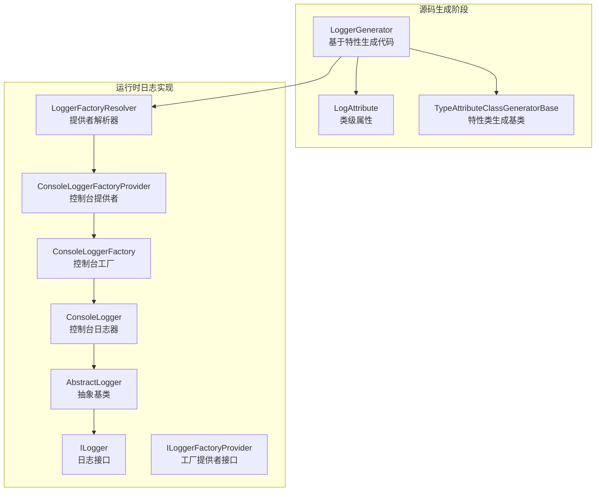
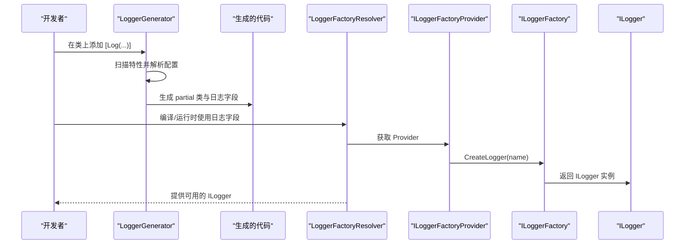
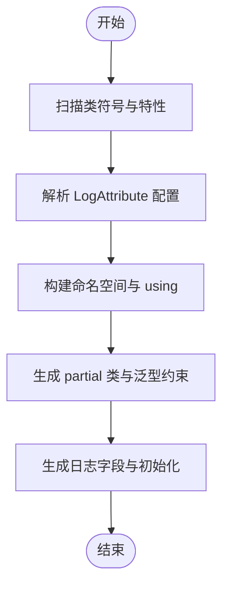
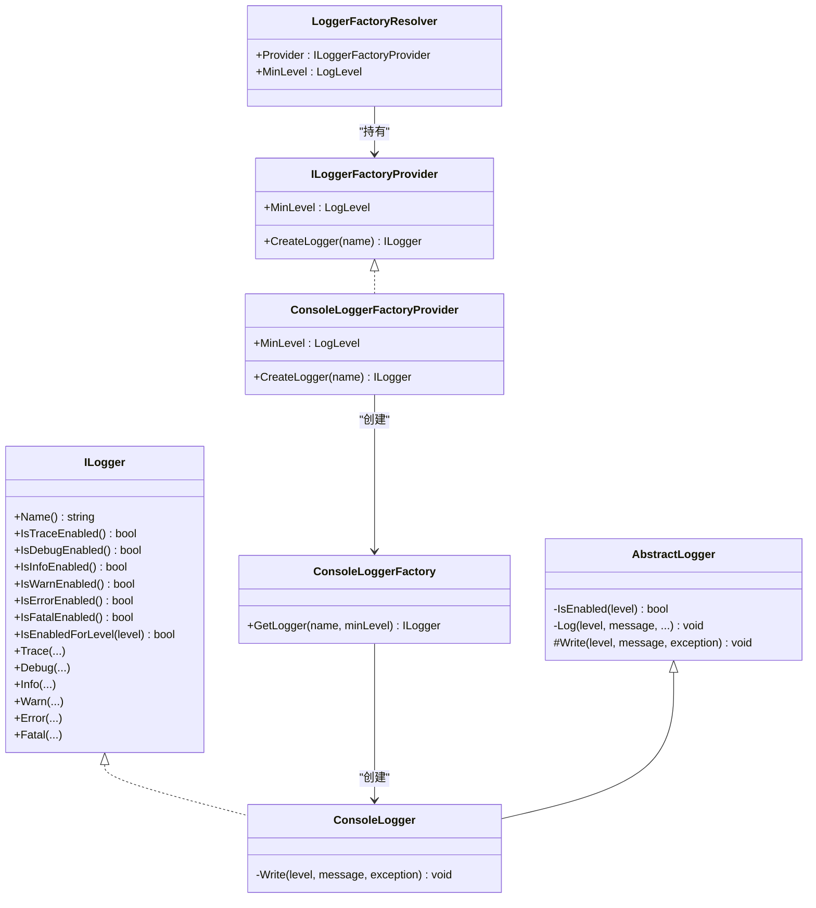
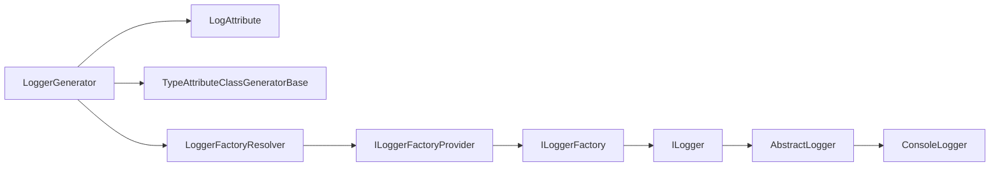

# 日志生成器

<cite>
**本文引用的文件**
- [LoggerGenerator.cs](file://GFramework.SourceGenerators/logging/LoggerGenerator.cs)
- [LogAttribute.cs](file://GFramework.SourceGenerators.Abstractions/logging/LogAttribute.cs)
- [LoggerFactoryResolver.cs](file://GFramework.Core/logging/LoggerFactoryResolver.cs)
- [ConsoleLoggerFactory.cs](file://GFramework.Core/logging/ConsoleLoggerFactory.cs)
- [ConsoleLoggerFactoryProvider.cs](file://GFramework.Core/logging/ConsoleLoggerFactoryProvider.cs)
- [ILogger.cs](file://GFramework.Core.Abstractions/logging/ILogger.cs)
- [ILoggerFactoryProvider.cs](file://GFramework.Core.Abstractions/logging/ILoggerFactoryProvider.cs)
- [AbstractLogger.cs](file://GFramework.Core/logging/AbstractLogger.cs)
- [ConsoleLogger.cs](file://GFramework.Core/logging/ConsoleLogger.cs)
- [LoggerDiagnostic.cs](file://GFramework.SourceGenerators/diagnostics/LoggerDiagnostic.cs)
- [LoggerGeneratorSnapshotTests.cs](file://GFramework.SourceGenerators.Tests/logging/LoggerGeneratorSnapshotTests.cs)
- [TypeAttributeClassGeneratorBase.cs](file://GFramework.SourceGenerators.Common/generator/TypeAttributeClassGeneratorBase.cs)
</cite>

## 目录
1. [简介](#简介)
2. [项目结构](#项目结构)
3. [核心组件](#核心组件)
4. [架构总览](#架构总览)
5. [组件详解](#组件详解)
6. [依赖关系分析](#依赖关系分析)
7. [性能考量](#性能考量)
8. [故障排查指南](#故障排查指南)
9. [结论](#结论)
10. [附录](#附录)

## 简介
本文件系统性阐述日志生成器（LoggerGenerator）的技术细节，覆盖以下主题：
- LoggerGenerator 的工作原理与生成流程
- LogAttribute 属性的使用方法与配置项
- ILogger 接口的自动实现与 LoggerFactoryResolver 的日志工厂解析过程
- 生成器配置项：日志名称、字段名、访问修饰符、静态标志
- partial 类生成逻辑与命名空间处理
- 使用示例与生成代码结构说明
- 性能特点与“零运行时开销”的设计理念
- 常见配置问题与解决方案

## 项目结构
日志生成器位于 Source Generators 子系统中，围绕 Roslyn Source Generator 进行扩展；日志运行时实现位于 Core 子系统，并通过抽象层解耦。

图表来源
- [LoggerGenerator.cs](file://GFramework.SourceGenerators/logging/LoggerGenerator.cs#L15-L103)
- [LogAttribute.cs](file://GFramework.SourceGenerators.Abstractions/logging/LogAttribute.cs#L9-L40)
- [TypeAttributeClassGeneratorBase.cs](file://GFramework.SourceGenerators.Common/generator/TypeAttributeClassGeneratorBase.cs#L10-L35)
- [LoggerFactoryResolver.cs](file://GFramework.Core/logging/LoggerFactoryResolver.cs#L8-L26)
- [ConsoleLoggerFactoryProvider.cs](file://GFramework.Core/logging/ConsoleLoggerFactoryProvider.cs#L8-L24)
- [ConsoleLoggerFactory.cs](file://GFramework.Core/logging/ConsoleLoggerFactory.cs#L8-L20)
- [ConsoleLogger.cs](file://GFramework.Core/logging/ConsoleLogger.cs#L10-L81)
- [AbstractLogger.cs](file://GFramework.Core/logging/AbstractLogger.cs#L10-L493)
- [ILogger.cs](file://GFramework.Core.Abstractions/logging/ILogger.cs#L8-L314)
- [ILoggerFactoryProvider.cs](file://GFramework.Core.Abstractions/logging/ILoggerFactoryProvider.cs#L6-L19)

章节来源
- [LoggerGenerator.cs](file://GFramework.SourceGenerators/logging/LoggerGenerator.cs#L15-L103)
- [LogAttribute.cs](file://GFramework.SourceGenerators.Abstractions/logging/LogAttribute.cs#L9-L40)
- [LoggerFactoryResolver.cs](file://GFramework.Core/logging/LoggerFactoryResolver.cs#L8-L26)

## 核心组件
- LoggerGenerator：基于特性扫描与 Roslyn 编译符号，为带有 LogAttribute 的类生成 partial 字段，初始化为 ILogger 实例。
- LogAttribute：声明式配置项，支持日志名称、字段名、访问修饰符、是否静态等。
- ILogger 与 ILoggerFactoryProvider：抽象接口，定义日志记录能力与工厂提供者契约。
- LoggerFactoryResolver：集中管理 ILoggerFactoryProvider 实例与最小日志级别。
- ConsoleLogger*：默认控制台实现链路，演示如何创建并使用 ILogger。
- AbstractLogger：统一实现级别检查与格式化，子类仅需实现 Write 即可。

章节来源
- [LoggerGenerator.cs](file://GFramework.SourceGenerators/logging/LoggerGenerator.cs#L15-L103)
- [LogAttribute.cs](file://GFramework.SourceGenerators.Abstractions/logging/LogAttribute.cs#L9-L40)
- [ILogger.cs](file://GFramework.Core.Abstractions/logging/ILogger.cs#L8-L314)
- [ILoggerFactoryProvider.cs](file://GFramework.Core.Abstractions/logging/ILoggerFactoryProvider.cs#L6-L19)
- [LoggerFactoryResolver.cs](file://GFramework.Core/logging/LoggerFactoryResolver.cs#L8-L26)
- [ConsoleLoggerFactoryProvider.cs](file://GFramework.Core/logging/ConsoleLoggerFactoryProvider.cs#L8-L24)
- [ConsoleLoggerFactory.cs](file://GFramework.Core/logging/ConsoleLoggerFactory.cs#L8-L20)
- [ConsoleLogger.cs](file://GFramework.Core/logging/ConsoleLogger.cs#L10-L81)
- [AbstractLogger.cs](file://GFramework.Core/logging/AbstractLogger.cs#L10-L493)

## 架构总览
下图展示了从类标注属性到生成代码、再到运行时日志器创建的端到端流程。

图表来源
- [LoggerGenerator.cs](file://GFramework.SourceGenerators/logging/LoggerGenerator.cs#L51-L93)
- [LoggerFactoryResolver.cs](file://GFramework.Core/logging/LoggerFactoryResolver.cs#L16-L17)
- [ConsoleLoggerFactoryProvider.cs](file://GFramework.Core/logging/ConsoleLoggerFactoryProvider.cs#L20-L23)
- [ConsoleLoggerFactory.cs](file://GFramework.Core/logging/ConsoleLoggerFactory.cs#L16-L19)
- [ILogger.cs](file://GFramework.Core.Abstractions/logging/ILogger.cs#L8-L314)

## 组件详解

### LoggerGenerator 工作原理
- 特性识别：继承通用基类，按特性全名匹配目标类型。
- 符号解析：从编译符号中提取命名空间、类名、泛型参数与约束。
- 配置读取：从 LogAttribute 读取日志名称、字段名、访问修饰符、是否静态。
- 代码生成：拼接 using、命名空间、partial 类、字段声明与初始化，调用 LoggerFactoryResolver.Provider.CreateLogger(...)。
- 文件命名：HintName 固定为 “{ClassName}.Logger.g.cs”。

图表来源
- [LoggerGenerator.cs](file://GFramework.SourceGenerators/logging/LoggerGenerator.cs#L51-L93)
- [TypeAttributeClassGeneratorBase.cs](file://GFramework.SourceGenerators.Common/generator/TypeAttributeClassGeneratorBase.cs#L24-L34)

章节来源
- [LoggerGenerator.cs](file://GFramework.SourceGenerators/logging/LoggerGenerator.cs#L15-L103)
- [TypeAttributeClassGeneratorBase.cs](file://GFramework.SourceGenerators.Common/generator/TypeAttributeClassGeneratorBase.cs#L10-L35)

### LogAttribute 属性与配置项
- 支持的配置项
  - Name：日志分类名，默认使用类名
  - FieldName：生成字段名，默认值参见属性定义
  - IsStatic：是否生成 static 字段，默认 true
  - AccessModifier：访问修饰符，默认 private
- 生成字段的可见性与生命周期由上述配置决定。

章节来源
- [LogAttribute.cs](file://GFramework.SourceGenerators.Abstractions/logging/LogAttribute.cs#L9-L40)

### ILogger 接口与工厂解析流程
- ILogger：定义日志名称、级别检查与各类别日志方法。
- ILoggerFactoryProvider：定义最小日志级别与 CreateLogger(name)。
- LoggerFactoryResolver：集中持有 Provider 与 MinLevel，默认提供 ConsoleLoggerFactoryProvider。
- ConsoleLoggerFactoryProvider：根据 MinLevel 创建 ConsoleLoggerFactory。
- ConsoleLoggerFactory：创建 ConsoleLogger 实例。
- ConsoleLogger：继承 AbstractLogger，实现 Write，完成实际输出。
- AbstractLogger：统一实现级别判断与格式化，减少重复代码。

图表来源
- [ILogger.cs](file://GFramework.Core.Abstractions/logging/ILogger.cs#L8-L314)
- [ILoggerFactoryProvider.cs](file://GFramework.Core.Abstractions/logging/ILoggerFactoryProvider.cs#L6-L19)
- [LoggerFactoryResolver.cs](file://GFramework.Core/logging/LoggerFactoryResolver.cs#L8-L26)
- [ConsoleLoggerFactoryProvider.cs](file://GFramework.Core/logging/ConsoleLoggerFactoryProvider.cs#L8-L24)
- [ConsoleLoggerFactory.cs](file://GFramework.Core/logging/ConsoleLoggerFactory.cs#L8-L20)
- [ConsoleLogger.cs](file://GFramework.Core/logging/ConsoleLogger.cs#L10-L81)
- [AbstractLogger.cs](file://GFramework.Core/logging/AbstractLogger.cs#L10-L493)

章节来源
- [ILogger.cs](file://GFramework.Core.Abstractions/logging/ILogger.cs#L8-L314)
- [ILoggerFactoryProvider.cs](file://GFramework.Core.Abstractions/logging/ILoggerFactoryProvider.cs#L6-L19)
- [LoggerFactoryResolver.cs](file://GFramework.Core/logging/LoggerFactoryResolver.cs#L8-L26)
- [ConsoleLoggerFactoryProvider.cs](file://GFramework.Core/logging/ConsoleLoggerFactoryProvider.cs#L8-L24)
- [ConsoleLoggerFactory.cs](file://GFramework.Core/logging/ConsoleLoggerFactory.cs#L8-L20)
- [ConsoleLogger.cs](file://GFramework.Core/logging/ConsoleLogger.cs#L10-L81)
- [AbstractLogger.cs](file://GFramework.Core/logging/AbstractLogger.cs#L10-L493)

### 生成器配置项与行为
- 日志名称（Name）
  - 若未显式设置，生成器会从构造参数推断默认名称（通常为类名）。
- 字段名（FieldName）
  - 默认值参见属性定义；可通过配置修改生成的字段标识符。
- 访问修饰符（AccessModifier）
  - 默认 private；可设为 public 等其他合法修饰符。
- 静态标志（IsStatic）
  - 默认 true；若设为 false，则生成实例字段。
- 泛型类支持
  - 生成器保留泛型参数与约束，确保生成代码与原类一致。

章节来源
- [LoggerGenerator.cs](file://GFramework.SourceGenerators/logging/LoggerGenerator.cs#L57-L90)
- [LogAttribute.cs](file://GFramework.SourceGenerators.Abstractions/logging/LogAttribute.cs#L29-L40)

### partial 类生成逻辑与命名空间处理
- 生成 partial 类，保留原类的类型修饰符（如 class、struct）与泛型参数。
- 生成 using 语句引入 Core.Abstractions 与 Core 的 logging 命名空间。
- 若原类处于命名空间中，生成对应的 namespace 块。
- 字段声明包含访问修饰符、static 关键字（可选）、只读修饰与初始化表达式。

章节来源
- [LoggerGenerator.cs](file://GFramework.SourceGenerators/logging/LoggerGenerator.cs#L68-L90)

### 使用示例与生成代码结构
- 示例场景
  - 在类上添加 [Log] 属性，即可在编译期生成日志字段。
  - 测试用例覆盖默认配置、自定义名称、自定义字段名、实例字段、公共字段、泛型类等场景。
- 生成代码结构要点
  - partial 类 + 字段声明 + using 引入 + 命名空间块
  - 字段初始化调用 LoggerFactoryResolver.Provider.CreateLogger(...)
- 参考测试用例路径
  - [LoggerGeneratorSnapshotTests.cs](file://GFramework.SourceGenerators.Tests/logging/LoggerGeneratorSnapshotTests.cs#L10-L591)

章节来源
- [LoggerGeneratorSnapshotTests.cs](file://GFramework.SourceGenerators.Tests/logging/LoggerGeneratorSnapshotTests.cs#L10-L591)
- [LoggerGenerator.cs](file://GFramework.SourceGenerators/logging/LoggerGenerator.cs#L51-L93)

### ILogger 的创建过程
- 生成器在生成的代码中直接调用 LoggerFactoryResolver.Provider.CreateLogger(...)
- 默认 Provider 为 ConsoleLoggerFactoryProvider
- ConsoleLoggerFactoryProvider.MinLevel 决定最低日志级别
- ConsoleLoggerFactory.GetLogger(name, minLevel) 返回 ConsoleLogger 实例
- ConsoleLogger 继承 AbstractLogger，实现 Write 完成输出

章节来源
- [LoggerGenerator.cs](file://GFramework.SourceGenerators/logging/LoggerGenerator.cs#L88-L89)
- [LoggerFactoryResolver.cs](file://GFramework.Core/logging/LoggerFactoryResolver.cs#L16-L17)
- [ConsoleLoggerFactoryProvider.cs](file://GFramework.Core/logging/ConsoleLoggerFactoryProvider.cs#L20-L23)
- [ConsoleLoggerFactory.cs](file://GFramework.Core/logging/ConsoleLoggerFactory.cs#L16-L19)
- [ConsoleLogger.cs](file://GFramework.Core/logging/ConsoleLogger.cs#L25-L38)
- [AbstractLogger.cs](file://GFramework.Core/logging/AbstractLogger.cs#L49-L52)

## 依赖关系分析
- LoggerGenerator 依赖
  - LogAttribute（特性定义）
  - TypeAttributeClassGeneratorBase（特性类生成基类）
  - LoggerFactoryResolver（运行时解析器）
- 运行时依赖
  - ILoggerFactoryProvider → ILoggerFactory → ILogger
  - AbstractLogger 作为实现基类，ConsoleLogger 为具体平台实现

图表来源
- [LoggerGenerator.cs](file://GFramework.SourceGenerators/logging/LoggerGenerator.cs#L15-L103)
- [LogAttribute.cs](file://GFramework.SourceGenerators.Abstractions/logging/LogAttribute.cs#L9-L40)
- [TypeAttributeClassGeneratorBase.cs](file://GFramework.SourceGenerators.Common/generator/TypeAttributeClassGeneratorBase.cs#L10-L35)
- [LoggerFactoryResolver.cs](file://GFramework.Core/logging/LoggerFactoryResolver.cs#L8-L26)
- [ILoggerFactoryProvider.cs](file://GFramework.Core.Abstractions/logging/ILoggerFactoryProvider.cs#L6-L19)
- [ILogger.cs](file://GFramework.Core.Abstractions/logging/ILogger.cs#L8-L314)
- [AbstractLogger.cs](file://GFramework.Core/logging/AbstractLogger.cs#L10-L493)
- [ConsoleLogger.cs](file://GFramework.Core/logging/ConsoleLogger.cs#L10-L81)

章节来源
- [LoggerGenerator.cs](file://GFramework.SourceGenerators/logging/LoggerGenerator.cs#L15-L103)
- [LoggerFactoryResolver.cs](file://GFramework.Core/logging/LoggerFactoryResolver.cs#L8-L26)

## 性能考量
- 零运行时开销设计
  - 生成器在编译期注入字段与初始化代码，运行时无需反射或动态绑定。
  - ILogger 的创建发生在字段初始化阶段，后续调用直接通过接口方法分派。
- 级别检查优化
  - AbstractLogger 将级别检查前置，避免格式化与字符串拼接的无效开销。
- 输出优化
  - ConsoleLogger 在控制台输出时支持彩色与异常堆栈输出，便于调试但不影响生成器性能。

章节来源
- [AbstractLogger.cs](file://GFramework.Core/logging/AbstractLogger.cs#L49-L52)
- [ConsoleLogger.cs](file://GFramework.Core/logging/ConsoleLogger.cs#L25-L38)

## 故障排查指南
- 诊断提示
  - LoggerDiagnostics 定义了 LogAttribute 无效的诊断描述符，可用于定位无效配置或环境问题。
- 常见问题与建议
  - 未正确引用 Core Abstractions 与 Core logging 命名空间：检查生成代码中的 using 是否包含相应命名空间。
  - Provider 未设置：确保在应用启动时设置 LoggerFactoryResolver.Provider，否则默认使用 ConsoleLoggerFactoryProvider。
  - 最小日志级别过高：若日志不显示，请检查 MinLevel 设置。
  - 泛型类生成异常：确认类为 partial 且生成器可访问到特性与符号。

章节来源
- [LoggerDiagnostic.cs](file://GFramework.SourceGenerators/diagnostics/LoggerDiagnostic.cs#L13-L20)
- [LoggerFactoryResolver.cs](file://GFramework.Core/logging/LoggerFactoryResolver.cs#L16-L17)

## 结论
日志生成器通过声明式属性与编译期代码生成，将日志能力以零运行时开销的方式注入到目标类中。结合抽象接口与工厂解析器，既保证了灵活性，又维持了高性能与易扩展性。配合完善的测试用例与诊断提示，能够帮助开发者快速落地并稳定使用。

## 附录
- 快速参考
  - 在类上添加 [Log] 属性，即可生成日志字段。
  - 如需自定义日志名称、字段名、访问修饰符或静态标志，请在属性中设置相应参数。
  - 运行时日志器由 LoggerFactoryResolver.Provider.CreateLogger(...) 创建，可在应用启动时替换为自定义 Provider。