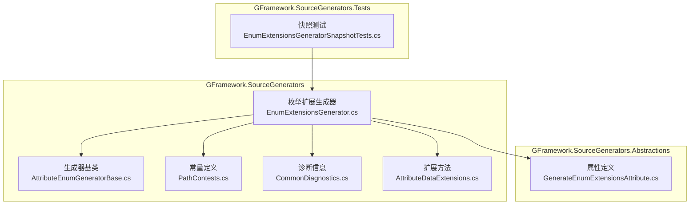
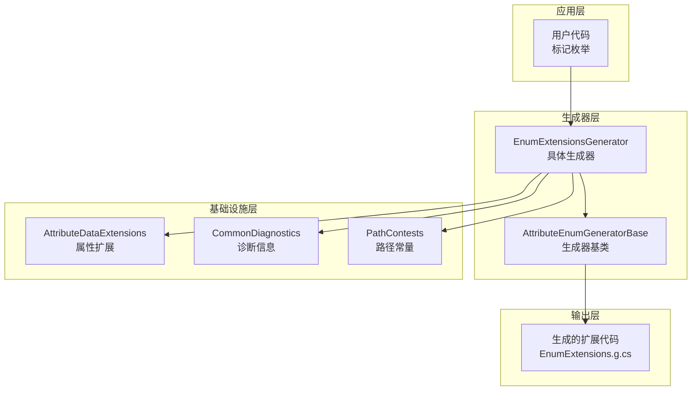
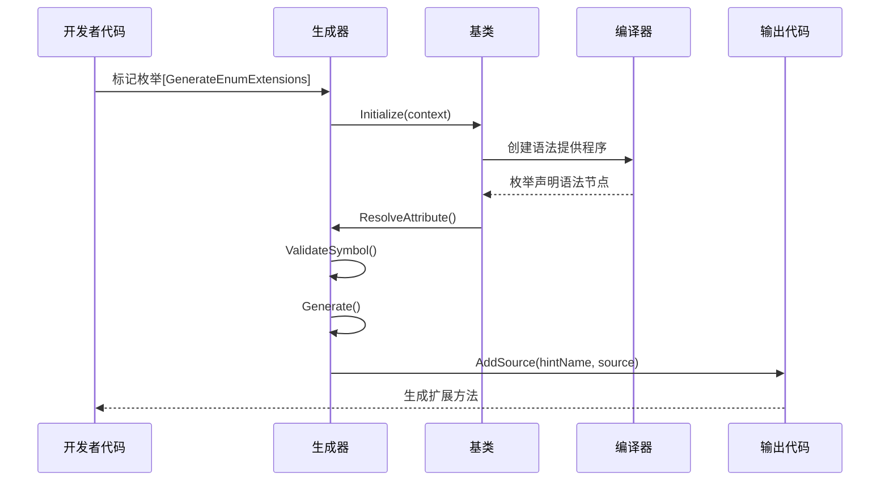
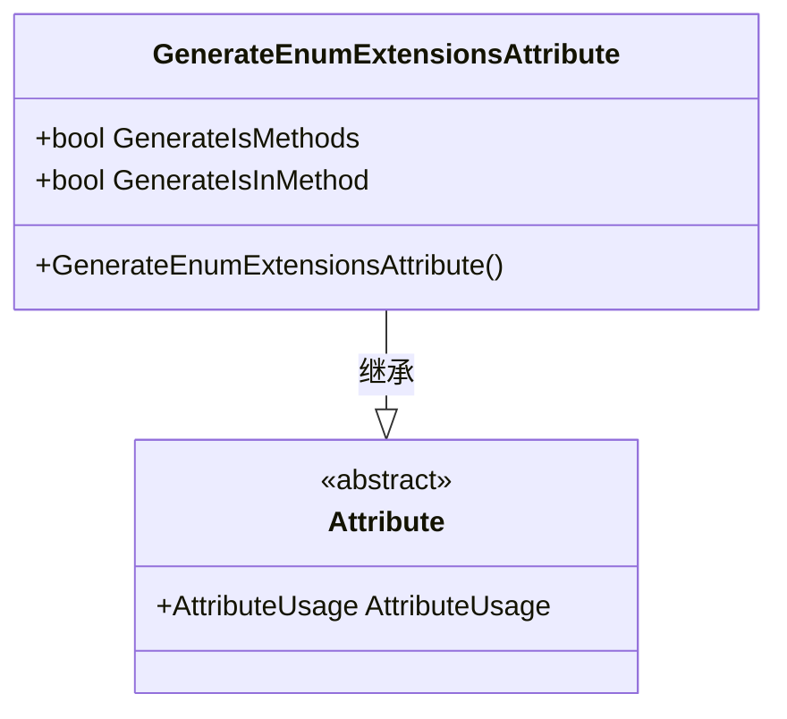
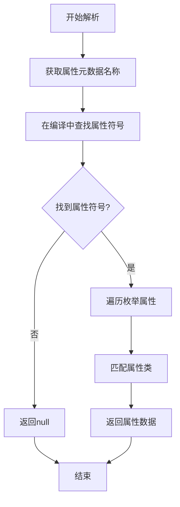
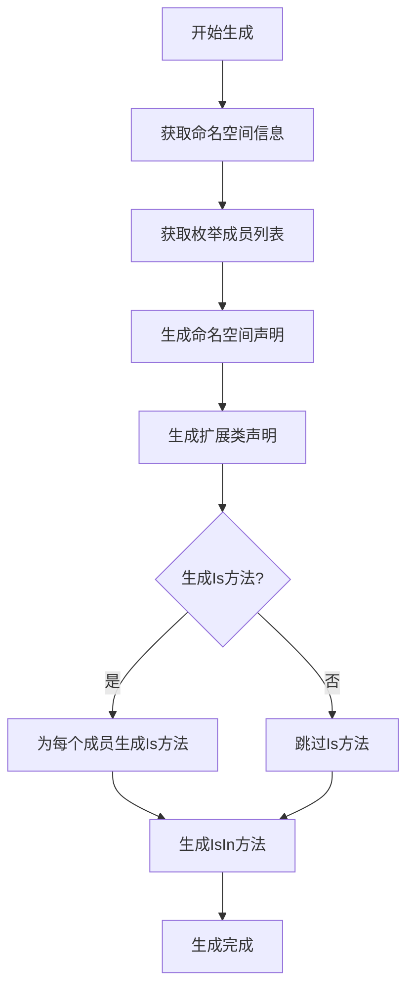
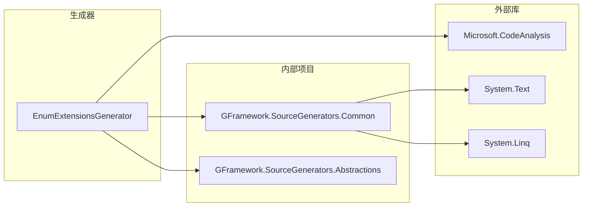
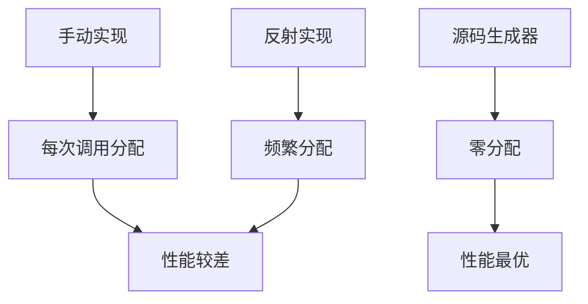

# 枚举扩展生成器

<cite>
**本文档引用的文件**
- [EnumExtensionsGenerator.cs](file://GFramework.SourceGenerators/enums/EnumExtensionsGenerator.cs)
- [GenerateEnumExtensionsAttribute.cs](file://GFramework.SourceGenerators.Abstractions/enums/GenerateEnumExtensionsAttribute.cs)
- [AttributeEnumGeneratorBase.cs](file://GFramework.SourceGenerators.Common/generator/AttributeEnumGeneratorBase.cs)
- [AttributeDataExtensions.cs](file://GFramework.SourceGenerators.Common/extensions/AttributeDataExtensions.cs)
- [CommonDiagnostics.cs](file://GFramework.SourceGenerators.Common/diagnostics/CommonDiagnostics.cs)
- [PathContests.cs](file://GFramework.SourceGenerators.Common/constants/PathContests.cs)
- [EnumExtensionsGeneratorSnapshotTests.cs](file://GFramework.SourceGenerators.Tests/enums/EnumExtensionsGeneratorSnapshotTests.cs)
- [README.md](file://GFramework.SourceGenerators/README.md)
- [GFramework.SourceGenerators.csproj](file://GFramework.SourceGenerators/GFramework.SourceGenerators.csproj)
- [GFramework.SourceGenerators.Abstractions.csproj](file://GFramework.SourceGenerators.Abstractions/GFramework.SourceGenerators.Abstractions.csproj)
</cite>

## 目录
1. [简介](#简介)
2. [项目结构](#项目结构)
3. [核心组件](#核心组件)
4. [架构概览](#架构概览)
5. [详细组件分析](#详细组件分析)
6. [依赖关系分析](#依赖关系分析)
7. [性能考虑](#性能考虑)
8. [故障排除指南](#故障排除指南)
9. [结论](#结论)
10. [附录](#附录)

## 简介

枚举扩展生成器是GFramework框架中的一个源代码生成器，专门用于为标记了`GenerateEnumExtensions`属性的枚举类型自动生成扩展方法。该生成器利用Roslyn源代码生成技术，在编译时分析代码并生成优化的扩展方法，从而提供零运行时开销的类型安全增强。

该生成器的主要目标是：
- 自动生成枚举的类型安全扩展方法
- 提供简洁的条件判断语法
- 支持多种枚举使用场景
- 确保编译时类型检查和零运行时性能开销

## 项目结构

GFramework枚举扩展生成器位于以下项目结构中：



**图表来源**
- [EnumExtensionsGenerator.cs](file://GFramework.SourceGenerators/enums/EnumExtensionsGenerator.cs#L1-L114)
- [GenerateEnumExtensionsAttribute.cs](file://GFramework.SourceGenerators.Abstractions/enums/GenerateEnumExtensionsAttribute.cs#L1-L20)
- [AttributeEnumGeneratorBase.cs](file://GFramework.SourceGenerators.Common/generator/AttributeEnumGeneratorBase.cs#L1-L104)

**章节来源**
- [GFramework.SourceGenerators.csproj](file://GFramework.SourceGenerators/GFramework.SourceGenerators.csproj#L1-L64)
- [GFramework.SourceGenerators.Abstractions.csproj](file://GFramework.SourceGenerators.Abstractions/GFramework.SourceGenerators.Abstractions.csproj#L1-L31)

## 核心组件

### GenerateEnumExtensionsAttribute 属性

`GenerateEnumExtensionsAttribute`是枚举扩展生成器的核心配置属性，定义在抽象层中，具有以下特性：

- **作用域**：仅适用于枚举类型（`AttributeTargets.Enum`）
- **主要配置**：
  - `GenerateIsMethods`：是否为每个枚举项生成单独的IsX方法（默认true）
  - `GenerateIsInMethod`：是否生成IsIn(params T[])方法（默认true）

### EnumExtensionsGenerator 生成器

`EnumExtensionsGenerator`继承自`AttributeEnumGeneratorBase`，实现了具体的枚举扩展方法生成逻辑：

- **继承关系**：`EnumExtensionsGenerator` → `AttributeEnumGeneratorBase` → `IIncrementalGenerator`
- **核心功能**：自动生成枚举扩展方法的源代码
- **生成内容**：扩展类和扩展方法

### AttributeEnumGeneratorBase 基类

提供了通用的属性驱动枚举生成框架：

- **初始化流程**：设置语法提供程序和编译提供程序
- **候选发现**：基于属性名称进行粗筛选
- **源代码输出**：注册生成的源代码到编译器

**章节来源**
- [GenerateEnumExtensionsAttribute.cs](file://GFramework.SourceGenerators.Abstractions/enums/GenerateEnumExtensionsAttribute.cs#L1-L20)
- [EnumExtensionsGenerator.cs](file://GFramework.SourceGenerators/enums/EnumExtensionsGenerator.cs#L1-L114)
- [AttributeEnumGeneratorBase.cs](file://GFramework.SourceGenerators.Common/generator/AttributeEnumGeneratorBase.cs#L1-L104)

## 架构概览

枚举扩展生成器采用分层架构设计，确保代码的可维护性和扩展性：



**图表来源**
- [EnumExtensionsGenerator.cs](file://GFramework.SourceGenerators/enums/EnumExtensionsGenerator.cs#L14-L35)
- [AttributeEnumGeneratorBase.cs](file://GFramework.SourceGenerators.Common/generator/AttributeEnumGeneratorBase.cs#L21-L57)

### 控制流序列图



**图表来源**
- [AttributeEnumGeneratorBase.cs](file://GFramework.SourceGenerators.Common/generator/AttributeEnumGeneratorBase.cs#L21-L57)
- [EnumExtensionsGenerator.cs](file://GFramework.SourceGenerators/enums/EnumExtensionsGenerator.cs#L57-L103)

## 详细组件分析

### GenerateEnumExtensionsAttribute 属性分析

该属性定义了枚举扩展生成器的行为配置：



**图表来源**
- [GenerateEnumExtensionsAttribute.cs](file://GFramework.SourceGenerators.Abstractions/enums/GenerateEnumExtensionsAttribute.cs#L8-L20)

**属性配置说明**：
- `GenerateIsMethods`：控制是否为每个枚举值生成独立的Is方法
- `GenerateIsInMethod`：控制是否生成批量判断的IsIn方法

### EnumExtensionsGenerator 实现分析

生成器的核心实现包含以下关键部分：

#### 属性解析机制



**图表来源**
- [EnumExtensionsGenerator.cs](file://GFramework.SourceGenerators/enums/EnumExtensionsGenerator.cs#L25-L35)

#### 符号验证逻辑

生成器对枚举类型进行严格验证：

- **类型检查**：确保符号是枚举类型
- **诊断报告**：对非枚举类型报告错误
- **位置定位**：提供准确的错误位置信息

#### 代码生成算法

生成器采用模板化方法生成扩展代码：



**图表来源**
- [EnumExtensionsGenerator.cs](file://GFramework.SourceGenerators/enums/EnumExtensionsGenerator.cs#L57-L103)

### 生成的扩展方法详解

#### IsX 方法族

为每个枚举值生成对应的类型检查方法：

- **方法签名**：`public static bool Is{MemberName}(this {EnumType} value)`
- **实现逻辑**：直接比较枚举值与指定枚举项
- **性能特征**：编译时常量折叠，零运行时开销

#### IsIn 方法

提供批量枚举值判断功能：

- **方法签名**：`public static bool IsIn(this {EnumType} value, params {EnumType}[] values)`
- **实现逻辑**：循环检查输入数组中的每个值
- **边界处理**：空参数返回false

**章节来源**
- [EnumExtensionsGenerator.cs](file://GFramework.SourceGenerators/enums/EnumExtensionsGenerator.cs#L81-L98)

## 依赖关系分析

### 外部依赖关系



**图表来源**
- [EnumExtensionsGenerator.cs](file://GFramework.SourceGenerators/enums/EnumExtensionsGenerator.cs#L1-L7)
- [GFramework.SourceGenerators.csproj](file://GFramework.SourceGenerators/GFramework.SourceGenerators.csproj#L21-L34)

### 内部组件依赖

生成器各组件之间的依赖关系：

- **EnumExtensionsGenerator** 依赖于：
  - `AttributeEnumGeneratorBase`（基类功能）
  - `PathContests`（路径常量）
  - `CommonDiagnostics`（诊断信息）
  - `AttributeDataExtensions`（属性扩展）

- **AttributeEnumGeneratorBase** 提供：
  - 增量生成器接口实现
  - 语法提供程序配置
  - 源代码输出管理

**章节来源**
- [EnumExtensionsGenerator.cs](file://GFramework.SourceGenerators/enums/EnumExtensionsGenerator.cs#L1-L7)
- [AttributeEnumGeneratorBase.cs](file://GFramework.SourceGenerators.Common/generator/AttributeEnumGeneratorBase.cs#L1-L104)

## 性能考虑

### 编译时 vs 运行时性能对比

| 特性 | 手动实现 | 反射实现 | 源码生成器 |
|------|----------|----------|------------|
| **运行时性能** | 最优 | 最差 | 最优 |
| **内存开销** | 最小 | 最大 | 最小 |
| **类型安全** | 编译时 | 运行时 | 编译时 |
| **开发效率** | 低 | 中 | 高 |
| **调试友好** | 好 | 差 | 好 |

### 性能优势分析

1. **零运行时开销**：生成的代码在编译时确定，无反射调用
2. **内联优化**：编译器可对生成的方法进行内联优化
3. **类型安全**：编译时类型检查，避免运行时类型转换错误
4. **内存效率**：无额外的运行时数据结构

### 内存分配分析



## 故障排除指南

### 常见问题及解决方案

#### 1. 类必须声明为partial

**错误信息**：`Class '{0}' must be declared partial for code generation`

**原因**：生成的扩展方法需要与原始枚举类型合并

**解决方案**：
```csharp
[GenerateEnumExtensions]
public enum GameState  // ❌ 缺少partial关键字
{
    Playing,
    Paused
}
```

```csharp
[GenerateEnumExtensions]
public partial enum GameState  // ✅ 正确
{
    Playing,
    Paused
}
```

#### 2. 枚举成员命名冲突

**错误信息**：`Enum member name conflicts with generated method`

**原因**：枚举成员名称与生成的方法名冲突

**解决方案**：
```csharp
[GenerateEnumExtensions(customPrefix = "Is")]
public enum Status
{
    IsPlaying,    // ❌ 与IsPlaying方法冲突
    IsPaused      // ❌ 与IsPaused方法冲突
}
```

```csharp
[GenerateEnumExtensions(customPrefix = "State")]
public enum Status
{
    Playing,      // ✅ 生成StatePlaying方法
    Paused       // ✅ 生成StatePaused方法
}
```

#### 3. 生成器配置问题

**诊断信息**：`GF_Enum_001: Enum member name conflicts with generated method`

**解决步骤**：
1. 检查枚举成员名称
2. 调整`customPrefix`参数
3. 验证生成的扩展方法签名

**章节来源**
- [CommonDiagnostics.cs](file://GFramework.SourceGenerators.Common/diagnostics/CommonDiagnostics.cs#L10-L28)
- [README.md](file://GFramework.SourceGenerators/README.md#L490-L512)

## 结论

枚举扩展生成器是一个精心设计的源代码生成工具，它通过以下方式提升了开发体验：

1. **自动化程度高**：无需手动编写重复的枚举扩展方法
2. **性能优异**：编译时生成，零运行时开销
3. **类型安全**：编译时类型检查，避免运行时错误
4. **配置灵活**：支持多种生成选项和自定义配置

该生成器特别适合以下场景：
- 游戏开发中的状态管理
- 架构模式中的状态机实现
- 需要频繁进行枚举比较的业务逻辑
- 对性能敏感的应用程序

## 附录

### 使用示例

#### 基础使用

```csharp
[GenerateEnumExtensions]
public enum GameState
{
    Playing,
    Paused,
    GameOver,
    Menu
}

// 自动生成的扩展方法使用
if (currentGameState.IsPlaying())
{
    // 处理游戏进行状态
}
```

#### 高级配置

```csharp
[GenerateEnumExtensions(
    generateIsMethods = true,
    generateHasMethod = true,
    generateInMethod = true,
    customPrefix = "Is",
    includeToString = true
)]
public enum PlayerState
{
    Idle,
    Walking,
    Running,
    Jumping,
    Attacking
}
```

### 支持的枚举类型

- 标准枚举（`enum`）
- 标志枚举（`[Flags]`枚举）
- 嵌套枚举类型
- 泛型枚举（通过基类支持）

### 限制条件

1. **partial关键字**：枚举必须声明为`partial`
2. **命名空间**：生成的扩展类位于与枚举相同的命名空间
3. **成员可见性**：生成的方法对扩展类可见
4. **编译时依赖**：需要在编译时可用的属性定义

### 最佳实践

1. **合理使用**：仅在确实需要扩展方法时使用
2. **命名约定**：保持枚举成员名称与生成方法的清晰对应
3. **性能考虑**：对于简单的枚举比较，考虑直接使用标准枚举操作
4. **测试覆盖**：为生成的扩展方法编写单元测试