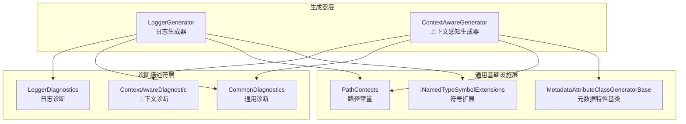
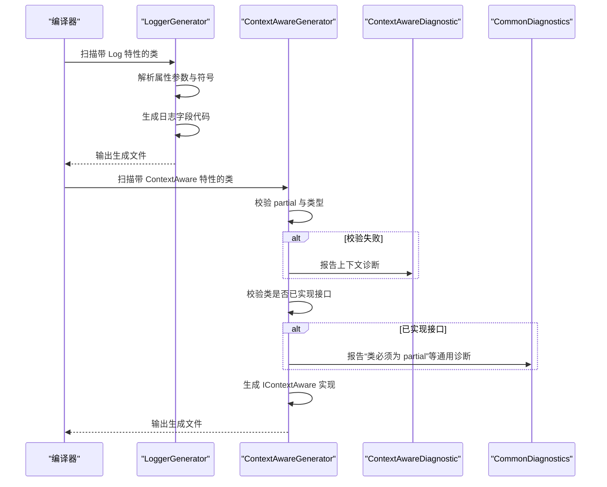
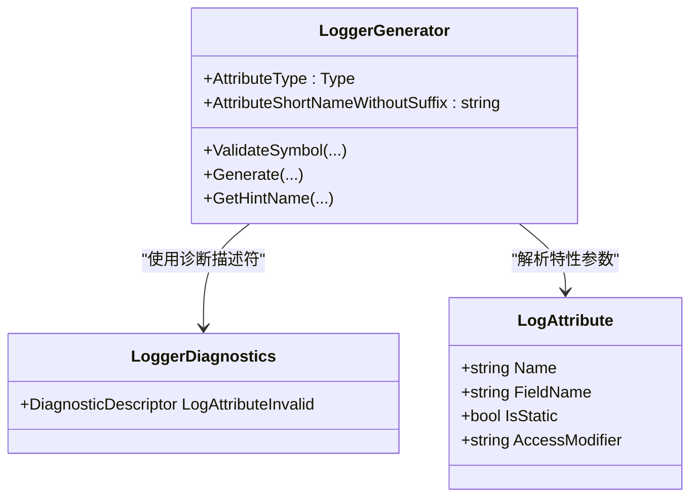
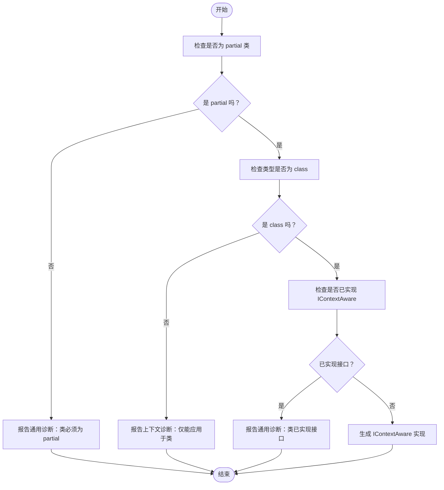
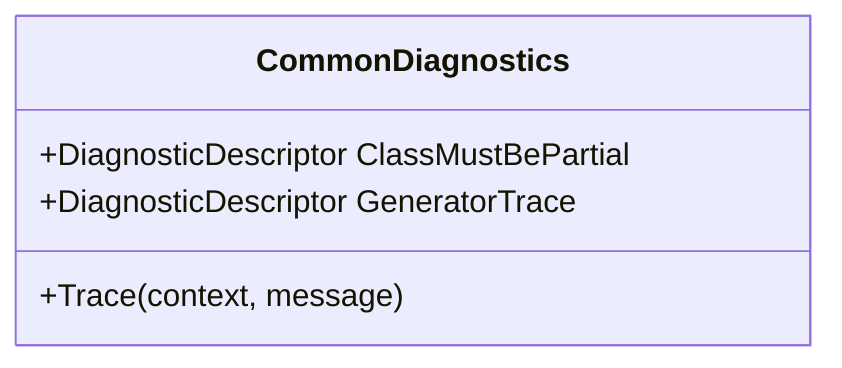
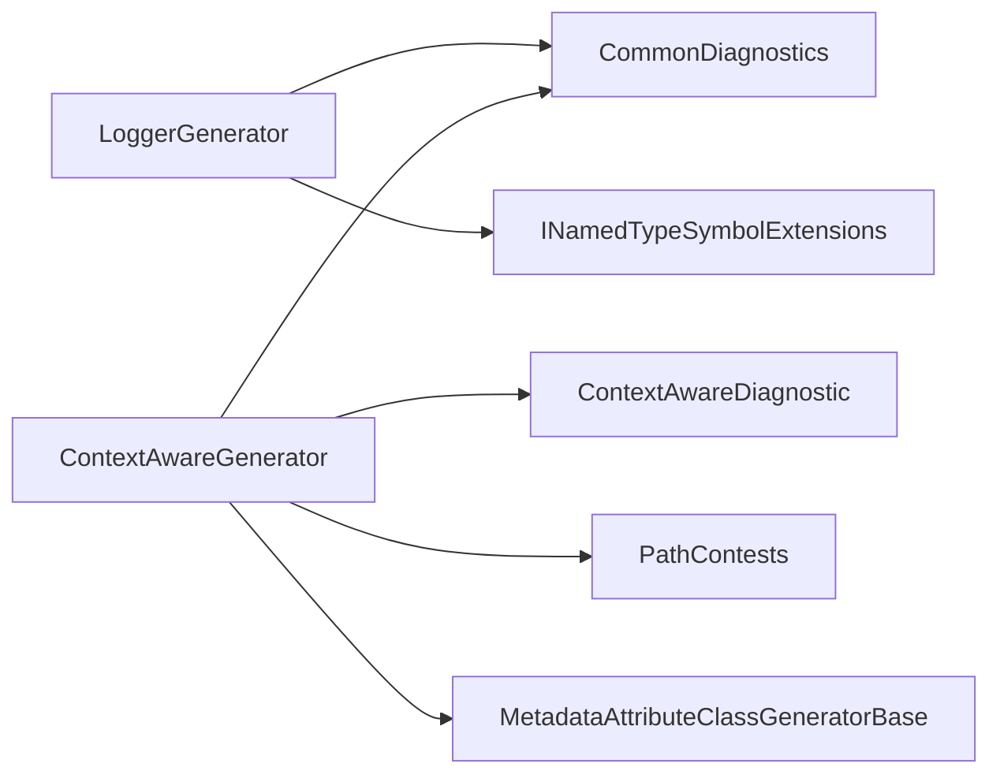

# 诊断系统

<cite>
**本文引用的文件**
- [GFramework.SourceGenerators\diagnostics\LoggerDiagnostic.cs](file://GFramework.SourceGenerators/diagnostics/LoggerDiagnostic.cs)
- [GFramework.SourceGenerators\diagnostics\ContextAwareDiagnostic.cs](file://GFramework.SourceGenerators/diagnostics/ContextAwareDiagnostic.cs)
- [GFramework.SourceGenerators.Common\diagnostics\CommonDiagnostics.cs](file://GFramework.SourceGenerators.Common/diagnostics/CommonDiagnostics.cs)
- [GFramework.SourceGenerators.Common\constants\PathContests.cs](file://GFramework.SourceGenerators.Common/constants/PathContests.cs)
- [GFramework.SourceGenerators.Common\generator\MetadataAttributeClassGeneratorBase.cs](file://GFramework.SourceGenerators.Common/generator/MetadataAttributeClassGeneratorBase.cs)
- [GFramework.SourceGenerators.Common\extensions\INamedTypeSymbolExtensions.cs](file://GFramework.SourceGenerators.Common/extensions/INamedTypeSymbolExtensions.cs)
- [GFramework.SourceGenerators\logging\LoggerGenerator.cs](file://GFramework.SourceGenerators/logging/LoggerGenerator.cs)
- [GFramework.SourceGenerators\rule\ContextAwareGenerator.cs](file://GFramework.SourceGenerators/rule/ContextAwareGenerator.cs)
- [GFramework.SourceGenerators.Abstractions\logging\LogAttribute.cs](file://GFramework.SourceGenerators.Abstractions/logging/LogAttribute.cs)
- [GFramework.SourceGenerators.Abstractions\rule\ContextAwareAttribute.cs](file://GFramework.SourceGenerators.Abstractions/rule/ContextAwareAttribute.cs)
- [GFramework.SourceGenerators\README.md](file://GFramework.SourceGenerators/README.md)
- [GFramework.SourceGenerators.Tests\rule\ContextAwareGeneratorSnapshotTests.cs](file://GFramework.SourceGenerators.Tests/rule/ContextAwareGeneratorSnapshotTests.cs)
- [GFramework.SourceGenerators.Tests\logging\LoggerGeneratorSnapshotTests.cs](file://GFramework.SourceGenerators.Tests/logging/LoggerGeneratorSnapshotTests.cs)
</cite>

## 目录
1. [简介](#简介)
2. [项目结构](#项目结构)
3. [核心组件](#核心组件)
4. [架构总览](#架构总览)
5. [详细组件分析](#详细组件分析)
6. [依赖关系分析](#依赖关系分析)
7. [性能考量](#性能考量)
8. [故障排除指南](#故障排除指南)
9. [结论](#结论)
10. [附录](#附录)

## 简介
本文件面向 GFramework 源代码生成器的诊断系统，系统性阐述诊断机制、错误码定义、诊断信息收集与报告流程，以及如何通过诊断改进代码质量与开发体验。重点覆盖以下内容：
- LoggerDiagnostic 与 ContextAwareDiagnostic 的错误检测机制与报告流程
- CommonDiagnostics 提供的通用诊断能力与错误码
- 诊断信息在编译时的收集、分析与报告过程
- 诊断系统的配置与自定义方法
- 常见诊断场景与解决方案
- 调试生成器问题的技巧与工具
- 最佳实践与故障排除指南

## 项目结构
诊断系统主要分布在三个层次：
- 生成器层：负责在编译时扫描特性、生成代码，并在必要时报告诊断
- 诊断描述符层：集中定义各类诊断的 ID、消息、分类与严重级别
- 通用基础设施层：提供路径常量、元数据解析、符号扩展等支撑

图表来源
- [GFramework.SourceGenerators\logging\LoggerGenerator.cs](file://GFramework.SourceGenerators/logging/LoggerGenerator.cs#L15-L103)
- [GFramework.SourceGenerators\rule\ContextAwareGenerator.cs](file://GFramework.SourceGenerators/rule/ContextAwareGenerator.cs#L16-L234)
- [GFramework.SourceGenerators\diagnostics\LoggerDiagnostic.cs](file://GFramework.SourceGenerators/diagnostics/LoggerDiagnostic.cs#L8-L21)
- [GFramework.SourceGenerators\diagnostics\ContextAwareDiagnostic.cs](file://GFramework.SourceGenerators/diagnostics/ContextAwareDiagnostic.cs#L8-L21)
- [GFramework.SourceGenerators.Common\diagnostics\CommonDiagnostics.cs](file://GFramework.SourceGenerators.Common/diagnostics/CommonDiagnostics.cs#L8-L60)
- [GFramework.SourceGenerators.Common\constants\PathContests.cs](file://GFramework.SourceGenerators.Common/constants/PathContests.cs#L6-L42)
- [GFramework.SourceGenerators.Common\generator\MetadataAttributeClassGeneratorBase.cs](file://GFramework.SourceGenerators.Common/generator/MetadataAttributeClassGeneratorBase.cs#L9-L41)
- [GFramework.SourceGenerators.Common\extensions\INamedTypeSymbolExtensions.cs](file://GFramework.SourceGenerators.Common/extensions/INamedTypeSymbolExtensions.cs#L11-L108)

章节来源
- [GFramework.SourceGenerators\README.md](file://GFramework.SourceGenerators/README.md#L434-L513)

## 核心组件
- LoggerDiagnostics：定义日志生成器相关的诊断描述符，例如日志字段无效或冲突等情况
- ContextAwareDiagnostic：定义上下文感知生成器相关的诊断描述符，例如特性应用目标非法
- CommonDiagnostics：提供通用诊断描述符与跟踪方法，如“类必须为 partial”“生成器跟踪信息”
- LoggerGenerator：扫描带 Log 特性的类，生成日志字段；可结合诊断描述符进行语义校验
- ContextAwareGenerator：扫描带 ContextAware 特性的类，生成 IContextAware 实现；包含严格的类与 partial 校验
- 路径常量 PathContests：统一管理命名空间与路径，便于生成器与诊断共享
- 元数据特性基类 MetadataAttributeClassGeneratorBase：按元数据名称解析特性，简化生成器实现
- 符号扩展 INamedTypeSymbolExtensions：提供类型关键字、泛型参数与约束、完整类名、命名空间等解析

章节来源
- [GFramework.SourceGenerators\diagnostics\LoggerDiagnostic.cs](file://GFramework.SourceGenerators/diagnostics/LoggerDiagnostic.cs#L8-L21)
- [GFramework.SourceGenerators\diagnostics\ContextAwareDiagnostic.cs](file://GFramework.SourceGenerators/diagnostics/ContextAwareDiagnostic.cs#L8-L21)
- [GFramework.SourceGenerators.Common\diagnostics\CommonDiagnostics.cs](file://GFramework.SourceGenerators.Common/diagnostics/CommonDiagnostics.cs#L8-L60)
- [GFramework.SourceGenerators\logging\LoggerGenerator.cs](file://GFramework.SourceGenerators/logging/LoggerGenerator.cs#L15-L103)
- [GFramework.SourceGenerators\rule\ContextAwareGenerator.cs](file://GFramework.SourceGenerators/rule/ContextAwareGenerator.cs#L16-L234)
- [GFramework.SourceGenerators.Common\constants\PathContests.cs](file://GFramework.SourceGenerators.Common/constants/PathContests.cs#L6-L42)
- [GFramework.SourceGenerators.Common\generator\MetadataAttributeClassGeneratorBase.cs](file://GFramework.SourceGenerators.Common/generator/MetadataAttributeClassGeneratorBase.cs#L9-L41)
- [GFramework.SourceGenerators.Common\extensions\INamedTypeSymbolExtensions.cs](file://GFramework.SourceGenerators.Common/extensions/INamedTypeSymbolExtensions.cs#L11-L108)

## 架构总览
诊断系统围绕“特性扫描—语义校验—生成代码—报告诊断”的闭环工作。生成器在编译时解析特性，执行必要的语义校验，生成目标代码，并在发现异常时通过诊断描述符向 IDE/构建反馈。

图表来源
- [GFramework.SourceGenerators\rule\ContextAwareGenerator.cs](file://GFramework.SourceGenerators/rule/ContextAwareGenerator.cs#L39-L67)
- [GFramework.SourceGenerators\diagnostics\ContextAwareDiagnostic.cs](file://GFramework.SourceGenerators/diagnostics/ContextAwareDiagnostic.cs#L13-L20)
- [GFramework.SourceGenerators.Common\diagnostics\CommonDiagnostics.cs](file://GFramework.SourceGenerators.Common/diagnostics/CommonDiagnostics.cs#L20-L28)

## 详细组件分析

### LoggerDiagnostics 与 LoggerGenerator
- LoggerDiagnostics 定义了日志相关的诊断描述符，用于提示日志生成器无法生成有效日志字段的情况
- LoggerGenerator 负责扫描带 Log 特性的类，解析属性参数（如字段名、访问修饰符、是否静态），并生成日志字段代码
- 生成器通过符号扩展与路径常量，确保生成的命名空间、类型关键字与泛型约束正确

图表来源
- [GFramework.SourceGenerators\diagnostics\LoggerDiagnostic.cs](file://GFramework.SourceGenerators/diagnostics/LoggerDiagnostic.cs#L8-L21)
- [GFramework.SourceGenerators\logging\LoggerGenerator.cs](file://GFramework.SourceGenerators/logging/LoggerGenerator.cs#L15-L103)
- [GFramework.SourceGenerators.Abstractions\logging\LogAttribute.cs](file://GFramework.SourceGenerators.Abstractions/logging/LogAttribute.cs#L10-L40)

章节来源
- [GFramework.SourceGenerators\diagnostics\LoggerDiagnostic.cs](file://GFramework.SourceGenerators/diagnostics/LoggerDiagnostic.cs#L8-L21)
- [GFramework.SourceGenerators\logging\LoggerGenerator.cs](file://GFramework.SourceGenerators/logging/LoggerGenerator.cs#L15-L103)
- [GFramework.SourceGenerators.Abstractions\logging\LogAttribute.cs](file://GFramework.SourceGenerators.Abstractions/logging/LogAttribute.cs#L10-L40)

### ContextAwareDiagnostic 与 ContextAwareGenerator
- ContextAwareDiagnostic 定义了上下文感知相关的诊断描述符，例如特性仅能应用于类
- ContextAwareGenerator 执行严格校验：要求类必须为 partial、必须为 class 类型；若类已实现 IContextAware 接口，则报告通用诊断
- 生成器通过元数据特性基类按特性元数据名称解析特性，再生成显式接口实现

图表来源
- [GFramework.SourceGenerators\rule\ContextAwareGenerator.cs](file://GFramework.SourceGenerators/rule/ContextAwareGenerator.cs#L39-L67)
- [GFramework.SourceGenerators\diagnostics\ContextAwareDiagnostic.cs](file://GFramework.SourceGenerators/diagnostics/ContextAwareDiagnostic.cs#L13-L20)
- [GFramework.SourceGenerators.Common\diagnostics\CommonDiagnostics.cs](file://GFramework.SourceGenerators.Common/diagnostics/CommonDiagnostics.cs#L20-L28)

章节来源
- [GFramework.SourceGenerators\diagnostics\ContextAwareDiagnostic.cs](file://GFramework.SourceGenerators/diagnostics/ContextAwareDiagnostic.cs#L8-L21)
- [GFramework.SourceGenerators\rule\ContextAwareGenerator.cs](file://GFramework.SourceGenerators/rule/ContextAwareGenerator.cs#L16-L234)
- [GFramework.SourceGenerators.Common\diagnostics\CommonDiagnostics.cs](file://GFramework.SourceGenerators.Common/diagnostics/CommonDiagnostics.cs#L8-L60)

### CommonDiagnostics 与通用诊断能力
- ClassMustBePartial：当类未声明为 partial 时，报告错误级别的诊断
- GeneratorTrace：提供 Info 级别的跟踪信息，便于调试生成器行为
- Trace 方法：在生成过程中输出跟踪信息，辅助定位问题

图表来源
- [GFramework.SourceGenerators.Common\diagnostics\CommonDiagnostics.cs](file://GFramework.SourceGenerators.Common/diagnostics/CommonDiagnostics.cs#L8-L60)

章节来源
- [GFramework.SourceGenerators.Common\diagnostics\CommonDiagnostics.cs](file://GFramework.SourceGenerators.Common/diagnostics/CommonDiagnostics.cs#L8-L60)

### 路径常量与元数据解析
- PathContests：集中定义命名空间常量，确保生成器与诊断共享一致的命名空间
- MetadataAttributeClassGeneratorBase：按特性元数据名称解析特性，简化生成器实现
- INamedTypeSymbolExtensions：提供类型关键字、泛型参数与约束、完整类名、命名空间等解析能力

章节来源
- [GFramework.SourceGenerators.Common\constants\PathContests.cs](file://GFramework.SourceGenerators.Common/constants/PathContests.cs#L6-L42)
- [GFramework.SourceGenerators.Common\generator\MetadataAttributeClassGeneratorBase.cs](file://GFramework.SourceGenerators.Common/generator/MetadataAttributeClassGeneratorBase.cs#L9-L41)
- [GFramework.SourceGenerators.Common\extensions\INamedTypeSymbolExtensions.cs](file://GFramework.SourceGenerators.Common/extensions/INamedTypeSymbolExtensions.cs#L11-L108)

## 依赖关系分析
- 生成器依赖诊断描述符与通用基础设施
- ContextAwareGenerator 依赖上下文诊断与通用诊断
- LoggerGenerator 依赖通用诊断与符号扩展
- 两者均依赖路径常量与元数据解析基类

图表来源
- [GFramework.SourceGenerators\logging\LoggerGenerator.cs](file://GFramework.SourceGenerators/logging/LoggerGenerator.cs#L15-L103)
- [GFramework.SourceGenerators\rule\ContextAwareGenerator.cs](file://GFramework.SourceGenerators/rule/ContextAwareGenerator.cs#L16-L234)
- [GFramework.SourceGenerators.Common\diagnostics\CommonDiagnostics.cs](file://GFramework.SourceGenerators.Common/diagnostics/CommonDiagnostics.cs#L8-L60)
- [GFramework.SourceGenerators\diagnostics\ContextAwareDiagnostic.cs](file://GFramework.SourceGenerators/diagnostics/ContextAwareDiagnostic.cs#L8-L21)
- [GFramework.SourceGenerators.Common\constants\PathContests.cs](file://GFramework.SourceGenerators.Common/constants/PathContests.cs#L6-L42)
- [GFramework.SourceGenerators.Common\generator\MetadataAttributeClassGeneratorBase.cs](file://GFramework.SourceGenerators.Common/generator/MetadataAttributeClassGeneratorBase.cs#L9-L41)
- [GFramework.SourceGenerators.Common\extensions\INamedTypeSymbolExtensions.cs](file://GFramework.SourceGenerators.Common/extensions/INamedTypeSymbolExtensions.cs#L11-L108)

## 性能考量
- 诊断系统在编译时运行，零运行时开销
- 通过增量编译与合理的诊断粒度，降低构建时间
- 生成的代码在运行时无反射或动态调用，性能接近手写代码

章节来源
- [GFramework.SourceGenerators\README.md](file://GFramework.SourceGenerators/README.md#L514-L564)

## 故障排除指南
- GF_Logging_001：日志字段名冲突
  - 现象：日志生成器提示字段名冲突
  - 解决：更改 Log 特性的字段名或移除冲突字段
- GF_Rule_001：上下文感知类型非法
  - 现象：ContextAwareAttribute 应用于非类类型
  - 解决：将特性应用于 class，或移除特性
- 通用诊断 GF_Common_Class_001：类必须为 partial
  - 现象：类未声明为 partial
  - 解决：添加 partial 关键字
- 调试技巧
  - 使用 CommonDiagnostics.Trace 输出生成器内部状态
  - 结合快照测试验证生成器输出一致性
  - 在 IDE 中查看诊断信息，定位具体语法位置

章节来源
- [GFramework.SourceGenerators\README.md](file://GFramework.SourceGenerators/README.md#L434-L513)
- [GFramework.SourceGenerators.Common\diagnostics\CommonDiagnostics.cs](file://GFramework.SourceGenerators.Common/diagnostics/CommonDiagnostics.cs#L53-L59)
- [GFramework.SourceGenerators.Tests\rule\ContextAwareGeneratorSnapshotTests.cs](file://GFramework.SourceGenerators.Tests/rule/ContextAwareGeneratorSnapshotTests.cs#L19-L84)
- [GFramework.SourceGenerators.Tests\logging\LoggerGeneratorSnapshotTests.cs](file://GFramework.SourceGenerators.Tests/logging/LoggerGeneratorSnapshotTests.cs#L10-L591)

## 结论
诊断系统通过清晰的描述符定义、严格的生成器校验与可追踪的诊断输出，为 GFramework 源代码生成器提供了可靠的编译时质量保障。遵循本文的最佳实践与故障排除建议，可显著提升代码质量与开发体验。

## 附录

### 错误码与严重级别对照
- GF_Logging_001：日志生成器相关警告
- GF_Rule_001：上下文感知类型错误（错误）
- GF_Common_Class_001：类必须为 partial（错误）
- GF_Common_Trace_001：生成器跟踪信息（信息）

章节来源
- [GFramework.SourceGenerators\diagnostics\LoggerDiagnostic.cs](file://GFramework.SourceGenerators/diagnostics/LoggerDiagnostic.cs#L13-L20)
- [GFramework.SourceGenerators\diagnostics\ContextAwareDiagnostic.cs](file://GFramework.SourceGenerators/diagnostics/ContextAwareDiagnostic.cs#L13-L20)
- [GFramework.SourceGenerators.Common\diagnostics\CommonDiagnostics.cs](file://GFramework.SourceGenerators.Common/diagnostics/CommonDiagnostics.cs#L20-L48)