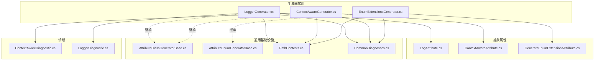
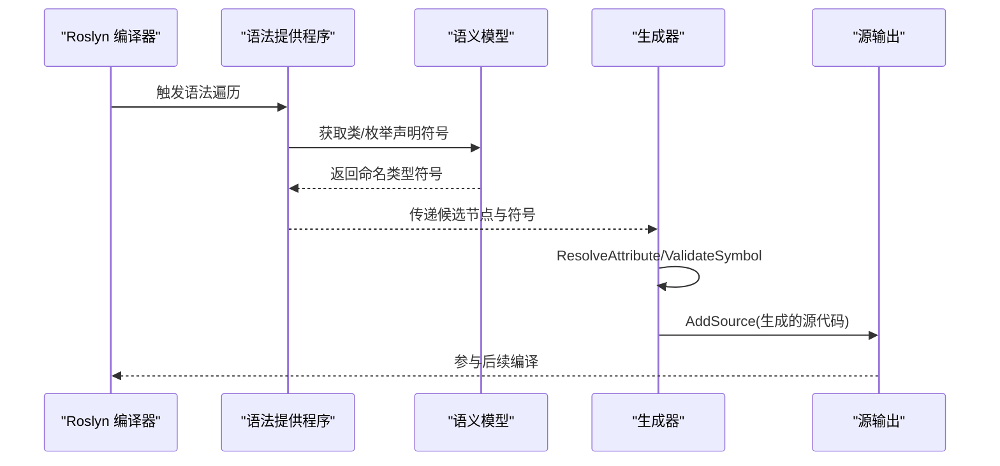
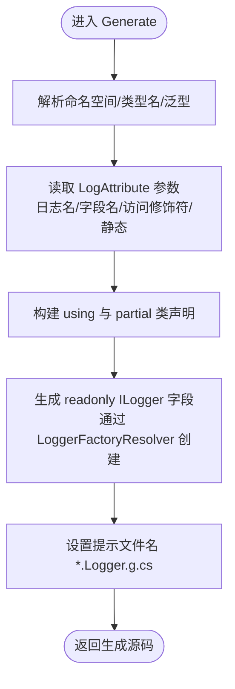
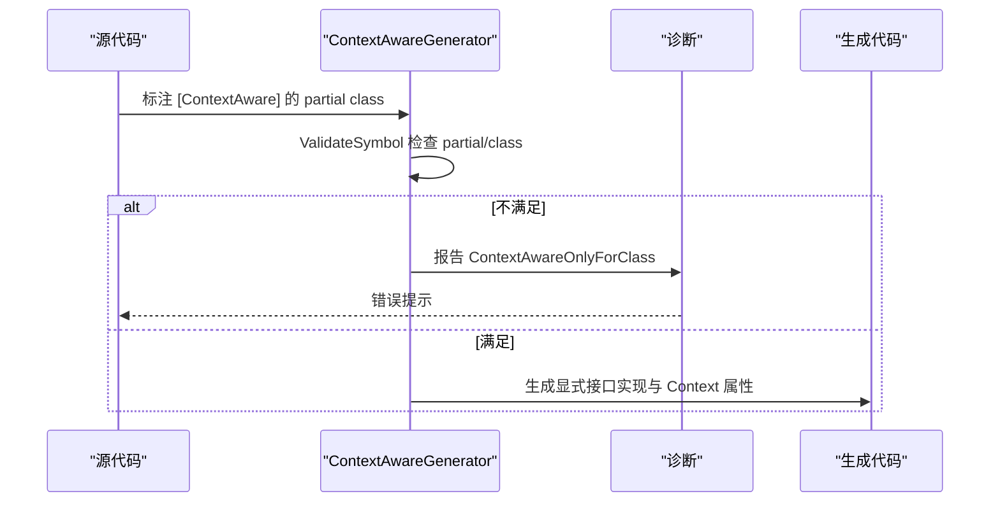
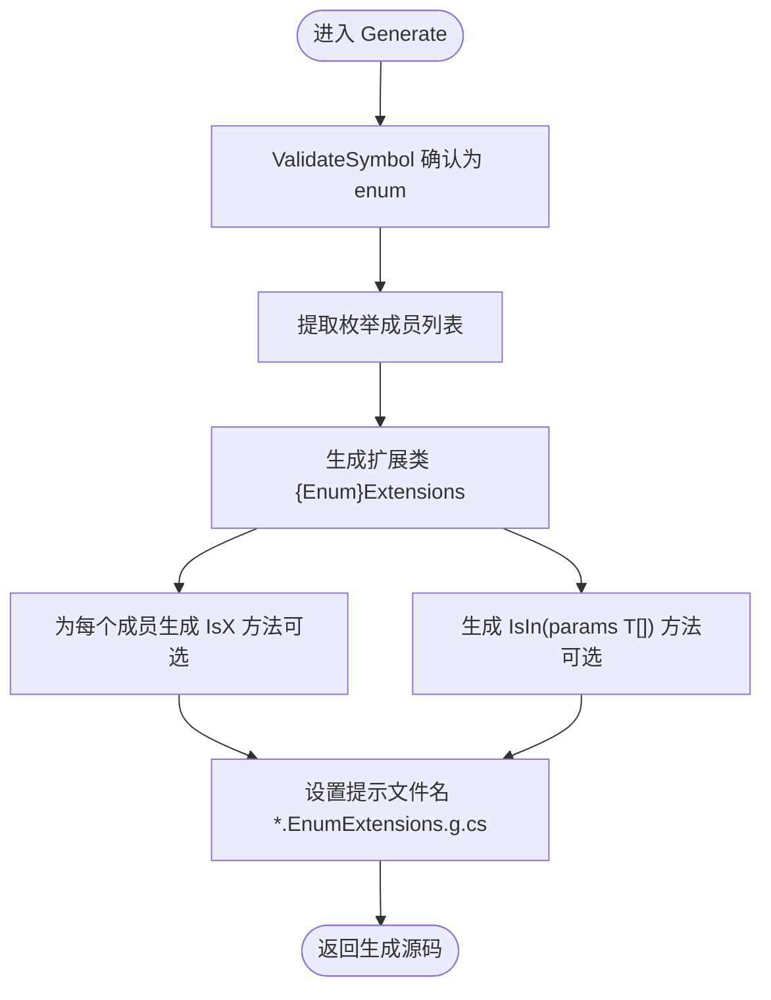
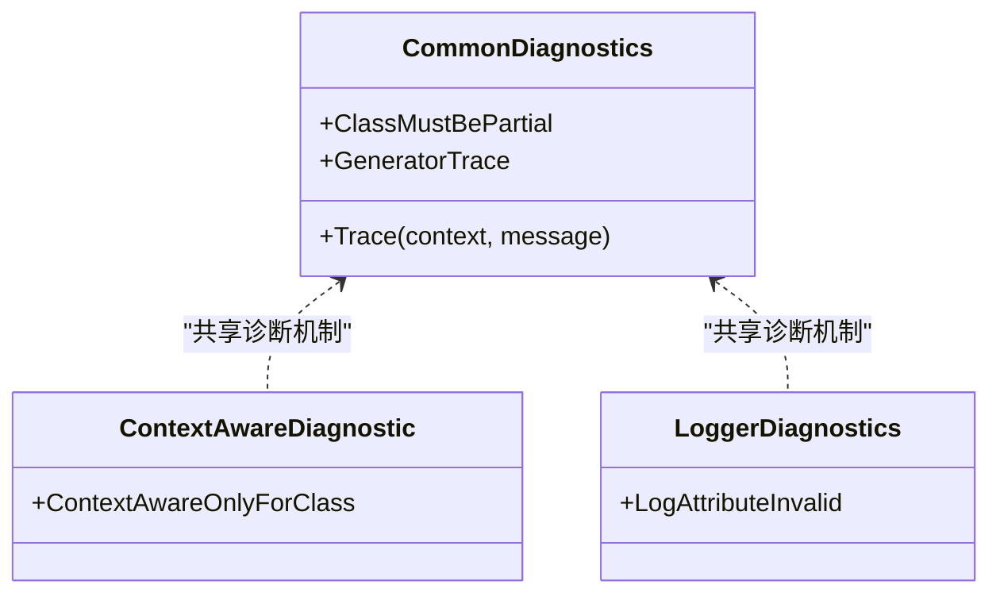
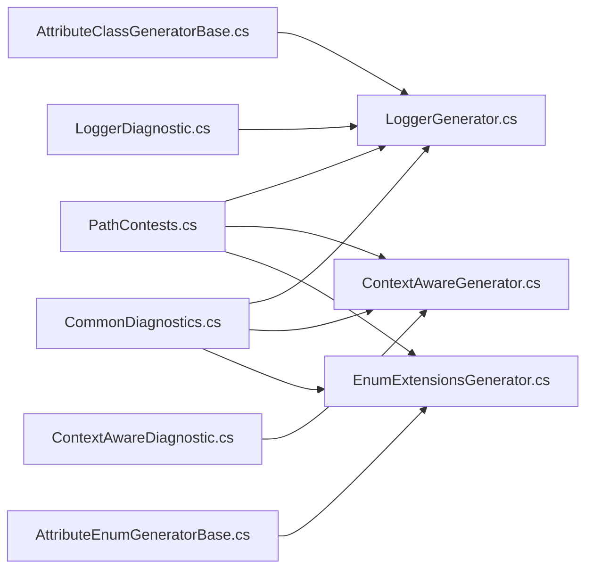

# 通用源代码生成器

<cite>
**本文引用的文件**
- [LoggerGenerator.cs](file://GFramework.SourceGenerators/logging/LoggerGenerator.cs)
- [ContextAwareGenerator.cs](file://GFramework.SourceGenerators/rule/ContextAwareGenerator.cs)
- [EnumExtensionsGenerator.cs](file://GFramework.SourceGenerators/enums/EnumExtensionsGenerator.cs)
- [LogAttribute.cs](file://GFramework.SourceGenerators.Abstractions/logging/LogAttribute.cs)
- [ContextAwareAttribute.cs](file://GFramework.SourceGenerators.Abstractions/rule/ContextAwareAttribute.cs)
- [GenerateEnumExtensionsAttribute.cs](file://GFramework.SourceGenerators.Abstractions/enums/GenerateEnumExtensionsAttribute.cs)
- [ContextAwareDiagnostic.cs](file://GFramework.SourceGenerators/diagnostics/ContextAwareDiagnostic.cs)
- [LoggerDiagnostic.cs](file://GFramework.SourceGenerators/diagnostics/LoggerDiagnostic.cs)
- [AttributeClassGeneratorBase.cs](file://GFramework.SourceGenerators.Common/generator/AttributeClassGeneratorBase.cs)
- [AttributeEnumGeneratorBase.cs](file://GFramework.SourceGenerators.Common/generator/AttributeEnumGeneratorBase.cs)
- [PathContests.cs](file://GFramework.SourceGenerators.Common/constants/PathContests.cs)
- [CommonDiagnostics.cs](file://GFramework.SourceGenerators.Common/diagnostics/CommonDiagnostics.cs)
- [LoggerGeneratorSnapshotTests.cs](file://GFramework.SourceGenerators.Tests/logging/LoggerGeneratorSnapshotTests.cs)
- [ContextAwareGeneratorSnapshotTests.cs](file://GFramework.SourceGenerators.Tests/rule/ContextAwareGeneratorSnapshotTests.cs)
- [EnumExtensionsGeneratorSnapshotTests.cs](file://GFramework.SourceGenerators.Tests/enums/EnumExtensionsGeneratorSnapshotTests.cs)
</cite>

## 目录
1. [简介](#简介)
2. [项目结构](#项目结构)
3. [核心组件](#核心组件)
4. [架构总览](#架构总览)
5. [详细组件分析](#详细组件分析)
6. [依赖关系分析](#依赖关系分析)
7. [性能考量](#性能考量)
8. [故障排查指南](#故障排查指南)
9. [结论](#结论)
10. [附录](#附录)

## 简介
本技术文档围绕通用源代码生成器展开，重点解析以下三个生成器的工作机制与使用方式：
- LoggerGenerator：基于 LogAttribute 属性为类自动生成日志记录器字段，并通过日志工厂解析器创建 ILogger 实例。
- ContextAwareGenerator：基于 ContextAwareAttribute 属性为类自动生成 IContextAware 接口实现，提供上下文访问与显式接口实现。
- EnumExtensionsGenerator：基于 GenerateEnumExtensionsAttribute 属性为枚举生成扩展方法，包括 IsX 与 IsIn 扩展。

同时，文档阐述诊断系统（ContextAwareDiagnostic、LoggerDiagnostic）的错误检测与报告机制，给出各生成器的使用示例、配置选项与最佳实践，并解释生成器的性能特点与零运行时开销的设计理念。

## 项目结构
本仓库采用分层与按功能域划分的组织方式：
- GFramework.SourceGenerators：具体生成器实现（LoggerGenerator、ContextAwareGenerator、EnumExtensionsGenerator）
- GFramework.SourceGenerators.Abstractions：生成器所用的属性定义（LogAttribute、ContextAwareAttribute、GenerateEnumExtensionsAttribute）
- GFramework.SourceGenerators.Common：通用生成器基类、常量与诊断工具
- GFramework.SourceGenerators.Tests：各生成器的快照测试，用于验证生成代码的正确性

图表来源
- [LoggerGenerator.cs](file://GFramework.SourceGenerators/logging/LoggerGenerator.cs#L15-L103)
- [ContextAwareGenerator.cs](file://GFramework.SourceGenerators/rule/ContextAwareGenerator.cs#L16-L234)
- [EnumExtensionsGenerator.cs](file://GFramework.SourceGenerators/enums/EnumExtensionsGenerator.cs#L14-L114)
- [LogAttribute.cs](file://GFramework.SourceGenerators.Abstractions/logging/LogAttribute.cs#L9-L40)
- [ContextAwareAttribute.cs](file://GFramework.SourceGenerators.Abstractions/rule/ContextAwareAttribute.cs#L8-L11)
- [GenerateEnumExtensionsAttribute.cs](file://GFramework.SourceGenerators.Abstractions/enums/GenerateEnumExtensionsAttribute.cs#L8-L20)
- [AttributeClassGeneratorBase.cs](file://GFramework.SourceGenerators.Common/generator/AttributeClassGeneratorBase.cs#L12-L175)
- [AttributeEnumGeneratorBase.cs](file://GFramework.SourceGenerators.Common/generator/AttributeEnumGeneratorBase.cs#L10-L104)
- [PathContests.cs](file://GFramework.SourceGenerators.Common/constants/PathContests.cs#L6-L42)
- [CommonDiagnostics.cs](file://GFramework.SourceGenerators.Common/diagnostics/CommonDiagnostics.cs#L8-L60)
- [ContextAwareDiagnostic.cs](file://GFramework.SourceGenerators/diagnostics/ContextAwareDiagnostic.cs#L8-L21)
- [LoggerDiagnostic.cs](file://GFramework.SourceGenerators/diagnostics/LoggerDiagnostic.cs#L8-L21)

章节来源
- [LoggerGenerator.cs](file://GFramework.SourceGenerators/logging/LoggerGenerator.cs#L10-L103)
- [ContextAwareGenerator.cs](file://GFramework.SourceGenerators/rule/ContextAwareGenerator.cs#L11-L234)
- [EnumExtensionsGenerator.cs](file://GFramework.SourceGenerators/enums/EnumExtensionsGenerator.cs#L9-L114)
- [AttributeClassGeneratorBase.cs](file://GFramework.SourceGenerators.Common/generator/AttributeClassGeneratorBase.cs#L12-L175)
- [AttributeEnumGeneratorBase.cs](file://GFramework.SourceGenerators.Common/generator/AttributeEnumGeneratorBase.cs#L10-L104)
- [PathContests.cs](file://GFramework.SourceGenerators.Common/constants/PathContests.cs#L6-L42)
- [CommonDiagnostics.cs](file://GFramework.SourceGenerators.Common/diagnostics/CommonDiagnostics.cs#L8-L60)

## 核心组件
本节概述三个生成器的核心职责与关键行为：
- LoggerGenerator：扫描带 LogAttribute 的类，生成 readonly ILogger 字段并通过 LoggerFactoryResolver 创建实例；支持自定义日志名、字段名、访问修饰符与静态/实例字段。
- ContextAwareGenerator：扫描带 ContextAwareAttribute 的类，生成对 IContextAware 的显式接口实现，自动生成 Context 属性与 SetContext/GetContext 的实现；强制类为 partial 并限制为 class。
- EnumExtensionsGenerator：扫描带 GenerateEnumExtensionsAttribute 的枚举，生成扩展类与扩展方法，包括每个枚举项的 IsX 判断与 IsIn 多值判断。

章节来源
- [LoggerGenerator.cs](file://GFramework.SourceGenerators/logging/LoggerGenerator.cs#L15-L103)
- [ContextAwareGenerator.cs](file://GFramework.SourceGenerators/rule/ContextAwareGenerator.cs#L16-L234)
- [EnumExtensionsGenerator.cs](file://GFramework.SourceGenerators/enums/EnumExtensionsGenerator.cs#L14-L114)

## 架构总览
生成器遵循 Roslyn 增量生成器模式，通过语法提供程序筛选候选节点，结合语义模型解析属性与符号，再生成源代码并注册到编译产物中。通用基类负责流程控制与诊断输出，具体生成器聚焦于模板生成与命名空间/类型解析。

图表来源
- [AttributeClassGeneratorBase.cs](file://GFramework.SourceGenerators.Common/generator/AttributeClassGeneratorBase.cs#L23-L113)
- [AttributeEnumGeneratorBase.cs](file://GFramework.SourceGenerators.Common/generator/AttributeEnumGeneratorBase.cs#L21-L56)

## 详细组件分析

### LoggerGenerator 日志记录器生成机制
- 属性与入口
  - 使用 LogAttribute 标注类，生成器继承 AttributeClassGeneratorBase，通过 AttributeShortNameWithoutSuffix 快速筛选含“Log”的类声明。
- 生成逻辑
  - 解析类的命名空间、完整类型名、泛型参数与约束，读取 LogAttribute 的构造参数与命名参数（日志名、字段名、访问修饰符、是否静态）。
  - 生成 using 引用核心抽象与具体实现命名空间，输出 partial 类并在其中声明 readonly ILogger 字段，初始化调用 LoggerFactoryResolver.Provider.CreateLogger(...)。
- 文件命名
  - 生成文件名为 {ClassName}.Logger.g.cs，便于识别与覆盖。

图表来源
- [LoggerGenerator.cs](file://GFramework.SourceGenerators/logging/LoggerGenerator.cs#L51-L103)
- [LogAttribute.cs](file://GFramework.SourceGenerators.Abstractions/logging/LogAttribute.cs#L9-L40)
- [PathContests.cs](file://GFramework.SourceGenerators.Common/constants/PathContests.cs#L6-L42)

章节来源
- [LoggerGenerator.cs](file://GFramework.SourceGenerators/logging/LoggerGenerator.cs#L15-L103)
- [LogAttribute.cs](file://GFramework.SourceGenerators.Abstractions/logging/LogAttribute.cs#L9-L40)
- [AttributeClassGeneratorBase.cs](file://GFramework.SourceGenerators.Common/generator/AttributeClassGeneratorBase.cs#L23-L113)
- [PathContests.cs](file://GFramework.SourceGenerators.Common/constants/PathContests.cs#L6-L42)

使用示例与最佳实践
- 示例参考快照测试：默认配置、自定义日志名、自定义字段名、实例字段、公开字段、泛型类等场景均在测试中覆盖。
- 最佳实践
  - 保持类为 partial，避免生成失败。
  - 合理设置日志名，便于日志聚合与过滤。
  - 默认静态字段可减少实例化成本，如需实例化日志请设置 IsStatic=false。
  - 访问修饰符按需调整，但建议保持私有封装。

章节来源
- [LoggerGeneratorSnapshotTests.cs](file://GFramework.SourceGenerators.Tests/logging/LoggerGeneratorSnapshotTests.cs#L10-L591)

### ContextAwareGenerator 上下文感知接口生成
- 属性与入口
  - 使用 ContextAwareAttribute 标注类，生成器继承 MetadataAttributeClassGeneratorBase，通过属性元数据名精确匹配。
- 生成逻辑
  - 校验类必须为 partial class；若不满足则报告诊断。
  - 生成 partial class 并显式实现 IContextAware 接口，生成 Context 属性（懒加载，首次使用时从 GameContext.GetFirstArchitectureContext 获取），以及 SetContext/GetContext 的显式实现。
- 文件命名
  - 生成文件名为 {ClassName}.ContextAware.g.cs。

图表来源
- [ContextAwareGenerator.cs](file://GFramework.SourceGenerators/rule/ContextAwareGenerator.cs#L39-L122)
- [ContextAwareDiagnostic.cs](file://GFramework.SourceGenerators/diagnostics/ContextAwareDiagnostic.cs#L13-L20)

章节来源
- [ContextAwareGenerator.cs](file://GFramework.SourceGenerators/rule/ContextAwareGenerator.cs#L16-L234)
- [ContextAwareAttribute.cs](file://GFramework.SourceGenerators.Abstractions/rule/ContextAwareAttribute.cs#L8-L11)
- [ContextAwareDiagnostic.cs](file://GFramework.SourceGenerators/diagnostics/ContextAwareDiagnostic.cs#L8-L21)
- [CommonDiagnostics.cs](file://GFramework.SourceGenerators.Common/diagnostics/CommonDiagnostics.cs#L20-L28)

使用示例与最佳实践
- 示例参考快照测试：partial class 且实现 IContextAware 的场景已覆盖。
- 最佳实践
  - 严格使用 partial class，避免显式接口实现冲突。
  - 将上下文访问封装在受保护属性中，避免直接暴露内部状态。
  - 如需自定义上下文来源，可在派生类中重写 Context 属性或 SetContext 行为。

章节来源
- [ContextAwareGeneratorSnapshotTests.cs](file://GFramework.SourceGenerators.Tests/rule/ContextAwareGeneratorSnapshotTests.cs#L19-L84)

### EnumExtensionsGenerator 枚举扩展方法生成
- 属性与入口
  - 使用 GenerateEnumExtensionsAttribute 标注枚举，生成器继承 AttributeEnumGeneratorBase，通过属性元数据名匹配。
- 生成逻辑
  - 校验目标为 enum；若非枚举则报告诊断。
  - 生成扩展类 {EnumName}Extensions，包含：
    - 每个枚举项的 IsX 判断方法（可禁用）
    - IsIn(params T[]) 多值判断方法（可禁用）
- 文件命名
  - 生成文件名为 {EnumName}.EnumExtensions.g.cs。

图表来源
- [EnumExtensionsGenerator.cs](file://GFramework.SourceGenerators/enums/EnumExtensionsGenerator.cs#L37-L114)
- [GenerateEnumExtensionsAttribute.cs](file://GFramework.SourceGenerators.Abstractions/enums/GenerateEnumExtensionsAttribute.cs#L8-L20)

章节来源
- [EnumExtensionsGenerator.cs](file://GFramework.SourceGenerators/enums/EnumExtensionsGenerator.cs#L14-L114)
- [GenerateEnumExtensionsAttribute.cs](file://GFramework.SourceGenerators.Abstractions/enums/GenerateEnumExtensionsAttribute.cs#L8-L20)
- [AttributeEnumGeneratorBase.cs](file://GFramework.SourceGenerators.Common/generator/AttributeEnumGeneratorBase.cs#L21-L56)

使用示例与最佳实践
- 示例参考快照测试：基础枚举、Flags 枚举、禁用 IsMethods/IsInMethod 等场景均已覆盖。
- 最佳实践
  - Flags 枚举可保留 IsIn 以简化多标志判断。
  - 当枚举项较多时，可关闭 IsX 以减少扩展类体积。

章节来源
- [EnumExtensionsGeneratorSnapshotTests.cs](file://GFramework.SourceGenerators.Tests/enums/EnumExtensionsGeneratorSnapshotTests.cs#L10-L208)

### 诊断系统工作原理
- 通用诊断
  - ClassMustBePartial：当类未声明为 partial 时报告错误，确保生成器能与现有代码合并。
  - GeneratorTrace：用于生成器内部调试追踪，输出进入/退出、属性解析、验证与生成阶段的信息。
- 特定诊断
  - ContextAwareOnlyForClass：ContextAwareAttribute 仅允许用于 class。
  - LogAttributeInvalid：当 LogAttribute 无效时发出警告，提示生成器无法生成日志记录器。

图表来源
- [CommonDiagnostics.cs](file://GFramework.SourceGenerators.Common/diagnostics/CommonDiagnostics.cs#L8-L60)
- [ContextAwareDiagnostic.cs](file://GFramework.SourceGenerators/diagnostics/ContextAwareDiagnostic.cs#L8-L21)
- [LoggerDiagnostic.cs](file://GFramework.SourceGenerators/diagnostics/LoggerDiagnostic.cs#L8-L21)

章节来源
- [CommonDiagnostics.cs](file://GFramework.SourceGenerators.Common/diagnostics/CommonDiagnostics.cs#L8-L60)
- [ContextAwareDiagnostic.cs](file://GFramework.SourceGenerators.diagnostics/ContextAwareDiagnostic.cs#L8-L21)
- [LoggerDiagnostic.cs](file://GFramework.SourceGenerators.diagnostics/LoggerDiagnostic.cs#L8-L21)

## 依赖关系分析
- 命名空间与路径
  - 生成器通过 PathContests 统一管理核心抽象与实现的命名空间，保证生成代码的引用一致性。
- 基类耦合
  - 三类生成器均依赖通用基类，复用语法筛选、语义解析、验证与输出流程，降低重复代码。
- 诊断耦合
  - 生成器通过 CommonDiagnostics 输出统一的诊断信息，特定诊断由对应诊断类定义。

图表来源
- [PathContests.cs](file://GFramework.SourceGenerators.Common/constants/PathContests.cs#L6-L42)
- [AttributeClassGeneratorBase.cs](file://GFramework.SourceGenerators.Common/generator/AttributeClassGeneratorBase.cs#L12-L175)
- [AttributeEnumGeneratorBase.cs](file://GFramework.SourceGenerators.Common/generator/AttributeEnumGeneratorBase.cs#L10-L104)
- [CommonDiagnostics.cs](file://GFramework.SourceGenerators.Common/diagnostics/CommonDiagnostics.cs#L8-L60)
- [ContextAwareDiagnostic.cs](file://GFramework.SourceGenerators/diagnostics/ContextAwareDiagnostic.cs#L8-L21)
- [LoggerDiagnostic.cs](file://GFramework.SourceGenerators/diagnostics/LoggerDiagnostic.cs#L8-L21)

章节来源
- [PathContests.cs](file://GFramework.SourceGenerators.Common/constants/PathContests.cs#L6-L42)
- [AttributeClassGeneratorBase.cs](file://GFramework.SourceGenerators.Common/generator/AttributeClassGeneratorBase.cs#L12-L175)
- [AttributeEnumGeneratorBase.cs](file://GFramework.SourceGenerators.Common/generator/AttributeEnumGeneratorBase.cs#L10-L104)
- [CommonDiagnostics.cs](file://GFramework.SourceGenerators.Common/diagnostics/CommonDiagnostics.cs#L8-L60)

## 性能考量
- 零运行时开销
  - 生成器在编译期生成源代码，运行时仅使用已生成的字段/方法，不引入反射或动态绑定，具备零运行时开销。
- 生成效率
  - 通过语法提供程序与语义模型的组合，先进行语法粗筛再进行语义解析，减少不必要的处理。
- 内存与字符串拼接
  - 生成器使用 StringBuilder 拼接源码，避免频繁分配；仅在必要处进行命名空间与类型名解析。
- 诊断与可观测性
  - 通过 GeneratorTrace 输出生成阶段信息，便于定位问题与优化生成流程。

[本节为通用性能讨论，无需列出具体文件来源]

## 故障排查指南
- 常见问题与解决
  - 类未声明为 partial：生成器会报告 ClassMustBePartial 错误。请将目标类声明为 partial。
  - ContextAwareAttribute 应用于非 class：生成器会报告 ContextAwareOnlyForClass 错误。请确保标注在 class 上。
  - LogAttribute 无效：生成器会报告 LogAttributeInvalid 警告。检查属性参数与类声明是否满足生成条件。
- 调试建议
  - 查看编译输出中的诊断信息，确认生成器是否进入 Execute、属性是否解析成功、验证是否通过。
  - 使用快照测试对比生成结果，定位差异。

章节来源
- [CommonDiagnostics.cs](file://GFramework.SourceGenerators.Common/diagnostics/CommonDiagnostics.cs#L20-L28)
- [ContextAwareDiagnostic.cs](file://GFramework.SourceGenerators.diagnostics/ContextAwareDiagnostic.cs#L13-L20)
- [LoggerDiagnostic.cs](file://GFramework.SourceGenerators.diagnostics/LoggerDiagnostic.cs#L13-L20)
- [AttributeClassGeneratorBase.cs](file://GFramework.SourceGenerators.Common/generator/AttributeClassGeneratorBase.cs#L74-L113)

## 结论
本通用源代码生成器体系通过简洁的属性与强大的基类设计，实现了日志记录器、上下文感知接口与枚举扩展方法的自动化生成。其零运行时开销、清晰的诊断机制与完善的快照测试保障了生成质量与可维护性。遵循 partial 类约定与合理的属性配置，可显著提升开发效率与代码一致性。

[本节为总结性内容，无需列出具体文件来源]

## 附录
- 使用清单
  - LoggerGenerator：在类上添加 LogAttribute，配置日志名、字段名、访问修饰符与静态/实例字段。
  - ContextAwareGenerator：在类上添加 ContextAwareAttribute，确保类为 partial class 并实现 IContextAware。
  - EnumExtensionsGenerator：在枚举上添加 GenerateEnumExtensionsAttribute，按需启用 IsX 与 IsIn 方法。
- 快照测试参考
  - LoggerGenerator：涵盖默认配置、自定义日志名、字段名、实例字段、公开字段、泛型类等场景。
  - ContextAwareGenerator：涵盖 partial class 与 IContextAware 实现场景。
  - EnumExtensionsGenerator：涵盖基础枚举、Flags 枚举与禁用方法场景。

章节来源
- [LoggerGeneratorSnapshotTests.cs](file://GFramework.SourceGenerators.Tests/logging/LoggerGeneratorSnapshotTests.cs#L10-L591)
- [ContextAwareGeneratorSnapshotTests.cs](file://GFramework.SourceGenerators.Tests/rule/ContextAwareGeneratorSnapshotTests.cs#L19-L84)
- [EnumExtensionsGeneratorSnapshotTests.cs](file://GFramework.SourceGenerators.Tests/enums/EnumExtensionsGeneratorSnapshotTests.cs#L10-L208)