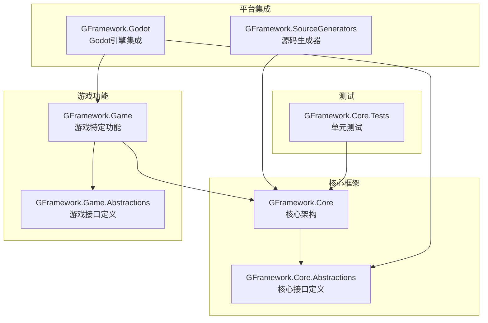
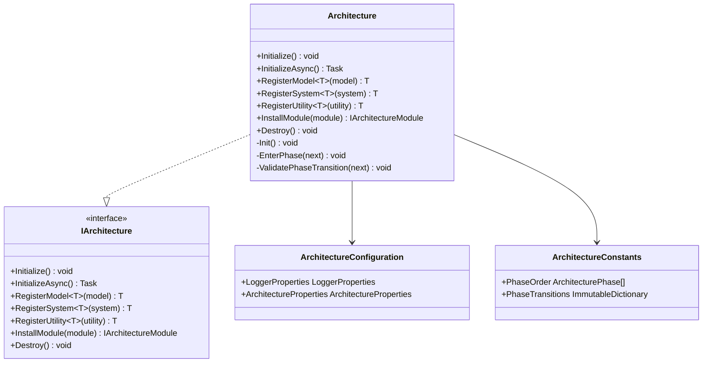
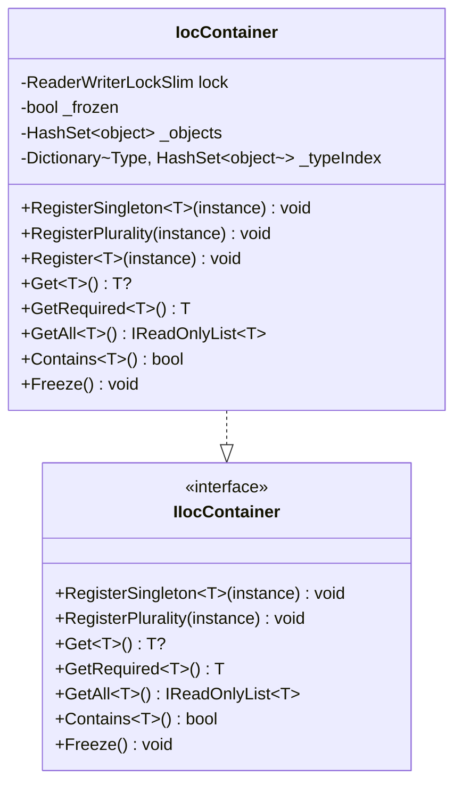
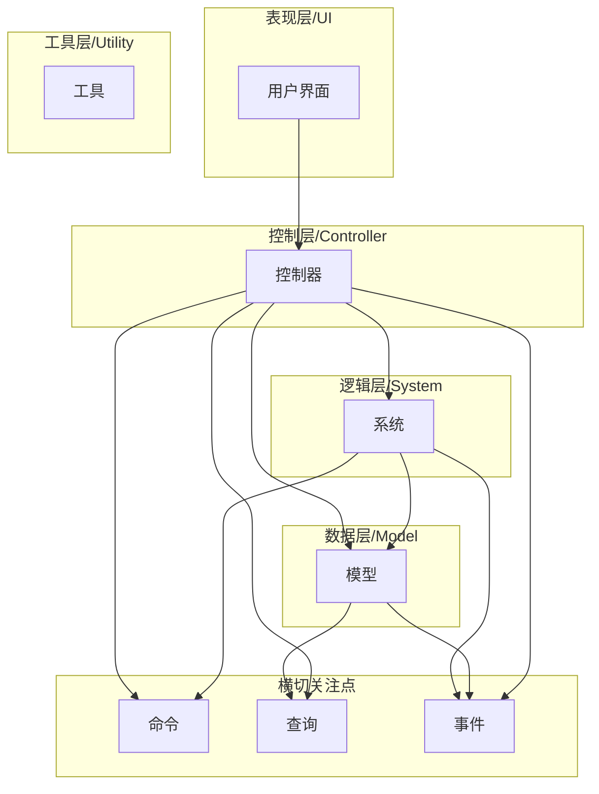
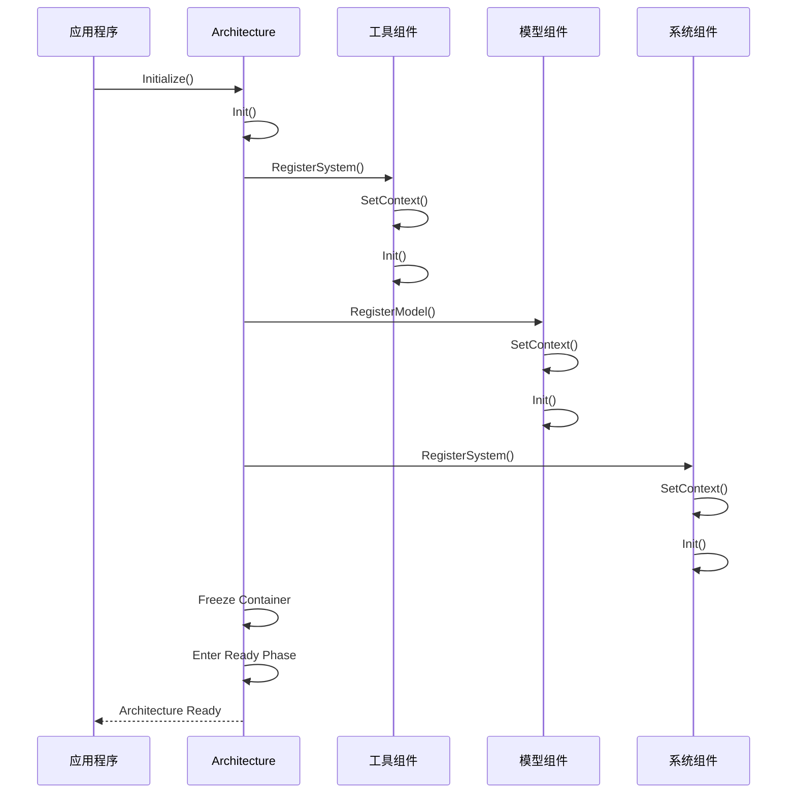
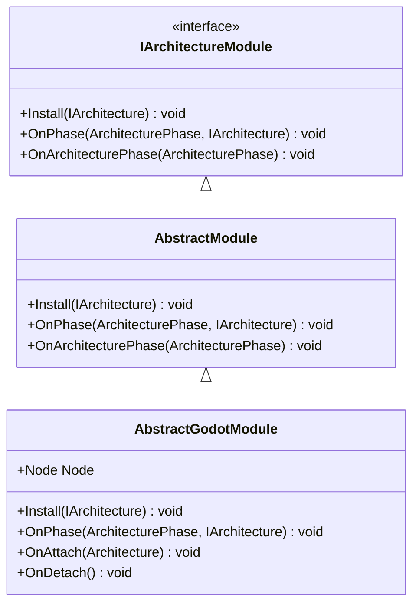
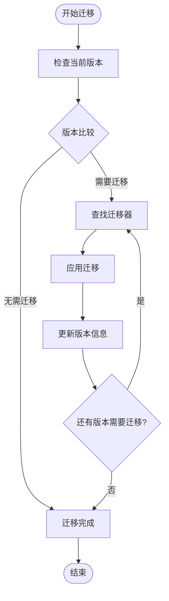
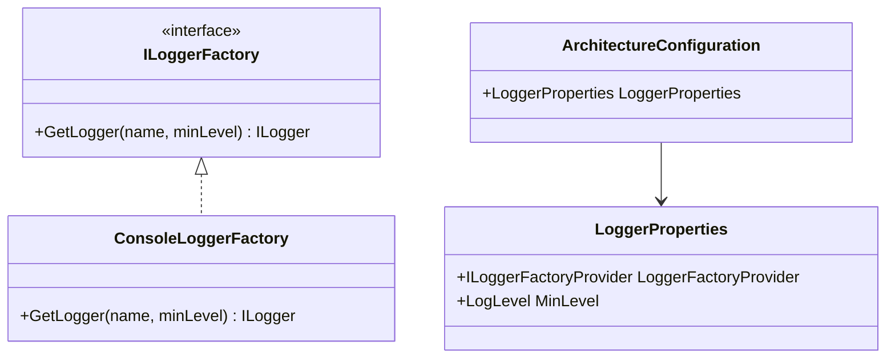
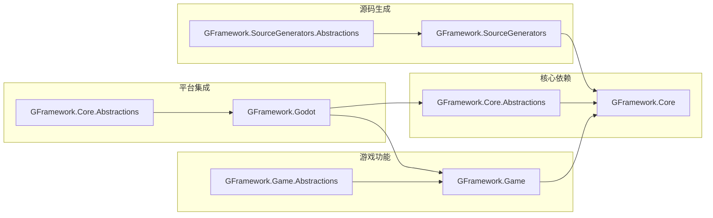
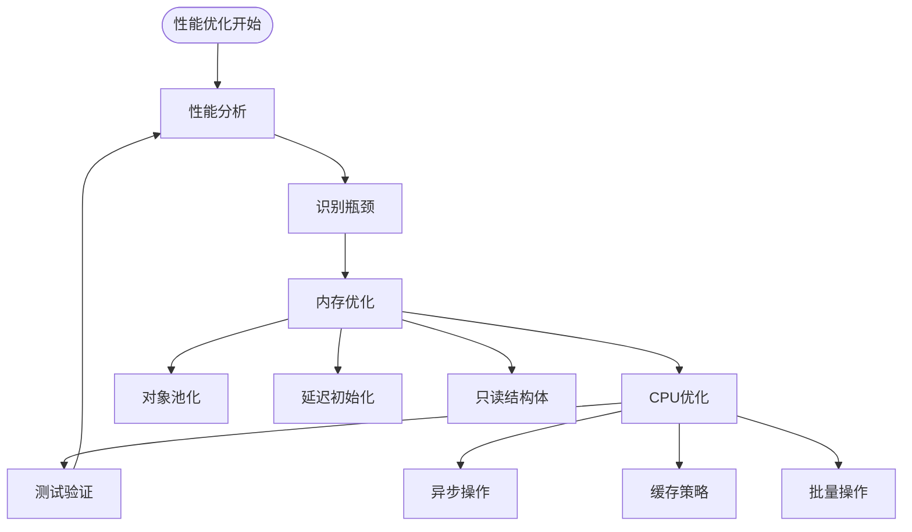

# 迁移和升级指南

<cite>
**本文档引用的文件**
- [README.md](file://README.md)
- [GFramework.Core/README.md](file://GFramework.Core/README.md)
- [GFramework.Game/README.md](file://GFramework.Game/README.md)
- [GFramework.Godot/README.md](file://GFramework.Godot/README.md)
- [GFramework.Core/architecture/Architecture.cs](file://GFramework.Core/architecture/Architecture.cs)
- [GFramework.Core/architecture/ArchitectureConfiguration.cs](file://GFramework.Core/architecture/ArchitectureConfiguration.cs)
- [GFramework.Core/architecture/ArchitectureConstants.cs](file://GFramework.Core/architecture/ArchitectureConstants.cs)
- [GFramework.Core/ioc/IocContainer.cs](file://GFramework.Core/ioc/IocContainer.cs)
- [GFramework.Game/architecture/AbstractModule.cs](file://GFramework.Game/architecture/AbstractModule.cs)
- [GFramework.Godot/architecture/AbstractArchitecture.cs](file://GFramework.Godot/architecture/AbstractArchitecture.cs)
- [GFramework.Godot/architecture/AbstractGodotModule.cs](file://GFramework.Godot/architecture/AbstractGodotModule.cs)
- [GFramework.Core/logging/ConsoleLoggerFactory.cs](file://GFramework.Core/logging/ConsoleLoggerFactory.cs)
- [GFramework.SourceGenerators/README.md](file://GFramework.SourceGenerators/README.md)
- [GFramework.Core.Tests/TEST_COVERAGE_PLAN.md](file://GFramework.Core.Tests/TEST_COVERAGE_PLAN.md)
</cite>

## 目录
1. [简介](#简介)
2. [项目结构](#项目结构)
3. [核心组件](#核心组件)
4. [架构概览](#架构概览)
5. [详细组件分析](#详细组件分析)
6. [依赖分析](#依赖分析)
7. [性能考虑](#性能考虑)
8. [故障排除指南](#故障排除指南)
9. [结论](#结论)
10. [附录](#附录)

## 简介

GFramework是一个专为游戏开发场景设计的综合性C#游戏开发框架，基于Clean Architecture原则构建，提供模块化、可扩展的架构解决方案。框架采用"约定优于配置"的设计理念，通过清晰的分层架构和强大的组件系统，为游戏开发提供了完整的基础设施。

### 主要特性

- **平台无关性**：GFramework.Core是纯.NET库，可在任何.NET环境中运行
- **模块化设计**：支持架构模块安装和扩展
- **生命周期管理**：阶段式的架构生命周期管理
- **依赖注入**：内置IoC容器管理对象生命周期
- **事件驱动**：类型安全的事件系统实现松耦合
- **响应式编程**：可绑定属性支持响应式数据流
- **源码生成器**：零运行时开销的代码生成

## 项目结构

GFramework采用多项目架构，每个模块都有明确的职责分工：



**图表来源**
- [README.md](file://README.md#L235-L253)
- [GFramework.Core/GFramework.Core.csproj](file://GFramework.Core/GFramework.Core.csproj#L1-L13)

**章节来源**
- [README.md](file://README.md#L235-L283)
- [GFramework.Core/README.md](file://GFramework.Core/README.md#L1-L508)

## 核心组件

### 架构系统

GFramework的核心是Architecture类，它作为整个应用的"中央调度器"，负责管理所有组件的生命周期和注册。



**图表来源**
- [GFramework.Core/architecture/Architecture.cs](file://GFramework.Core/architecture/Architecture.cs#L23-L569)
- [GFramework.Core/architecture/ArchitectureConfiguration.cs](file://GFramework.Core/architecture/ArchitectureConfiguration.cs#L12-L35)
- [GFramework.Core/architecture/ArchitectureConstants.cs](file://GFramework.Core/architecture/ArchitectureConstants.cs#L9-L54)

### 依赖注入容器

IocContainer提供线程安全的依赖注入功能，支持单例和多重注册：



**图表来源**
- [GFramework.Core/ioc/IocContainer.cs](file://GFramework.Core/ioc/IocContainer.cs#L12-L373)

**章节来源**
- [GFramework.Core/architecture/Architecture.cs](file://GFramework.Core/architecture/Architecture.cs#L1-L569)
- [GFramework.Core/ioc/IocContainer.cs](file://GFramework.Core/ioc/IocContainer.cs#L1-L373)

## 架构概览

### 五层架构设计

GFramework遵循Clean Architecture原则，采用清晰的分层架构：



**图表来源**
- [GFramework.Core/README.md](file://GFramework.Core/README.md#L42-L108)

### 架构阶段流程



**图表来源**
- [GFramework.Core/architecture/Architecture.cs](file://GFramework.Core/architecture/Architecture.cs#L531-L566)

**章节来源**
- [GFramework.Core/README.md](file://GFramework.Core/README.md#L66-L108)

## 详细组件分析

### 模块系统

GFramework提供灵活的模块化架构，支持游戏功能的模块化扩展：



**图表来源**
- [GFramework.Game/architecture/AbstractModule.cs](file://GFramework.Game/architecture/AbstractModule.cs#L9-L33)
- [GFramework.Godot/architecture/AbstractGodotModule.cs](file://GFramework.Godot/architecture/AbstractGodotModule.cs#L11-L55)

### 数据迁移系统

GFramework提供完整的数据迁移和版本管理功能：



**图表来源**
- [GFramework.Game/README.md](file://GFramework.Game/README.md#L120-L200)

**章节来源**
- [GFramework.Game/architecture/AbstractModule.cs](file://GFramework.Game/architecture/AbstractModule.cs#L1-L33)
- [GFramework.Godot/architecture/AbstractArchitecture.cs](file://GFramework.Godot/architecture/AbstractArchitecture.cs#L1-L140)

### 日志系统

GFramework提供灵活的日志配置和管理功能：



**图表来源**
- [GFramework.Core/logging/ConsoleLoggerFactory.cs](file://GFramework.Core/logging/ConsoleLoggerFactory.cs#L8-L20)

**章节来源**
- [GFramework.Core/logging/ConsoleLoggerFactory.cs](file://GFramework.Core/logging/ConsoleLoggerFactory.cs#L1-L20)

## 依赖分析

### 组件耦合关系



**图表来源**
- [GFramework.Core/GFramework.Core.csproj](file://GFramework.Core/GFramework.Core.csproj#L9-L12)
- [GFramework.Godot/GFramework.Godot.csproj](file://GFramework.Godot/GFramework.Godot.csproj#L16-L21)

### 版本兼容性矩阵

| 组件 | .NET 8.0 | .NET 9.0 | .NET 10.0 |
|------|----------|----------|-----------|
| GFramework.Core | ✓ | ✓ | ✓ |
| GFramework.Game | ✓ | ✓ | ✓ |
| GFramework.Godot | ✓ | ✓ | ✓ |
| GFramework.SourceGenerators | ✓ | ✓ | ✓ |

**章节来源**
- [GFramework.Core/GFramework.Core.csproj](file://GFramework.Core/GFramework.Core.csproj#L4-L8)
- [GFramework.Godot/GFramework.Godot.csproj](file://GFramework.Godot/GFramework.Godot.csproj#L7-L7)

## 性能考虑

### 内存管理

GFramework通过以下机制优化内存使用：

1. **对象池化**：支持对象池系统减少垃圾回收压力
2. **延迟初始化**：上下文和日志记录器的延迟初始化
3. **线程安全**：使用ReaderWriterLockSlim优化并发访问
4. **容器冻结**：初始化后冻结IoC容器防止意外修改

### 性能优化建议



**章节来源**
- [GFramework.Core/ioc/IocContainer.cs](file://GFramework.Core/ioc/IocContainer.cs#L14-L32)

## 故障排除指南

### 常见问题诊断

#### 架构初始化失败

**症状**：架构初始化抛出InvalidOperationException

**可能原因**：
1. 组件注册时机错误（在Ready阶段后注册）
2. 重复注册单例
3. 依赖注入循环

**解决方案**：
```csharp
// 检查架构配置
var config = new ArchitectureConfiguration();
config.ArchitectureProperties.AllowLateRegistration = true; // 临时解决方案

// 验证组件注册顺序
architecture.RegisterUtility(myUtility);
architecture.RegisterModel(myModel);
architecture.RegisterSystem(mySystem);
```

#### 模块安装问题

**症状**：模块安装后无法正常工作

**排查步骤**：
1. 检查模块是否正确实现Install方法
2. 验证模块生命周期回调
3. 确认模块依赖关系

**章节来源**
- [GFramework.Core/architecture/Architecture.cs](file://GFramework.Core/architecture/Architecture.cs#L164-L183)
- [GFramework.Core/architecture/Architecture.cs](file://GFramework.Core/architecture/Architecture.cs#L216-L223)

### 测试和验证

#### 单元测试策略

根据测试覆盖计划，建议重点关注以下区域：

1. **异步功能测试**：CommandBus、AbstractAsyncCommand、AsyncQueryBus、AbstractAsyncQuery
2. **工具基类测试**：AbstractContextUtility
3. **常量验证测试**：ArchitectureConstants、GFrameworkConstants

**章节来源**
- [GFramework.Core.Tests/TEST_COVERAGE_PLAN.md](file://GFramework.Core.Tests/TEST_COVERAGE_PLAN.md#L166-L350)

## 结论

GFramework提供了一个完整、模块化且高度可扩展的游戏开发框架。通过清晰的分层架构、强大的组件系统和灵活的模块化设计，开发者可以快速构建高质量的游戏应用。

### 主要优势

1. **架构清晰**：遵循Clean Architecture原则，职责分离明确
2. **扩展性强**：模块化设计支持功能扩展和平台移植
3. **性能优秀**：零运行时开销的源码生成器和优化的内存管理
4. **开发效率**：丰富的工具和最佳实践减少开发成本

### 未来发展方向

1. **持续测试改进**：完善异步功能的单元测试覆盖
2. **平台扩展**：支持更多游戏引擎和平台
3. **性能优化**：进一步优化内存使用和执行效率
4. **文档完善**：持续更新API文档和最佳实践指南

## 附录

### 迁移检查清单

#### 从旧版本升级

1. **备份项目**：创建完整的项目备份
2. **检查依赖**：确认.NET版本兼容性
3. **更新包引用**：升级到最新版本的GFramework包
4. **测试功能**：验证核心功能正常运行
5. **性能测试**：运行性能基准测试

#### 从其他框架迁移

1. **分析现有架构**：识别现有的组件和数据结构
2. **设计迁移策略**：制定逐步迁移计划
3. **创建映射层**：实现新旧框架的兼容层
4. **数据迁移**：安全地迁移游戏数据
5. **功能验证**：确保所有功能正常工作

#### 自定义扩展开发

1. **创建模块**：继承AbstractModule或AbstractGodotModule
2. **实现接口**：遵循GFramework的接口约定
3. **注册组件**：在Install方法中注册所需组件
4. **测试验证**：编写单元测试验证功能
5. **文档编写**：为新模块编写使用文档