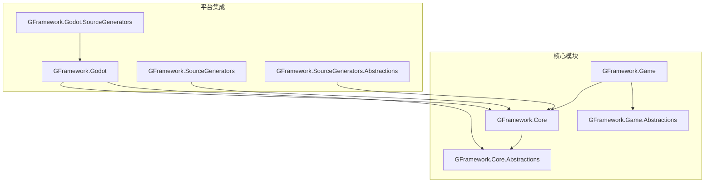
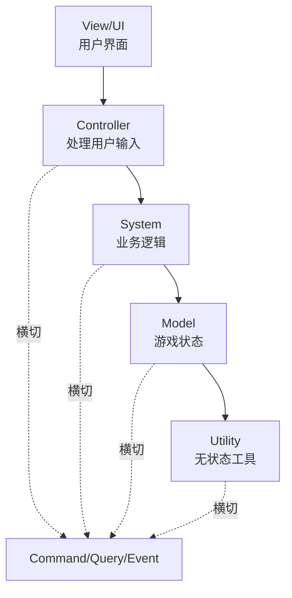
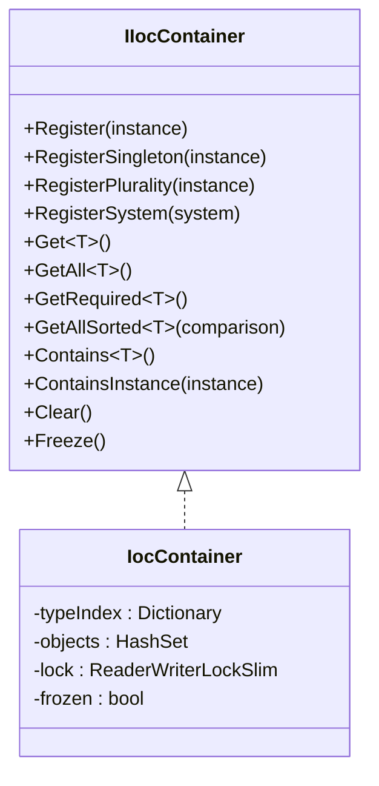
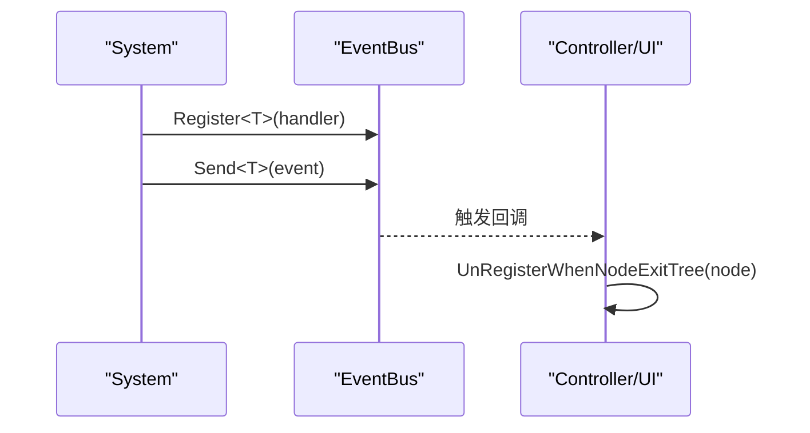
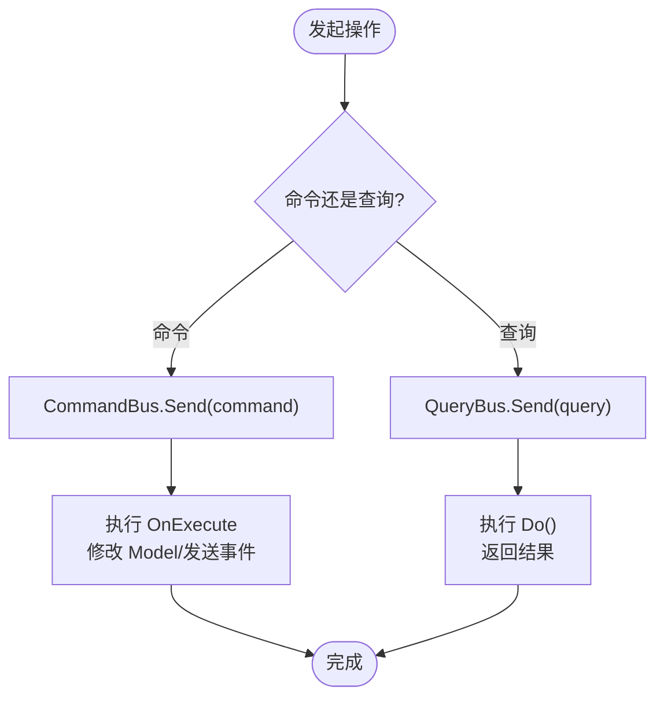
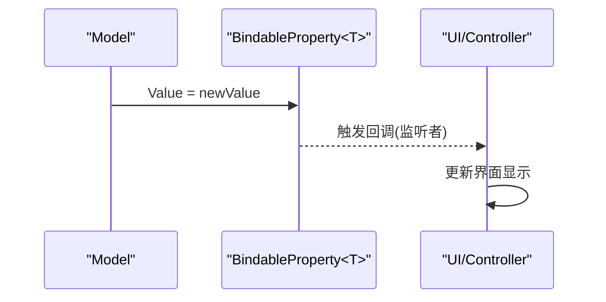
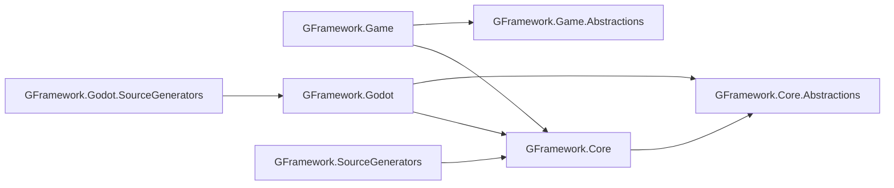

# 项目概述

<cite>
**本文档引用的文件**
- [README.md](file://README.md)
- [GFramework.Core/README.md](file://GFramework.Core/README.md)
- [GFramework.Core.Abstractions/README.md](file://GFramework.Core.Abstractions/README.md)
- [GFramework.Core/architecture/README.md](file://GFramework.Core/architecture/README.md)
- [GFramework.Core/events/README.md](file://GFramework.Core/events/README.md)
- [GFramework.Core/ioc/README.md](file://GFramework.Core/ioc/README.md)
- [GFramework.Core/command/README.md](file://GFramework.Core/command/README.md)
- [GFramework.Core/query/README.md](file://GFramework.Core/query/README.md)
- [GFramework.Core/property/README.md](file://GFramework.Core/property/README.md)
- [GFramework.Core/logging/README.md](file://GFramework.Core/logging/README.md)
- [GFramework.Core/system/README.md](file://GFramework.Core/system/README.md)
- [GFramework.Core/model/README.md](file://GFramework.Core/model/README.md)
- [GFramework.Core/utility/README.md](file://GFramework.Core/utility/README.md)
- [GFramework.Game/README.md](file://GFramework.Game/README.md)
- [GFramework.Godot/README.md](file://GFramework.Godot/README.md)
</cite>

## 目录
1. [引言](#引言)
2. [项目结构](#项目结构)
3. [核心组件](#核心组件)
4. [架构总览](#架构总览)
5. [详细组件分析](#详细组件分析)
6. [依赖分析](#依赖分析)
7. [性能考量](#性能考量)
8. [故障排除指南](#故障排除指南)
9. [结论](#结论)
10. [附录](#附录)

## 引言
GFramework 是一个面向游戏开发场景的综合性 C# 架构框架，强调模块化、平台无关与 Clean Architecture 设计。它通过命令查询职责分离（CQRS）、事件驱动、依赖注入、属性绑定、日志框架与生命周期管理等核心能力，帮助团队构建清晰、可维护、可扩展的游戏应用。

- 平台无关：核心模块 GFramework.Core 与 Godot 解耦，可在任意 .NET 环境运行。
- 深度集成：通过 GFramework.Godot 提供与 Godot 引擎的无缝集成与扩展。
- 清洁架构：从 View/UI 到 Utility 的分层设计，职责清晰、易于测试与演进。

## 项目结构
项目采用多模块分层组织，核心模块与平台集成模块分离，便于移植与扩展：

图表来源
- [README.md](file://README.md#L33-L51)
- [GFramework.Core/README.md](file://GFramework.Core/README.md#L1-L508)
- [GFramework.Game/README.md](file://GFramework.Game/README.md#L1-L1402)
- [GFramework.Godot/README.md](file://GFramework.Godot/README.md#L1-L893)

章节来源
- [README.md](file://README.md#L33-L51)
- [GFramework.Core/README.md](file://GFramework.Core/README.md#L1-L508)

## 核心组件
GFramework 的核心能力围绕以下组件展开，它们共同构成 Clean Architecture 的分层与横切关注点：

- 架构与生命周期：IArchitecture、IArchitectureContext、IArchitectureModule、ArchitecturePhase
- 依赖注入：IIocContainer、IocContainer
- 命令查询分离：ICommand/ICommand<TResult>、IQuery<TResult>、CommandBus、QueryBus
- 事件系统：IEventBus、EasyEvent/EasyEventGeneric、EventBus、UnRegisterList
- 属性绑定：IBindableProperty/IReadonlyBindableProperty、BindableProperty
- 日志框架：ILogger、ILoggerFactory、ILoggerFactoryProvider、LogLevel
- 数据模型：IModel、AbstractModel
- 业务系统：ISystem、AbstractSystem
- 工具层：IUtility、IContextUtility、AbstractContextUtility
- 游戏特定：资产目录、存储系统、序列化、UI 路由与过渡管线等

章节来源
- [GFramework.Core.Abstractions/README.md](file://GFramework.Core.Abstractions/README.md#L1-L522)
- [GFramework.Core/architecture/README.md](file://GFramework.Core/architecture/README.md#L1-L503)
- [GFramework.Core/ioc/README.md](file://GFramework.Core/ioc/README.md#L1-L681)
- [GFramework.Core/command/README.md](file://GFramework.Core/command/README.md#L1-L309)
- [GFramework.Core/query/README.md](file://GFramework.Core/query/README.md#L1-L433)
- [GFramework.Core/events/README.md](file://GFramework.Core/events/README.md#L1-L523)
- [GFramework.Core/property/README.md](file://GFramework.Core/property/README.md#L1-L342)
- [GFramework.Core/logging/README.md](file://GFramework.Core/logging/README.md#L1-L364)
- [GFramework.Core/model/README.md](file://GFramework.Core/model/README.md#L1-L184)
- [GFramework.Core/system/README.md](file://GFramework.Core/system/README.md#L1-L544)
- [GFramework.Core/utility/README.md](file://GFramework.Core/utility/README.md#L1-L613)

## 架构总览
GFramework 采用 Clean Architecture 的五层结构，并引入横切关注点（命令/查询/事件）贯穿各层，形成“View/UI → Controller → System → Model → Utility”的数据与控制流。

图表来源
- [GFramework.Core/README.md](file://GFramework.Core/README.md#L42-L108)
- [GFramework.Core/architecture/README.md](file://GFramework.Core/architecture/README.md#L107-L124)

章节来源
- [GFramework.Core/README.md](file://GFramework.Core/README.md#L42-L108)

## 详细组件分析

### 依赖注入（IoC）
- IocContainer 提供注册、解析与生命周期管理，支持单例、多实现、排序解析与冻结保护。
- Architecture 内置 IoC 容器，统一管理 System、Model、Utility 的注册与获取。
- 最佳实践：在 Init 中集中注册；使用接口注册与解析；避免运行时频繁注册；初始化后冻结容器。

图表来源
- [GFramework.Core/ioc/README.md](file://GFramework.Core/ioc/README.md#L10-L681)

章节来源
- [GFramework.Core/ioc/README.md](file://GFramework.Core/ioc/README.md#L1-L681)
- [GFramework.Core/architecture/README.md](file://GFramework.Core/architecture/README.md#L148-L173)

### 事件系统（Event System）
- IEventBus 提供类型化事件的注册与发送；EasyEvent/EasyEventGeneric 支持无参/单参/双参事件。
- UnRegisterList 统一管理注销，配合 Godot 节点生命周期自动清理。
- 架构事件：ArchitectureLifecycleReadyEvent、ArchitectureDestroyingEvent、ArchitectureDestroyedEvent、ArchitectureFailedInitializationEvent。

图表来源
- [GFramework.Core/events/README.md](file://GFramework.Core/events/README.md#L138-L162)
- [GFramework.Core/events/README.md](file://GFramework.Core/events/README.md#L213-L223)

章节来源
- [GFramework.Core/events/README.md](file://GFramework.Core/events/README.md#L1-L523)

### 命令查询分离（CQRS）
- ICommand/ICommand<TResult> 封装写操作；IQuery<TResult> 封装读操作。
- CommandBus/QueryBus 统一分发与执行；EmptyCommandInput/EmptyQueryInput 简化无参场景。
- 使用建议：命令原子性、无状态、参数结构化；查询只读、可组合、避免过度查询。

图表来源
- [GFramework.Core/command/README.md](file://GFramework.Core/command/README.md#L150-L173)
- [GFramework.Core/query/README.md](file://GFramework.Core/query/README.md#L50-L65)

章节来源
- [GFramework.Core/command/README.md](file://GFramework.Core/command/README.md#L1-L309)
- [GFramework.Core/query/README.md](file://GFramework.Core/query/README.md#L1-L433)

### 属性绑定（Property Binding）
- IBindableProperty/IReadonlyBindableProperty 支持值变化监听与响应式更新。
- RegisterWithInitValue 立即触发回调，适合 UI 绑定；SetValueWithoutEvent 批量更新避免频繁触发。
- 与事件系统协同，实现 Model → UI 的自动更新。

图表来源
- [GFramework.Core/property/README.md](file://GFramework.Core/property/README.md#L45-L100)

章节来源
- [GFramework.Core/property/README.md](file://GFramework.Core/property/README.md#L1-L342)

### 日志框架（Logging）
- ILogger/ILoggerFactory/ILoggerFactoryProvider 提供多级别日志记录与工厂解析。
- 默认 Info 级别，支持 Trace/Debug/Info/Warning/Error/Fatal。
- 建议：为模块创建独立 Logger；异常日志记录；分类使用日志；合理设置最小级别。

章节来源
- [GFramework.Core/logging/README.md](file://GFramework.Core/logging/README.md#L1-L364)

### 数据模型（Model）
- IModel/AbstractModel 管理数据与状态；监听属性变化并发送事件。
- 最佳实践：Model 仅存储数据；复杂逻辑放入 System；避免 Model 间直接调用。

章节来源
- [GFramework.Core/model/README.md](file://GFramework.Core/model/README.md#L1-L184)

### 业务系统（System）
- ISystem/AbstractSystem 处理业务逻辑，响应事件并协调 Model。
- 最佳实践：单一职责、事件驱动、无状态或少状态、初始化注册。

章节来源
- [GFramework.Core/system/README.md](file://GFramework.Core/system/README.md#L1-L544)

### 工具层（Utility）
- IUtility/IContextUtility 提供无状态工具方法；AbstractContextUtility 支持日志与上下文。
- 最佳实践：纯函数、单一职责、避免依赖架构组件。

章节来源
- [GFramework.Core/utility/README.md](file://GFramework.Core/utility/README.md#L1-L613)

### 游戏特定功能（GFramework.Game）
- 模块化架构：AbstractModule 支持生命周期阶段感知与模块安装。
- 资产管理：统一资源目录、类型安全、映射与缓存。
- 存储系统：分层存储、多格式支持、异步操作、版本兼容。
- 序列化系统：JSON 集成、自定义转换器、版本化序列化与迁移。

章节来源
- [GFramework.Game/README.md](file://GFramework.Game/README.md#L1-L1402)

### 平台集成（GFramework.Godot）
- 架构生命周期绑定：自动与 Godot 场景树同步，节点销毁时自动清理。
- Node 扩展方法：50+ 实用扩展，简化节点查找、验证、场景树操作、输入处理与异步等待。
- 信号系统：SignalBuilder 流畅 API，桥接 Godot 信号与框架事件。
- 节点池化：AbstractNodePoolSystem 支持高频节点创建/销毁的内存友好策略。
- 资源管理：ResourceLoadUtility、自定义资源工厂。
- 日志系统：GodotLogger/GodotLoggerFactory，与引擎日志集成。

章节来源
- [GFramework.Godot/README.md](file://GFramework.Godot/README.md#L1-L893)

## 依赖分析
- 核心依赖：GFramework.Core 与 GFramework.Core.Abstractions 提供抽象契约与实现。
- 平台集成：GFramework.Godot 依赖 Core 与 Abstractions，并提供 Godot 特定扩展。
- 游戏模块：GFramework.Game 依赖 Core 与 Game.Abstractions，提供资产、存储、序列化等游戏功能。
- 源码生成器：GFramework.SourceGenerators 与 GFramework.Godot.SourceGenerators 提供上下文感知、日志与枚举扩展的零运行时开销代码生成。

图表来源
- [README.md](file://README.md#L33-L51)
- [GFramework.Game/README.md](file://GFramework.Game/README.md#L1379-L1387)

章节来源
- [README.md](file://README.md#L33-L51)
- [GFramework.Game/README.md](file://GFramework.Game/README.md#L1379-L1387)

## 性能考量
- 事件系统：避免每帧触发高频事件；使用结构体事件减少 GC；条件事件过滤。
- 属性绑定：使用 SetValueWithoutEvent 批量更新；自定义比较器避免浮点误差导致的频繁触发。
- IoC 容器：初始化后冻结容器；避免运行时频繁注册；合理使用 GetRequired/Contains。
- 游戏模块：分层存储命名与缓存；批量写入与异步 I/O；序列化格式与压缩策略；对象池化降低 GC 压力。

## 故障排除指南
- 事件未注销：使用 UnRegisterList 或 UnRegisterWhenNodeExitTree；在 _ExitTree 中统一注销。
- 循环依赖：避免在事件处理器中直接发送新事件；通过命令打破循环。
- 初始化失败：检查 ArchitecturePhase 与 FailedInitialization 事件；逐步排查注册顺序与依赖。
- 日志级别：确认 LoggerFactoryResolver.Provider 与 MinLevel 设置；区分 Info/Debug/Warn/Error/Fatal。
- 模块安装：确保在 ArchitecturePhase.Ready 前注册生命周期钩子；模块安装顺序影响依赖解析。

章节来源
- [GFramework.Core/events/README.md](file://GFramework.Core/events/README.md#L437-L463)
- [GFramework.Core/logging/README.md](file://GFramework.Core/logging/README.md#L215-L252)
- [GFramework.Core/architecture/README.md](file://GFramework.Core/architecture/README.md#L283-L325)

## 结论
GFramework 以 Clean Architecture 为核心，结合 CQRS、事件驱动、依赖注入、属性绑定与生命周期管理，为游戏开发提供了平台无关、模块化、可扩展的基础设施。通过 GFramework.Game 与 GFramework.Godot，开发者可以在不同平台上快速落地架构理念，并获得强大的游戏功能与平台集成能力。

## 附录

### 技术栈概览
- .NET：6.0+
- Godot：4.5+
- 依赖库：Newtonsoft.Json 等（详见各模块 README）

章节来源
- [README.md](file://README.md#L6-L7)
- [GFramework.Game/README.md](file://GFramework.Game/README.md#L1389-L1393)

### 快速开始与安装
- 安装 NuGet 包：GeWuYou.GFramework.Core、GeWuYou.GFramework.Core.Abstractions、GeWuYou.GFramework.Game、GeWuYou.GFramework.Game.Abstractions、GeWuYou.GFramework.SourceGenerators、GeWuYou.GFramework.Godot（Godot 项目）。
- 基本使用：定义架构（继承 Architecture）、注册 Model/System/Utility、在 Controller 中使用依赖注入、通过 SendCommand/SendQuery/事件通信。

章节来源
- [README.md](file://README.md#L88-L105)
- [README.md](file://README.md#L107-L159)
- [README.md](file://README.md#L161-L233)
- [README.md](file://README.md#L255-L274)