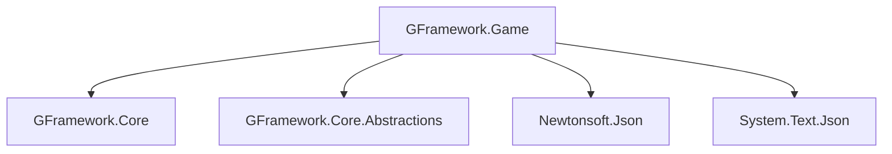

# GFramework.Game

> 游戏特定功能抽象 - 为游戏开发提供专门的工具和系统

GFramework.Game 是 GFramework 框架的游戏特定功能模块，提供了游戏开发中常用的抽象和工具，包括资产管理、存储系统、序列化等核心功能。

## 📋 目录

- [概述](#概述)
- [核心特性](#核心特性)
- [架构模块系统](#架构模块系统)
- [资产管理](#资产管理)
- [存储系统](#存储系统)
- [序列化系统](#序列化系统)
- [使用示例](#使用示例)
- [最佳实践](#最佳实践)
- [性能特性](#性能特性)

## 概述

GFramework.Game 为游戏开发提供了专门的功能模块，与 GFramework.Core 的平台无关特性完美结合，为游戏项目提供了一整套完整的解决方案。

### 核心设计理念

- **游戏导向**：专门针对游戏开发场景设计
- **模块化架构**：可插拔的模块系统，按需组合
- **数据持久化**：完善的存档和数据管理方案
- **资源管理**：高效的资源加载和管理机制

## 核心特性

### 🏗️ 模块化架构

- **AbstractModule**：可重用的架构模块基类
- **生命周期管理**：与框架生命周期深度集成
- **依赖注入**：模块间的依赖自动管理
- **配置驱动**：灵活的模块配置系统

### 📦 资产管理

- **统一资源目录**：集中化的资源注册和查询
- **类型安全**：编译时类型检查和泛型支持
- **重复检测**：自动检测资源重复注册
- **映射支持**：灵活的资源映射和别名系统

### 💾 存储系统

- **分层存储**：命名空间支持的存储隔离
- **多格式支持**：JSON、二进制等多种存储格式
- **异步操作**：完整的异步存储 API
- **版本兼容**：存档版本管理和迁移支持

### 🔄 序列化系统

- **JSON 集成**：基于 Newtonsoft.Json 的序列化
- **自定义序列化**：支持自定义序列化逻辑
- **性能优化**：序列化缓存和优化策略
- **类型安全**：强类型的序列化和反序列化

## 架构模块系统

### AbstractModule 基础使用

```csharp
using GFramework.Game.architecture;

public class AudioModule : AbstractModule
{
    public override void Install(IArchitecture architecture)
    {
        // 注册音频相关系统
        architecture.RegisterSystem(new AudioSystem());
        architecture.RegisterSystem(new MusicSystem());
        
        // 注册音频工具
        architecture.RegisterUtility(new AudioUtility());
        architecture.RegisterUtility(new MusicUtility());
    }
    
    public override void OnPhase(ArchitecturePhase phase, IArchitecture architecture)
    {
        switch (phase)
        {
            case ArchitecturePhase.BeforeModelInit:
                // 在模型初始化前准备音频资源
                PreloadAudioResources();
                break;
                
            case ArchitecturePhase.Ready:
                // 架构准备就绪，开始播放背景音乐
                StartBackgroundMusic();
                break;
                
            case ArchitecturePhase.Destroying:
                // 清理音频资源
                CleanupAudioResources();
                break;
        }
    }
    
    private void PreloadAudioResources()
    {
        // 预加载音频资源
        var audioUtility = architecture.GetUtility<AudioUtility>();
        audioUtility.PreloadAudio("background_music");
        audioUtility.PreloadAudio("shoot_sound");
        audioUtility.PreloadAudio("explosion_sound");
    }
    
    private void StartBackgroundMusic()
    {
        var musicSystem = architecture.GetSystem<MusicSystem>();
        musicSystem.PlayBackgroundMusic("background_music");
    }
    
    private void CleanupAudioResources()
    {
        var audioUtility = architecture.GetUtility<AudioUtility>();
        audioUtility.UnloadAllAudio();
    }
}
```

### 复杂模块示例

```csharp
public class SaveModule : AbstractModule
{
    private ISaveSystem _saveSystem;
    private IDataMigrationManager _migrationManager;
    
    public override void Install(IArchitecture architecture)
    {
        // 注册存储相关组件
        _saveSystem = new SaveSystem();
        architecture.RegisterUtility(_saveSystem);
        
        _migrationManager = new DataMigrationManager();
        architecture.RegisterUtility(_migrationManager);
        
        // 注册数据版本管理
        architecture.RegisterSystem(new SaveDataVersionSystem());
    }
    
    public override void OnPhase(ArchitecturePhase phase, IArchitecture architecture)
    {
        switch (phase)
        {
            case ArchitecturePhase.AfterModelInit:
                // 在模型初始化后设置数据迁移
                SetupDataMigrations();
                break;
                
            case ArchitecturePhase.Ready:
                // 尝试自动加载存档
                TryAutoLoadSave();
                break;
        }
    }
    
    private void SetupDataMigrations()
    {
        // 设置数据版本迁移
        _migrationManager.RegisterMigration<PlayerData>(1, 2, MigratePlayerDataV1ToV2);
        _migrationManager.RegisterMigration<PlayerData>(2, 3, MigratePlayerDataV2ToV3);
    }
    
    private void TryAutoLoadSave()
    {
        if (_saveSystem.HasAutoSave())
        {
            _saveSystem.LoadAutoSave();
        }
    }
    
    private PlayerData MigratePlayerDataV1ToV2(PlayerData v1Data)
    {
        return new PlayerData
        {
            // 迁移逻辑
            Name = v1Data.Name,
            Health = v1Data.Health,
            // 新增字段
            MaxHealth = 100,
            Level = 1
        };
    }
    
    private PlayerData MigratePlayerDataV2ToV3(PlayerData v2Data)
    {
        return new PlayerData
        {
            // 迁移逻辑
            Name = v2Data.Name,
            Health = v2Data.Health,
            MaxHealth = v2Data.MaxHealth,
            Level = v2Data.Level,
            // 新增字段
            Experience = 0,
            Skills = new List<SkillData>()
        };
    }
}
```

### 模块配置

```csharp
public class ModuleConfig
{
    public string SaveDirectory { get; set; } = "saves";
    public int AutoSaveInterval { get; set; } = 300; // 5分钟
    public bool EnableDataCompression { get; set; } = true;
    public int MaxSaveSlots { get; set; } = 10;
}

public class ConfigurableSaveModule : AbstractModule
{
    private ModuleConfig _config;
    
    public ConfigurableSaveModule(ModuleConfig config)
    {
        _config = config;
    }
    
    public override void Install(IArchitecture architecture)
    {
        var saveSystem = new SaveSystem(_config);
        architecture.RegisterUtility(saveSystem);
        
        // 配置自动保存
        if (_config.AutoSaveInterval > 0)
        {
            architecture.RegisterSystem(new AutoSaveSystem(_config.AutoSaveInterval));
        }
    }
}
```

## 资产管理

### AbstractAssetCatalogUtility 基础使用

```csharp
using GFramework.Game.assets;

public class GameAssetCatalog : AbstractAssetCatalogUtility
{
    public override void Initialize()
    {
        base.Initialize();
        
        // 注册场景资产
        RegisterSceneUnit("Player", "res://scenes/Player.tscn");
        RegisterSceneUnit("Enemy", "res://scenes/Enemy.tscn");
        RegisterSceneUnit("Bullet", "res://scenes/Bullet.tscn");
        
        // 注册场景页面
        RegisterScenePage("MainMenu", "res://ui/MainMenu.tscn");
        RegisterScenePage("GameUI", "res://ui/GameUI.tscn");
        RegisterScenePage("PauseMenu", "res://ui/PauseMenu.tscn");
        
        // 注册通用资产
        RegisterAsset<Texture2D>("PlayerTexture", "res://textures/player.png");
        RegisterAsset<Texture2D>("EnemyTexture", "res://textures/enemy.png");
        RegisterAsset<AudioStream>("ShootSound", "res://audio/shoot.wav");
        RegisterAsset<AudioStream>("ExplosionSound", "res://audio/explosion.wav");
    }
    
    // 自定义资产验证
    protected override bool ValidateAsset(string key, string path)
    {
        if (!FileAccess.FileExists(path))
        {
            GD.PrintErr($"Asset file not found: {path}");
            return false;
        }
        
        return true;
    }
    
    // 资产加载完成回调
    protected override void OnAssetLoaded(string key, object asset)
    {
        GD.Print($"Asset loaded: {key}");
        
        // 对特定资产进行额外处理
        if (key == "PlayerTexture")
        {
            var texture = (Texture2D)asset;
            // 预处理纹理...
        }
    }
}
```

### 资产映射系统

```csharp
public class AssetMapping
{
    public string Key { get; set; }
    public string Path { get; set; }
    public Type Type { get; set; }
    public Dictionary<string, object> Metadata { get; set; } = new();
}

public class AdvancedAssetCatalog : AbstractAssetCatalogUtility
{
    public override void Initialize()
    {
        base.Initialize();
        
        // 使用映射对象注册资产
        RegisterAsset(new AssetMapping
        {
            Key = "Player",
            Path = "res://scenes/Player.tscn",
            Type = typeof(PackedScene),
            Metadata = new Dictionary<string, object>
            {
                ["category"] = "character",
                ["tags"] = new[] { "player", "hero", "controlled" },
                ["health"] = 100,
                ["speed"] = 5.0f
            }
        });
        
        // 批量注册
        RegisterAssetsFromDirectory("res://textures/", "*.png", "texture");
        RegisterAssetsFromDirectory("res://audio/", "*.wav", "sound");
    }
    
    private void RegisterAssetsFromDirectory(string directory, string pattern, string prefix)
    {
        var dir = DirAccess.Open(directory);
        if (dir == null) return;
        
        dir.ListDirBegin();
        var fileName = dir.GetNext();
        
        while (!string.IsNullOrEmpty(fileName))
        {
            if (fileName.EndsWith(pattern.Substring(1)))
            {
                var key = $"{prefix}{Path.GetFileNameWithoutExtension(fileName)}";
                var path = Path.Combine(directory, fileName);
                
                RegisterAsset(key, path);
            }
            
            fileName = dir.GetNext();
        }
        
        dir.ListDirEnd();
    }
}
```

### 资产工厂模式

```csharp
public interface IAssetFactory<T>
{
    T Create(string key);
    bool CanCreate(string key);
}

public class PlayerFactory : IAssetFactory<Player>
{
    private readonly AbstractAssetCatalogUtility _catalog;
    
    public PlayerFactory(AbstractAssetCatalogUtility catalog)
    {
        _catalog = catalog;
    }
    
    public Player Create(string key)
    {
        var scene = _catalog.GetScene<PackedScene>(key);
        var player = scene.Instantiate<Player>();
        
        // 配置玩家
        player.Health = GetPlayerHealth(key);
        player.Speed = GetPlayerSpeed(key);
        
        return player;
    }
    
    public bool CanCreate(string key)
    {
        return _catalog.HasScene(key) && key.StartsWith("Player");
    }
    
    private int GetPlayerHealth(string key)
    {
        var metadata = _catalog.GetAssetMetadata(key);
        return metadata?.GetValueOrDefault("health", 100) ?? 100;
    }
    
    private float GetPlayerSpeed(string key)
    {
        var metadata = _catalog.GetAssetMetadata(key);
        return metadata?.GetValueOrDefault("speed", 5.0f) ?? 5.0f;
    }
}
```

## 存储系统

### ScopedStorage 分层存储

```csharp
using GFramework.Game.storage;

public class GameDataManager
{
    private readonly IStorage _rootStorage;
    private readonly IStorage _playerStorage;
    private readonly IStorage _saveStorage;
    
    public GameDataManager(IStorage rootStorage)
    {
        _rootStorage = rootStorage;
        
        // 创建分层存储
        _playerStorage = new ScopedStorage(rootStorage, "player");
        _saveStorage = new ScopedStorage(rootStorage, "saves");
    }
    
    public void SavePlayerData(string playerId, PlayerData data)
    {
        _playerStorage.Write($"{playerId}/profile", data);
        _playerStorage.Write($"{playerId}/inventory", data.Inventory);
        _playerStorage.Write($"{playerId}/stats", data.Stats);
    }
    
    public PlayerData LoadPlayerData(string playerId)
    {
        var profile = _playerStorage.Read<PlayerProfile>($"{playerId}/profile");
        var inventory = _playerStorage.Read<Inventory>($"{playerId}/inventory", new Inventory());
        var stats = _playerStorage.Read<PlayerStats>($"{playerId}/stats", new PlayerStats());
        
        return new PlayerData
        {
            Profile = profile,
            Inventory = inventory,
            Stats = stats
        };
    }
    
    public void SaveGame(int slotId, SaveData data)
    {
        _saveStorage.Write($"slot_{slotId}", data);
        _saveStorage.Write($"slot_{slotId}/timestamp", DateTime.Now);
        _saveStorage.Write($"slot_{slotId}/version", data.Version);
    }
    
    public SaveData LoadGame(int slotId)
    {
        return _saveStorage.Read<SaveData>($"slot_{slotId}");
    }
    
    public List<SaveSlotInfo> GetSaveSlotInfos()
    {
        var infos = new List<SaveSlotInfo>();
        
        for (int i = 1; i <= 10; i++)
        {
            var timestamp = _saveStorage.Read<DateTime>($"slot_{i}/timestamp");
            var version = _saveStorage.Read<int>($"slot_{i}/version");
            
            if (timestamp != default)
            {
                infos.Add(new SaveSlotInfo
                {
                    SlotId = i,
                    Timestamp = timestamp,
                    Version = version
                });
            }
        }
        
        return infos;
    }
}
```

### 自定义存储实现

```csharp
public class EncryptedStorage : IStorage
{
    private readonly IStorage _innerStorage;
    private readonly IEncryptor _encryptor;
    
    public EncryptedStorage(IStorage innerStorage, IEncryptor encryptor)
    {
        _innerStorage = innerStorage;
        _encryptor = encryptor;
    }
    
    public void Write<T>(string key, T data)
    {
        var json = JsonConvert.SerializeObject(data);
        var encrypted = _encryptor.Encrypt(json);
        _innerStorage.Write(key, encrypted);
    }
    
    public T Read<T>(string key, T defaultValue = default)
    {
        var encrypted = _innerStorage.Read<string>(key);
        if (string.IsNullOrEmpty(encrypted))
            return defaultValue;
            
        var json = _encryptor.Decrypt(encrypted);
        return JsonConvert.DeserializeObject<T>(json);
    }
    
    public async Task WriteAsync<T>(string key, T data)
    {
        var json = JsonConvert.SerializeObject(data);
        var encrypted = _encryptor.Encrypt(json);
        await _innerStorage.WriteAsync(key, encrypted);
    }
    
    public async Task<T> ReadAsync<T>(string key, T defaultValue = default)
    {
        var encrypted = await _innerStorage.ReadAsync<string>(key);
        if (string.IsNullOrEmpty(encrypted))
            return defaultValue;
            
        var json = _encryptor.Decrypt(encrypted);
        return JsonConvert.DeserializeObject<T>(json);
    }
    
    public bool Has(string key)
    {
        return _innerStorage.Has(key);
    }
    
    public void Delete(string key)
    {
        _innerStorage.Delete(key);
    }
    
    public void Clear()
    {
        _innerStorage.Clear();
    }
}
```

### 存储缓存层

```csharp
public class CachedStorage : IStorage
{
    private readonly IStorage _innerStorage;
    private readonly Dictionary<string, object> _cache;
    private readonly Dictionary<string, DateTime> _cacheTimestamps;
    private readonly TimeSpan _cacheExpiry;
    
    public CachedStorage(IStorage innerStorage, TimeSpan cacheExpiry = default)
    {
        _innerStorage = innerStorage;
        _cacheExpiry = cacheExpiry == default ? TimeSpan.FromMinutes(5) : cacheExpiry;
        _cache = new Dictionary<string, object>();
        _cacheTimestamps = new Dictionary<string, DateTime>();
    }
    
    public T Read<T>(string key, T defaultValue = default)
    {
        if (_cache.TryGetValue(key, out var cachedValue) && 
            !IsCacheExpired(key))
        {
            return (T)cachedValue;
        }
        
        var value = _innerStorage.Read<T>(key, defaultValue);
        UpdateCache(key, value);
        
        return value;
    }
    
    public void Write<T>(string key, T data)
    {
        _innerStorage.Write(key, data);
        UpdateCache(key, data);
    }
    
    public async Task<T> ReadAsync<T>(string key, T defaultValue = default)
    {
        if (_cache.TryGetValue(key, out var cachedValue) && 
            !IsCacheExpired(key))
        {
            return (T)cachedValue;
        }
        
        var value = await _innerStorage.ReadAsync<T>(key, defaultValue);
        UpdateCache(key, value);
        
        return value;
    }
    
    public async Task WriteAsync<T>(string key, T data)
    {
        await _innerStorage.WriteAsync(key, data);
        UpdateCache(key, data);
    }
    
    public bool Has(string key)
    {
        return _cache.ContainsKey(key) || _innerStorage.Has(key);
    }
    
    public void Delete(string key)
    {
        _cache.Remove(key);
        _cacheTimestamps.Remove(key);
        _innerStorage.Delete(key);
    }
    
    public void Clear()
    {
        _cache.Clear();
        _cacheTimestamps.Clear();
        _innerStorage.Clear();
    }
    
    public void ClearCache()
    {
        _cache.Clear();
        _cacheTimestamps.Clear();
    }
    
    private bool IsCacheExpired(string key)
    {
        if (!_cacheTimestamps.TryGetValue(key, out var timestamp))
            return true;
            
        return DateTime.Now - timestamp > _cacheExpiry;
    }
    
    private void UpdateCache<T>(string key, T value)
    {
        _cache[key] = value;
        _cacheTimestamps[key] = DateTime.Now;
    }
}
```

## 序列化系统

### JsonSerializer 使用

```csharp
using GFramework.Game.serializer;

public class GameDataSerializer
{
    private readonly JsonSerializer _serializer;
    
    public GameDataSerializer()
    {
        _serializer = new JsonSerializer(new JsonSerializerSettings
        {
            Formatting = Formatting.Indented,
            NullValueHandling = NullValueHandling.Ignore,
            DefaultValueHandling = DefaultValueHandling.Populate,
            TypeNameHandling = TypeNameHandling.Auto
        });
        
        // 自定义转换器
        _serializer.Converters.Add(new Vector2JsonConverter());
        _serializer.Converters.Add(new ColorJsonConverter());
        _serializer.Converters.Add(new GodotResourceJsonConverter());
    }
    
    public string Serialize<T>(T data)
    {
        return _serializer.Serialize(data);
    }
    
    public T Deserialize<T>(string json)
    {
        return _serializer.Deserialize<T>(json);
    }
    
    public void SerializeToFile<T>(string path, T data)
    {
        var json = Serialize(data);
        FileAccess.Open(path, FileAccess.ModeFlags.Write).StoreString(json);
    }
    
    public T DeserializeFromFile<T>(string path)
    {
        if (!FileAccess.FileExists(path))
            return default(T);
            
        var file = FileAccess.Open(path, FileAccess.ModeFlags.Read);
        var json = file.GetAsText();
        file.Close();
        
        return Deserialize<T>(json);
    }
}
```

### 自定义 JSON 转换器

```csharp
public class Vector2JsonConverter : JsonConverter<Vector2>
{
    public override void WriteJson(JsonWriter writer, Vector2 value, JsonSerializer serializer)
    {
        writer.WriteStartObject();
        writer.WritePropertyName("x");
        writer.WriteValue(value.X);
        writer.WritePropertyName("y");
        writer.WriteValue(value.Y);
        writer.WriteEndObject();
    }
    
    public override Vector2 ReadJson(JsonReader reader, Type objectType, Vector2 existingValue, bool hasExistingValue, JsonSerializer serializer)
    {
        if (reader.TokenType == JsonToken.Null)
            return Vector2.Zero;
            
        var obj = serializer.Deserialize<Dictionary<string, float>>(reader);
        return new Vector2(obj["x"], obj["y"]);
    }
}

public class ColorJsonConverter : JsonConverter<Color>
{
    public override void WriteJson(JsonWriter writer, Color value, JsonSerializer serializer)
    {
        writer.WriteValue(value.ToHtml());
    }
    
    public override Color ReadJson(JsonReader reader, Type objectType, Color existingValue, bool hasExistingValue, JsonSerializer serializer)
    {
        if (reader.TokenType == JsonToken.Null)
            return Colors.White;
            
        var html = reader.Value.ToString();
        return Color.FromHtml(html);
    }
}

public class GodotResourceJsonConverter : JsonConverter<Resource>
{
    public override void WriteJson(JsonWriter writer, Resource value, JsonSerializer serializer)
    {
        if (value == null)
        {
            writer.WriteNull();
            return;
        }
        
        writer.WriteStartObject();
        writer.WritePropertyName("$type");
        writer.WriteValue(value.GetType().Name);
        writer.WritePropertyName("path");
        writer.WriteValue(value.ResourcePath);
        writer.WriteEndObject();
    }
    
    public override Resource ReadJson(JsonReader reader, Type objectType, Resource existingValue, bool hasExistingValue, JsonSerializer serializer)
    {
        if (reader.TokenType == JsonToken.Null)
            return null;
            
        var obj = serializer.Deserialize<Dictionary<string, string>>(reader);
        var path = obj["path"];
        
        return GD.Load<Resource>(path);
    }
}
```

### 版本化序列化

```csharp
public class VersionedData
{
    public int Version { get; set; }
    public Dictionary<string, object> Data { get; set; } = new();
}

public class VersionedSerializer
{
    private readonly Dictionary<Type, int> _typeVersions = new();
    private readonly Dictionary<int, IDataMigration> _migrations = new();
    
    public void RegisterVersion<T>(int version)
    {
        _typeVersions[typeof(T)] = version;
    }
    
    public void RegisterMigration<T>(int fromVersion, int toVersion, IDataMigration<T> migration)
    {
        var key = GetMigrationKey(typeof(T), fromVersion, toVersion);
        _migrations[key] = migration;
    }
    
    public string Serialize<T>(T data)
    {
        var versioned = new VersionedData
        {
            Version = _typeVersions.GetValueOrDefault(typeof(T), 1),
            Data = new Dictionary<string, object>
            {
                ["type"] = typeof(T).Name,
                ["data"] = JsonConvert.SerializeObject(data)
            }
        };
        
        return JsonConvert.SerializeObject(versioned);
    }
    
    public T Deserialize<T>(string json)
    {
        var versioned = JsonConvert.DeserializeObject<VersionedData>(json);
        var currentVersion = _typeVersions.GetValueOrDefault(typeof(T), 1);
        
        // 迁移数据到当前版本
        var dataJson = MigrateData<T>(versioned.Data["data"] as string, versioned.Version, currentVersion);
        
        return JsonConvert.DeserializeObject<T>(dataJson);
    }
    
    private string MigrateData<T>(string dataJson, int fromVersion, int toVersion)
    {
        var currentData = dataJson;
        var currentVersion = fromVersion;
        
        while (currentVersion < toVersion)
        {
            var migrationKey = GetMigrationKey(typeof(T), currentVersion, currentVersion + 1);
            
            if (_migrations.TryGetValue(migrationKey, out var migration))
            {
                currentData = migration.Migrate(currentData);
                currentVersion++;
            }
            else
            {
                throw new InvalidOperationException($"No migration found from version {currentVersion} to {currentVersion + 1}");
            }
        }
        
        return currentData;
    }
    
    private int GetMigrationKey(Type type, int fromVersion, int toVersion)
    {
        return HashCode.Combine(type.Name, fromVersion, toVersion);
    }
}

public interface IDataMigration
{
    string Migrate(string data);
}

public interface IDataMigration<T> : IDataMigration
{
    T Migrate(T data);
}
```

## 使用示例

### 完整的游戏数据管理系统

```csharp
// 1. 定义数据模型
public class GameProfile
{
    public string PlayerName { get; set; }
    public DateTime LastPlayed { get; set; }
    public int TotalPlayTime { get; set; }
    public List<Achievement> UnlockedAchievements { get; set; } = new();
}

public class GameSettings
{
    public float MasterVolume { get; set; } = 1.0f;
    public float MusicVolume { get; set; } = 0.8f;
    public float SFXVolume { get; set; } = 0.9f;
    public GraphicsSettings Graphics { get; set; } = new();
    public InputSettings Input { get; set; } = new();
}

// 2. 创建游戏管理器
[ContextAware]
[Log]
public partial class GameManager : Node, IController
{
    private GameAssetCatalog _assetCatalog;
    private GameDataManager _dataManager;
    private GameDataSerializer _serializer;
    
    protected override void OnInit()
    {
        // 初始化资产目录
        _assetCatalog = new GameAssetCatalog();
        _assetCatalog.Initialize();
        
        // 初始化存储系统
        var rootStorage = new FileStorage("user://data/");
        var cachedStorage = new CachedStorage(rootStorage);
        _dataManager = new GameDataManager(cachedStorage);
        
        // 初始化序列化器
        _serializer = new GameDataSerializer();
        
        Logger.Info("Game manager initialized");
    }
    
    public void StartNewGame(string playerName)
    {
        Logger.Info($"Starting new game for player: {playerName}");
        
        // 创建新的游戏档案
        var profile = new GameProfile
        {
            PlayerName = playerName,
            LastPlayed = DateTime.Now,
            TotalPlayTime = 0
        };
        
        _dataManager.SavePlayerData("current", profile);
        
        // 加载初始场景
        LoadInitialScene();
        
        Context.SendEvent(new NewGameStartedEvent { PlayerName = playerName });
    }
    
    public void LoadGame(int slotId)
    {
        Logger.Info($"Loading game from slot {slotId}");
        
        try
        {
            var saveData = _dataManager.LoadGame(slotId);
            if (saveData != null)
            {
                // 恢复游戏状态
                RestoreGameState(saveData);
                
                Context.SendEvent(new GameLoadedEvent { SlotId = slotId });
                Logger.Info("Game loaded successfully");
            }
            else
            {
                Logger.Warning($"No save data found in slot {slotId}");
                Context.SendEvent(new GameLoadFailedEvent { SlotId = slotId });
            }
        }
        catch (Exception ex)
        {
            Logger.Error($"Failed to load game: {ex.Message}");
            Context.SendEvent(new GameLoadFailedEvent { SlotId = slotId, Error = ex.Message });
        }
    }
    
    public void SaveGame(int slotId)
    {
        Logger.Info($"Saving game to slot {slotId}");
        
        try
        {
            var saveData = CreateSaveData();
            _dataManager.SaveGame(slotId, saveData);
            
            Context.SendEvent(new GameSavedEvent { SlotId = slotId });
            Logger.Info("Game saved successfully");
        }
        catch (Exception ex)
        {
            Logger.Error($"Failed to save game: {ex.Message}");
            Context.SendEvent(new GameSaveFailedEvent { SlotId = slotId, Error = ex.Message });
        }
    }
    
    private void LoadInitialScene()
    {
        var playerScene = _assetCatalog.GetScene<PackedScene>("Player");
        var player = playerScene.Instantiate<Player>();
        
        var gameWorldScene = _assetCatalog.GetScene<PackedScene>("GameWorld");
        var gameWorld = gameWorldScene.Instantiate<Control>();
        
        AddChild(gameWorld);
        gameWorld.AddChild(player);
    }
    
    private void RestoreGameState(SaveData saveData)
    {
        // 恢复玩家位置
        var playerScene = _assetCatalog.GetScene<PackedScene>("Player");
        var player = playerScene.Instantiate<Player>();
        player.Position = saveData.PlayerPosition;
        
        // 恢复游戏世界
        var gameWorldScene = _assetCatalog.GetScene<PackedScene>("GameWorld");
        var gameWorld = gameWorldScene.Instantiate<Control>();
        
        AddChild(gameWorld);
        gameWorld.AddChild(player);
        
        // 恢复其他游戏状态
        Context.GetModel<PlayerModel>().Health.Value = saveData.PlayerHealth;
        Context.GetModel<GameModel>().CurrentLevel.Value = saveData.CurrentLevel;
        Context.GetModel<InventoryModel>().LoadFromData(saveData.Inventory);
    }
    
    private SaveData CreateSaveData()
    {
        var player = GetTree().CurrentScene.FindChild("Player");
        
        return new SaveData
        {
            PlayerPosition = player?.Position ?? Vector2.Zero,
            PlayerHealth = Context.GetModel<PlayerModel>().Health.Value,
            CurrentLevel = Context.GetModel<GameModel>().CurrentLevel.Value,
            Inventory = Context.GetModel<InventoryModel>().GetData(),
            Timestamp = DateTime.Now,
            Version = 1
        };
    }
}
```

### 自动保存系统

```csharp
public class AutoSaveSystem : AbstractSystem
{
    private Timer _autoSaveTimer;
    private int _currentSaveSlot;
    private float _autoSaveInterval;
    
    public AutoSaveSystem(float intervalMinutes = 5.0f)
    {
        _autoSaveInterval = intervalMinutes * 60.0f;
    }
    
    protected override void OnInit()
    {
        _autoSaveTimer = new Timer();
        _autoSaveTimer.WaitTime = _autoSaveInterval;
        _autoSaveTimer.Timeout += OnAutoSave;
        _autoSaveTimer.Autostart = true;
        
        AddChild(_autoSaveTimer);
        
        // 监听重要事件，立即自动保存
        this.RegisterEvent<PlayerDeathEvent>(OnImportantEvent);
        this.RegisterEvent<BossDefeatedEvent>(OnImportantEvent);
        this.RegisterEvent<LevelCompletedEvent>(OnImportantEvent);
        
        Logger.Info("Auto-save system initialized");
    }
    
    protected override void OnDestroy()
    {
        _autoSaveTimer?.Stop();
        
        // 最后一次自动保存
        PerformAutoSave();
    }
    
    private void OnAutoSave()
    {
        PerformAutoSave();
        Logger.Debug("Periodic auto-save completed");
    }
    
    private void OnImportantEvent(IEvent e)
    {
        Logger.Info($"Important event {e.GetType().Name}, triggering auto-save");
        PerformAutoSave();
    }
    
    private void PerformAutoSave()
    {
        try
        {
            var saveData = CreateAutoSaveData();
            
            // 保存到自动存档槽
            var storage = Context.GetUtility<IStorage>();
            storage.Write("autosave", saveData);
            storage.Write("autosave/timestamp", DateTime.Now);
            
            Logger.Debug("Auto-save completed successfully");
        }
        catch (Exception ex)
        {
            Logger.Error($"Auto-save failed: {ex.Message}");
        }
    }
    
    private SaveData CreateAutoSaveData()
    {
        return new SaveData
        {
            // ... 创建保存数据
        };
    }
}
```

## 最佳实践

### 🏗️ 数据模型设计

#### 1. 版本化数据结构

```csharp
// 好的做法：版本化数据模型
[Serializable]
public class PlayerDataV2
{
    public int Version { get; set; } = 2;
    public string Name { get; set; }
    public int Health { get; set; }
    public int MaxHealth { get; set; } = 100; // V2 新增
    public List<SkillData> Skills { get; set; } = new(); // V2 新增
}

// 避免：没有版本控制
[Serializable]
public class PlayerData
{
    public string Name { get; set; }
    public int Health { get; set; }
    // 未来新增字段会导致兼容性问题
}
```

#### 2. 数据验证

```csharp
public class PlayerData
{
    private string _name;
    
    public string Name
    {
        get => _name;
        set
        {
            if (string.IsNullOrWhiteSpace(value))
                throw new ArgumentException("Player name cannot be empty");
            _name = value;
        }
    }
    
    public int Health
    {
        get => _health;
        set => _health = Math.Max(0, value); // 确保不为负数
    }
    
    public void Validate()
    {
        if (string.IsNullOrWhiteSpace(Name))
            throw new ValidationException("Player name is required");
        
        if (Health < 0)
            throw new ValidationException("Health cannot be negative");
    }
}
```

### 💾 存储策略

#### 1. 分层存储命名

```csharp
// 好的做法：有意义的分层结构
var playerStorage = new ScopedStorage(rootStorage, "players");
var saveStorage = new ScopedStorage(rootStorage, "saves");
var settingsStorage = new ScopedStorage(rootStorage, "settings");
var tempStorage = new ScopedStorage(rootStorage, "temp");

// 避免的混乱命名
var storage1 = new ScopedStorage(rootStorage, "data1");
var storage2 = new ScopedStorage(rootStorage, "data2");
```

#### 2. 存储性能优化

```csharp
// 好的做法：批量操作和缓存
public class OptimizedDataManager
{
    private readonly IStorage _storage;
    private readonly Dictionary<string, object> _writeBuffer = new();
    
    public void QueueWrite<T>(string key, T data)
    {
        _writeBuffer[key] = data;
    }
    
    public async Task FlushWritesAsync()
    {
        var tasks = _writeBuffer.Select(kvp => _storage.WriteAsync(kvp.Key, kvp.Value));
        await Task.WhenAll(tasks);
        _writeBuffer.Clear();
    }
}

// 避免：频繁的小写入
public class InefficientDataManager
{
    public void UpdatePlayerStat(string stat, int value)
    {
        _storage.Write($"player/stats/{stat}", value); // 每次都写入磁盘
    }
}
```

### 🔄 序列化优化

#### 1. 选择合适的序列化格式

```csharp
// 好的做法：根据需求选择格式
public class GameSerializer
{
    // JSON：可读性好，调试方便
    public string SerializeForDebug(object data) => JsonConvert.SerializeObject(data, Formatting.Indented);
    
    // 二进制：体积小，性能好
    public byte[] SerializeForStorage(object data) => MessagePackSerializer.Serialize(data);
    
    // 压缩：减少存储空间
    public byte[] SerializeWithCompression(object data)
    {
        var json = JsonConvert.SerializeObject(data);
        return Compress(Encoding.UTF8.GetBytes(json));
    }
}
```

#### 2. 自定义序列化逻辑

```csharp
public class PlayerInventory
{
    public Dictionary<string, int> Items { get; set; } = new();
    
    [JsonIgnore] // 排除不需要序列化的属性
    public int TotalWeight => Items.Sum(kvp => GetItemWeight(kvp.Key) * kvp.Value);
    
    [JsonProperty("total_items")] // 自定义序列化名称
    public int TotalItems => Items.Values.Sum();
    
    public bool ShouldSerializeItems() // 条件序列化
    {
        return Items.Count > 0;
    }
    
    [OnDeserialized] // 反序列化后处理
    private void OnDeserialized(StreamingContext context)
    {
        // 初始化默认值或执行验证
        Items ??= new Dictionary<string, int>();
    }
}
```

### 🏭 模块设计模式

#### 1. 单一职责模块

```csharp
// 好的做法：模块职责单一
public class AudioModule : AbstractModule
{
    // 只负责音频相关功能
}

public class SaveModule : AbstractModule
{
    // 只负责存档相关功能
}

// 避免：功能过于庞大
public class GameModule : AbstractModule
{
    // 音频、存档、UI、输入全部混在一起
}
```

#### 2. 模块间通信

```csharp
public class SaveModule : AbstractModule
{
    public override void Install(IArchitecture architecture)
    {
        architecture.RegisterUtility(new SaveUtility());
    }
}

public class PlayerModule : AbstractModule
{
    public override void Install(IArchitecture architecture)
    {
        architecture.RegisterSystem(new PlayerSystem());
    }
    
    public override void OnPhase(ArchitecturePhase phase, IArchitecture architecture)
    {
        if (phase == ArchitecturePhase.Ready)
        {
            // 通过事件进行模块间通信
            this.RegisterEvent<PlayerDeathEvent>(OnPlayerDeath);
        }
    }
    
    private void OnPlayerDeath(PlayerDeathEvent e)
    {
        // 触发保存模块的事件
        Context.SendEvent(new RequestAutoSaveEvent { Reason = "Player Death" });
    }
}
```

## 性能特性

### 📊 内存管理

- **缓存策略**：多层缓存减少磁盘 I/O
- **延迟加载**：按需加载资源，减少内存占用
- **对象池化**：重用对象，减少 GC 压力
- **内存映射**：大文件使用内存映射技术

### ⚡ 存储性能

```csharp
// 性能对比示例
public class StoragePerformanceTest
{
    // 同步操作：简单直接
    public void SyncWrite(IStorage storage, string key, object data)
    {
        storage.Write(key, data); // ~1-5ms
    }
    
    // 异步操作：非阻塞
    public async Task AsyncWrite(IStorage storage, string key, object data)
    {
        await storage.WriteAsync(key, data); // ~0.1-1ms (不阻塞主线程)
    }
    
    // 批量操作：高吞吐量
    public async Task BatchWrite(IStorage storage, Dictionary<string, object> data)
    {
        var tasks = data.Select(kvp => storage.WriteAsync(kvp.Key, kvp.Value));
        await Task.WhenAll(tasks); // ~10-50ms for 100 items
    }
}
```

### 🔄 序列化优化

- **格式选择**：JSON（可读性）vs 二进制（性能）
- **压缩技术**：减少存储空间和网络传输
- **增量序列化**：只序列化变化的部分
- **版本控制**：向后兼容的数据迁移

---

## 依赖关系



## 版本兼容性

- **.NET**: 6.0+
- **Newtonsoft.Json**: 13.0.3+
- **GFramework.Core**: 与 Core 模块版本保持同步
---