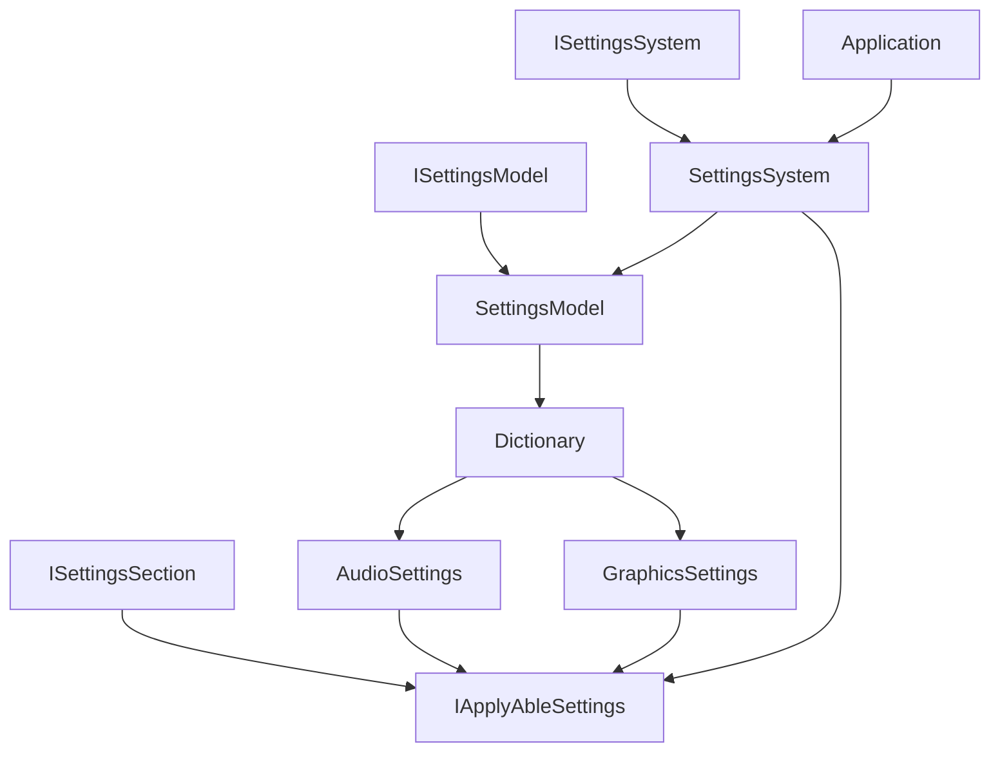

# 设置系统 (Settings System)

## 概述

设置系统是 GFramework.Game 的核心组件之一，负责管理游戏中各种设置配置。该系统采用了模型-系统分离的设计模式，支持设置部分（Section）的管理和设置应用器模式。

## 核心类

### SettingsModel

设置模型类，继承自 `AbstractModel` 并实现 `ISettingsModel` 接口。

**主要功能：**

- 管理不同类型的设置部分（Settings Section）
- 提供类型安全的设置访问
- 支持可应用设置对象的注册

**关键方法：**

- `Get<T>()` - 获取或创建指定类型的设置部分
- `TryGet(Type, out ISettingsSection)` - 尝试获取设置部分
- `Register(IApplyAbleSettings)` - 注册可应用的设置对象
- `All()` - 获取所有设置部分

### SettingsSystem

设置系统类，继承自 `AbstractSystem` 并实现 `ISettingsSystem` 接口。

**主要功能：**

- 应用设置配置到相应系统
- 支持单个或批量设置应用
- 自动识别可应用设置类型

**关键方法：**

- `ApplyAll()` - 应用所有设置配置
- `Apply<T>()` - 应用指定类型的设置
- `Apply(IEnumerable<Type>)` - 应用指定类型集合的设置

## 架构设计



## 使用示例

### 基本使用

```csharp
// 获取设置模型
var settingsModel = this.GetModel<ISettingsModel>();

// 获取或创建音频设置
var audioSettings = settingsModel.Get<GodotAudioSettings>();
audioSettings.MasterVolume = 0.8f;
audioSettings.BgmVolume = 0.6f;
audioSettings.SfxVolume = 0.9f;

// 注册设置到模型
settingsModel.Register(audioSettings);
```

### 应用设置

```csharp
// 获取设置系统
var settingsSystem = this.GetSystem<ISettingsSystem>();

// 应用所有设置
await settingsSystem.ApplyAll();

// 应用特定类型设置
await settingsSystem.Apply<GodotAudioSettings>();

// 应用多个类型设置
var types = new[] { typeof(GodotAudioSettings), typeof(GodotGraphicsSettings) };
await settingsSystem.Apply(types);
```

### 创建自定义设置

```csharp
public class GameSettings : ISettingsSection
{
    public float GameSpeed { get; set; } = 1.0f;
    public int Difficulty { get; set; } = 1;
    public bool AutoSave { get; set; } = true;
}

// 使用自定义设置
var gameSettings = settingsModel.Get<GameSettings>();
gameSettings.GameSpeed = 1.5f;
```

### 创建可应用设置

```csharp
public class GameSettings : ISettingsSection, IApplyAbleSettings
{
    public float GameSpeed { get; set; } = 1.0f;
    public int Difficulty { get; set; } = 1;
    
    public Task Apply()
    {
        // 应用游戏速度
        Time.timeScale = GameSpeed;
        
        // 应用难度设置
        GameDifficulty.Current = Difficulty;
        
        return Task.CompletedTask;
    }
}
```

## 接口定义

### ISettingsSection

```csharp
public interface ISettingsSection
{
    // 设置部分的标识接口
}
```

### IApplyAbleSettings

```csharp
public interface IApplyAbleSettings : ISettingsSection
{
    Task Apply();
}
```

### ISettingsModel

```csharp
public interface ISettingsModel
{
    T Get<T>() where T : class, ISettingsSection, new();
    bool TryGet(Type type, out ISettingsSection section);
    IEnumerable<ISettingsSection> All();
    void Register(IApplyAbleSettings applyAble);
}
```

### ISettingsSystem

```csharp
public interface ISettingsSystem
{
    Task ApplyAll();
    Task Apply<T>() where T : class, ISettingsSection;
    Task Apply(Type settingsType);
    Task Apply(IEnumerable<Type> settingsTypes);
}
```

## 设计模式

该系统使用了以下设计模式：

1. **Repository Pattern** - SettingsModel 作为设置数据的仓库
2. **Command Pattern** - IApplyAbleSettings 的 Apply 方法作为命令
3. **Factory Pattern** - Get`<T>`() 方法创建设置实例
4. **Template Method** - AbstractSystem 提供初始化模板

## 最佳实践

1. **设置分类** - 将相关设置组织到同一个设置类中
2. **延迟应用** - 批量修改后再应用，而不是每次修改都应用
3. **类型安全** - 使用泛型方法确保类型安全
4. **可测试性** - 通过接口实现便于单元测试