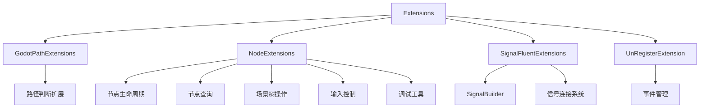

# Godot 扩展方法 (Godot Extensions)

## 概述

Godot 扩展方法模块为 Godot 引擎提供了丰富的便捷扩展方法集合。这些扩展方法简化了常见的 Godot
开发任务，提高了代码的可读性和开发效率。该模块遵循流畅接口设计原则，支持链式调用。

## 模块结构



## 扩展模块详解

### 1. 路径扩展 (GodotPathExtensions)

提供 Godot 虚拟路径的判断和识别功能。

**主要方法：**

- `IsUserPath()` - 判断是否为 `user://` 路径
- `IsResPath()` - 判断是否为 `res://` 路径
- `IsGodotPath()` - 判断是否为 Godot 虚拟路径

**使用示例：**

```csharp
string savePath = "user://save.dat";
string configPath = "res://config.json";
string logPath = "C:/logs/debug.log";

if (savePath.IsUserPath()) Console.WriteLine("用户数据路径");
if (configPath.IsResPath()) Console.WriteLine("资源路径");
if (logPath.IsGodotPath()) Console.WriteLine("Godot 虚拟路径");
else Console.WriteLine("文件系统路径");
```

### 2. 节点扩展 (NodeExtensions)

最丰富的扩展模块，提供全面的节点操作功能。

#### 节点生命周期管理

```csharp
// 安全释放节点
node.QueueFreeX();  // 延迟释放
node.FreeX();       // 立即释放

// 等待节点就绪
await node.WaitUntilReady();

// 检查节点有效性
if (node.IsValidNode()) Console.WriteLine("节点有效");
if (node.IsInvalidNode()) Console.WriteLine("节点无效");
```

#### 节点查询操作

```csharp
// 查找子节点
var sprite = node.FindChildX<Sprite2D>("Sprite");
var parent = node.GetParentX<Control>();

// 获取或创建节点
var panel = parent.GetOrCreateNode<Panel>("MainPanel");

// 遍历子节点
node.ForEachChild<Sprite2D>(sprite => {
    sprite.Modulate = Colors.White;
});
```

#### 场景树操作

```csharp
// 获取根节点
var root = node.GetRootNodeX();

// 异步添加子节点
await parent.AddChildX(childNode);

// 设置场景树暂停状态
node.Paused(true);   // 暂停
node.Paused(false);  // 恢复
```

#### 输入控制

```csharp
// 标记输入事件已处理
node.SetInputAsHandled();

// 禁用/启用输入
node.DisableInput();
node.EnableInput();
```

#### 调试工具

```csharp
// 打印节点路径
node.LogNodePath();

// 打印节点树
node.PrintTreeX();

// 安全延迟调用
node.SafeCallDeferred("UpdateUI");
```

#### 类型转换

```csharp
// 安全的类型转换
var button = node.OfType<Button>();
var sprite = childNode.OfType<Sprite2D>();
```

### 3. 信号扩展 (SignalFluentExtensions)

提供流畅的信号连接 API，详见 [信号扩展](signal.md)。

**快速示例：**

```csharp
button.Signal(Button.SignalName.Pressed)
    .WithFlags(GodotObject.ConnectFlags.OneShot)
    .ToAndCall(new Callable(this, nameof(OnButtonPressed)));
```

### 4. 取消注册扩展 (UnRegisterExtension)

自动管理事件监听器的生命周期。

**主要方法：**

- `UnRegisterWhenNodeExitTree()` - 节点退出场景树时自动取消注册

**使用示例：**

```csharp
var unRegister = eventManager.Subscribe<GameEvent>(OnGameEvent);
unRegister.UnRegisterWhenNodeExitTree(node);
```

## 快速参考

### 常用代码片段

#### 场景节点管理

```csharp
public class GameManager : Node
{
    private Node _uiRoot;
    
    public override void _Ready()
    {
        _uiRoot = GetNode<Node>("UI");
        
        // 创建游戏面板
        var gamePanel = _uiRoot.GetOrCreateNode<Panel>("GamePanel");
        
        // 安全添加子节点
        var player = new Player();
        await AddChildX(player);
        
        // 查找并配置玩家
        var sprite = player.FindChildX<Sprite2D>("Sprite");
        if (sprite.IsValidNode()) sprite.Modulate = Colors.Red;
    }
    
    public void Cleanup()
    {
        // 安全释放所有子节点
        ForEachChild<Node>(child => child.QueueFreeX());
    }
}
```

#### UI 事件处理

```csharp
public class MainMenu : Control
{
    private Button _startButton;
    private Button _quitButton;
    
    public override void _Ready()
    {
        _startButton = FindChildX<Button>("StartButton");
        _quitButton = FindChildX<Button>("QuitButton");
        
        // 流畅的信号连接
        _startButton.Signal(BaseButton.SignalName.Pressed)
            .ToAndCall(new Callable(this, nameof(OnStartPressed)));
            
        _quitButton.Signal(BaseButton.SignalName.Pressed)
            .To(new Callable(this, nameof(OnQuitPressed)));
    }
    
    private void OnStartPressed()
    {
        GetTree().ChangeSceneToFile("res://scenes/game.tscn");
    }
    
    private void OnQuitPressed()
    {
        GetTree().Quit();
    }
}
```

#### 异步场景管理

```csharp
public class SceneManager : Node
{
    public async Task<T> LoadSceneAsync<T>(string scenePath) where T : Node
    {
        var packedScene = GD.Load<PackedScene>(scenePath);
        var instance = packedScene.Instantiate<T>();
        
        // 等待场景加载完成
        await instance.WaitUntilReady();
        
        return instance;
    }
    
    public async Task TransitionToScene(string scenePath)
    {
        var newScene = await LoadSceneAsync<Node>(scenePath);
        
        // 清理当前场景
        ForEachChild<Node>(child => child.QueueFreeX());
        
        // 加载新场景
        await AddChildX(newScene);
        
        // 设置输入处理
        newScene.SetInputAsHandled();
    }
}
```

## 设计原则

### 1. 安全性

- 所有节点操作都包含有效性检查
- 提供安全的类型转换方法
- 避免空引用异常

### 2. 便利性

- 流畅的 API 设计
- 支持链式调用
- 减少样板代码

### 3. 一致性

- 统一的命名约定
- 一致的返回类型
- 预测性方法行为

### 4. 性能

- 避免不必要的节点查找
- 最小化内存分配
- 优化常见操作

## 最佳实践

### 1. 节点生命周期

```csharp
// ✅ 推荐：使用安全释放
node.QueueFreeX();

// ❌ 避免：直接释放可能导致错误
node.QueueFree();
```

### 2. 节点查询

```csharp
// ✅ 推荐：类型安全的查找
var button = node.FindChildX<Button>("Button");

// ❌ 避免：需要手动类型转换
var button = node.FindChild("Button") as Button;
```

### 3. 异步操作

```csharp
// ✅ 推荐：等待节点就绪
await child.WaitUntilReady();

// ❌ 避免：假设节点已就绪
child.DoSomething();
```

### 4. 事件管理

```csharp
// ✅ 推荐：自动清理事件
var unRegister = eventSystem.Subscribe(eventHandler);
unRegister.UnRegisterWhenNodeExitTree(node);

// ❌ 避免：手动管理事件生命周期
// 可能导致内存泄漏
```