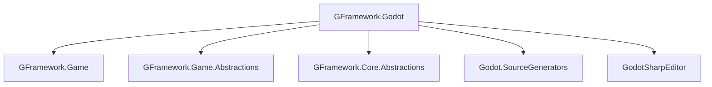

# GFramework.Godot

> Godot 引擎深度集成 - 为 GFramework 框架提供原生的 Godot 支持

GFramework.Godot 是 GFramework 框架的 Godot 特定实现，将框架的架构优势与 Godot 引擎的强大功能完美结合。

## 📋 目录

- [概述](#概述)
- [核心特性](#核心特性)
- [架构集成](#架构集成)
- [Node 扩展方法](#node-扩展方法)
- [信号系统](#信号系统)
- [节点池化](#节点池化)
- [资源管理](#资源管理)
- [日志系统](#日志系统)
- [完整示例](#完整示例)
- [最佳实践](#最佳实践)
- [性能特性](#性能特性)

## 概述

GFramework.Godot 提供了与 Godot 引擎的深度集成，让开发者能够在保持 GFramework 架构优势的同时，充分利用 Godot
的节点系统、信号机制和场景管理功能。

### 核心设计理念

- **无缝集成**：框架生命周期与 Godot 节点生命周期自动同步
- **类型安全**：保持 GFramework 的强类型特性
- **性能优化**：零额外开销的 Godot 集成
- **开发效率**：丰富的扩展方法简化常见操作

## 核心特性

### 🎯 架构生命周期绑定

- 自动将框架初始化与 Godot 场景树绑定
- 支持节点销毁时的自动清理
- 阶段式架构初始化与 Godot `_Ready` 周期同步

### 🔧 丰富的 Node 扩展方法

- **50+** 个实用扩展方法
- 安全的节点操作和验证
- 流畅的场景树遍历和查找
- 简化的输入处理

### 📡 流畅的信号 API

- 类型安全的信号连接
- 链式调用支持
- 自动生命周期管理
- Godot 信号与框架事件系统的桥接

### 🏊‍♂️ 高效的节点池化

- 专用的 Node 对象池
- 自动回收和重用机制
- 内存友好的高频节点创建/销毁

### 📦 智能资源管理

- 简化的 Godot 资源加载
- 类型安全的资源工厂
- 缓存和预加载支持

### 📝 Godot 原生日志

- 与 Godot 日志系统完全集成
- 框架日志自动输出到 Godot 控制台
- 可配置的日志级别

## 架构集成

### Architecture 基类

```csharp
using GFramework.Godot.architecture;

public class GameArchitecture : AbstractArchitecture
{
    protected override void Init()
    {
        // 注册核心模型
        RegisterModel(new PlayerModel());
        RegisterModel(new GameModel());
        
        // 注册系统
        RegisterSystem(new CombatSystem());
        RegisterSystem(new AudioSystem());
        
        // 注册工具类
        RegisterUtility(new StorageUtility());
        RegisterUtility(new ResourceLoadUtility());
    }
    
    protected override void InstallModules()
    {
        // 安装 Godot 特定模块
        InstallGodotModule(new InputModule());
        InstallGodotModule(new AudioModule());
    }
}
```

### Godot 模块系统

```csharp
using GFramework.Godot.architecture;

[ContextAware]
[Log]
public partial class AudioModule : AbstractGodotModule
{
    // 模块节点本身可以作为 Godot 节点
    public override Node Node => this;
    
    public override void Install(IArchitecture architecture)
    {
        // 注册音频相关系统
        architecture.RegisterSystem(new AudioSystem());
        architecture.RegisterUtility(new AudioUtility());
    }
    
    public override void OnAttach(Architecture architecture)
    {
        // 模块附加时的初始化
        Logger.Info("Audio module attached to architecture");
    }
    
    public override void OnDetach(Architecture architecture)
    {
        // 模块分离时的清理
        Logger.Info("Audio module detached from architecture");
    }
    
    // 响应架构生命周期阶段
    public override void OnPhase(ArchitecturePhase phase, IArchitecture architecture)
    {
        switch (phase)
        {
            case ArchitecturePhase.Ready:
                // 架构准备就绪，可以开始播放背景音乐
                PlayBackgroundMusic();
                break;
        }
    }
}
```

### Controller 集成

```csharp
using GFramework.Godot.extensions;

[ContextAware]
[Log]
public partial class PlayerController : Node, IController
{
    private PlayerModel _playerModel;
    
    public override void _Ready()
    {
        // 获取模型引用
        _playerModel = Context.GetModel<PlayerModel>();
        
        // 注册事件监听，自动与节点生命周期绑定
        this.RegisterEvent<PlayerInputEvent>(OnPlayerInput)
            .UnRegisterWhenNodeExitTree(this);
            
        // 监听属性变化
        _playerModel.Health.Register(OnHealthChanged)
            .UnRegisterWhenNodeExitTree(this);
    }
    
    private void OnPlayerInput(PlayerInputEvent e)
    {
        // 处理玩家输入
        switch (e.Action)
        {
            case "move_left":
                MovePlayer(-1, 0);
                break;
            case "move_right":
                MovePlayer(1, 0);
                break;
            case "attack":
                Context.SendCommand(new AttackCommand());
                break;
        }
    }
    
    private void OnHealthChanged(int newHealth)
    {
        // 更新 UI
        var healthBar = GetNode<ProgressBar>("UI/HealthBar");
        healthBar.Value = newHealth;
        
        // 播放音效
        if (newHealth < _playerModel.PreviousHealth)
            PlayHurtSound();
    }
}
```

## Node 扩展方法

GFramework.Godot 提供了 50+ 个 Node 扩展方法，大大简化了 Godot 开发中的常见操作。

### 🔍 节点查找与验证

```csharp
// 安全的节点获取
var player = GetNodeX<Player>("Player"); // 自动 null 检查和类型转换
var child = FindChildX<Player>("Player"); // 递归查找子节点

// 节点验证
if (IsValidNode(player))
{
    // 节点有效且在场景树中
}

// 安全的节点遍历
this.ForEachChild<Node>(child => {
    GD.Print($"Found child: {child.Name}");
});
```

### 🌊 流畅的场景树操作

```csharp
// 安全的添加子节点
var bullet = bulletScene.Instantiate<Bullet>();
AddChildX(bullet);

// 等待节点准备就绪
await bullet.WaitUntilReady();

// 获取父节点
var parent = GetParentX<GameLevel>();

// 安全的节点移除
bullet.QueueFreeX(); // 等效于 QueueFree() 但带有验证
bullet.FreeX(); // 立即释放（谨慎使用）
```

### 🎮 输入处理简化

```csharp
// 输入处理
SetInputAsHandled(); // 标记输入已处理
DisableInput(); // 禁用输入
EnableInput(); // 启用输入

// 输入状态检查
if (Input.IsActionJustPressed("jump"))
{
    Jump();
}
```

### 🔄 异步操作支持

```csharp
// 等待信号
await ToSignal(this, SignalName.Ready);

// 等待条件满足
await WaitUntil(() => IsReady);

// 等待帧结束
await WaitUntilProcessFrame();

// 延迟执行
await WaitUntilTimeout(2.0f);
```

## 信号系统

### SignalBuilder 流畅 API

```csharp
using GFramework.Godot.extensions;

// 基础信号连接
this.ConnectSignal(Button.SignalName.Pressed, OnButtonPressed);

// 流畅的信号构建
this.CreateSignalBuilder(Timer.SignalName.Timeout)
    .WithFlags(ConnectFlags.OneShot) // 单次触发
    .CallImmediately() // 立即调用一次
    .Connect(OnTimerTimeout)
    .UnRegisterWhenNodeExitTree(this);

// 多信号连接
this.CreateSignalBuilder()
    .AddSignal(Button.SignalName.Pressed, OnButtonPressed)
    .AddSignal(Button.SignalName.MouseEntered, OnButtonHover)
    .AddSignal(Button.SignalName.MouseExited, OnButtonExit)
    .UnRegisterWhenNodeExitTree(this);
```

### 信号与框架事件桥接

```csharp
[ContextAware]
[Log]
public partial class UIController : Node, IController
{
    public override void _Ready()
    {
        // Godot 信号 -> 框架事件
        this.CreateSignalBuilder(Button.SignalName.Pressed)
            .Connect(() => {
                Context.SendEvent(new UIButtonClickEvent { ButtonId = "start_game" });
            })
            .UnRegisterWhenNodeExitTree(this);
            
        // 框架事件 -> Godot 信号
        this.RegisterEvent<HealthChangeEvent>(OnHealthChanged)
            .UnRegisterWhenNodeExitTree(this);
    }
    
    private void OnHealthChanged(HealthChangeEvent e)
    {
        // 更新 Godot UI
        var healthBar = GetNode<ProgressBar>("HealthBar");
        healthBar.Value = e.NewHealth;
        
        // 发送 Godot 信号
        EmitSignal(SignalName.HealthUpdated, e.NewHealth);
    }
    
    [Signal]
    public delegate void HealthUpdatedEventHandler(int newHealth);
}
```

## 节点池化

### AbstractNodePoolSystem 使用

```csharp
using GFramework.Godot.pool;

public class BulletPoolSystem : AbstractNodePoolSystem<string, Bullet>
{
    private PackedScene _bulletScene;
    
    public BulletPoolSystem()
    {
        _bulletScene = GD.Load<PackedScene>("res://scenes/Bullet.tscn");
    }
    
    protected override Bullet CreateItem(string key)
    {
        return _bulletScene.Instantiate<Bullet>();
    }
    
    protected override void OnSpawn(Bullet item, string key)
    {
        // 重置子弹状态
        item.Reset();
        item.Position = Vector3.Zero;
        item.Visible = true;
    }
    
    protected override void OnDespawn(Bullet item)
    {
        // 隐藏子弹
        item.Visible = false;
        // 移除父节点
        item.GetParent()?.RemoveChild(item);
    }
    
    protected override bool CanDespawn(Bullet item)
    {
        // 只有不在使用中的子弹才能回收
        return !item.IsActive;
    }
}
```

### 池化系统使用

```csharp
[ContextAware]
[Log]
public partial class WeaponController : Node, IController
{
    private BulletPoolSystem _bulletPool;
    
    protected override void OnInit()
    {
        _bulletPool = Context.GetSystem<BulletPoolSystem>();
    }
    
    public void Shoot(Vector3 direction)
    {
        // 从池中获取子弹
        var bullet = _bulletPool.Spawn("standard");
        
        if (bullet != null)
        {
            // 设置子弹参数
            bullet.Direction = direction;
            bullet.Speed = 10.0f;
            
            // 添加到场景
            GetTree().Root.AddChild(bullet);
            
            // 注册碰撞检测
            this.RegisterEvent<BulletCollisionEvent>(e => {
                if (e.Bullet == bullet)
                {
                    // 回收子弹
                    _bulletPool.Despawn(bullet);
                }
            }).UnRegisterWhenNodeExitTree(this);
        }
    }
}
```

## 资源管理

### ResourceLoadUtility 使用

```csharp
using GFramework.Godot.assets;

[ContextAware]
[Log]
public partial class ResourceManager : Node, IController
{
    private ResourceLoadUtility _resourceLoader;
    
    protected override void OnInit()
    {
        _resourceLoader = new ResourceLoadUtility();
    }
    
    public T LoadResource<T>(string path) where T : Resource
    {
        return _resourceLoader.LoadResource<T>(path);
    }
    
    public async Task<T> LoadResourceAsync<T>(string path) where T : Resource
    {
        return await _resourceLoader.LoadResourceAsync<T>(path);
    }
    
    public void PreloadResources()
    {
        // 预加载常用资源
        _resourceLoader.PreloadResource<Texture2D>("res://textures/player.png");
        _resourceLoader.PreloadResource<AudioStream>("res://audio/shoot.wav");
        _resourceLoader.PreloadResource<PackedScene>("res://scenes/enemy.tscn");
    }
}
```

### 自定义资源工厂

```csharp
public class GameResourceFactory : AbstractResourceFactoryUtility
{
    protected override void RegisterFactories()
    {
        RegisterFactory<PlayerData>(CreatePlayerData);
        RegisterFactory<WeaponConfig>(CreateWeaponConfig);
        RegisterFactory<LevelData>(CreateLevelData);
    }
    
    private PlayerData CreatePlayerData(string path)
    {
        var config = LoadJson<PlayerConfig>(path);
        return new PlayerData
        {
            MaxHealth = config.MaxHealth,
            Speed = config.Speed,
            JumpForce = config.JumpForce
        };
    }
    
    private WeaponConfig CreateWeaponConfig(string path)
    {
        var data = LoadJson<WeaponJsonData>(path);
        return new WeaponConfig
        {
            Damage = data.Damage,
            FireRate = data.FireRate,
            BulletPrefab = LoadResource<PackedScene>(data.BulletPath)
        };
    }
}
```

## 日志系统

### GodotLogger 使用

```csharp
using GFramework.Godot.logging;

[ContextAware]
[Log] // 自动生成 Logger 字段
public partial class GameController : Node, IController
{
    public override void _Ready()
    {
        // 使用自动生成的 Logger
        Logger.Info("Game controller ready");
        
        try
        {
            InitializeGame();
            Logger.Info("Game initialized successfully");
        }
        catch (Exception ex)
        {
            Logger.Error($"Failed to initialize game: {ex.Message}");
        }
    }
    
    public void StartGame()
    {
        Logger.Debug("Starting game");
        
        // 发送游戏开始事件
        Context.SendEvent(new GameStartEvent());
        
        Logger.Info("Game started");
    }
    
    public void PauseGame()
    {
        Logger.Info("Game paused");
        Context.SendEvent(new GamePauseEvent());
    }
}
```

### 日志配置

```csharp
public class GodotLoggerFactoryProvider : ILoggerFactoryProvider
{
    public ILoggerFactory CreateFactory()
    {
        return new GodotLoggerFactory(new LoggerProperties
        {
            MinLevel = LogLevel.Debug,
            IncludeTimestamp = true,
            IncludeCallerInfo = true
        });
    }
}

// 在架构初始化时配置日志
public class GameArchitecture : AbstractArchitecture
{
    protected override void Init()
    {
        // 配置 Godot 日志工厂
        LoggerProperties = new LoggerProperties
        {
            LoggerFactoryProvider = new GodotLoggerFactoryProvider(),
            MinLevel = LogLevel.Info
        };
        
        // 注册组件...
    }
}
```

## 完整示例

### 简单射击游戏示例

```csharp
// 1. 定义架构
public class ShooterGameArchitecture : AbstractArchitecture
{
    protected override void Init()
    {
        // 注册模型
        RegisterModel(new PlayerModel());
        RegisterModel(new GameModel());
        RegisterModel(new ScoreModel());
        
        // 注册系统
        RegisterSystem(new PlayerControllerSystem());
        RegisterSystem(new BulletPoolSystem());
        RegisterSystem(new EnemySpawnSystem());
        RegisterSystem(new CollisionSystem());
        
        // 注册工具
        RegisterUtility(new StorageUtility());
        RegisterUtility(new ResourceLoadUtility());
    }
}

// 2. 玩家控制器
[ContextAware]
[Log]
public partial class PlayerController : CharacterBody2D, IController
{
    private PlayerModel _playerModel;
    
    public override void _Ready()
    {
        _playerModel = Context.GetModel<PlayerModel>();
        
        // 输入处理
        SetProcessInput(true);
        
        // 注册事件
        this.RegisterEvent<PlayerDamageEvent>(OnDamage)
            .UnRegisterWhenNodeExitTree(this);
    }
    
    public override void _Process(double delta)
    {
        var inputDir = Input.GetVector("ui_left", "ui_right", "ui_up", "ui_down");
        Velocity = inputDir * _playerModel.Speed.Value;
        MoveAndSlide();
    }
    
    public override void _Input(InputEvent @event)
    {
        if (@event.IsActionPressed("shoot"))
        {
            Shoot();
        }
    }
    
    private void Shoot()
    {
        if (CanShoot())
        {
            var bulletPool = Context.GetSystem<BulletPoolSystem>();
            var bullet = bulletPool.Spawn("player");
            
            if (bullet != null)
            {
                var direction = GetGlobalMousePosition() - GlobalPosition;
                bullet.Initialize(GlobalPosition, direction.Normalized());
                GetTree().Root.AddChild(bullet);
                
                Context.SendEvent(new BulletFiredEvent());
            }
        }
    }
    
    private void OnDamage(PlayerDamageEvent e)
    {
        _playerModel.Health.Value -= e.Damage;
        
        if (_playerModel.Health.Value <= 0)
        {
            Die();
        }
    }
    
    private void Die()
    {
        Logger.Info("Player died");
        Context.SendEvent(new PlayerDeathEvent());
        QueueFreeX();
    }
}

// 3. 主场景
[ContextAware]
[Log]
public partial class MainScene : Node2D
{
    private ShooterGameArchitecture _architecture;
    
    public override void _Ready()
    {
        // 初始化架构
        _architecture = new ShooterGameArchitecture();
        _architecture.Initialize();
        
        // 创建玩家
        var playerScene = GD.Load<PackedScene>("res://scenes/Player.tscn");
        var player = playerScene.Instantiate<PlayerController>();
        AddChild(player);
        
        // 注册全局事件
        this.RegisterEvent<PlayerDeathEvent>(OnPlayerDeath)
            .UnRegisterWhenNodeExitTree(this);
            
        this.RegisterEvent<GameWinEvent>(OnGameWin)
            .UnRegisterWhenNodeExitTree(this);
            
        Logger.Info("Game started");
    }
    
    private void OnPlayerDeath(PlayerDeathEvent e)
    {
        Logger.Info("Game over");
        ShowGameOverScreen();
    }
    
    private void OnGameWin(GameWinEvent e)
    {
        Logger.Info("Victory!");
        ShowVictoryScreen();
    }
    
    private void ShowGameOverScreen()
    {
        var gameOverScene = GD.Load<PackedScene>("res://ui/GameOver.tscn");
        var gameOverUI = gameOverScene.Instantiate<Control>();
        AddChild(gameOverUI);
    }
    
    private void ShowVictoryScreen()
    {
        var victoryScene = GD.Load<PackedScene>("res://ui/Victory.tscn");
        var victoryUI = victoryScene.Instantiate<Control>();
        AddChild(victoryUI);
    }
}
```

## 最佳实践

### 🏗️ 架构设计最佳实践

#### 1. 模块化设计

```csharp
// 好的做法：按功能分组模块
public class AudioModule : AbstractGodotModule { }
public class InputModule : AbstractGodotModule { }
public class UIModule : AbstractGodotModule { }

// 避免的功能过于庞大的单一模块
public class GameModule : AbstractGodotModule // ❌ 太大
{
    // 音频、输入、UI、逻辑全部混在一起
}
```

#### 2. 生命周期管理

```csharp
// 好的做法：使用自动清理
this.RegisterEvent<GameEvent>(OnGameEvent)
    .UnRegisterWhenNodeExitTree(this);

model.Property.Register(OnPropertyChange)
    .UnRegisterWhenNodeExitTree(this);

// 避免手动管理清理
private IUnRegister _eventRegister;
public override void _Ready()
{
    _eventRegister = this.RegisterEvent<GameEvent>(OnGameEvent);
}

public override void _ExitTree()
{
    _eventRegister?.UnRegister(); // 容易忘记
}
```

### 🎮 Godot 集成最佳实践

#### 1. 节点安全操作

```csharp
// 好的做法：使用安全扩展
var player = GetNodeX<Player>("Player");
var child = FindChildX<HealthBar>("HealthBar");

// 避免的直接节点访问
var player = GetNode<Player>("Player"); // 可能抛出异常
```

#### 2. 信号连接模式

```csharp
// 好的做法：使用 SignalBuilder
this.CreateSignalBuilder(Button.SignalName.Pressed)
    .UnRegisterWhenNodeExitTree(this)
    .Connect(OnButtonPressed);

// 避免的原始方式
Button.Pressed += OnButtonPressed; // 容易忘记清理
```

### 🏊‍♂️ 性能优化最佳实践

#### 1. 节点池化策略

```csharp
// 好的做法：高频创建对象使用池化
public class BulletPool : AbstractNodePoolSystem<string, Bullet>
{
    // 为不同类型的子弹创建不同的池
}

// 避免的频繁创建销毁
public void Shoot()
{
    var bullet = bulletScene.Instantiate(); // ❌ 性能问题
    // ...
    bullet.QueueFree();
}
```

#### 2. 资源预加载

```csharp
// 好的做法：预加载常用资源
public override void _Ready()
{
    var resourceLoader = new ResourceLoadUtility();
    resourceLoader.PreloadResource<Texture2D>("res://textures/bullet.png");
    resourceLoader.PreloadResource<AudioStream>("res://audio/shoot.wav");
}
```

### 🔧 调试和错误处理

#### 1. 日志使用策略

```csharp
// 好的做法：分级别记录
Logger.Debug($"Player position: {Position}"); // 调试信息
Logger.Info("Game started");                 // 重要状态
Logger.Warning($"Low health: {_playerModel.Health}"); // 警告
Logger.Error($"Failed to load resource: {path}");     // 错误

// 避免的过度日志
Logger.Debug($"Frame: {Engine.GetProcessFrames()}"); // 太频繁
```

#### 2. 异常处理

```csharp
// 好的做法：优雅的错误处理
public T LoadResource<T>(string path) where T : Resource
{
    try
    {
        return GD.Load<T>(path);
    }
    catch (Exception ex)
    {
        Logger.Error($"Failed to load resource {path}: {ex.Message}");
        return GetDefaultResource<T>();
    }
}
```

## 性能特性

### 📊 内存管理

- **节点池化**：减少 GC 压力，提高频繁创建/销毁对象的性能
- **资源缓存**：自动缓存已加载的 Godot 资源
- **生命周期管理**：自动清理事件监听器和资源引用

### ⚡ 运行时性能

- **零分配**：扩展方法避免不必要的对象分配
- **编译时优化**：Source Generators 减少运行时开销
- **类型安全**：编译时类型检查，避免运行时错误

### 🔄 异步支持

- **信号等待**：使用 `await ToSignal()` 简化异步代码
- **条件等待**：`WaitUntil()` 和 `WaitUntilTimeout()` 简化异步逻辑
- **场景树等待**：`WaitUntilReady()` 确保节点准备就绪

---

## 依赖关系



## 版本兼容性

- **Godot**: 4.6
- **.NET**: 6.0+
- **GFramework.Core**: 与 Core 模块版本保持同步