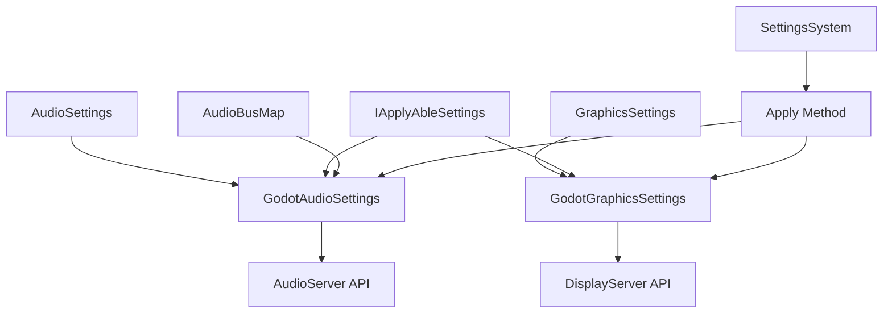

# Godot 设置模块 (Godot Settings Module)

## 概述

Godot 设置模块是 GFramework.Godot 的核心组件之一，专门为 Godot 引擎提供游戏设置系统的实现。该模块将通用的设置框架与 Godot
引擎的特定功能相结合，提供了音频设置和图形设置的完整解决方案。

## 核心类

### 音频设置系统

#### AudioBusMap

音频总线映射配置类，用于定义音频系统中不同类型音频的总线名称。

**属性：**

- `Master` - 主音频总线名称（默认："Master"）
- `Bgm` - 背景音乐音频总线名称（默认："BGM"）
- `Sfx` - 音效音频总线名称（默认："SFX"）

#### GodotAudioApplier

音频设置应用器，负责将音频设置应用到 Godot 引擎的音频总线系统。

**功能：**

- 应用音量设置到指定音频总线
- 处理音量格式转换（线性值到分贝）
- 音频总线存在性检查和警告

#### GodotAudioSettings

Godot 音频设置实现类，接收 AudioSettings 配置并实现 IApplyAbleSettings 接口，负责将音频配置应用到 Godot 音频系统。

**实现关系：**

```
AudioSettings (配置数据)
    ↓ [组合]
GodotAudioSettings (Godot 特定实现) → IApplyAbleSettings (可应用设置接口)
```

**功能：**

- 接收 AudioSettings 配置对象和 AudioBusMap 总线映射
- 实现 Apply() 方法，将音量设置应用到指定音频总线
- 支持自定义音频总线映射
- 自动处理音量格式转换（线性值到分贝）

### 图形设置系统

#### GodotGraphicsSettings

Godot 图形设置实现类，继承自 GraphicsSettings 并实现 IApplyAbleSettings。

**功能：**

- 分辨率设置和窗口尺寸调整
- 全屏模式切换
- 窗口位置自动居中
- 多显示器支持

## 架构设计



## 使用示例

### 音频设置配置

#### 基本音频设置

```csharp
// 创建音频配置数据
var settings = new AudioSettings
{
    MasterVolume = 0.8f,  // 80% 主音量
    BgmVolume = 0.6f,      // 60% 背景音乐音量
    SfxVolume = 0.9f       // 90% 音效音量
};

// 创建 Godot 音频设置应用器
var audioSettings = new GodotAudioSettings(settings, new AudioBusMap());

// 应用设置
audioSettings.Apply();
```

#### 自定义音频总线映射

```csharp
// 自定义音频总线映射
var customBusMap = new AudioBusMap
{
    Master = "Master_Bus",
    Bgm = "Background_Music",
    Sfx = "Sound_Effects"
};

// 创建音频配置
var settings = new AudioSettings
{
    MasterVolume = 0.7f,
    BgmVolume = 0.5f,
    SfxVolume = 0.8f
};

// 使用自定义总线映射应用设置
var audioSettings = new GodotAudioSettings(settings, customBusMap);
await audioSettings.Apply();
```

#### 通过设置系统使用

```csharp
// 注册音频设置到设置模型
var settingsModel = this.GetModel<ISettingsModel>();
var audioSettingsData = settingsModel.Get<AudioSettings>();
audioSettingsData.MasterVolume = 0.8f;
audioSettingsData.BgmVolume = 0.6f;
audioSettingsData.SfxVolume = 0.9f;

// 创建 Godot 音频设置应用器
var godotAudioSettings = new GodotAudioSettings(audioSettingsData, new AudioBusMap());
await godotAudioSettings.Apply();
```

### 图形设置配置

#### 基本图形设置

```csharp
// 创建图形设置
var graphicsSettings = new GodotGraphicsSettings
{
    ResolutionWidth = 1920,
    ResolutionHeight = 1080,
    Fullscreen = true
};

// 应用设置
await graphicsSettings.Apply();
```

#### 窗口模式切换

```csharp
public class DisplayManager : Node
{
    private GodotGraphicsSettings _graphicsSettings;
    
    public override void _Ready()
    {
        _graphicsSettings = new GodotGraphicsSettings();
    }
    
    public async Task ToggleFullscreen()
    {
        _graphicsSettings.Fullscreen = !_graphicsSettings.Fullscreen;
        await _graphicsSettings.Apply();
    }
    
    public async Task SetResolution(int width, int height)
    {
        _graphicsSettings.ResolutionWidth = width;
        _graphicsSettings.ResolutionHeight = height;
        _graphicsSettings.Fullscreen = false; // 窗口化时自动关闭全屏
        await _graphicsSettings.Apply();
    }
}
```

#### 预设分辨率配置

```csharp
public class ResolutionPresets
{
    public static readonly (int width, int height)[] CommonResolutions = 
    {
        (1920, 1080), // Full HD
        (2560, 1440), // QHD
        (3840, 2160), // 4K
        (1280, 720),  // HD
        (1366, 768),  // 常见笔记本分辨率
    };
    
    public static async Task ApplyResolution(GodotGraphicsSettings settings, int width, int height)
    {
        settings.ResolutionWidth = width;
        settings.ResolutionHeight = height;
        settings.Fullscreen = false;
        await settings.Apply();
    }
}
```

## API 详细说明

### AudioBusMap

```csharp
public sealed class AudioBusMap
{
    public string Master { get; init; } = "Master";
    public string Bgm { get; init; } = "BGM";
    public string Sfx { get; init; } = "SFX";
}
```

**特点：**

- 使用 `init` 属性，创建后不可修改
- 提供合理的默认值
- 支持对象初始化语法

### GodotAudioSettings

```csharp
public class GodotAudioSettings(AudioSettings settings, AudioBusMap busMap) : IApplyAbleSettings
{
    public Task Apply();
}
```

**构造函数参数：**

- `settings` - AudioSettings 配置对象，包含音量设置
- `busMap` - AudioBusMap 对象，定义音频总线映射

**Apply 方法实现：**

```csharp
public Task Apply()
{
    SetBus(busMap.Master, settings.MasterVolume);
    SetBus(busMap.Bgm, settings.BgmVolume);
    SetBus(busMap.Sfx, settings.SfxVolume);
    return Task.CompletedTask;
}
```

### GodotGraphicsSettings

```csharp
public class GodotGraphicsSettings : GraphicsSettings, IApplyAbleSettings
{
    public Task Apply();
}
```

**Apply 方法功能：**

- 设置窗口边框标志
- 切换窗口模式（窗口化/全屏）
- 调整窗口尺寸
- 自动居中窗口

## 技术实现细节

### 音频音量转换

Godot 音频系统使用分贝（dB）作为音量单位，而我们通常使用线性值（0-1）：

```csharp
// 线性值到分贝转换
float linearVolume = 0.5f;  // 50% 音量
float dbVolume = Mathf.LinearToDb(linearVolume); // 转换为分贝

// 应用到音频总线
AudioServer.SetBusVolumeDb(busIndex, dbVolume);
```

### 音量限制和保护

为避免完全静音（-inf dB），应用了最小音量限制：

```csharp
float clampedVolume = Mathf.Clamp(linear, 0.0001f, 1f);
float dbVolume = Mathf.LinearToDb(clampedVolume);
```

### 窗口管理

#### 全屏模式

```csharp
// 设置全屏
DisplayServer.WindowSetMode(DisplayServer.WindowMode.ExclusiveFullscreen);
DisplayServer.WindowSetFlag(DisplayServer.WindowFlags.Borderless, true);
```

#### 窗口化模式

```csharp
// 设置窗口化
DisplayServer.WindowSetMode(DisplayServer.WindowMode.Windowed);
DisplayServer.WindowSetSize(newSize);

// 居中窗口
var screen = DisplayServer.GetPrimaryScreen();
var screenSize = DisplayServer.ScreenGetSize(screen);
var position = (screenSize - newSize) / 2;
DisplayServer.WindowSetPosition(position);
```

## 最佳实践

### 1. 音频设置管理

#### 音量变化平滑过渡

```csharp
public class AudioManager : Node
{
    private Tween _volumeTween;
    
    public async Task SmoothVolumeTransition(float targetMasterVolume, float duration = 1.0f)
    {
        var currentVolume = AudioServer.GetBusVolumeDb(AudioServer.GetBusIndex("Master"));
        var currentLinear = Mathf.DbToLinear(currentVolume);
        
        _volumeTween?.Kill();
        _volumeTween = CreateTween();
        
        _volumeTween.TweenMethod(
            new Callable(this, nameof(SetMasterVolume)),
            currentLinear,
            targetMasterVolume,
            duration
        );
    }
    
    private void SetMasterVolume(float linearVolume)
    {
        var settings = new AudioSettings { MasterVolume = linearVolume };
        var audioSettings = new GodotAudioSettings(settings, new AudioBusMap());
        audioSettings.Apply();
    }
}

// 使用自定义总线映射的平滑过渡
public class CustomAudioManager : Node
{
    private Tween _volumeTween;
    private AudioBusMap _customBusMap;
    
    public override void _Ready()
    {
        _customBusMap = new AudioBusMap
        {
            Master = "Master_Bus",
            Bgm = "Background_Music",
            Sfx = "Sound_Effects"
        };
    }
    
    public async Task SmoothVolumeTransition(float targetMasterVolume, float duration = 1.0f)
    {
        var settings = new AudioSettings { MasterVolume = targetMasterVolume };
        var currentVolume = AudioServer.GetBusVolumeDb(AudioServer.GetBusIndex(_customBusMap.Master));
        var currentLinear = Mathf.DbToLinear(currentVolume);
        
        _volumeTween?.Kill();
        _volumeTween = CreateTween();
        
        _volumeTween.TweenMethod(
            new Callable(this, nameof(SetMasterVolume)),
            currentLinear,
            targetMasterVolume,
            duration
        );
    }
    
    private void SetMasterVolume(float linearVolume)
    {
        var audioSettingsData = new AudioSettings { MasterVolume = linearVolume };
        var audioSettings = new GodotAudioSettings(audioSettingsData, _customBusMap);
        audioSettings.Apply();
    }
}
```

#### 音频设置验证

```csharp
public static class AudioSettingsValidator
{
    public static bool ValidateBusNames(AudioBusMap busMap)
    {
        var masterIndex = AudioServer.GetBusIndex(busMap.Master);
        var bgmIndex = AudioServer.GetBusIndex(busMap.Bgm);
        var sfxIndex = AudioServer.GetBusIndex(busMap.Sfx);
        
        return masterIndex >= 0 && bgmIndex >= 0 && sfxIndex >= 0;
    }
    
    public static void LogMissingBuses(AudioBusMap busMap)
    {
        if (AudioServer.GetBusIndex(busMap.Master) < 0)
            GD.PrintErr($"Master bus not found: {busMap.Master}");
        
        if (AudioServer.GetBusIndex(busMap.Bgm) < 0)
            GD.PrintErr($"BGM bus not found: {busMap.Bgm}");
        
        if (AudioServer.GetBusIndex(busMap.Sfx) < 0)
            GD.PrintErr($"SFX bus not found: {busMap.Sfx}");
    }
}
```

### 2. 图形设置管理

#### 分辨率变更安全检查

```csharp
public static class DisplayValidator
{
    public static bool IsResolutionSupported(int width, int height)
    {
        var screen = DisplayServer.GetPrimaryScreen();
        var screenSize = DisplayServer.ScreenGetSize(screen);
        
        return width <= screenSize.x && height <= screenSize.y;
    }
    
    public static (int width, int height) GetMaxSafeResolution()
    {
        var screen = DisplayServer.GetPrimaryScreen();
        var screenSize = DisplayServer.ScreenGetSize(screen);
        
        return ((int)screenSize.x, (int)screenSize.y);
    }
}
```

#### 图形设置持久化

```csharp
public class GraphicsSettingsManager : Node
{
    private const string SettingsKey = "graphics_settings";
    private GodotGraphicsSettings _settings;
    
    public override void _Ready()
    {
        LoadSettings();
    }
    
    private void LoadSettings()
    {
        var storage = new GodotFileStorage(new JsonSerializer());
        
        try
        {
            _settings = storage.Read<GodotGraphicsSettings>(SettingsKey);
        }
        catch (FileNotFoundException)
        {
            _settings = new GodotGraphicsSettings
            {
                ResolutionWidth = 1920,
                ResolutionHeight = 1080,
                Fullscreen = false
            };
            SaveSettings();
        }
    }
    
    public void SaveSettings()
    {
        var storage = new GodotFileStorage(new JsonSerializer());
        storage.Write(SettingsKey, _settings);
    }
    
    public async Task ApplyAndSave()
    {
        await _settings.Apply();
        SaveSettings();
    }
}
```

## 性能考虑

### 1. 音频设置应用

- 音频总线查找是 O(1) 操作
- 音量转换计算开销很小
- 建议批量应用多个音量设置

### 2. 图形设置应用

- 窗口操作需要系统调用，相对较慢
- 分辨率变更可能触发窗口重建
- 避免频繁切换显示模式

### 3. 设置持久化

- 使用异步文件 I/O
- 考虑设置变更防抖机制
- 压缩设置文件以减少 I/O 开销

## 故障排除

### 常见问题

#### 1. 音频总线未找到

```
错误：Audio bus not found: CustomBGM
解决：确保在 Godot 项目中创建了对应的音频总线
```

#### 2. 分辨率设置无效

```
错误：分辨率无法设置到指定值
解决：检查分辨率是否超出显示器支持范围
```

#### 3. 全屏模式问题

```
错误：全屏切换失败
解决：检查是否在调试器中运行，某些全屏模式在调试时可能不可用
```

### 调试技巧

#### 音频调试

```csharp
// 打印所有音频总线信息
for (int i = 0; i < AudioServer.GetBusCount(); i++)
{
    var name = AudioServer.GetBusName(i);
    var volume = AudioServer.GetBusVolumeDb(i);
    GD.Print($"Bus {i}: {name} ({volume} dB)");
}
```

#### 图形调试

```csharp
// 打印当前显示信息
var screen = DisplayServer.GetPrimaryScreen();
var screenSize = DisplayServer.ScreenGetSize(screen);
var windowSize = DisplayServer.WindowGetSize();
var windowPos = DisplayServer.WindowGetPosition();
var windowMode = DisplayServer.WindowGetMode();

GD.Print($"Screen: {screenSize}");
GD.Print($"Window: {windowSize} at {windowPos}");
GD.Print($"Mode: {windowMode}");
```