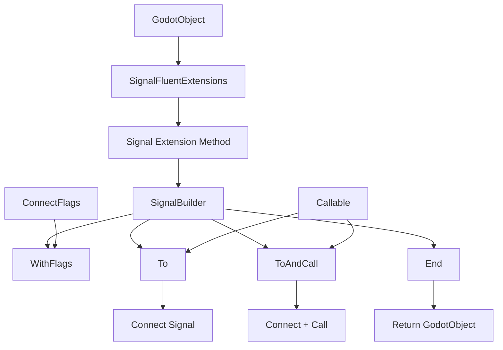

# 信号连接系统 (Signal Connection System)

## 概述

信号连接系统是 Godot 扩展方法模块中的一个专门子模块，提供流畅、类型安全的 Godot 信号连接 API。该系统采用构建器模式（Builder
Pattern）和流畅接口设计（Fluent Interface），大大简化了信号订阅代码，提高了代码的可读性和可维护性。

## 核心类

### SignalBuilder

信号连接构建器，负责构建和执行信号连接操作。

**特性：**

- 支持链式调用
- 可配置连接标志
- 支持连接后立即调用
- 返回原始对象以便继续操作

### SignalFluentExtensions

为 `GodotObject` 提供信号连接扩展方法，创建 `SignalBuilder` 实例。

## 架构设计



## 使用示例

### 基本信号连接

```csharp
// 基本连接
button.Signal(Button.SignalName.Pressed)
    .To(new Callable(this, nameof(OnButtonPressed)));

// 带连接标志
timer.Signal(Timer.SignalName.Timeout)
    .WithFlags(GodotObject.ConnectFlags.OneShot)
    .To(new Callable(this, nameof(OnTimerTimeout)));
```

### 连接并立即调用

```csharp
// 连接信号并立即调用一次
button.Signal(Button.SignalName.Pressed)
    .ToAndCall(new Callable(this, nameof(OnButtonPressed)));

// 连接带参数的信号并立即调用
area2D.Signal(Area2D.SignalName.BodyEntered)
    .ToAndCall(new Callable(this, nameof(OnBodyEntered)), new Variant[] { node });
```

### 复杂的连接链

```csharp
// 设置连接标志并连接
player.Signal(Player.SignalName.HealthChanged)
    .WithFlags(GodotObject.ConnectFlags.Deferred)
    .To(new Callable(this, nameof(OnHealthChanged)));

// 连接多个信号
var button = GetNode<Button>("StartButton");
button.Signal(Button.SignalName.Pressed)
    .WithFlags(GodotObject.ConnectFlags.OneShot)
    .ToAndCall(new Callable(this, nameof(OnGameStarted)));
```

## API 详细说明

### SignalBuilder 构造函数

```csharp
public SignalBuilder(GodotObject target, StringName signal)
```

**参数：**

- `target` - 要连接信号的 Godot 对象
- `signal` - 要连接的信号名称

### SignalBuilder 方法

#### WithFlags

设置连接标志。

```csharp
public SignalBuilder WithFlags(GodotObject.ConnectFlags flags)
```

**参数：**

- `flags` - Godot 连接标志枚举值

**常用的连接标志：**

- `ConnectFlags.Deferred` - 延迟调用
- `ConnectFlags.OneShot` - 一次性连接
- `ConnectFlags.ConnectPersisted` - 连接持久化
- `ConnectFlags.ReferenceCounted` - 引用计数

#### To

连接信号到指定的可调用对象。

```csharp
public SignalBuilder To(Callable callable, GodotObject.ConnectFlags? flags = null)
```

**参数：**

- `callable` - 要连接的可调用对象
- `flags` - 可选的连接标志，覆盖之前设置的标志

#### ToAndCall

连接信号并立即调用一次。

```csharp
public SignalBuilder ToAndCall(Callable callable, GodotObject.ConnectFlags? flags = null, params Variant[] args)
```

**参数：**

- `callable` - 要连接的可调用对象
- `flags` - 可选的连接标志
- `args` - 调用时传递的参数

#### End

显式结束构建，返回原始对象。

```csharp
public GodotObject End()
```

### SignalFluentExtensions 扩展方法

#### Signal

为 Godot 对象创建信号构建器。

```csharp
public static SignalBuilder Signal(this GodotObject @object, StringName signal)
```

**参数：**

- `@object` - 扩展方法的目标对象
- `signal` - 要连接的信号名称

## 实际应用场景

### UI 事件处理

```csharp
public class MainMenu : Control
{
    public override void _Ready()
    {
        var startButton = GetNode<Button>("StartButton");
        var quitButton = GetNode<Button>("QuitButton");
        var settingsButton = GetNode<Button>("SettingsButton");
        
        // 开始按钮 - 一次性连接并立即禁用
        startButton.Signal(Button.SignalName.Pressed)
            .WithFlags(GodotObject.ConnectFlags.OneShot)
            .ToAndCall(new Callable(this, nameof(OnStartPressed)));
        
        // 退出按钮
        quitButton.Signal(Button.SignalName.Pressed)
            .To(new Callable(this, nameof(OnQuitPressed)));
        
        // 设置按钮 - 延迟调用避免嵌套问题
        settingsButton.Signal(Button.SignalName.Pressed)
            .WithFlags(GodotObject.ConnectFlags.Deferred)
            .To(new Callable(this, nameof(OnSettingsPressed)));
    }
    
    private void OnStartPressed()
    {
        GetTree().ChangeSceneToFile("res://scenes/game.tscn");
    }
    
    private void OnQuitPressed()
    {
        GetTree().Quit();
    }
    
    private void OnSettingsPressed()
    {
        // 打开设置面板
        GetNode<Control>("SettingsPanel").Show();
    }
}
```

### 游戏逻辑事件

```csharp
public class Player : CharacterBody2D
{
    private HealthComponent _health;
    private AnimationPlayer _animPlayer;
    
    public override void _Ready()
    {
        _health = GetNode<HealthComponent>("HealthComponent");
        _animPlayer = GetNode<AnimationPlayer>("AnimationPlayer");
        
        // 生命值变化 - 延迟处理避免在动画中修改状态
        _health.Signal(HealthComponent.SignalName.HealthChanged)
            .WithFlags(GodotObject.ConnectFlags.Deferred)
            .To(new Callable(this, nameof(OnHealthChanged)));
        
        // 死亡事件 - 一次性连接
        _health.Signal(HealthComponent.SignalName.Died)
            .WithFlags(GodotObject.ConnectFlags.OneShot)
            .To(new Callable(this, nameof(OnDied)));
    }
    
    private void OnHealthChanged(float newHealth, float maxHealth)
    {
        // 更新UI或状态
        UpdateHealthBar(newHealth / maxHealth);
        
        // 播放受伤动画
        if (newHealth < _health.PreviousHealth)
        {
            _animPlayer.Play("hurt");
        }
    }
    
    private void OnDied()
    {
        // 播放死亡动画
        _animPlayer.Play("death");
        
        // 游戏结束
        GetTree().CallDeferred(SceneTree.MethodName.Quit);
    }
}
```

### 音频管理

```csharp
public class AudioManager : Node
{
    private AudioStreamPlayer _bgmPlayer;
    private AudioStreamPlayer _sfxPlayer;
    
    public override void _Ready()
    {
        _bgmPlayer = GetNode<AudioStreamPlayer>("BGMPlayer");
        _sfxPlayer = GetNode<AudioStreamPlayer>("SFXPlayer");
        
        // 背景音乐播放完成
        _bgmPlayer.Signal(AudioStreamPlayer.SignalName.Finished)
            .To(new Callable(this, nameof(OnBGMFinished)));
        
        // 音效播放完成 - 延迟清理
        _sfxPlayer.Signal(AudioStreamPlayer.SignalName.Finished)
            .WithFlags(GodotObject.ConnectFlags.Deferred)
            .To(new Callable(this, nameof(OnSFXFinished)));
    }
    
    private void OnBGMFinished()
    {
        // 循环播放背景音乐
        PlayBGM(_currentBGM);
    }
    
    private void OnSFXFinished()
    {
        // 清理音效资源或播放队列中的下一个音效
        CleanupSFXResources();
    }
}
```

## 设计模式分析

### Builder Pattern

SignalBuilder 实现了构建器模式：

- 分步构建复杂的信号连接
- 支持链式调用
- 延迟执行到最终调用时

### Fluent Interface

流畅接口设计：

- 方法链式调用
- 可读性强
- 表达力强

### Extension Method Pattern

扩展方法模式：

- 为现有类型添加功能
- 不修改原始类
- 保持向后兼容

## 与原生 API 对比

### 原生 Godot API

```csharp
// 传统方式
button.Connect(Button.SignalName.Pressed, new Callable(this, nameof(OnButtonPressed)));

// 带标志的方式
button.Connect(Button.SignalName.Pressed, new Callable(this, nameof(OnButtonPressed)), (uint)GodotObject.ConnectFlags.OneShot);

// 连接并立即调用
button.Connect(Button.SignalName.Pressed, new Callable(this, nameof(OnButtonPressed)));
new Callable(this, nameof(OnButtonPressed)).Call();
```

### 信号连接系统 API

```csharp
// 流畅方式
button.Signal(Button.SignalName.Pressed)
    .To(new Callable(this, nameof(OnButtonPressed)));

// 带标志的方式
button.Signal(Button.SignalName.Pressed)
    .WithFlags(GodotObject.ConnectFlags.OneShot)
    .To(new Callable(this, nameof(OnButtonPressed)));

// 连接并立即调用
button.Signal(Button.SignalName.Pressed)
    .ToAndCall(new Callable(this, nameof(OnButtonPressed)));
```

## 性能考虑

### 内存分配

- SignalBuilder 是轻量级对象
- 创建开销很小
- 使用后可被垃圾回收

### 调用开销

- 与原生 API 性能基本相同
- 主要开销在方法链调用
- 运行时性能无差异

### 推荐做法

- 避免在热循环中创建大量 SignalBuilder
- 适合 UI 事件、游戏逻辑等场景
- 可以放心使用，性能影响可忽略

## 最佳实践

### 1. 选择合适的连接标志

```csharp
// UI 事件通常使用延迟调用
button.Signal(Button.SignalName.Pressed)
    .WithFlags(GodotObject.ConnectFlags.Deferred)
    .To(callable);

// 一次性事件使用一次性标志
dialog.Signal(CustomDialog.SignalName.Accepted)
    .WithFlags(GodotObject.ConnectFlags.OneShot)
    .To(callable);
```

### 2. 合理使用 ToAndCall

```csharp
// ✅ 适合：初始化时立即触发
settingsSlider.Signal(Slider.SignalName.ValueChanged)
    .ToAndCall(new Callable(this, nameof(OnSettingsChanged)), initialSliderValue);

// ❌ 避免：重复连接并调用
button.Signal(Button.SignalName.Pressed)
    .ToAndCall(new Callable(this, nameof(OnButtonPressed))); // 可能不必要
```

### 3. 链式调用可读性

```csharp
// ✅ 推荐：清晰的链式调用
player.Signal(Player.SignalName.HealthChanged)
    .WithFlags(GodotObject.ConnectFlags.Deferred)
    .To(new Callable(this, nameof(UpdateHealthUI)));

// ❌ 避免：过度嵌套
node.Signal(CustomSignal.Signal1).WithFlags(Flags1).To(callable1)
     .Signal(CustomSignal.Signal2).WithFlags(Flags2).To(callable2);
```

## 相关链接

- [Godot 扩展方法](../README.md) - 扩展方法总览
- [节点扩展](../README.md#nodeextensions) - 更多节点操作方法
- [取消注册扩展](../README.md#unregisterextension) - 事件生命周期管理
- [Godot 官方信号文档](https://docs.godotengine.org/en/stable/tutorials/scripting_signals.html) - Godot 信号系统基础