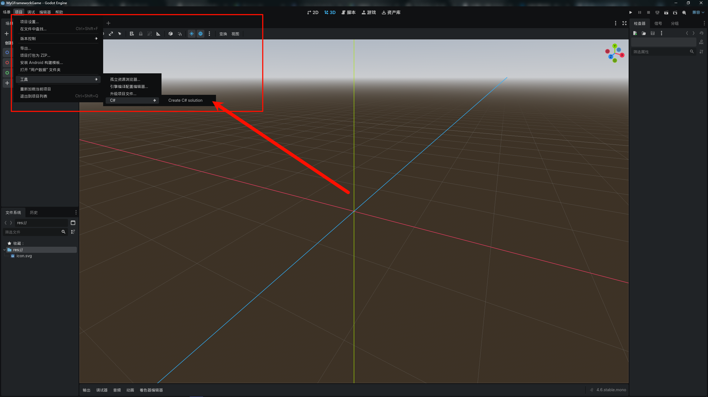
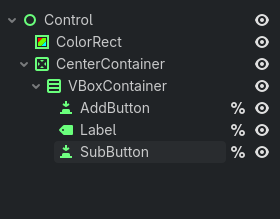
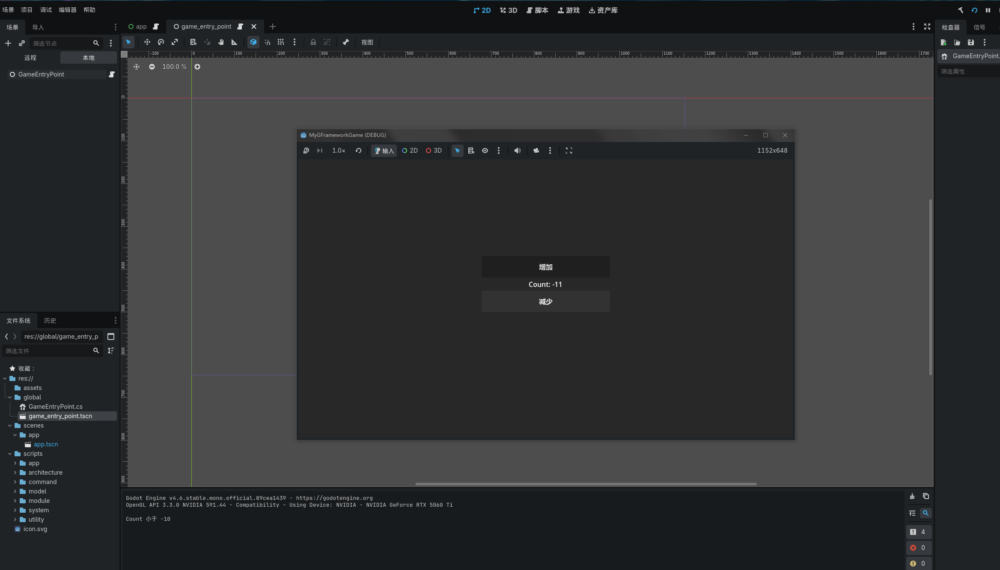

# 基础教程

这是一个完整的从零开始的教程，将带领你创建一个使用 GFramework 的简单的计数器应用。

## 目录

- [环境准备](#环境准备)
- [项目创建](#项目创建)
- [项目初始化](#项目初始化)
- [功能实现](#功能实现)
- [测试验证](#测试验证)

## 环境准备

### 系统要求

- **操作系统**: Windows 10+, macOS 10.15+, 或 Linux
- **.NET SDK**: 6.0 或更高版本
- **Godot 引擎**: 4.5.1 或更高版本
- **IDE**: Visual Studio 2022+, JetBrains Rider, 或 VS Code

### 安装 .NET SDK

1. 访问 [.NET 官网](https://dotnet.microsoft.com/download)
2. 下载并安装 .NET 6.0 SDK
3. 验证安装：

```bash
dotnet --version
# 应该显示 6.0.x 或更高版本
```

### 安装 Godot

1. 访问 [Godot 官网](https://godotengine.org/download)
2. 下载 Godot （Mono版）
3. 解压到合适的位置并启动
4. 在编辑器设置中确认 .NET 支持

### 验证环境

创建一个测试项目验证环境：

```bash
# 创建测试项目
dotnet new console -n TestProject
cd TestProject

# 如果使用 Godot，添加 Godot 引用
dotnet add package GeWuYou.GFramework.Core
dotnet add package GeWuYou.GFramework.Godot

# 编译测试
dotnet build
```

## 项目创建

### 1. 创建新的 Godot 项目

1. 打开 Godot 编辑器

2. 点击 "新建项目"

3. 创建项目文件夹，命名为 "MyGFrameworkGame"

4. 创建项目后初始化C#项目

   

### 2. 配置项目结构

在项目根目录创建以下文件夹结构：

```
MyGFrameworkGame/
├── sripts/				# 脚本
├── scenes/				# 场景
├── assets/             # 游戏资源
├── global/             # 全局类
└── project.godot
```

当然，你也可以选择你喜欢的代码组织方式

### 3. 引入GFramework

一般我们有两种引入方式

第一种是使用命令的方式引入

```sh
# 核心能力（推荐最小起步）
dotnet add package GeWuYou.GFramework.Core
dotnet add package GeWuYou.GFramework.Core.Abstractions

# 游戏扩展
dotnet add package GeWuYou.GFramework.Game
dotnet add package GeWuYou.GFramework.Game.Abstractions

# Godot 集成（仅 Godot 项目需要）
dotnet add package GeWuYou.GFramework.Godot

# 源码生成器（可选，但推荐）
dotnet add package GeWuYou.GFramework.SourceGenerators
```

当然这样包太多了，太费劲了，因此可以通过下方的命令直接将Core和Game模块都引入到项目中，再通过另外两个引入godot支持和源代码生成器

```sh
# Core+Game
dotnet add package GeWuYou.GFramework
# Godot
dotnet add package GeWuYou.GFramework.Godot
# 源码生成器
dotnet add package GeWuYou.GFramework.SourceGenerators
```

第二种方法可以通过ide（比如VS和Rider）

它们都提供NuGet管理，允许你基于图形界面来搜索并下载相关的NuGet包


## 项目初始化

### 1. 定义游戏架构

创建 `scripts/architecture/GameArchitecture.cs`:

```csharp
using GFramework.Godot.architecture;

namespace MyGFrameworkGame.scripts.architecture;

public class GameArchitecture : AbstractArchitecture
{
    protected override void InstallModules()
    {
        
    }
}
```

游戏架构类提供一个InstallModules方法用于注册模块，模块可以看作是一个个相关的Model、System、Utility的集合，按照开发者的意愿进行组织。

这里以一个示例代码进行说明

```C#
using GFramework.Core.Abstractions.architecture;
using GFramework.Core.Abstractions.environment;
using GFramework.Godot.architecture;
using GFrameworkGodotTemplate.scripts.module;

namespace GFrameworkGodotTemplate.scripts.core;

/// <summary>
///     游戏架构类，负责安装和管理游戏所需的各种模块
///     继承自AbstractArchitecture，用于构建游戏的整体架构体系
/// </summary>
public sealed class GameArchitecture(IArchitectureConfiguration configuration, IEnvironment environment)
    : AbstractArchitecture(configuration, environment)
{
    public IArchitectureConfiguration Configuration { get; set; } = configuration;

    /// <summary>
    ///     安装游戏所需的各个功能模块
    ///     该方法在架构初始化时被调用，用于注册系统、模型和工具模块
    /// </summary>
    protected override void InstallModules()
    {
        // 安装数据模型相关的Godot模块
        InstallModule(new ModelModule());
        // 安装系统相关的Godot模块
        InstallModule(new SystemModule());
        // 安装工具类相关的Godot模块
        InstallModule(new UtilityModule());
        // 安装状态相关的Godot模块
        InstallModule(new StateModule());
    }
}
```

从这里可以看到我们把 Model、 System、 Utility 进行了拆分，这是一种方式，使用这种方式的前提是，项目依赖不复杂，如果项目依赖复杂可能就得拆分多个Module来控制初始化顺序

### 2. 创建模型模块

创建 `scripts/module/ModelModule.cs`:

```csharp
using GFramework.Core.Abstractions.architecture;
using GFramework.Game.architecture;

namespace MyGFrameworkGame.scripts.module;

public class ModelModule: AbstractModule
{
    public override void Install(IArchitecture architecture)
    {
        
    }
}
```

这个Install(IArchitecture architecture)方法用于注册所需要的类即各种model

> Model在框架中表示游戏的状态和数据。模型是简单的数据容器，它们公开描述游戏实体当前状态的属性。

这里以一个示例代码进行说明

```C#
using GFramework.Core.Abstractions.architecture;
using GFramework.Core.functional.pipe;
using GFramework.Game.Abstractions.data;
using GFramework.Game.architecture;
using GFramework.Game.setting;
using GFramework.Godot.setting;
using GFramework.Godot.setting.data;
using GFrameworkGodotTemplate.scripts.setting;

namespace GFrameworkGodotTemplate.scripts.module;


/// <summary>
/// ModelModule 类继承自 AbstractModule，用于在架构中安装和注册模型。
/// 该模块主要负责初始化设置相关的模型，并将其注册到架构中。
/// </summary>
public class ModelModule : AbstractModule
{
    /// <summary>
    /// 安装方法，用于将模型注册到指定的架构中。
    /// </summary>
    /// <param name="architecture">IArchitecture 接口实例，表示当前的应用程序架构。</param>
    public override void Install(IArchitecture architecture)
    {
        // 获取设置数据仓库的实例，用于后续模型的初始化
        var settingsDataRepository = architecture.Context.GetUtility<ISettingsDataRepository>()!;

        // 注册设置模型，并配置其应用器（Applicator）
        architecture.RegisterModel(
            new SettingsModel<ISettingsDataRepository>(new SettingDataLocationProvider(), settingsDataRepository)
                .Also(it =>
                {
                    // 注册音频设置应用器，用于处理音频相关配置
                    it.RegisterApplicator(new GodotAudioSettings(it, new AudioBusMap()))
                        // 注册图形设置应用器，用于处理图形相关配置
                        .RegisterApplicator(new GodotGraphicsSettings(it))
                        // 注册本地化设置应用器，用于处理语言和区域相关配置
                        .RegisterApplicator(new GodotLocalizationSettings(it, new LocalizationMap()));
                })
        );
    }
}

```

可以看到这里把设置数据模型注册进了架构中

### 3. 创建系统模块

创建 `scripts/module/SystemModule.cs`:

```C#
using GFramework.Core.Abstractions.architecture;
using GFramework.Game.architecture;

namespace MyGFrameworkGame.scripts.module;

public class SystemModule: AbstractModule
{
    public override void Install(IArchitecture architecture)
    {
        
    }
}
```

这个Install(IArchitecture architecture)方法用于注册所需要的类即各种system

> System 包含游戏的业务逻辑和规则。系统操作模型并实现核心机制，如战斗、物理、库存管理或进度系统。

这里以一个示例代码进行说明

```C#
using GFramework.Core.Abstractions.architecture;
using GFramework.Game.architecture;
using GFramework.Game.setting;
using GFrameworkGodotTemplate.scripts.core.scene;
using GFrameworkGodotTemplate.scripts.core.ui;

namespace GFrameworkGodotTemplate.scripts.module;

/// <summary>
///     系统Godot模块类，负责安装和注册游戏所需的各种系统组件
///     继承自AbstractGodotModule，用于在游戏架构中集成系统功能
/// </summary>
public class SystemModule : AbstractModule
{
    /// <summary>
    ///     安装方法，用于向游戏架构注册各种系统组件
    /// </summary>
    /// <param name="architecture">游戏架构接口实例，用于注册系统</param>
    public override void Install(IArchitecture architecture)
    {
        architecture.RegisterSystem(new UiRouter());
        architecture.RegisterSystem(new SceneRouter());
        architecture.RegisterSystem(new SettingsSystem());
    }
}
```

可以看到我们向框架里注册了ui路由，场景路由，设置系统，这便是系统模块的作用

### 4. 创建工具模块

创建 `scripts/module/UtilityModule.cs`:

```C#
using GFramework.Core.Abstractions.architecture;
using GFramework.Game.architecture;

namespace MyGFrameworkGame.scripts.module;

public class UtilityModule: AbstractModule
{
    public override void Install(IArchitecture architecture)
    {
        
    }
}
```

同理这个Install(IArchitecture architecture)方法用于注册所需要的类即各种utility

> Utility 提供可在整个应用程序中使用的无状态辅助函数和算法——数学计算、路径查找、数据验证和其他纯函数。

这里以一个示例代码进行说明

```C#
using GFramework.Core.Abstractions.architecture;
using GFramework.Game.Abstractions.data;
using GFramework.Game.architecture;
using GFramework.Game.data;
using GFramework.Game.serializer;
using GFramework.Godot.scene;
using GFramework.Godot.storage;
using GFramework.Godot.ui;
using GFrameworkGodotTemplate.scripts.data;
using GFrameworkGodotTemplate.scripts.utility;
using Godot;

namespace GFrameworkGodotTemplate.scripts.module;

/// <summary>
///     工具模块类，负责安装和管理游戏中的实用工具组件
/// </summary>
public class UtilityModule : AbstractModule
{
    /// <summary>
    ///     安装模块到指定的游戏架构中
    /// </summary>
    /// <param name="architecture">要安装模块的目标游戏架构实例</param>
    public override void Install(IArchitecture architecture)
    {
        architecture.RegisterUtility(new GodotUiRegistry());
        architecture.RegisterUtility(new GodotSceneRegistry());
        architecture.RegisterUtility(new GodotTextureRegistry());
        architecture.RegisterUtility(new GodotUiFactory());
        var jsonSerializer = new JsonSerializer();
        architecture.RegisterUtility(jsonSerializer);
        var storage = new GodotFileStorage(jsonSerializer);
        architecture.RegisterUtility(storage);
        architecture.RegisterUtility(new UnifiedSettingsDataRepository(storage, jsonSerializer,
            new DataRepositoryOptions
            {
                BasePath = ProjectSettings.GetSetting("application/config/save/setting_path").AsString(),
                AutoBackup = true
            }));
        architecture.RegisterUtility(new SaveStorageUtility());
    }
}
```

这里安装了非常多的工具，特别是对于工具之间相互依赖的情况下，集中处理是一种比较好的方式。

### 5. 创建游戏入口点

在Godot创建一个全局类GameEntryPoint.cs


全局类代码

```C#
using GFramework.Core.Abstractions.architecture;
using Godot;
using MyGFrameworkGame.scripts.architecture;

namespace MyGFrameworkGame.global;

/// <summary>
/// 游戏入口点类，继承自Node类。
/// 该类负责初始化游戏架构，并在节点首次进入场景树时执行相关逻辑。
/// </summary>
public partial class GameEntryPoint : Node
{
    /// <summary>
    /// 获取游戏架构的静态属性。
    /// 该属性在类初始化时被赋值，用于全局访问游戏架构实例。
    /// </summary>
    public static IArchitecture Architecture { get; private set; } = null!;

    /// <summary>
    /// 当节点首次进入场景树时调用此方法。
    /// 在此方法中，创建并初始化游戏架构实例。
    /// </summary>
    public override void _Ready()
    {
       // 创建游戏架构实例
       Architecture = new GameArchitecture();
       // 初始化游戏架构
       Architecture.Initialize();
    }
}
```

### 6. 安装模块

```C#
using GFramework.Godot.architecture;
using MyGFrameworkGame.scripts.module;

namespace MyGFrameworkGame.scripts.architecture;

/// <summary>
/// 游戏架构类，继承自抽象架构类 AbstractArchitecture。
/// 负责安装和管理游戏中的各个模块。
/// </summary>
public class GameArchitecture : AbstractArchitecture
{
    /// <summary>
    /// 安装游戏所需的模块。
    /// 该方法在架构初始化时被调用，用于注册模型、系统和工具模块。
    /// </summary>
    protected override void InstallModules()
    {
        // 安装模型模块，负责处理游戏数据和业务逻辑
        InstallModule(new ModelModule());
       
        // 安装系统模块，负责处理游戏的核心系统功能
        InstallModule(new SystemModule());
       
        // 安装工具模块，提供通用的辅助功能和工具方法
        InstallModule(new UtilityModule());
    }
}
```

这样我们的准备工作就完成了

## 功能实现

### 1. 实现基础功能

首先让我们搭建一个非常简单的场景



这个是大致结构


这个是效果图

接着我们创建对应的代码

```C#
using GFramework.Core.Abstractions.controller;
using GFramework.SourceGenerators.Abstractions.logging;
using GFramework.SourceGenerators.Abstractions.rule;
using Godot;

namespace MyGFrameworkGame.scripts.app;

/// <summary>
/// App 类继承自 Control 并实现 IController 接口，用于管理应用程序的核心逻辑。
/// 该类通过按钮控制计数器的增减，并更新界面上的标签显示。
/// </summary>
[ContextAware]
[Log]
public partial class App : Control, IController
{
    /// <summary>
    /// 获取场景中的 AddButton 节点，用于增加计数器值。
    /// </summary>
    private Button AddButton => GetNode<Button>("%AddButton");

    /// <summary>
    /// 获取场景中的 SubButton 节点，用于减少计数器值。
    /// </summary>
    private Button SubButton => GetNode<Button>("%SubButton");

    /// <summary>
    /// 获取场景中的 Label 节点，用于显示当前计数器的值。
    /// </summary>
    private Label Label => GetNode<Label>("%Label");

    /// <summary>
    /// 计数器的当前值。
    /// </summary>
    private int _count;

    /// <summary>
    /// 当节点准备就绪时调用此方法。
    /// 初始化按钮点击事件并更新界面显示。
    /// </summary>
    public override void _Ready()
    {
        // 为 AddButton 添加点击事件，每次点击将计数器加一并更新视图
        AddButton.Pressed += () =>
        {
            _count++;
            UpdateView();
        };

        // 为 SubButton 添加点击事件，每次点击将计数器减一并更新视图
        SubButton.Pressed += () =>
        {
            _count--;
            UpdateView();
        };

        // 初始更新界面显示
        UpdateView();
    }

    /// <summary>
    /// 更新界面上 Label 的文本内容，显示当前计数器的值。
    /// </summary>
    private void UpdateView()
    {
        Label.Text = $"Count: {_count}";
    }
}
```

接着我们启动游戏


可以看到数量正确变化，我们基础功能已经实现了

根据MVC的定义

#### 1.1. **View（界面显示）**

负责呈现 UI 并接受用户输入：

- **节点引用**（按钮、标签）：

```
private Button AddButton => GetNode<Button>("%AddButton");
private Button SubButton => GetNode<Button>("%SubButton");
private Label Label => GetNode<Label>("%Label");
```

这些都是界面元素本身，属于 View。

- **UpdateView 方法**：

```
private void UpdateView()
{
    Label.Text = $"Count: {_count}";
}
```

这个方法是把 Model 的数据 `_count` 渲染到界面上，也属于 View 的逻辑。

#### 1.2. **Model（数据状态）**

负责存储业务数据或应用状态：

- **计数器状态**：

```
private int _count;
```

`_count` 就是你的 Model 数据，它保存了应用的核心状态（计数器的值）。

#### 1.3. **Controller（控制器）**

负责响应事件、处理逻辑、协调 Model 与 View：

- **按钮事件绑定和逻辑**：

```C#
AddButton.Pressed += () =>
{
    _count++;
    UpdateView();
};

SubButton.Pressed += () =>
{
    _count--;
    UpdateView();
};
```

这里是响应用户输入（按钮点击）、更新 Model（`_count++` / `--`）并通知 View（`UpdateView()`），属于 Controller 或 System。

- **_Ready 方法整体**：

```C#
public override void _Ready()
{
    // 添加按钮事件绑定
    ...
    // 初始更新界面显示
    UpdateView();
}
```

`_Ready` 是 Godot 的生命周期方法，用于初始化 Controller 系统。

接着让我们回顾一下代码

```C#
using GFramework.Core.Abstractions.controller;
using GFramework.SourceGenerators.Abstractions.logging;
using GFramework.SourceGenerators.Abstractions.rule;
using Godot;

namespace MyGFrameworkGame.scripts.app;

/// <summary>
/// App 类继承自 Control 并实现 IController 接口，用于管理应用程序的核心逻辑。
/// 该类通过按钮控制计数器的增减，并更新界面上的标签显示。
/// </summary>
[ContextAware]
[Log]
public partial class App : Control, IController
{
    /// <summary>
    /// 获取场景中的 AddButton 节点，用于增加计数器值。
    /// </summary>
    private Button AddButton => GetNode<Button>("%AddButton");

    /// <summary>
    /// 获取场景中的 SubButton 节点，用于减少计数器值。
    /// </summary>
    private Button SubButton => GetNode<Button>("%SubButton");

    /// <summary>
    /// 获取场景中的 Label 节点，用于显示当前计数器的值。
    /// </summary>
    private Label Label => GetNode<Label>("%Label");

    /// <summary>
    /// 计数器的当前值。
    /// </summary>
    private int _count;

    /// <summary>
    /// 当节点准备就绪时调用此方法。
    /// 初始化按钮点击事件并更新界面显示。
    /// </summary>
    public override void _Ready()
    {
        // 为 AddButton 添加点击事件，每次点击将计数器加一并更新视图
        AddButton.Pressed += () =>
        {
            _count++;
            UpdateView();
        };

        // 为 SubButton 添加点击事件，每次点击将计数器减一并更新视图
        SubButton.Pressed += () =>
        {
            _count--;
            UpdateView();
        };

        // 初始更新界面显示
        UpdateView();
    }

    /// <summary>
    /// 更新界面上 Label 的文本内容，显示当前计数器的值。
    /// </summary>
    private void UpdateView()
    {
        Label.Text = $"Count: {_count}";
    }
}

```

虽然看以上代码非常简洁明了，但其实存在诸多设计上的缺点

##### **1. View 与 Controller 耦合过紧**

```
AddButton.Pressed += () =>
{
    _count++;
    UpdateView();
};
```

- **问题**：UI 控件和业务逻辑（计数器）直接耦合在一起。
- **结果**：一旦界面复杂化（多个按钮、多个 Label、多个功能），代码难以维护，修改逻辑容易影响界面，反之亦然。

##### **2. 数据状态 Model 没有抽象**

```
private int _count;
```

- **问题**：计数器直接存在控制器里，没有独立的 Model 层。
- **结果**：无法单独测试逻辑，也无法在不同界面或不同场景复用数据。

------

##### **3. 缺乏统一的上下文管理**

- 事件绑定和视图更新直接在 `_Ready` 里写死。
- **问题**：当应用复杂，涉及异步操作、多场景或者跨协程调用时，很容易出现状态不一致或上下文丢失。
- **例子**：如果计数器状态需要在多个 Controller 或 Service 之间共享，这种写法就很麻烦。

------

##### **4. 可测试性低**

- `_count` 逻辑和按钮点击事件紧密耦合，**无法在单元测试中独立测试计数器逻辑**，只能在运行场景里手动点击按钮验证。

因此为了解决这些痛点，我们可以引入GFramework来解决它们

首先创建对应的模型接口

```C#
using GFramework.Core.Abstractions.model;

namespace MyGFrameworkGame.scripts.model;

/// <summary>
/// 定义一个计数器模型接口，用于提供计数器的基本操作。
/// </summary>
public interface ICounterModel: IModel
{
    /// <summary>
    /// 获取当前计数器的值。
    /// </summary>
    public int Count { get; }
    
    /// <summary>
    /// 将计数器的值增加1。
    /// </summary>
    public void Increment();

    /// <summary>
    /// 将计数器的值减少1。
    /// </summary>
    public void Decrement();
}

```

实现类

```C#
using GFramework.Core.extensions;
using GFramework.Core.model;

namespace MyGFrameworkGame.scripts.model;

/// <summary>
/// CounterModel 类表示一个计数器模型，继承自 AbstractModel 并实现 ICounterModel 接口。
/// 该类用于管理计数器的状态，并提供增加和减少计数的功能。
/// </summary>
public class CounterModel : AbstractModel, ICounterModel
{
    /// <summary>
    /// 获取当前计数器的值。该属性为只读，只能通过 Increment 和 Decrement 方法修改。
    /// </summary>
    public int Count { get; private set; }

    /// <summary>
    /// 初始化方法，在模型初始化时调用。当前实现为空，可根据需要扩展初始化逻辑。
    /// </summary>
    protected override void OnInit()
    {
        
    }

    /// <summary>
    /// ChangedCountEvent 记录类用于表示计数器值发生变化的事件。
    /// </summary>
    public sealed record ChangedCountEvent
    {
        public int Count { get; init; }
    }

    /// <summary>
    /// 增加计数器的值，并发送 ChangedCountEvent 事件通知监听者。
    /// </summary>
    public void Increment()
    {
        Count++;
        this.SendEvent(new ChangedCountEvent { Count = Count });
    }

    /// <summary>
    /// 减少计数器的值，并发送 ChangedCountEvent 事件通知监听者。
    /// </summary>
    public void Decrement()
    {
        Count--;
        this.SendEvent(new ChangedCountEvent { Count = Count });
    }
}

```

注册模型

```C#
using GFramework.Core.Abstractions.architecture;
using GFramework.Game.architecture;
using MyGFrameworkGame.scripts.model;

namespace MyGFrameworkGame.scripts.module;

/// <summary>
/// ModelModule 类继承自 AbstractModule，用于安装和注册模型。
/// </summary>
public class ModelModule: AbstractModule
{
    /// <summary>
    /// 安装方法，用于向架构中注册模型。
    /// </summary>
    /// <param name="architecture">IArchitecture 接口的实例，表示当前的架构。</param>
    public override void Install(IArchitecture architecture)
    {
        // 向架构中注册 CounterModel 实例
        architecture.RegisterModel(new CounterModel());
    }
}
```

重构App.cs

```C#
using GFramework.Core.Abstractions.controller;
using GFramework.Core.extensions;
using GFramework.SourceGenerators.Abstractions.logging;
using GFramework.SourceGenerators.Abstractions.rule;
using Godot;
using MyGFrameworkGame.scripts.model;

namespace MyGFrameworkGame.scripts.app;

/// <summary>
/// App 类继承自 Control 并实现 IController 接口，用于管理应用程序的核心逻辑。
/// 该类通过按钮控制计数器的增减，并更新界面上的标签显示。
/// </summary>
[ContextAware]
[Log]
public partial class App : Control, IController
{
    /// <summary>
    /// 获取场景中的 AddButton 节点，用于增加计数器值。
    /// </summary>
    private Button AddButton => GetNode<Button>("%AddButton");

    /// <summary>
    /// 获取场景中的 SubButton 节点，用于减少计数器值。
    /// </summary>
    private Button SubButton => GetNode<Button>("%SubButton");

    /// <summary>
    /// 获取场景中的 Label 节点，用于显示当前计数器的值。
    /// </summary>
    private Label Label => GetNode<Label>("%Label");
    
    
    private ICounterModel _counterModel = null!;

    /// <summary>
    /// 当节点准备就绪时调用此方法。
    /// 初始化按钮点击事件并更新界面显示。
    /// </summary>
    public override void _Ready()
    {
        _counterModel = this.GetModel<ICounterModel>();
        this.RegisterEvent<CounterModel.ChangedCountEvent>(e =>
        {
            UpdateView(e.Count);
        });
        // 为 AddButton 添加点击事件，每次点击将计数器加一并更新视图
        AddButton.Pressed += () =>
        {
            _counterModel.Increment();
        };

        // 为 SubButton 添加点击事件，每次点击将计数器减一并更新视图
        SubButton.Pressed += () =>
        {
            _counterModel.Decrement();
        };

        // 初始更新界面显示
        UpdateView();
    }

    /// <summary>
    /// 更新界面上 Label 的文本内容，显示当前计数器的值。
    /// </summary>
    private void UpdateView(int count = 0)
    {
        Label.Text = $"Count: {count}";
    }
}
```

然后我们启动游戏


可以看到功能还是正常的，但此时我们已经解决了刚刚的那几个问题.

问题 1：View 与 Controller 耦合过紧

原始问题

```
_count++;
UpdateView();
```

UI 直接操作数据，UI 和状态强耦合。

------

现在的实现

```
AddButton.Pressed += () =>
{
    _counterModel.Increment();
};
```

UI 只做一件事：

> 把“用户行为”转交给 Model

视图更新通过事件：

```
this.RegisterEvent<CounterModel.ChangedCountEvent>(e =>
{
    UpdateView(e.Count);
});
```

现在的流程变成：

```
Button → Model → Event → View
```

结论

已解决耦合问题
UI 不再直接修改状态
UI 不再主动刷新
UI 只是订阅结果

这是典型的 **单向数据流**。

问题 2：Model 没有抽象

原始问题

```
private int _count;
```

状态在 UI 控制器里。

------

现在

```
private ICounterModel _counterModel;
_counterModel = this.GetModel<ICounterModel>();
```

- 状态完全移动到 Model
- 通过接口依赖（而不是具体类）
- Controller 不关心具体实现

结论

现在：

- Model 可复用
- Model 可替换
- Controller 不依赖具体实现
- 可以单独测试 Model

问题 3：缺乏统一上下文管理

现在使用了：

```
[ContextAware]
this.GetModel<T>()
this.RegisterEvent<T>()
```

说明：

- Model 由 Context 提供
- 事件系统由框架管理
- 生命周期由框架管理

这意味着：

- 不需要手动 new Model
- 不需要手动维护单例
- 不需要自己管理事件总线
- 不会出现跨 Controller 状态错乱

问题 4：可测试性

现在 Controller 不再依赖按钮逻辑，理论上可以：

```
var model = new CounterModel();
model.Increment();
Assert.Equal(1, model.Count);
```

Model 已完全可测试。

但 Controller 呢？

`App : Control` 仍然继承 Godot 节点。

这意味着：

- 它仍然依赖 Godot 生命周期
- 仍然不能纯粹在普通单元测试里 new 出来

所以：

| 层级            | 可测试性        |
|---------------|-------------|
| Model         | ✅ 完全可测试     |
| Controller 逻辑 | ⚠️ 部分改善     |
| View          | ❌ 仍依赖 Godot |

但这是合理的，因为：

> View 本来就不应该被单元测试

真正重要的是：

- 业务逻辑在 Model
- Model 可测试
- Controller 只是桥梁

但即使是这样的代码也存在可能臃肿的情况，因为它同时承担着表现逻辑和交互逻辑。

表现逻辑（View Binding）

```
AddButton.Pressed += ...
UpdateView(...)
RegisterEvent(...)
```

交互逻辑（Interaction Logic）

```
_counterModel.Increment();
_counterModel.Decrement();
```

现在只是加减计数器，很简单。

但如果变成：

- 保存设置
- 切换语言
- 读取配置文件
- 异步加载资源
- 网络请求
- 存档
- 播放音效
- 埋点统计

`App` 会变成：

```
AddButton.Pressed += async () =>
{
    await DoSomething();
    UpdateSomething();
    SaveSomething();
    LogSomething();
    ...
};
```

Controller 会迅速膨胀。

这个时候就可以引入框架提供的命令来解决 Controller 的臃肿，即通过命令来分担 Controller 的交互逻辑的职责。

```C#
using GFramework.Core.command;
using GFramework.Core.extensions;
using MyGFrameworkGame.scripts.model;

namespace MyGFrameworkGame.scripts.command;

/// <summary>
/// 表示一个用于减少计数器值的命令类。
/// 该类继承自抽象命令类 <see cref="AbstractCommand"/>，并实现了具体的执行逻辑。
/// </summary>
public class DecreaseCountCommand : AbstractCommand
{
    /// <summary>
    /// 执行命令的核心方法。
    /// 该方法通过获取计数器模型并调用其递减方法来实现计数器值的减少。
    /// </summary>
    protected override void OnExecute()
    {
        // 获取计数器模型实例，并调用其递减方法
        this.GetModel<ICounterModel>()!.Decrement();
    }
}

```

```C#
using GFramework.Core.command;
using GFramework.Core.extensions;
using MyGFrameworkGame.scripts.model;

namespace MyGFrameworkGame.scripts.command;

/// <summary>
/// 表示一个用于增加计数器值的命令类。
/// 该类继承自抽象命令类 <see cref="AbstractCommand"/>，并实现了具体的执行逻辑。
/// </summary>
public class IncreaseCountCommand : AbstractCommand
{
    /// <summary>
    /// 执行命令的核心逻辑。
    /// 通过获取计数器模型实例并调用其递增方法来实现计数器值的增加。
    /// </summary>
    protected override void OnExecute()
    {
        // 获取计数器模型实例，并调用其 Increment 方法以增加计数器的值
        this.GetModel<ICounterModel>()!.Increment();
    }
}
```

```C#
using GFramework.Core.Abstractions.controller;
using GFramework.Core.extensions;
using GFramework.SourceGenerators.Abstractions.logging;
using GFramework.SourceGenerators.Abstractions.rule;
using Godot;
using MyGFrameworkGame.scripts.command;
using MyGFrameworkGame.scripts.model;

namespace MyGFrameworkGame.scripts.app;

/// <summary>
/// App 类继承自 Control 并实现 IController 接口，用于管理应用程序的核心逻辑。
/// 该类通过按钮控制计数器的增减，并更新界面上的标签显示。
/// </summary>
[ContextAware]
[Log]
public partial class App : Control, IController
{
    /// <summary>
    /// 获取场景中的 AddButton 节点，用于增加计数器值。
    /// </summary>
    private Button AddButton => GetNode<Button>("%AddButton");

    /// <summary>
    /// 获取场景中的 SubButton 节点，用于减少计数器值。
    /// </summary>
    private Button SubButton => GetNode<Button>("%SubButton");

    /// <summary>
    /// 获取场景中的 Label 节点，用于显示当前计数器的值。
    /// </summary>
    private Label Label => GetNode<Label>("%Label");

    /// <summary>
    /// 当节点准备就绪时调用此方法。
    /// 初始化按钮点击事件并更新界面显示。
    /// </summary>
    public override void _Ready()
    {
        this.RegisterEvent<CounterModel.ChangedCountEvent>(e =>
        {
            UpdateView(e.Count);
        });
        // 为 AddButton 添加点击事件，每次点击将计数器加一并更新视图
        AddButton.Pressed += () =>
        {
            this.SendCommand(new IncreaseCountCommand());
        };

        // 为 SubButton 添加点击事件，每次点击将计数器减一并更新视图
        SubButton.Pressed += () =>
        {
            this.SendCommand(new DecreaseCountCommand());
        };

        // 初始更新界面显示
        UpdateView();
    }

    /// <summary>
    /// 更新界面上 Label 的文本内容，显示当前计数器的值。
    /// </summary>
    private void UpdateView(int count = 0)
    {
        Label.Text = $"Count: {count}";
    }
}
```

这样你会发现，控制器不需要再获取Model了，这样控制器不必再去关心如何增加计数

即Controller 不再关心：

- 如何加
- 是否要保存
- 是否要同步服务器
- 是否要记录日志
- 是否要触发动画

全部委托给命令去处理，可以大幅减少控制器的代码量

这里举一个命令的例子，因为上面的计数增加可能看起来太简单了

```C#
using GFramework.Core.command;
using GFramework.Core.extensions;
using GFramework.Game.Abstractions.setting;
using GFramework.Game.Abstractions.setting.data;
using GFramework.Godot.setting;
using GFrameworkGodotTemplate.scripts.command.setting.input;

namespace GFrameworkGodotTemplate.scripts.command.setting;

/// <summary>
///     更改语言命令类
///     用于处理更改语言的业务逻辑
/// </summary>
/// <param name="input">语言更改命令输入参数</param>
public sealed class ChangeLanguageCommand(ChangeLanguageCommandInput input)
    : AbstractAsyncCommand<ChangeLanguageCommandInput>(input)
{
    /// <summary>
    ///     执行命令的异步方法
    /// </summary>
    /// <param name="input">命令输入参数</param>
    protected override async Task OnExecuteAsync(ChangeLanguageCommandInput input)
    {
        var model = this.GetModel<ISettingsModel>()!;
        var settings = model.GetData<LocalizationSettings>();
        settings.Language = input.Language;
        await this.GetSystem<ISettingsSystem>()!.Apply<GodotLocalizationSettings>().ConfigureAwait(false);
    }
}
```

从这个类可以看到切换一个语言我们需要获取设置模型，获取语言设置，变更配置，最后获取设置系统应用语言配置，如果这些全部写到控制器，会非常臃肿。特别是当逻辑越来越复杂的时候。

在前面的例子中，我们已经使用了这样一段代码：

```
this.RegisterEvent<CounterModel.ChangedCountEvent>(e =>
{
    UpdateView(e.Count);
});
```

我们当时只是用它来更新界面。

但实际上，这一行代码引入了一个更重要的机制：

> **事件驱动架构（Event-Driven Architecture）**

大家可能有个困惑。

为什么 Model 不直接调用 UpdateView？
为什么要多绕一层 Event？

没有事件

Model：

```
public void Increment()
{
    Count++;
    _view.UpdateView(Count);
}
```

问题：

- Model 依赖 View
- 强耦合
- 无法复用
- 无法扩展

------

使用事件

Model：

```
public void Increment()
{
    Count++;
    this.SendEvent(new ChangedCountEvent(Count));
}
```

View：

```
this.RegisterEvent<ChangedCountEvent>(...)
```

现在：

- Model 不知道 View
- View 订阅结果
- 可以有多个订阅者
- 完全解耦

因此我们可以知道事件不是为了通知 UI，事件是为了解耦系统。

接下来我们说说Utility

假设我们有个需求，就是计数不能超过20

首先可能会有人觉得为什么不用写在 Command 里？

```C#

using GFramework.Core.command;
using GFramework.Core.extensions;
using MyGFrameworkGame.scripts.model;

namespace MyGFrameworkGame.scripts.command;

/// <summary>
/// 表示一个用于增加计数器值的命令类。
/// 该类继承自抽象命令类 <see cref="AbstractCommand"/>，并实现了具体的执行逻辑。
/// </summary>
public class IncreaseCountCommand : AbstractCommand
{
    /// <summary>
    /// 执行命令的核心逻辑。
    /// 通过获取计数器模型实例并调用其递增方法来实现计数器值的增加。
    /// </summary>
    protected override void OnExecute()
    {
        // 获取计数器模型实例，并调用其 Increment 方法以增加计数器的值
        var model = this.GetModel<ICounterModel>()!;
        if(model.Count >= 20){
            return;
        }
        this.GetModel<ICounterModel>()!.Increment();
    }
}
```

对吧，多快

那么代价是什么呢？古尔丹？

- 规则写死在 Command 里
- 以后如果别的地方也要用“最大 20”这个限制怎么办？
- 单元测试只能测试 Command，不能单独测试规则
- 如果上限改成 100，需要改业务代码

因此我们需要一个“规则工具类” —— Utility

在 GFramework 中：

- Model：负责状态
- Command：负责行为
- Controller：负责协调
- Utility：负责**可复用逻辑**

Utility 的特点：

- 不依赖场景
- 不持有状态
- 纯逻辑
- 可单独测试
- 可以在任何层调用

```C#
using GFramework.Core.Abstractions.utility;

namespace MyGFrameworkGame.scripts.utility;

/// <summary>
/// 定义一个计数器工具接口，继承自 IContextUtility。
/// 该接口提供用于控制计数器行为的方法。
/// </summary>
public interface ICounterUtility: IContextUtility
{
    /// <summary>
    /// 判断当前值是否可以增加。
    /// </summary>
    /// <param name="current">当前计数器的值。</param>
    /// <returns>如果可以增加则返回 true，否则返回 false。</returns>
    public bool CanIncrease(int current);

    /// <summary>
    /// 将给定值限制在有效范围内。
    /// </summary>
    /// <param name="value">需要被限制的值。</param>
    /// <returns>经过限制后的值。</returns>
    public int Clamp(int value);
}

```

```C#
using System;
using GFramework.Core.utility;

namespace MyGFrameworkGame.scripts.utility;

/// <summary>
/// 计数器工具类，继承自 AbstractContextUtility 并实现 ICounterUtility 接口。
/// 提供计数相关的功能，如判断是否可以增加计数以及将值限制在指定范围内。
/// </summary>
/// <param name="maxCount">计数器的最大值，默认为 20。</param>
public class CounterUtility(int maxCount = 20): AbstractContextUtility,ICounterUtility
{
    /// <summary>
    /// 初始化方法，在对象创建时调用。
    /// 可以在此处进行初始化逻辑，例如从上下文中获取配置参数。
    /// </summary>
    protected override void OnInit()
    {
        // 当然，最大值也可以通过上下文的类进行传入，这里为了方便直接使用构造函数传入
    }

    /// <summary>
    /// 判断当前计数值是否可以继续增加。
    /// </summary>
    /// <param name="current">当前计数值。</param>
    /// <returns>如果当前值小于最大值，则返回 true；否则返回 false。</returns>
    public bool CanIncrease(int current)
    {
        return current < maxCount;
    }

    /// <summary>
    /// 将输入值限制在 [0, maxCount] 范围内。
    /// </summary>
    /// <param name="value">需要被限制的值。</param>
    /// <returns>限制后的值，确保其在合法范围内。</returns>
    public int Clamp(int value)
    {
        return Math.Clamp(value, 0, maxCount);
    }
}

```

```C#
using GFramework.Core.Abstractions.architecture;
using GFramework.Game.architecture;
using MyGFrameworkGame.scripts.utility;

namespace MyGFrameworkGame.scripts.module;

/// <summary>
/// UtilityModule 类继承自 AbstractModule，用于安装和注册工具类模块。
/// </summary>
public class UtilityModule : AbstractModule
{
    /// <summary>
    /// 安装方法，用于向架构中注册工具类实例。
    /// </summary>
    /// <param name="architecture">IArchitecture 接口的实现，表示当前的架构实例。</param>
    public override void Install(IArchitecture architecture)
    {
        // 向架构中注册 CounterUtility 实例
        architecture.RegisterUtility(new CounterUtility());
    }
}

```

```C#
using GFramework.Core.command;
using GFramework.Core.extensions;
using MyGFrameworkGame.scripts.model;
using MyGFrameworkGame.scripts.utility;

namespace MyGFrameworkGame.scripts.command;

/// <summary>
/// 表示一个用于增加计数器值的命令类。
/// 该类继承自抽象命令类 <see cref="AbstractCommand"/>，并实现了具体的执行逻辑。
/// </summary>
public class IncreaseCountCommand : AbstractCommand
{
    /// <summary>
    /// 执行命令的核心逻辑。
    /// 通过获取计数器模型实例并调用其递增方法来实现计数器值的增加。
    /// </summary>
    protected override void OnExecute()
    {
        // 获取计数器模型实例，并调用其 Increment 方法以增加计数器的值
        var model = this.GetModel<ICounterModel>()!;
        var utility = this.GetUtility<ICounterUtility>()!;
        if (!utility.CanIncrease(model.Count))
        {
            return;
        }
        model.Increment();
    }
}
```

这样我们就可以轻松的修改最大值，避免反复修改代码逻辑

新的需求出现了

现在我们又有一个新需求：

- 当 Count > 10 时，执行某个逻辑
- 当 Count < -10 时，执行另一个逻辑
- 未来可能还会有：
    - 达到 5 播放音效
    - 达到 15 触发警告
    - 达到 20 锁定按钮
    - 等等……

这时候问题来了：

> 这些逻辑应该写在哪里？

把逻辑堆在 Command 里？

```
protected override void OnExecute()
{
    var model = this.GetModel<ICounterModel>()!;
    var utility = this.GetUtility<ICounterUtility>()!;

    if (!utility.CanIncrease(model.Count))
        return;

    model.Increment();

    if (model.Count > 10)
    {
        // 做点事情
    }

    if (model.Count < -10)
    {
        // 做点别的事情
    }
}
```

但这样会导致

- Command 变得臃肿
- 逻辑耦合
- 每个 Command 都要写类似判断
- 如果以后 Count 变化来自别的地方怎么办？
- 逻辑分散，难以维护

因此我们要知道

> Command 只应该关心“行为”，
> 不应该关心“系统状态带来的连锁反应”。

因此我们要引入框架最后一个概念 -- System

> System 是对“状态变化”做出响应的统一管理者。

即

> Model 负责存储状态
>
> Command 负责改变状态
>
> System 负责响应状态

当某个状态变化后：

- 可能触发 UI 更新
- 可能触发音效
- 可能触发奖励
- 可能触发警告
- 可能触发更多逻辑

这些都不是 Command 的责任。

它们是：

> 系统级联行为（System-level reaction）

所以我们需要一个：

> 统一监听状态变化，并集中处理规则触发的模块。

这就是 System。

```C#
namespace MyGFrameworkGame.scripts.system;

/// <summary>
/// 定义一个计数器阈值检查系统的接口。
/// </summary>
public interface ICounterThresholdSystem
{
    /// <summary>
    /// 检查当前计数值是否超过预设阈值。
    /// </summary>
    /// <param name="count">当前的计数值。</param>
    /// <remarks>
    /// 此方法用于实现具体的阈值检查逻辑，具体行为由实现类定义。
    /// </remarks>
    public void CheckThreshold(int count);
}

```

```C#
using GFramework.Core.extensions;
using GFramework.Core.system;
using Godot;
using MyGFrameworkGame.scripts.model;

namespace MyGFrameworkGame.scripts.system;

/// <summary>
/// CounterThresholdSystem 类继承自 AbstractSystem 并实现 ICounterThresholdSystem 接口。
/// 该系统用于监听计数器的变化事件，并在计数值超过或低于特定阈值时执行相应逻辑。
/// </summary>
public class CounterThresholdSystem : AbstractSystem, ICounterThresholdSystem
{
    /// <summary>
    /// 初始化系统时注册计数器变化事件的监听器。
    /// 当计数器值发生变化时，触发 CheckThreshold 方法进行阈值检查。
    /// </summary>
    protected override void OnInit()
    {
        // 注册计数器变化事件的监听器
        this.RegisterEvent<CounterModel.ChangedCountEvent>(e =>
        {
            CheckThreshold(e.Count);
        });
    }

    /// <summary>
    /// 检查给定的计数值是否超出预设的阈值范围。
    /// 如果计数值大于 10，则输出提示信息 "Count 超过 10"；
    /// 如果计数值小于 -10，则输出提示信息 "Count 小于 -10"。
    /// </summary>
    /// <param name="count">当前计数值</param>
    public void CheckThreshold(int count)
    {
        // 检查计数值是否超过上限阈值（10）
        if (count > 10)
        {
            GD.Print("Count 超过 10");
        }

        // 检查计数值是否低于下限阈值（-10）
        if (count < -10)
        {
            GD.Print("Count 小于 -10");
        }
    }
}

```

```C#
using GFramework.Core.Abstractions.architecture;
using GFramework.Game.architecture;
using MyGFrameworkGame.scripts.system;

namespace MyGFrameworkGame.scripts.module;

/// <summary>
/// SystemModule 类继承自 AbstractModule，用于安装系统模块。
/// </summary>
public class SystemModule : AbstractModule
{
    /// <summary>
    /// 安装系统模块到指定的架构中。
    /// </summary>
    /// <param name="architecture">目标架构实例，用于注册系统模块。</param>
    public override void Install(IArchitecture architecture)
    {
        // 注册计数器阈值系统到架构中
        architecture.RegisterSystem(new CounterThresholdSystem());
    }
}

```

当我们启动游戏可以看到



成功触发

这样我们可以知道

Command 不需要知道阈值逻辑

Model 只负责发事件

System 统一管理状态反应

| 层级      | 负责什么   |
|---------|--------|
| Model   | 数据     |
| Command | 修改数据   |
| Utility | 纯规则计算  |
| System  | 状态驱动逻辑 |

> 当逻辑是“状态触发的反应”时，
> 应该使用 System，而不是堆在 Command 里。

这就是以上的教程了
