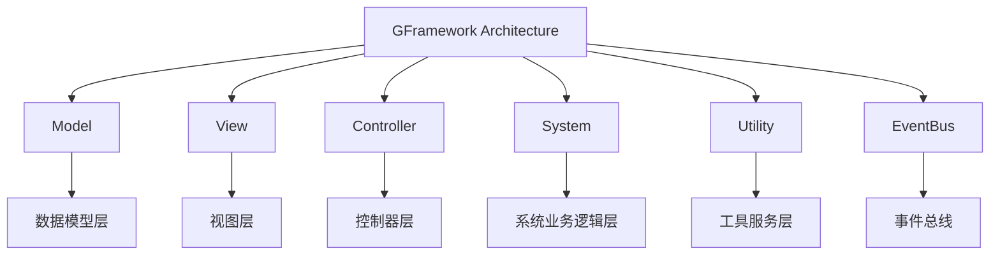

# GFramework 基础教程

这是一个循序渐进的教程，将带你从零开始学习 GFramework，通过构建一个计数器应用来理解框架的核心概念和最佳实践。

## 目录

### 第一部分：入门准备

- [环境准备](#环境准备)
- [GFramework 核心概念](#gframework-核心概念)

### 第二部分：基础实践

- [创建第一个项目](#创建第一个项目)
- [实现基础计数器](#实现基础计数器)

### 第三部分：架构深化

- [Model层设计](#model层设计)

### 第四部分：架构完善

- [System层实现](#system层实现)
- [Utility层设计](#utility层设计)

### 第五部分：架构整合

- [完整架构集成](#完整架构集成)

### 第六部分：进阶理解

- [架构原理深入](#架构原理深入)
- [最佳实践总结](#最佳实践总结)

---

## 环境准备

### 系统要求

- **操作系统**: Windows 10+, macOS 10.15+, 或 Linux
- **.NET SDK**: 6.0 或更高版本
- **Godot 引擎**: 4.5.1 或更高版本
- **IDE**: Visual Studio 2022+, JetBrains Rider, 或 VS Code

### 安装 .NET SDK

1. 访问 [.NET 官网](https://dotnet.microsoft.com/download)
2. 下载并安装 .NET 6.0 SDK
3. 验证安装：

```bash
dotnet --version
# 应该显示 6.0.x 或更高版本
```

### 安装 Godot

1. 访问 [Godot 官网](https://godotengine.org/download)
2. 下载 Godot （Mono版）
3. 解压到合适的位置并启动
4. 在编辑器设置中确认 .NET 支持

### 验证环境

创建一个测试项目验证环境：

```bash
# 创建测试项目
dotnet new console -n TestProject
cd TestProject

# 添加 GFramework 引用
dotnet add package GeWuYou.GFramework.Core
dotnet add package GeWuYou.GFramework.Godot

# 编译测试
dotnet build
```

---

## GFramework 核心概念

### MVC 架构模式简介

在传统的 MVC（Model-View-Controller）架构中：

- **Model（模型）**: 管理应用程序的数据和业务逻辑
- **View（视图）**: 负责数据的展示和用户界面
- **Controller（控制器）**: 处理用户输入，协调 Model 和 View

### GFramework 架构组件概述

GFramework 在传统 MVC 基础上进行了扩展，包含以下核心组件：



### 为什么选择事件驱动架构

传统的直接调用方式存在耦合问题：

```csharp
// 传统方式 - 强耦合
Model.Increment();
View.UpdateDisplay(Model.Count);
```

事件驱动架构的优势：

```csharp
// 事件驱动 - 松耦合
Model.Increment();  // 只关心业务逻辑
// View 通过事件订阅自动更新
```

---

## 创建第一个项目

### 项目结构规划

创建以下文件夹结构：

```text
MyGFrameworkGame/
├── scripts/           # 脚本代码
│   ├── architecture/  # 架构定义
│   ├── model/         # 数据模型
│   ├── system/        # 业务系统
│   ├── utility/       # 工具服务
│   ├── module/        # 模块定义
│   └── app/           # 应用入口
├── scenes/            # 场景文件
├── assets/            # 游戏资源
└── global/            # 全局类
```

### 包管理配置

推荐使用以下包配置：

```bash
# 核心框架
dotnet add package GeWuYou.GFramework

# Godot 集成
dotnet add package GeWuYou.GFramework.Godot

# 源码生成器（可选但推荐）
dotnet add package GeWuYou.GFramework.SourceGenerators
```

### 基础场景搭建

创建一个简单的 UI 场景：

```text
Control (App)
├── VBoxContainer
│   ├── Label ("%Label")
│   ├── HBoxContainer
│   │   ├── Button ("%AddButton")
│   │   └── Button ("%SubButton")
```

---

## 实现基础计数器

### 传统 MVC 实现方式

让我们先用传统方式实现一个简单的计数器：

```csharp
using Godot;

public partial class App : Control
{
    private Button _addButton => GetNode<Button>("%AddButton");
    private Button _subButton => GetNode<Button>("%SubButton");
    private Label _label => GetNode<Label>("%Label");
    
    private int _count = 0;

    public override void _Ready()
    {
        _addButton.Pressed += () => {
            _count++;
            UpdateView();
        };
        
        _subButton.Pressed += () => {
            _count--;
            UpdateView();
        };
        
        UpdateView();
    }

    private void UpdateView()
    {
        _label.Text = $"Count: {_count}";
    }
}
```

### 识别设计问题

上述实现存在以下问题：

1. **View 与 Controller 耦合过紧**
   - UI 控件和业务逻辑直接耦合
   - 难以维护和扩展

2. **数据状态没有抽象**
   - 状态直接存在控制器中
   - 无法复用和独立测试

3. **缺乏统一上下文管理**
   - 状态管理分散
   - 跨组件通信困难

4. **可测试性低**
   - 业务逻辑与 Godot 节点耦合
   - 难以进行单元测试

### 引入 GFramework 改进

让我们用 GFramework 来解决这些问题：

```csharp
using GFramework.Core.Abstractions.controller;
using GFramework.Core.extensions;
using GFramework.SourceGenerators.Abstractions.logging;
using GFramework.SourceGenerators.Abstractions.rule;
using Godot;

[ContextAware]
[Log]
public partial class App : Control, IController
{
    private Button AddButton => GetNode<Button>("%AddButton");
    private Button SubButton => GetNode<Button>("%SubButton");
    private Label Label => GetNode<Label>("%Label");

    public override void _Ready()
    {
        // 事件驱动的视图更新
        this.RegisterEvent<CounterModel.ChangedCountEvent>(e => {
            UpdateView(e.Count);
        });

        // 命令驱动的用户交互
        AddButton.Pressed += () => {
            this.SendCommand(new IncreaseCountCommand());
        };

        SubButton.Pressed += () => {
            this.SendCommand(new DecreaseCountCommand());
        };

        UpdateView();
    }

    private void UpdateView(int count = 0)
    {
        Label.Text = $"Count: {count}";
    }
}
```

---

## Model层设计

### 抽象模型接口

首先定义计数器模型接口：

```csharp
using GFramework.Core.Abstractions.model;

public interface ICounterModel : IModel
{
    int Count { get; }
    void Increment();
    void Decrement();
}
```

### 具体模型实现

实现具体的计数器模型：

```csharp
using GFramework.Core.extensions;
using GFramework.Core.model;

public class CounterModel : AbstractModel, ICounterModel
{
    public int Count { get; private set; }

    protected override void OnInit() { }

    public sealed record ChangedCountEvent
    {
        public int Count { get; init; }
    }

    public void Increment()
    {
        Count++;
        this.SendEvent(new ChangedCountEvent { Count = Count });
    }

    public void Decrement()
    {
        Count--;
        this.SendEvent(new ChangedCountEvent { Count = Count });
    }
}
```

### 模型注册与使用

在模块中注册模型：

```csharp
using GFramework.Core.Abstractions.architecture;
using GFramework.Game.architecture;

public class ModelModule : AbstractModule
{
    public override void Install(IArchitecture architecture)
    {
        architecture.RegisterModel(new CounterModel());
    }
}
```

---

## System层实现

### 系统模块概念

System 层负责处理业务逻辑和规则：

```csharp
using GFramework.Core.Abstractions.architecture;
using GFramework.Game.architecture;

public class SystemModule : AbstractModule
{
    public override void Install(IArchitecture architecture)
    {
        // 注册业务系统
        architecture.RegisterSystem(new CounterBusinessSystem());
    }
}
```

### 业务逻辑封装

创建业务逻辑系统：

```csharp
using GFramework.Core.system;
using GFramework.Core.extensions;

public class CounterBusinessSystem : AbstractSystem
{
    protected override void OnInit()
    {
        // 系统初始化逻辑
    }

    public void ValidateCount(int count)
    {
        // 业务验证逻辑
        if (count < 0)
            throw new InvalidOperationException("计数不能为负数");
    }
}
```

### 命令模式应用

创建计数命令：

```csharp
using GFramework.Core.command;
using GFramework.Core.extensions;

public class IncreaseCountCommand : AbstractCommand
{
    protected override void OnExecute()
    {
        var model = this.GetModel<ICounterModel>();
        model.Increment();
    }
}

public class DecreaseCountCommand : AbstractCommand
{
    protected override void OnExecute()
    {
        var model = this.GetModel<ICounterModel>();
        model.Decrement();
    }
}
```

---

## Utility层设计

### 工具类职责

Utility 层提供无状态的辅助功能：

```csharp
using GFramework.Core.Abstractions.architecture;
using GFramework.Game.architecture;

public class UtilityModule : AbstractModule
{
    public override void Install(IArchitecture architecture)
    {
        // 注册工具服务
        architecture.RegisterUtility(new MathUtility());
        architecture.RegisterUtility(new StringUtility());
    }
}
```

### 依赖注入管理

工具类的依赖注入示例：

```csharp
public class MathUtility
{
    public int Clamp(int value, int min, int max)
    {
        return Math.Max(min, Math.Min(max, value));
    }
    
    public float Lerp(float a, float b, float t)
    {
        return a + (b - a) * t;
    }
}
```

### 通用功能封装

常用的工具方法：

```csharp
public class StringUtility
{
    public string FormatCount(int count)
    {
        return count >= 1000 
            ? $"{count / 1000.0:F1}K" 
            : count.ToString();
    }
    
    public bool IsValidName(string name)
    {
        return !string.IsNullOrWhiteSpace(name) && name.Length <= 20;
    }
}
```

---

## 完整架构集成

### 模块化架构设计

整合所有模块：

```csharp
using GFramework.Godot.architecture;

public class GameArchitecture : AbstractArchitecture
{
    protected override void InstallModules()
    {
        InstallModule(new ModelModule());
        InstallModule(new SystemModule());
        InstallModule(new UtilityModule());
    }
}
```

### 依赖关系管理

清晰的依赖层次：

```text
GameArchitecture
├── ModelModule
│   └── CounterModel
├── SystemModule
│   └── CounterBusinessSystem
└── UtilityModule
    ├── MathUtility
    └── StringUtility
```

### 初始化流程

游戏入口点：

```csharp
using GFramework.Core.Abstractions.architecture;
using Godot;

public partial class GameEntryPoint : Node
{
    public static IArchitecture Architecture { get; private set; }

    public override void _Ready()
    {
        Architecture = new GameArchitecture();
        Architecture.Initialize();
    }
}
```

### 上下文管理

使用上下文感知特性：

```csharp
[ContextAware]
public partial class App : Control, IController
{
    // 框架自动注入上下文
    // 可以直接使用 this.GetModel<T>() 等方法
}
```

---

## 架构原理深入

### 事件驱动架构优势

事件驱动的核心价值：

```csharp
// 发布事件
this.SendEvent(new GameEvent.LevelCompleted { Level = 1 });

// 订阅事件（多个订阅者）
this.RegisterEvent<GameEvent.LevelCompleted>(e => {
    // 更新UI
});

this.RegisterEvent<GameEvent.LevelCompleted>(e => {
    // 保存进度
});

this.RegisterEvent<GameEvent.LevelCompleted>(e => {
    // 播放音效
});
```

### 解耦设计思想

组件间的松耦合关系：

```text
Model ←→ EventBus ←→ View
  ↑                     ↑
  └───────System────────┘
```

### 可测试性提升

各层组件的可测试性：

```csharp
// Model 层测试
[Test]
public void CounterModel_Increment_ShouldIncreaseCount()
{
    var model = new CounterModel();
    model.Initialize();
    
    model.Increment();
    
    Assert.Equal(1, model.Count);
}

// System 层测试
[Test]
public void CounterBusinessSystem_ValidateCount_ShouldThrowForNegative()
{
    var system = new CounterBusinessSystem();
    system.Initialize();
    
    Assert.Throws<InvalidOperationException>(() => 
        system.ValidateCount(-1));
}
```

### 扩展性考虑

易于扩展的架构设计：

```csharp
// 添加新功能只需扩展相应层
public class SaveSystem : AbstractSystem
{
    public void SaveGame()
    {
        var counterModel = this.GetModel<ICounterModel>();
        // 保存逻辑
    }
}

// 在模块中注册
public override void Install(IArchitecture architecture)
{
    architecture.RegisterSystem(new SaveSystem());
}
```

---

## 最佳实践总结

### 代码组织规范

推荐的项目结构：

```text
Project/
├── scripts/
│   ├── architecture/
│   │   ├── GameArchitecture.cs
│   │   └── GameModule.cs
│   ├── model/
│   │   ├── ICounterModel.cs
│   │   └── CounterModel.cs
│   ├── system/
│   │   ├── CounterBusinessSystem.cs
│   │   └── SaveSystem.cs
│   ├── utility/
│   │   ├── MathUtility.cs
│   │   └── StringUtility.cs
│   ├── command/
│   │   ├── IncreaseCountCommand.cs
│   │   └── DecreaseCountCommand.cs
│   └── app/
│       └── App.cs
└── scenes/
```

### 设计模式应用

核心设计模式：

1. **观察者模式**: 事件系统
2. **命令模式**: 业务操作封装
3. **工厂模式**: 对象创建
4. **单例模式**: 架构上下文

### 性能优化建议

```csharp
// 避免频繁事件发送
public void BatchUpdate()
{
    // 批量处理逻辑
    this.SendEvent(new BatchUpdateEvent { Data = batchData });
}

// 合理使用事件过滤
this.RegisterEvent<CounterModel.ChangedCountEvent>(
    e => UpdateView(e.Count),
    filter: e => e.Count % 10 == 0  // 每10次更新一次
);
```

### 常见问题解答

**Q: 什么时候使用 Model vs System?**
A: Model 管理状态数据，System 处理业务逻辑

**Q: 如何处理异步操作?**
A: 使用 AbstractAsyncCommand 和协程调度器

**Q: 如何进行模块间通信?**
A: 通过事件总线，避免直接依赖

**Q: 如何管理复杂的依赖关系?**
A: 使用模块化设计，明确依赖方向

---

## 总结

通过本教程，你已经学习了：

1. **基础概念**: MVC 架构和事件驱动设计
2. **实践应用**: 从传统实现到框架改进
3. **架构分层**: Model、System、Utility 各层职责
4. **核心原理**: 解耦设计和可测试性
5. **最佳实践**: 代码组织和设计模式应用

现在你已经具备了使用 GFramework 构建游戏应用的基础知识，可以开始创建更复杂的游戏功能了！
