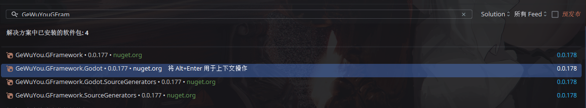
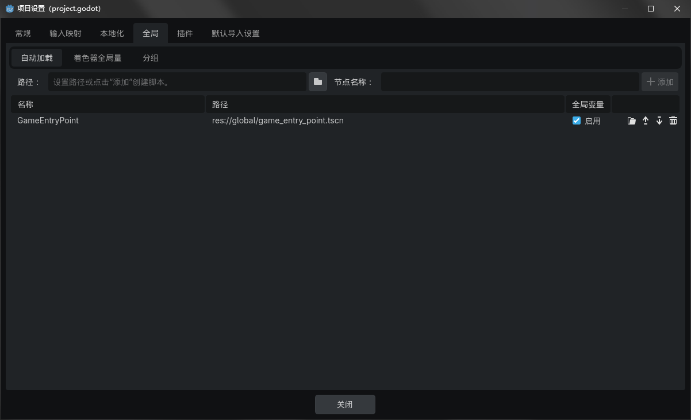

---
prev:
  text: '环境准备'
  link: './01-environment'
next:
  text: '基础计数器实现'
  link: './03-counter-basic'
---

# 第 2 章：项目创建与初始化

本章将指导你创建一个新的 Godot 项目，引入 GFramework，并搭建基础的架构结构。

## 创建 Godot 项目

### 1. 新建项目

1. 打开 Godot 编辑器
2. 点击 **新建项目**
3. 配置项目信息：
    - **项目名称**：`MyGFrameworkGame`
    - **项目路径**：选择合适的文件夹
    - **渲染器**：Forward+ 或 Mobile（根据需求选择）
4. 点击 **创建并编辑**

### 2. 初始化 C# 项目

项目创建后，Godot 会提示初始化 C# 支持：


点击 **创建 C# 解决方案**，Godot 会自动生成：

- `MyGFrameworkGame.csproj` - C# 项目文件
- `MyGFrameworkGame.sln` - 解决方案文件

### 3. 配置项目结构

在项目根目录创建以下文件夹：

```
MyGFrameworkGame/
├── scripts/          # C# 脚本代码
│   ├── architecture/ # 架构相关
│   ├── module/       # 模块定义
│   ├── model/        # 数据模型
│   ├── system/       # 系统逻辑
│   ├── utility/      # 工具类
│   └── app/          # 应用逻辑
├── scenes/           # Godot 场景文件
├── assets/           # 游戏资源（图片、音频等）
├── global/           # 全局脚本
└── project.godot     # Godot 项目配置
```

::: tip 文件夹组织建议
这只是推荐的结构，你可以根据项目需求调整。核心原则是：

- **按功能分类**（如 model、system）
- **保持清晰**（避免过深的嵌套）
- **易于导航**（团队成员能快速找到文件）
  :::

## 引入 GFramework

### 方式一：使用命令行（推荐）

打开项目根目录的终端，运行：

```bash
# 核心能力 + 游戏扩展（一键安装）
dotnet add package GeWuYou.GFramework

# Godot 集成
dotnet add package GeWuYou.GFramework.Godot

# 源码生成器（可选，但推荐）
dotnet add package GeWuYou.GFramework.SourceGenerators
```

::: details 分包安装（了解即可）
如果需要更细粒度的控制，也可以单独安装各个包：

```bash
# 核心能力
dotnet add package GeWuYou.GFramework.Core
dotnet add package GeWuYou.GFramework.Core.Abstractions

# 游戏扩展
dotnet add package GeWuYou.GFramework.Game
dotnet add package GeWuYou.GFramework.Game.Abstractions

# Godot 集成
dotnet add package GeWuYou.GFramework.Godot

# 源码生成器
dotnet add package GeWuYou.GFramework.SourceGenerators
```

:::

### 方式二：使用 IDE

**Visual Studio / Rider**

1. 右键点击项目 → **管理 NuGet 包**
2. 搜索 `GeWuYou.GFramework`
3. 安装以下包：
    - `GeWuYou.GFramework`
    - `GeWuYou.GFramework.Godot`
    - `GeWuYou.GFramework.SourceGenerators`



### 验证安装

安装完成后，运行：

```bash
dotnet build
```

如果编译成功，说明 GFramework 已正确引入。

## 搭建基础架构

### 1. 创建游戏架构类

在 `scripts/architecture/` 创建 `GameArchitecture.cs`：

```csharp
using GFramework.Godot.architecture;

namespace MyGFrameworkGame.scripts.architecture;

/// <summary>
/// 游戏架构类，负责管理整个应用的模块和依赖
/// </summary>
public class GameArchitecture : AbstractArchitecture
{
    /// <summary>
    /// 安装游戏所需的各个功能模块
    /// </summary>
    protected override void InstallModules()
    {
        // 稍后在这里注册模块
    }
}
```

::: tip 架构类的作用
`GameArchitecture` 是整个应用的核心入口点，它负责：

- 注册和管理所有模块
- 提供依赖注入容器
- 管理应用生命周期
  :::

### 2. 创建模型模块

在 `scripts/module/` 创建 `ModelModule.cs`：

```csharp
using GFramework.Core.Abstractions.architecture;
using GFramework.Game.architecture;

namespace MyGFrameworkGame.scripts.module;

/// <summary>
/// 模型模块，负责注册所有的数据模型
/// </summary>
public class ModelModule : AbstractModule
{
    /// <summary>
    /// 安装模型到架构中
    /// </summary>
    public override void Install(IArchitecture architecture)
    {
        // 稍后在这里注册 Model
    }
}
```

::: tip Model 是什么？
**Model（模型）** 表示游戏的状态和数据。它是简单的数据容器，负责：

- 存储应用状态（如计数器的值）
- 提供数据访问接口
- 发送状态变化事件

Model **不应该**包含业务逻辑或 UI 逻辑。
:::

### 3. 创建系统模块

在 `scripts/module/` 创建 `SystemModule.cs`：

```csharp
using GFramework.Core.Abstractions.architecture;
using GFramework.Game.architecture;

namespace MyGFrameworkGame.scripts.module;

/// <summary>
/// 系统模块，负责注册所有的系统逻辑
/// </summary>
public class SystemModule : AbstractModule
{
    /// <summary>
    /// 安装系统到架构中
    /// </summary>
    public override void Install(IArchitecture architecture)
    {
        // 稍后在这里注册 System
    }
}
```

::: tip System 是什么？
**System（系统）** 包含游戏的业务逻辑和规则。它负责：

- 响应状态变化
- 执行游戏规则
- 协调多个 Model 的交互

示例：设置系统、UI 路由系统、场景管理系统等。
:::

### 4. 创建工具模块

在 `scripts/module/` 创建 `UtilityModule.cs`：

```csharp
using GFramework.Core.Abstractions.architecture;
using GFramework.Game.architecture;

namespace MyGFrameworkGame.scripts.module;

/// <summary>
/// 工具模块,负责注册所有的工具类
/// </summary>
public class UtilityModule : AbstractModule
{
    /// <summary>
    /// 安装工具类到架构中
    /// </summary>
    public override void Install(IArchitecture architecture)
    {
        // 稍后在这里注册 Utility
    }
}
```

::: tip Utility 是什么？
**Utility（工具类）** 提供可复用的辅助函数，负责：

- 无状态的计算和验证
- 数据转换和格式化
- 纯函数式的业务规则

示例：数学计算、数据校验、文件操作等。
:::

### 5. 注册模块到架构

回到 `GameArchitecture.cs`，注册刚创建的模块：

```csharp
using GFramework.Godot.architecture;
using MyGFrameworkGame.scripts.module;

namespace MyGFrameworkGame.scripts.architecture;

/// <summary>
/// 游戏架构类，负责管理整个应用的模块和依赖
/// </summary>
public class GameArchitecture : AbstractArchitecture
{
    /// <summary>
    /// 安装游戏所需的各个功能模块
    /// </summary>
    protected override void InstallModules()
    {
        // 按顺序安装模块
        InstallModule(new ModelModule());    // 数据模型
        InstallModule(new SystemModule());   // 系统逻辑
        InstallModule(new UtilityModule());  // 工具类
    }
}
```

::: warning 模块安装顺序
模块的安装顺序很重要！如果 System 依赖 Model，那么 Model 必须先安装。

推荐顺序：

1. Utility（无依赖）
2. Model（可能依赖 Utility）
3. System（可能依赖 Model 和 Utility）
   :::

## 创建游戏入口点

### 1. 创建全局类

在 Godot 编辑器中：

1. 点击 **项目 → 项目设置**
2. 选择 **自动加载** 标签
3. 点击文件夹图标，选择 **新建脚本**
4. 配置脚本：
    - **语言**：C#
    - **模板**：Node
    - **类名**：`GameEntryPoint`
    - **路径**：`global/GameEntryPoint.cs`
5. 点击 **创建**
6. 将脚本添加为自动加载单例



### 2. 实现入口点逻辑

编辑 `global/GameEntryPoint.cs`：

```csharp
using GFramework.Core.Abstractions.architecture;
using Godot;
using MyGFrameworkGame.scripts.architecture;

namespace MyGFrameworkGame.global;

/// <summary>
/// 游戏入口点，在游戏启动时初始化架构
/// </summary>
public partial class GameEntryPoint : Node
{
    /// <summary>
    /// 获取游戏架构的静态属性
    /// </summary>
    public static IArchitecture Architecture { get; private set; } = null!;

    /// <summary>
    /// 当节点首次进入场景树时调用
    /// </summary>
    public override void _Ready()
    {
        // 创建游戏架构实例
        Architecture = new GameArchitecture();
        
        // 初始化游戏架构（会自动调用 InstallModules）
        Architecture.Initialize();
        
        GD.Print("✅ GFramework 架构初始化完成！");
    }
}
```

### 3. 验证架构初始化

运行游戏（F5），在输出面板应该看到：

```
✅ GFramework 架构初始化完成！
```

如果看到这条消息，说明架构初始化成功！

## 项目结构总览

此时，你的项目结构应该如下：

```
MyGFrameworkGame/
├── scripts/
│   ├── architecture/
│   │   └── GameArchitecture.cs     ✅ 游戏架构
│   └── module/
│       ├── ModelModule.cs          ✅ 模型模块
│       ├── SystemModule.cs         ✅ 系统模块
│       └── UtilityModule.cs        ✅ 工具模块
├── global/
│   └── GameEntryPoint.cs           ✅ 入口点
├── scenes/
├── assets/
├── project.godot
├── MyGFrameworkGame.csproj         ✅ C# 项目文件
└── MyGFrameworkGame.sln            ✅ 解决方案文件
```

## 理解架构设计

让我们回顾一下刚才搭建的架构：

```
GameEntryPoint (入口)
    ↓
GameArchitecture (架构核心)
    ↓
InstallModules (安装模块)
    ├── ModelModule   → 注册 Model
    ├── SystemModule  → 注册 System
    └── UtilityModule → 注册 Utility
```

### 为什么要分模块？

1. **关注点分离**：Model、System、Utility 各司其职
2. **依赖管理**：通过模块控制初始化顺序
3. **可维护性**：相关功能集中在一个模块中
4. **可扩展性**：新增功能只需添加新模块

### 依赖注入的优势

通过 `architecture.Register*()`，GFramework 提供了依赖注入能力：

```csharp
// 注册时
architecture.RegisterModel(new CounterModel());

// 使用时（在 Controller 或 Command 中）
var model = this.GetModel<ICounterModel>();
```

优势：

- **无需手动管理单例**
- **自动处理依赖关系**
- **便于单元测试**（可以 mock 依赖）

## 常见问题

### 编译错误："找不到类型或命名空间"

**原因**：NuGet 包未正确安装

**解决方案**：

```bash
dotnet restore
dotnet build
```

### GameEntryPoint 未自动执行

**原因**：未添加为自动加载

**解决方案**：

1. 打开 **项目 → 项目设置 → 自动加载**
2. 确认 `GameEntryPoint` 在列表中
3. 确认 **启用** 复选框已勾选

### 模块注册顺序错误

**症状**：System 初始化时找不到 Model

**解决方案**：
在 `InstallModules()` 中调整顺序，确保被依赖的模块先安装。

## 下一步

基础架构搭建完成！虽然现在还没有具体功能，但我们已经建立了一个坚实的基础。

在下一章中，我们将：

- 创建一个简单的计数器 UI
- 实现基础的增减功能
- 分析传统实现的问题
- 为后续的架构优化做准备

👉 [第 3 章：基础计数器实现](./03-counter-basic.md)

---

::: details 本章检查清单

- [ ] Godot 项目已创建
- [ ] C# 解决方案已初始化
- [ ] GFramework NuGet 包已安装
- [ ] GameArchitecture 类已创建
- [ ] 三大模块（Model/System/Utility）已创建
- [ ] GameEntryPoint 入口点已配置
- [ ] 运行游戏能看到"架构初始化完成"消息
  :::
