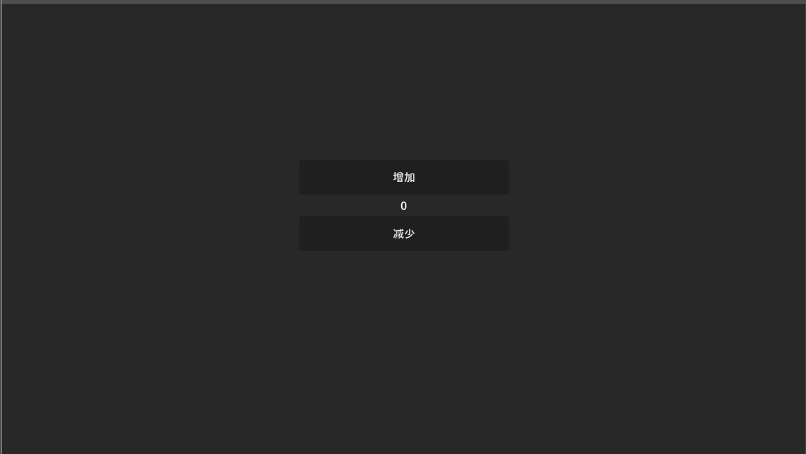
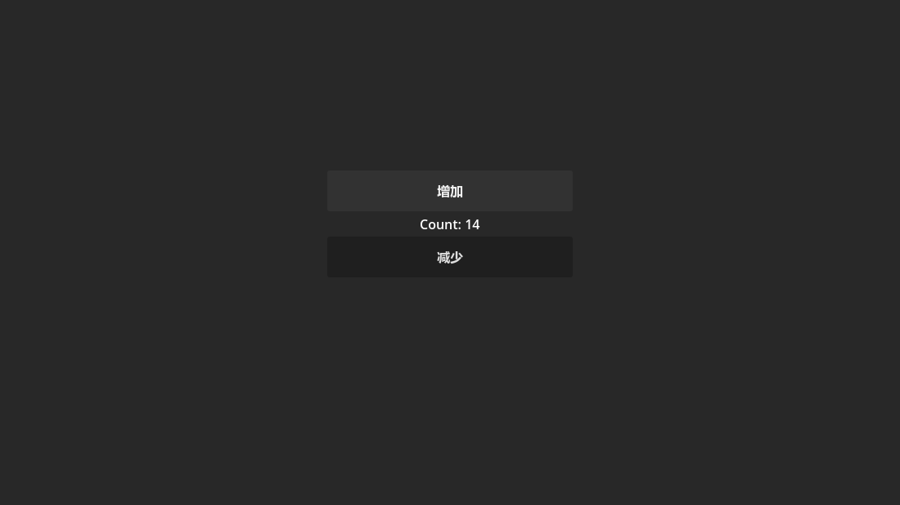

---
prev:
  text: '项目创建与初始化'
  link: './02-project-setup'
next:
  text: '引入 Model 重构'
  link: './04-model-refactor'
---

# 第 3 章：基础计数器实现

在本章中,我们将创建一个简单的计数器应用。首先用最直接的方式实现功能，然后分析这种实现方式的问题，为后续的架构优化做准备。

## 创建 UI 场景

### 1. 创建主场景

1. 在 Godot 编辑器中，点击 **场景 → 新建场景**
2. 选择 **用户界面** 作为根节点类型（Control）
3. 将根节点重命名为 `App`
4. 保存场景为 `scenes/App.tscn`

### 2. 搭建 UI 布局

添加以下节点结构：

```
App (Control)
├── CenterContainer (CenterContainer)
│   └── VBoxContainer (VBoxContainer)
│       ├── Label (Label) - 唯一名称：%Label
│       ├── HBoxContainer (HBoxContainer)
│       │   ├── SubButton (Button) - 唯一名称：%SubButton
│       │   └── AddButton (Button) - 唯一名称：%AddButton
```

::: tip 唯一名称的作用
在 Godot 中，带 `%` 前缀的唯一名称可以让我们在代码中更方便地访问节点：

```csharp
GetNode("%Label")  // 无论节点在哪个层级都能找到
```

:::

### 3. 配置节点属性

**App (Control)**

- **布局**：Anchor Preset → Full Rect

**CenterContainer**

- **布局**：Anchor Preset → Full Rect

**VBoxContainer**

- **主题覆盖 → 常量 → Separation**：20

**Label (%Label)**

- **文本**：Count: 0
- **水平对齐**：Center
- **主题覆盖 → 字体大小**：32

**SubButton (%SubButton)**

- **文本**：-
- **最小尺寸**：宽度 60, 高度 40

**AddButton (%AddButton)**

- **文本**：+
- **最小尺寸**：宽度 60, 高度 40

### 4. 最终效果

完成后的界面应该如下：



## 实现基础功能

### 1. 创建 App 脚本

右键点击 `App` 节点，选择 **附加脚本**：

- **语言**：C#
- **模板**：Node: Basic Script
- **路径**：`scripts/app/App.cs`

点击 **创建**。

### 2. 编写代码

编辑 `App.cs`，实现基础功能：

```csharp
using Godot;

namespace MyGFrameworkGame.scripts.app;

/// <summary>
/// 计数器应用的主控制器
/// </summary>
public partial class App : Control
{
    /// <summary>
    /// 获取 Add 按钮节点
    /// </summary>
    private Button AddButton => GetNode<Button>("%AddButton");

    /// <summary>
    /// 获取 Sub 按钮节点
    /// </summary>
    private Button SubButton => GetNode<Button>("%SubButton");

    /// <summary>
    /// 获取 Label 节点
    /// </summary>
    private Label Label => GetNode<Label>("%Label");

    /// <summary>
    /// 计数器的当前值
    /// </summary>
    private int _count;

    /// <summary>
    /// 节点准备就绪时调用
    /// </summary>
    public override void _Ready()
    {
        // 绑定按钮点击事件
        AddButton.Pressed += () =>
        {
            _count++;
            UpdateView();
        };

        SubButton.Pressed += () =>
        {
            _count--;
            UpdateView();
        };

        // 初始化界面
        UpdateView();
    }

    /// <summary>
    /// 更新界面显示
    /// </summary>
    private void UpdateView()
    {
        Label.Text = $"Count: {_count}";
    }
}
```

### 3. 设置为主场景

1. 点击 **项目 → 项目设置 → 应用 → 运行**
2. **主场景** 选择 `res://scenes/App.tscn`
3. 点击 **关闭**

### 4. 运行游戏

按 **F5** 运行游戏，点击 + 和 - 按钮，观察计数变化：



功能正常工作！🎉

## 代码分析

虽然功能实现了，但让我们分析一下这段代码的结构。

### 识别 MVC 组成部分

#### View（视图）

```csharp
// 节点引用
private Button AddButton => GetNode<Button>("%AddButton");
private Button SubButton => GetNode<Button>("%SubButton");
private Label Label => GetNode<Label>("%Label");

// 渲染逻辑
private void UpdateView()
{
    Label.Text = $"Count: {_count}";
}
```

**职责**：呈现 UI，接收用户输入

#### Model（数据）

```csharp
// 状态数据
private int _count;
```

**职责**：保存应用状态

#### Controller（控制器）

```csharp
// 事件绑定和业务逻辑
AddButton.Pressed += () =>
{
    _count++;      // 修改 Model
    UpdateView();  // 通知 View
};

SubButton.Pressed += () =>
{
    _count--;
    UpdateView();
};
```

**职责**：响应事件，协调 Model 和 View

### 执行流程

```
用户点击按钮
    ↓
Pressed 事件触发
    ↓
修改 _count (Model)
    ↓
调用 UpdateView() (View)
    ↓
界面更新
```

## 设计问题分析

虽然代码简洁明了，但存在以下问题：

### 问题 1：View 与 Controller 耦合过紧

```csharp
AddButton.Pressed += () =>
{
    _count++;       // ← 业务逻辑
    UpdateView();   // ← UI 更新
};
```

**问题**：

- UI 控件和业务逻辑直接耦合
- 修改逻辑可能影响界面，反之亦然
- 当功能复杂化时，代码难以维护

**示例**：如果将来需要：

- 多个按钮触发相同逻辑
- 多个 Label 显示相同数据
- 支持键盘快捷键

当前实现会导致代码重复和混乱。

### 问题 2：数据状态没有抽象

```csharp
private int _count;
```

**问题**：

- 计数器直接存在 Controller 里
- 没有独立的 Model 层
- 无法在不同界面或场景复用数据
- 无法单独测试逻辑

**示例**：如果需要：

- 在多个场景共享计数器状态
- 保存和加载计数器数据
- 实现撤销/重做功能

当前实现无法满足这些需求。

### 问题 3：缺乏统一的上下文管理

```csharp
public override void _Ready()
{
    // 事件绑定和视图更新直接写在这里
    AddButton.Pressed += ...
}
```

**问题**：

- 当应用复杂化，涉及异步操作、多场景时
- 容易出现状态不一致或上下文丢失
- 无法在多个 Controller 间共享状态

**示例**：如果计数器需要：

- 在多个 Service 之间共享
- 跨场景保持状态
- 支持网络同步

当前实现会非常麻烦。

### 问题 4：可测试性低

```csharp
_count++;  // ← 逻辑和按钮点击事件耦合
```

**问题**：

- `_count` 逻辑和按钮点击事件紧密耦合
- 无法在单元测试中独立测试计数器逻辑
- 只能在运行场景里手动点击按钮验证

**示例**：无法写出这样的单元测试：

```csharp
[Test]
public void Increment_ShouldIncreaseCount()
{
    var counter = new CounterModel();
    counter.Increment();
    Assert.AreEqual(1, counter.Count);
}
```

## 问题总结

| 问题                 | 后果        | 示例场景            |
|--------------------|-----------|-----------------|
| View-Controller 耦合 | 代码重复，难以维护 | 多个界面显示相同数据      |
| Model 未抽象          | 无法复用，难以测试 | 跨场景共享状态         |
| 缺乏上下文管理            | 状态混乱，扩展困难 | 多 Controller 协作 |
| 可测试性低              | 只能手动测试    | 业务逻辑复杂化         |

## 重构的必要性

随着项目规模增长，这些问题会被放大：

**场景 1：新增功能**

```csharp
AddButton.Pressed += () =>
{
    _count++;
    if (_count > 10) { /* 做某事 */ }
    if (_count < -10) { /* 做别的事 */ }
    SaveToFile();
    PlaySound();
    UpdateAchievement();
    UpdateView();
};
```

→ **Controller 迅速膨胀**

**场景 2：跨场景共享**

```csharp
// 场景 A
private int _count;

// 场景 B
private int _count;  // ← 重复的状态，如何同步？
```

→ **状态同步困难**

**场景 3：单元测试**

```csharp
// 如何测试这个逻辑？
AddButton.Pressed += () => { _count++; };
```

→ **无法测试**

## 下一步

我们已经实现了基础功能，并分析了当前实现的问题。在下一章中，我们将：

1. **引入 Model 层**：将状态抽离到独立的 Model
2. **使用事件系统**：实现数据驱动的 UI 更新
3. **解耦 View 和 Controller**：让代码更清晰、可测试

通过这些重构，你将看到 GFramework 如何帮助我们解决这些设计问题。

👉 [第 4 章：引入 Model 重构](./04-model-refactor.md)

---

::: details 本章检查清单

- [ ] UI 场景已创建（App.tscn）
- [ ] 节点结构正确（Label, AddButton, SubButton）
- [ ] App.cs 脚本已创建并附加到根节点
- [ ] 运行游戏，点击按钮能正常增减计数
- [ ] 理解了当前实现的 4 个主要问题
  :::

::: tip 思考题

1. 如果要在另一个场景也显示这个计数器，你会怎么做？
2. 如何实现"计数超过 10 时播放音效"的功能？
3. 能否在不运行游戏的情况下测试计数逻辑？

这些问题在下一章中都会得到解答！
:::
