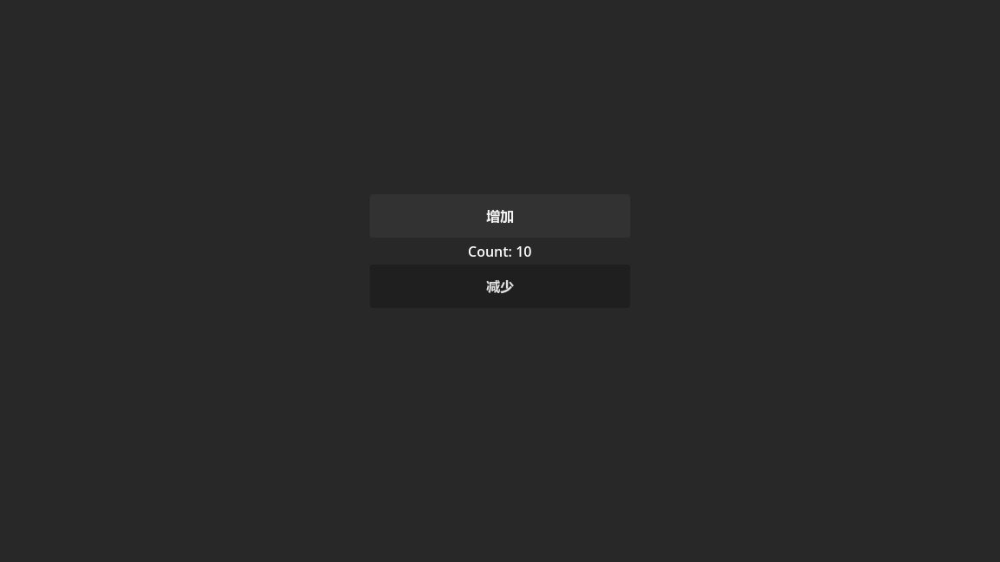

---
prev:
  text: '基础计数器实现'
  link: './03-counter-basic'
next:
  text: '命令系统优化'
  link: './05-command-system'
---

# 第 4 章：引入 Model 重构

在上一章中，我们实现了基础功能但也发现了一些设计问题。本章将通过引入 **Model 层** 和 **事件系统**，重构我们的计数器应用。

## 理解 Model 的作用

在 GFramework 中，**Model（模型）** 负责：

✅ **存储应用状态**：保存数据，如计数器的值  
✅ **提供数据访问接口**：通过方法暴露数据操作  
✅ **发送状态变化事件**：当数据改变时通知监听者

Model **不应该**：

❌ 包含 UI 逻辑（如更新 Label）  
❌ 直接调用 Controller 方法  
❌ 知道谁在使用它

## 创建 Model

### 1. 定义 Model 接口

在 `scripts/model/` 创建 `ICounterModel.cs`：

```csharp
using GFramework.Core.Abstractions.model;

namespace MyGFrameworkGame.scripts.model;

/// <summary>
/// 计数器模型接口，定义计数器的基本操作
/// </summary>
public interface ICounterModel : IModel
{
    /// <summary>
    /// 获取当前计数器的值
    /// </summary>
    int Count { get; }

    /// <summary>
    /// 将计数器的值增加 1
    /// </summary>
    void Increment();

    /// <summary>
    /// 将计数器的值减少 1
    /// </summary>
    void Decrement();
}
```

::: tip 为什么要定义接口？
使用接口的好处：

- **依赖倒置**：依赖抽象而不是具体实现
- **易于测试**：可以创建 Mock 实现
- **灵活替换**：可以切换不同的实现

这是 SOLID 原则中的 **依赖倒置原则（DIP）**。
:::

### 2. 实现 Model 类

在 `scripts/model/` 创建 `CounterModel.cs`：

```csharp
using GFramework.Core.extensions;
using GFramework.Core.model;

namespace MyGFrameworkGame.scripts.model;

/// <summary>
/// 计数器模型实现
/// </summary>
public class CounterModel : AbstractModel, ICounterModel
{
    /// <summary>
    /// 获取当前计数器的值
    /// </summary>
    public int Count { get; private set; }

    /// <summary>
    /// 初始化 Model（可选）
    /// </summary>
    protected override void OnInit()
    {
        // 可以在这里初始化默认值或加载数据
    }

    /// <summary>
    /// 计数变化事件
    /// </summary>
    public sealed record ChangedCountEvent
    {
        public int Count { get; init; }
    }

    /// <summary>
    /// 增加计数器的值
    /// </summary>
    public void Increment()
    {
        Count++;
        // 发送事件通知监听者
        this.SendEvent(new ChangedCountEvent { Count = Count });
    }

    /// <summary>
    /// 减少计数器的值
    /// </summary>
    public void Decrement()
    {
        Count--;
        // 发送事件通知监听者
        this.SendEvent(new ChangedCountEvent { Count = Count });
    }
}
```

::: tip 事件驱动设计
注意 `Increment` 和 `Decrement` 方法的最后一行：

```csharp
this.SendEvent(new ChangedCountEvent { Count = Count });
```

这是 **事件驱动架构** 的核心：

- Model 只负责改变状态并发送事件
- **不关心谁在监听**
- **不直接调用 UI 更新**

这实现了完全解耦！
:::

### 3. 注册 Model

编辑 `scripts/module/ModelModule.cs`：

```csharp
using GFramework.Core.Abstractions.architecture;
using GFramework.Game.architecture;
using MyGFrameworkGame.scripts.model;

namespace MyGFrameworkGame.scripts.module;

/// <summary>
/// 模型模块，负责注册所有的数据模型
/// </summary>
public class ModelModule : AbstractModule
{
    /// <summary>
    /// 安装模型到架构中
    /// </summary>
    public override void Install(IArchitecture architecture)
    {
        // 注册 CounterModel 实例
        architecture.RegisterModel<ICounterModel>(new CounterModel());
    }
}
```

::: warning 注意泛型参数

```csharp
architecture.RegisterModel<ICounterModel>(new CounterModel());
```

第一个泛型参数 `ICounterModel` 是接口类型，用于后续获取时指定类型。
:::

## 重构 Controller

### 1. 启用上下文感知

编辑 `App.cs`，添加 `IController` 接口和特性：

```csharp
using GFramework.Core.Abstractions.controller;
using GFramework.Core.extensions;
using GFramework.SourceGenerators.Abstractions.rule;
using Godot;
using MyGFrameworkGame.scripts.model;

namespace MyGFrameworkGame.scripts.app;

/// <summary>
/// 计数器应用的主控制器
/// </summary>
[ContextAware]  // ← 启用上下文感知（由源码生成器处理）
public partial class App : Control, IController  // ← 实现 IController 接口
{
    // ... 其他代码
}
```

::: tip ContextAware 特性
`[ContextAware]` 特性由 **源码生成器** 处理，它会自动生成：

- `IArchitecture Architecture { get; }` 属性
- 依赖注入相关的辅助代码

这使得我们可以使用 `this.GetModel()` 等扩展方法。
:::

### 2. 获取 Model 并监听事件

修改 `_Ready` 方法：

```csharp
using GFramework.Core.Abstractions.controller;
using GFramework.Core.extensions;
using GFramework.SourceGenerators.Abstractions.rule;
using Godot;
using MyGFrameworkGame.scripts.model;

namespace MyGFrameworkGame.scripts.app;

[ContextAware]
public partial class App : Control, IController
{
    private Button AddButton => GetNode<Button>("%AddButton");
    private Button SubButton => GetNode<Button>("%SubButton");
    private Label Label => GetNode<Label>("%Label");

    private ICounterModel _counterModel = null!;

    public override void _Ready()
    {
        // 从架构中获取 Model
        _counterModel = this.GetModel<ICounterModel>()!;

        // 监听 Model 的事件
        this.RegisterEvent<CounterModel.ChangedCountEvent>(e =>
        {
            UpdateView(e.Count);
        });

        // 按钮点击时调用 Model 的方法
        AddButton.Pressed += () =>
        {
            _counterModel.Increment();
        };

        SubButton.Pressed += () =>
        {
            _counterModel.Decrement();
        };

        // 初始化界面
        UpdateView(_counterModel.Count);
    }

    /// <summary>
    /// 更新界面显示
    /// </summary>
    private void UpdateView(int count)
    {
        Label.Text = $"Count: {count}";
    }
}
```

### 3. 运行游戏

按 **F5** 运行游戏，测试功能：



功能依然正常！但现在架构更清晰了。

## 对比重构前后

### 重构前

```csharp
// ❌ 状态在 Controller 里
private int _count;

// ❌ UI 直接修改状态
AddButton.Pressed += () =>
{
    _count++;       // 修改状态
    UpdateView();   // 更新 UI
};

// ❌ 状态和 UI 耦合
private void UpdateView()
{
    Label.Text = $"Count: {_count}";
}
```

**问题**：

- 状态、逻辑、UI 混在一起
- 无法复用状态
- 无法单独测试

### 重构后

```csharp
// ✅ 状态在 Model 里
private ICounterModel _counterModel;

// ✅ UI 只发起操作
AddButton.Pressed += () =>
{
    _counterModel.Increment();  // 调用 Model 方法
};

// ✅ 通过事件更新 UI
this.RegisterEvent<CounterModel.ChangedCountEvent>(e =>
{
    UpdateView(e.Count);  // 响应事件
});
```

**优势**：

- 关注点分离
- Model 可复用、可测试
- UI 只负责展示

## 理解事件驱动架构

### 数据流向

```
用户点击按钮
    ↓
Controller: _counterModel.Increment()
    ↓
Model: Count++
    ↓
Model: SendEvent(ChangedCountEvent)
    ↓
Controller: RegisterEvent<ChangedCountEvent>
    ↓
Controller: UpdateView(e.Count)
    ↓
界面更新
```

### 为什么不直接调用 UpdateView？

**方式一：直接调用（❌ 不推荐）**

```csharp
public void Increment()
{
    Count++;
    _view.UpdateView(Count);  // ← Model 依赖 View
}
```

**问题**：

- Model 依赖 View，强耦合
- Model 无法复用
- 无法扩展（如果有多个监听者怎么办？）

**方式二：事件驱动（✅ 推荐）**

```csharp
public void Increment()
{
    Count++;
    this.SendEvent(new ChangedCountEvent(Count));  // ← 发送事件
}

// View 订阅事件
this.RegisterEvent<ChangedCountEvent>(e => UpdateView(e.Count));
```

**优势**：

- Model 不知道 View 的存在
- 可以有多个订阅者
- 完全解耦

### 事件系统的威力

假设将来需要：

**需求 1：多个界面显示计数器**

```csharp
// Scene A
this.RegisterEvent<ChangedCountEvent>(e => LabelA.Text = $"Count: {e.Count}");

// Scene B
this.RegisterEvent<ChangedCountEvent>(e => LabelB.Text = $"Count: {e.Count}");
```

无需修改 Model！

**需求 2：计数变化时播放音效**

```csharp
this.RegisterEvent<ChangedCountEvent>(e =>
{
    if (e.Count > 0) PlaySound("increment.wav");
    else PlaySound("decrement.wav");
});
```

只需添加新的监听者！

## 解决的问题

回顾第 3 章提出的问题：

### ✅ 问题 1：View-Controller 耦合

**解决方案**：

```csharp
// 之前：UI 直接修改状态
_count++;
UpdateView();

// 现在：UI 通过 Model 操作
_counterModel.Increment();

// UI 通过事件更新
this.RegisterEvent<ChangedCountEvent>(e => UpdateView(e.Count));
```

现在的流程：`Button → Model → Event → View`，这是典型的 **单向数据流**。

### ✅ 问题 2：Model 未抽象

**解决方案**：

```csharp
// 之前：状态在 Controller 里
private int _count;

// 现在：状态在独立的 Model
private ICounterModel _counterModel;
_counterModel = this.GetModel<ICounterModel>();
```

现在：

- Model 可复用
- Model 可替换（依赖接口）
- Controller 不关心具体实现
- **可以单独测试 Model**

### ✅ 问题 3：缺乏上下文管理

**解决方案**：

```csharp
[ContextAware]
this.GetModel<ICounterModel>()
this.RegisterEvent<ChangedCountEvent>(...)
```

现在：

- Model 由 Context 提供
- 事件系统由框架管理
- 生命周期由框架管理
- 不需要手动 new Model
- 不会出现跨 Controller 状态错乱

### ⚠️ 问题 4：可测试性（部分改善）

**Model 层**：

```csharp
// ✅ Model 现在完全可测试
var model = new CounterModel();
model.Increment();
Assert.AreEqual(1, model.Count);
```

**Controller 层**：

```csharp
// ⚠️ Controller 仍然依赖 Godot 节点
App : Control
```

Controller 仍然不能在纯单元测试中实例化，但这是合理的：

- **View 本来就不应该被单元测试**
- **业务逻辑已经在 Model，可以测试**
- **Controller 只是桥梁**

## 核心收获

通过这次重构，我们学到了：

| 概念            | 解释                                    |
|---------------|---------------------------------------|
| **Model 的职责** | 存储状态，提供接口，发送事件                        |
| **事件驱动架构**    | Model 不关心谁在监听，完全解耦                    |
| **依赖注入**      | 通过 `GetModel` 获取依赖，而不是 `new`          |
| **单向数据流**     | Button → Model → Event → View         |
| **关注点分离**     | 数据（Model）、逻辑（Controller）、展示（View）各司其职 |

## 下一步

虽然我们引入了 Model，但 Controller 仍然承担着 **交互逻辑**：

```csharp
AddButton.Pressed += () =>
{
    _counterModel.Increment();  // ← 这是交互逻辑
};
```

当功能复杂化时（如需要保存、验证、异步操作），这些逻辑会让 Controller 变得臃肿。

在下一章中，我们将引入 **Command（命令）模式**，进一步解耦 Controller。

👉 [第 5 章：命令系统优化](./05-command-system.md)

---

::: details 本章检查清单

- [ ] ICounterModel 接口已创建
- [ ] CounterModel 实现已创建
- [ ] Model 已注册到 ModelModule
- [ ] App.cs 添加了 [ContextAware] 和 IController
- [ ] 通过事件系统更新 UI
- [ ] 运行游戏，功能正常
- [ ] 理解了事件驱动架构的优势
  :::

::: tip 思考题

1. 如果要在 Model 中添加"最大值限制"功能，应该怎么做？
2. 如果需要持久化计数器（保存到文件），应该在哪一层实现？
3. 事件驱动和直接调用的主要区别是什么？

这些问题会在后续章节中继续探讨！
:::
